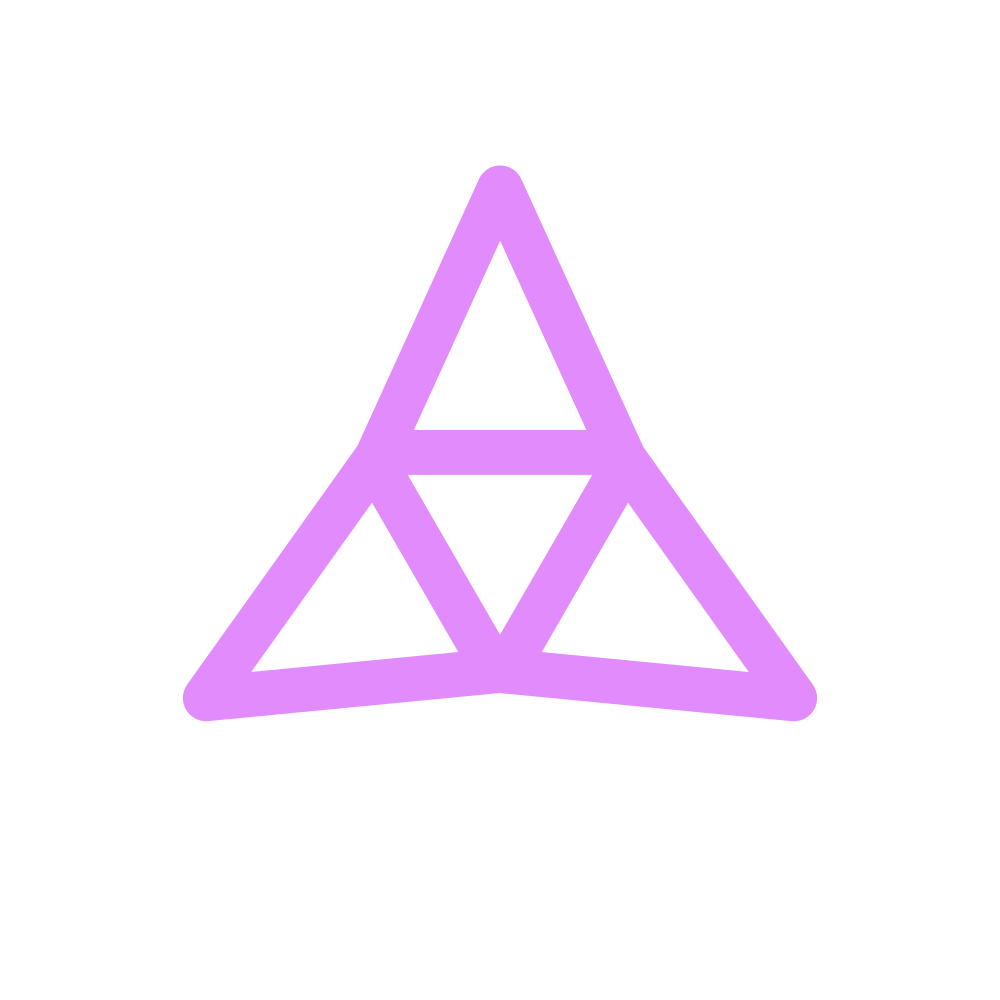

<!-- BADGES -->

<!-- PROJECT LOGO -->
 

  

  <h3>Taiko</h3>

  

    A decentralized Ethereum equivalent ZK rollup
     
    <a href="https://taiko.xyz" target="_blank"><strong>Explore the website »</strong></a>
     
  

## Packages

- [branding](./packages/branding/): branding materials
- [protocol](./packages/protocol/): L1 and L2 smart contracts
- [website](./packages/website/): main documentation website

## Release naming

We are using [ships from the game EVE](https://wiki.eveuniversity.org/Ships) as release/testnet names.
