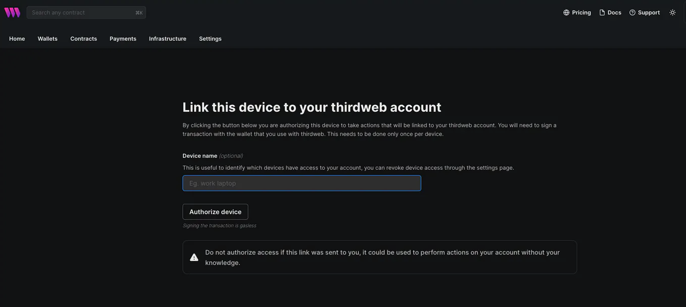
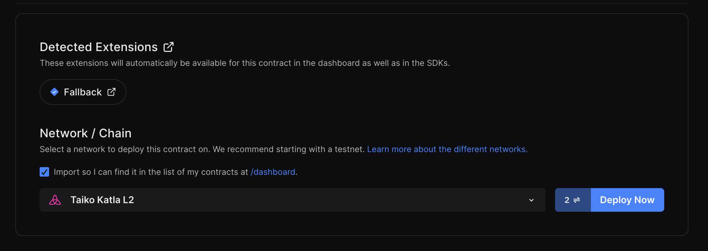
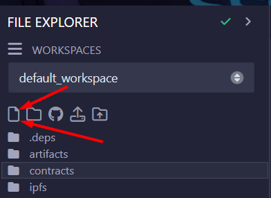
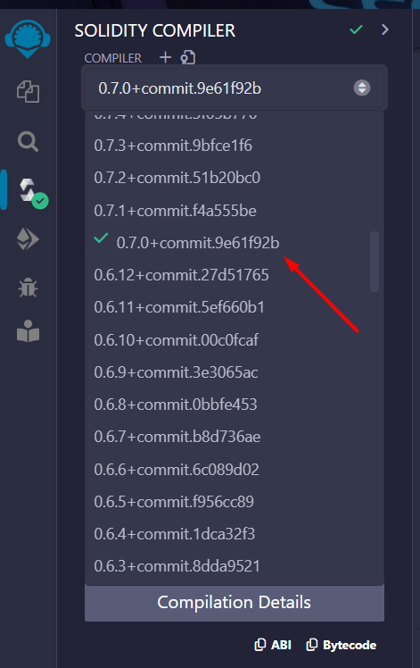
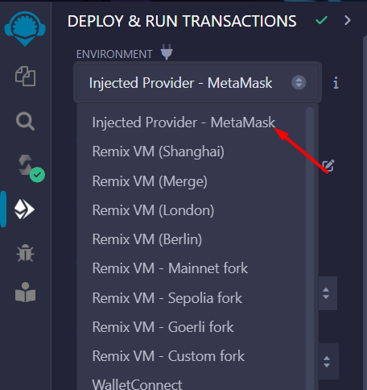
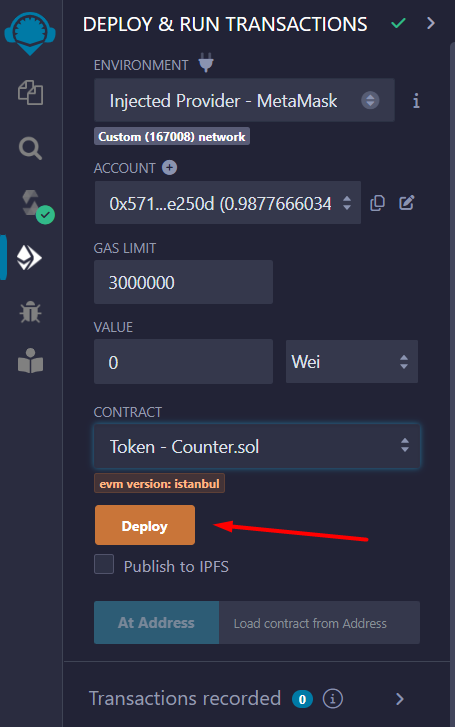

import { Aside, Steps } from '@astrojs/starlight/components';

This guide will help you deploy a smart contract on Taiko.

## Prerequisites

- A wallet with some testnet ETH on Taiko (can receive this from [the bridge](/guides/app-developers/bridge-tokens)).
- The private key to the account with testnet ETH on Taiko.

## Taiko Alethia

------

### Deploy a contract using Foundry

<Steps>

1. Install Foundry

    Open a terminal and run the following commands to install Foundry:

    ```bash
    curl -L https://foundry.paradigm.xyz | bash
    foundryup
    ```

2. Create a project with Foundry

    ```bash
    forge init hello_foundry && cd hello_foundry
    ```

3. Deploy your contract

    Deploy the contract located at `src/Counter.sol`. Replace `YOUR_PRIVATE_KEY` below with your private key which has some testnet ETH on Taiko.

    ```bash
    forge create src/Counter.sol:Counter \
    --rpc-url https://rpc.mainnet.taiko.xyz \
    --private-key YOUR_PRIVATE_KEY
    ```

</Steps>

### Deploy a contract using Hardhat

Hardhat is an Ethereum development environment for deploying smart contracts, running tests, and debugging Solidity code locally. It is one of the popular smart contract development frameworks. This guide demonstrates deploying a `Storage smart contract` on Taiko using Hardhat, highlighting the compatibility of Ethereum contracts with Taiko.

<Steps>

1. Set up the environment
    Hardhat is a flexible Ethereum development environment designed for testing, compiling, and deploying smart contracts. It requires Node.js, npm, and Git to get started.

    To effectively use Hardhat, your system must have [Node.js](https://nodejs.org/en/) (v10+ LTS) and npm installed.

    <Aside type="tip">
    If you are using Windows, we strongly recommend using [WSL 2](https://learn.microsoft.com/en-us/assessments/) to follow this guide.
    </Aside>

2. Create a Hardhat project
    - In your desired directory, run
    ```bash
    mkdir hello-hardhat && cd hello-hardhat
    ```
    - Initialize an npm project
    ```bash
    npm init -y
    ```
    - Install dotenv for environment variable management
    ```bash
    npm install dotenv
    ```
    - Add Hardhat to your project
    ```bash
    npm install --save-dev hardhat
    ```
    - Initialize Hardhat
    ```bash
    npx hardhat init
    ```
    Choose `Create a JavaScript project` and follow the prompts, agreeing to create a `.gitignore` and install suggested dependencies.

3. Configure Your Project

    - Delete `Lock.sol` in the `/contracts` directory.
    - In your project's `/contracts` directory, create a new file named `Storage.sol` and paste the provided Solidity code into it using your text editor.
    ```solidity
    // /contracts/Storage.sol

    // SPDX-License-Identifier: GPL-3.0
    pragma solidity >=0.8.2 <0.9.0;

    contract Storage {

        uint256 number;
        function store(uint256 num) public {
            number = num;
        }

        function retrieve() public view returns (uint256){
            return number;
        }
    }
    ```
    This contract, named `Storage`, includes functions to store and retrieve a `uint256` number.
    - Create the `/scripts` to write a deployment script. Then create and open a new `deploy.js` file to insert the provided JavaScript code.
    - Proceed to the `/scripts` directory of your Hardhat project to write a deployment script. Then create and open a new `deploy.js` file to insert the provided JavaScript code.

    ```javascript
    // /scripts/deploy.js
    const { ethers } = require("hardhat");

    async function main() {
    const StorageContract = await ethers.getContractFactory("Storage");
    const storageContract = await StorageContract.deploy();

    await storageContract.waitForDeployment();
    const tx = await storageContract.deploymentTransaction();

    console.log("Contract deployed successfully.");
    console.log(`Deployer: ${storageContract.runner.address}`);
    console.log(`Deployed to: ${storageContract.target}`);
    console.log(`Transaction hash: ${tx.hash}`);
    }

    main()
    .then(() => process.exit(0))
    .catch(error => {
        console.error(error);
        process.exit(1);
    });
    ```
    - Populate the `.env` file. That is,

        - Create a `.env` file within the `root` folder.
        - Populate `.env` with your `YOUR_PRIVATE_KEY` and the Taiko `RPC_URL` as follows:

    ```plaintext
    RPC_URL="https://rpc.mainnet.taiko.xyz"
    YOUR_PRIVATE_KEY="<insert private key here>"
    ```

    <Aside>
    Make sure `.env` is in the `.gitignore` file to avoid uploading your `ACCOUNT_PRIVATE_KEY`.
    </Aside>
    - Update `hardhat.config.js` with the following configuration to include Taiko network settings and Solidity version.
    ```javascript
    // hardhat.config.js
    require('dotenv').config();
    require("@nomicfoundation/hardhat-toolbox");

    module.exports = {
    solidity: "0.8.20",
    networks: {
        taiko: {
        url: process.env.RPC_URL,
        accounts: [process.env.YOUR_PRIVATE_KEY],
        }
    }
    };
    ```

4. Compile your contracts
    To compile your smart contracts, run
    ```bash
    npx hardhat compile
    ```
    Your compiled contracts will be located in the `artifacts/` directory.

5. Deploy your contracts
    To deploy your contracts to Taiko network, use
    ```bash
    npx hardhat run --network taiko scripts/deploy.js
    ```
    <Aside>
    Ensure you replace `YOUR_PRIVATE_KEY` with your actual private key that holds some testnet ETH on Taiko.
    </Aside>

    This command deploys your `Storage` contract to the Taiko. For additional details on deploying contracts with Hardhat, refer to the [Deploying Contracts with Hardhat](https://hardhat.org/hardhat-runner/docs/guides/deploying). The output on the terminal looks like as below.

    ```bash
    Contract deployed successfully.
    Deployer: 0xFdBA275E47....
    Deployed to: 0x77De5f1e40....
    Transaction hash: 0x75f219defa....
    ```

    You can now check your deployed contract on any explorer found on [our homepage](https://taiko.xyz/) using the `deployed contract address`.

</Steps>

### Deploy a contract using thirdweb

[Thirdweb](https://thirdweb.com/) offers a streamlined solution for deploying smart contracts to any EVM-compatible chain, including Taiko. By simplifying the deployment process, Thirdweb enables developers to focus on building without the hassle of managing private keys, RPC URLs, or deployment scripts. This guide demonstrates deploying a `Lock smart contract` on Taiko using Thirdweb, highlighting the compatibility of Ethereum contracts with Taiko.

<Steps>

1. Set up the environment

    Before deploying a smart contract on Taiko with Thirdweb, ensure your contracts are ready in a folder or a Hardhat project. This setup can include a Hardhat project or any other structure where your contracts are organized.

    For setup details, see our [Hardhat Deployment](/guides/app-developers/deploy-a-contract/#deploy-a-contract-using-hardhat) guide on taiko.

    <Aside>
    Before proceeding further, it is required for you to set up your wallet. For guidance on this, please refer to the section [Set up your wallet](/start-here/set-up-your-wallet/).
    </Aside>

2. Deploying with Thirdweb

    <Steps>

    1. Initialize Your Project

        Navigate to your smart contract project's root directory in the CLI and install Thirdweb globally using `npm i -g thirdweb`.

    2. Deploy Your Contract

        Execute `thirdweb deploy` in the CLI. This command initiates the deployment process.

    3. Authorize Your Device

        A browser window will prompt you to connect and authorize your wallet. This step ensures secure deployment from your chosen wallet.

        

    4. Access the Deployment Link

        The CLI will provide a link. Open this link to proceed with deployment via the Thirdweb UI.

    5. Complete Deployment Details

        - Fill in the necessary fields in the Thirdweb UI.
        - Select `Taiko Network` from the Chain drop-down menu.
        - Opt for `Add to dashboard` if you wish to manage this contract from the Thirdweb dashboard.
        - Click `Deploy Now` and sign the transaction in your connected wallet.

        

        For a more detailed documentation on deployments through Thirdweb using CLI, visit [Thirdweb CLI Docs](https://portal.thirdweb.com/cli).

    </Steps>

3. Managing Your Contract

    After deployment, the Thirdweb dashboard allows you to manage and interact with your contract seamlessly.
    Deploying with Thirdweb not only streamlines the process but also enhances security by supporting browser-based wallets like MetaMask and others for deployment activities.

</Steps>

## Taiko Hekla

------

### Deploy a contract using Foundry

<Steps>

1. Install Foundry

    Open a terminal and run the following commands to install Foundry:

    ```bash
    curl -L https://foundry.paradigm.xyz | bash
    foundryup
    ```

2. Create a project with Foundry

    ```bash
    forge init hello_foundry && cd hello_foundry
    ```

3. Deploy your contract

    Deploy the contract located at `src/Counter.sol`. Replace `YOUR_PRIVATE_KEY` below with your private key which has some testnet ETH on Taiko.

    ```bash
    forge create src/Counter.sol:Counter \
    --rpc-url https://rpc.hekla.taiko.xyz \
    --private-key YOUR_PRIVATE_KEY
    ```

</Steps>

### Deploy a contract using Hardhat

Hardhat is an Ethereum development environment for deploying smart contracts, running tests, and debugging Solidity code locally. It is one of the popular smart contract development frameworks. This guide demonstrates deploying a `Storage smart contract` on Taiko using Hardhat, highlighting the compatibility of Ethereum contracts with Taiko.

<Steps>

1. Set up the environment
    Hardhat is a flexible Ethereum development environment designed for testing, compiling, and deploying smart contracts. It requires Node.js, npm, and Git to get started.

    To effectively use Hardhat, your system must have [Node.js](https://nodejs.org/en/) (v10+ LTS) and npm installed.

    <Aside type="tip">
    If you are using Windows, we strongly recommend using [WSL 2](https://learn.microsoft.com/en-us/assessments/) to follow this guide.
    </Aside>

2. Create a Hardhat project
    - In your desired directory, run
    ```bash
    mkdir hello-hardhat && cd hello-hardhat
    ```
    - Initialize an npm project
    ```bash
    npm init -y
    ```
    - Install dotenv for environment variable management
    ```bash
    npm install dotenv
    ```
    - Add Hardhat to your project
    ```bash
    npm install --save-dev hardhat
    ```
    - Initialize Hardhat
    ```bash
    npx hardhat init
    ```
    Choose `Create a JavaScript project` and follow the prompts, agreeing to create a `.gitignore` and install suggested dependencies.

3. Configure Your Project

    - Delete `Lock.sol` in the `/contracts` directory.
    - In your project's `/contracts` directory, create a new file named `Storage.sol` and paste the provided Solidity code into it using your text editor.
    ```solidity
    // /contracts/Storage.sol

    // SPDX-License-Identifier: GPL-3.0
    pragma solidity >=0.8.2 <0.9.0;

    contract Storage {

        uint256 number;
        function store(uint256 num) public {
            number = num;
        }

        function retrieve() public view returns (uint256){
            return number;
        }
    }
    ```
    This contract, named `Storage`, includes functions to store and retrieve a `uint256` number.
    - Create the `/scripts` to write a deployment script. Then create and open a new `deploy.js` file to insert the provided JavaScript code.
    - Proceed to the `/scripts` directory of your Hardhat project to write a deployment script. Then create and open a new `deploy.js` file to insert the provided JavaScript code.

    ```javascript
    // /scripts/deploy.js
    const { ethers } = require("hardhat");

    async function main() {
    const StorageContract = await ethers.getContractFactory("Storage");
    const storageContract = await StorageContract.deploy();

    await storageContract.waitForDeployment();
    const tx = await storageContract.deploymentTransaction();

    console.log("Contract deployed successfully.");
    console.log(`Deployer: ${storageContract.runner.address}`);
    console.log(`Deployed to: ${storageContract.target}`);
    console.log(`Transaction hash: ${tx.hash}`);
    }

    main()
    .then(() => process.exit(0))
    .catch(error => {
        console.error(error);
        process.exit(1);
    });
    ```
    - Populate the `.env` file. That is,

        - Create a `.env` file within the `root` folder.
        - Populate `.env` with your `YOUR_PRIVATE_KEY` and the Taiko `RPC_URL` as follows:

    ```plaintext
    RPC_URL="https://rpc.hekla.taiko.xyz"
    YOUR_PRIVATE_KEY="<insert private key here>"
    ```

    <Aside>
    Make sure `.env` is in the `.gitignore` file to avoid uploading your `ACCOUNT_PRIVATE_KEY`.
    </Aside>
    - Update `hardhat.config.js` with the following configuration to include Taiko network settings and Solidity version.
    ```javascript
    // hardhat.config.js
    require('dotenv').config();
    require("@nomicfoundation/hardhat-toolbox");

    module.exports = {
    solidity: "0.8.20",
    networks: {
        taiko: {
        url: process.env.RPC_URL,
        accounts: [process.env.YOUR_PRIVATE_KEY],
        }
    }
    };
    ```

4. Compile your contracts
    To compile your smart contracts, run
    ```bash
    npx hardhat compile
    ```
    Your compiled contracts will be located in the `artifacts/` directory.

5. Deploy your contracts
    To deploy your contracts to Taiko network, use
    ```bash
    npx hardhat run --network taiko scripts/deploy.js
    ```
    <Aside>
    Ensure you replace `YOUR_PRIVATE_KEY` with your actual private key that holds some testnet ETH on Taiko.
    </Aside>

    This command deploys your `Storage` contract to the Taiko. For additional details on deploying contracts with Hardhat, refer to the [Deploying Contracts with Hardhat](https://hardhat.org/hardhat-runner/docs/guides/deploying). The output on the terminal looks like as below.

    ```bash
    Contract deployed successfully.
    Deployer: 0xFdBA275E47....
    Deployed to: 0x77De5f1e40....
    Transaction hash: 0x75f219defa....
    ```

    You can now check your deployed contract on [the explorer](https://hekla.taikoscan.network/) using the `deployed contract address`.

</Steps>

### Deploy a contract using Remix

<Steps>

1. Open Remix IDE

    Visit <a href="https://remix.ethereum.org" target="_blank">Remix IDE</a>.

2. Create a new `.sol` file

    

    - Give it any name, for example `Counter.sol`.
    - Fill with this example code:

    ```solidity
    // SPDX-License-Identifier: MIT
    pragma solidity ^0.7.0;

    import "https://github.com/OpenZeppelin/openzeppelin-contracts/blob/v3.4.0-solc-0.7/contracts/token/ERC20/ERC20.sol";

    contract Token is ERC20 {

        constructor () ERC20("Example Token Hekla", "ETH") {
            _mint(msg.sender, 1000000 * (10 ** uint256(decimals())));
        }
    }
    ```

3. Compile

    - Change the Compiler version to `0.7.0+commit.9e61f92b`

    

    - Then compile it.

4. Deploy

    - Change the Environment to `Injected Provider`

    

    

    - Then click `transact`

    - Finally, verify the smart contract using [Blockscout](/guides/app-developers/verify-a-contract/#verify-a-contract-with-hardhat-or-other-alternatives)

</Steps>

### Deploy a contract using thirdweb

[Thirdweb](https://thirdweb.com/) offers a streamlined solution for deploying smart contracts to any EVM-compatible chain, including Taiko. By simplifying the deployment process, Thirdweb enables developers to focus on building without the hassle of managing private keys, RPC URLs, or deployment scripts. This guide demonstrates deploying a `Lock smart contract` on Taiko using Thirdweb, highlighting the compatibility of Ethereum contracts with Taiko.

<Steps>

1. Set up the environment

    Before deploying a smart contract on Taiko with Thirdweb, ensure your contracts are ready in a folder or a Hardhat project. This setup can include a Hardhat project or any other structure where your contracts are organized.

    For setup details, see our [Hardhat Deployment](/guides/app-developers/deploy-a-contract/#deploy-a-contract-using-hardhat-1) guide on taiko.

    <Aside>
    Before proceeding further, it is required for you to set up your wallet. For guidance on this, please refer to the section [Set up your wallet](/start-here/set-up-your-wallet/).
    </Aside>

2. Deploying with Thirdweb

    <Steps>

    1. Initialize Your Project

        Navigate to your smart contract project's root directory in the CLI and install Thirdweb globally using `npm i -g thirdweb`.

    2. Deploy Your Contract

        Execute `thirdweb deploy` in the CLI. This command initiates the deployment process.

    3. Authorize Your Device

        A browser window will prompt you to connect and authorize your wallet. This step ensures secure deployment from your chosen wallet.

        

    4. Access the Deployment Link

        The CLI will provide a link. Open this link to proceed with deployment via the Thirdweb UI.

    5. Complete Deployment Details

        - Fill in the necessary fields in the Thirdweb UI.
        - Select `Taiko Network` from the Chain drop-down menu.
        - Opt for `Add to dashboard` if you wish to manage this contract from the Thirdweb dashboard.
        - Click `Deploy Now` and sign the transaction in your connected wallet.

        

        For a more detailed documentation on deployments through Thirdweb using CLI, visit [Thirdweb CLI Docs](https://portal.thirdweb.com/cli).

    </Steps>

3. Managing Your Contract

    After deployment, the Thirdweb dashboard allows you to manage and interact with your contract seamlessly.
    Deploying with Thirdweb not only streamlines the process but also enhances security by supporting browser-based wallets like MetaMask and others for deployment activities.

</Steps>
