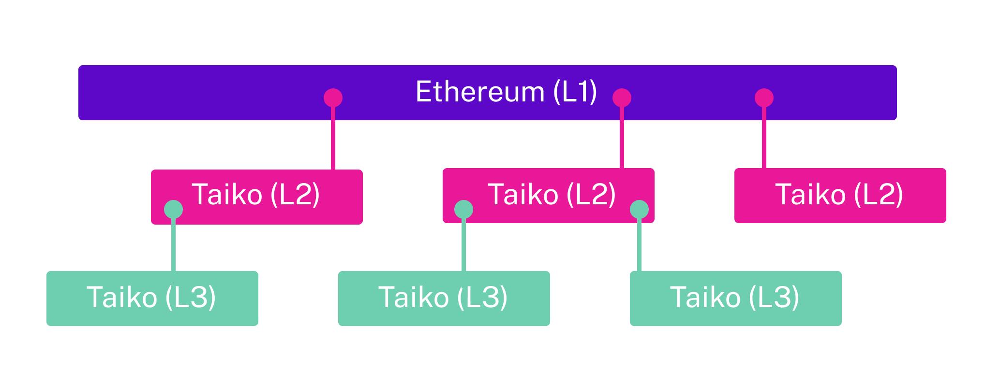

Ethereum's scalability challenges cannot be fully solved with a **single rollup**. A single L2 can only process a finite number of transactions before **state bloat** and **sequencer bottlenecks** emerge. To truly scale Ethereum, multiple rollups need to operate in parallel and in stacked layers.

Taiko Alethia is designed with **flexibility**, enabling:

- **Parallel L2s**: Multiple independent rollup instances running side by side.
- **Recursive Rollups (L3s on L2s)**: Running **Taiko on Taiko**, deploying the same architecture on top of itself.

## What Are Inception Layers?

**Inception layers** refer to a recursive rollup approach where **Taiko Alethia operates as an L2**, and the **exact same Taiko Alethia codebase is deployed as an L3** on top of it. Since **Taiko Alethia is Ethereum-equivalent**, the relationship between **L3 → L2** closely mirrors that of **L2 → L1**. This maintains a high degree of reusability and interoperability.

### **Why Are Inception Layers Needed?**

1. **Ethereum's Scaling Limits**

   A single L2 has inherent constraints:
   - Throughput bottlenecks: Even a performant rollup has an upper bound on TPS.
   - State Growth: Storing all state in a single rollup leads to **expensive calldata** and **verification costs** on Ethereum L1.

 

2. **Multiple Rollups Are the Future**
   - The Ethereum roadmap anticipates a **multi-rollup ecosystem**.
   - Inception layers allow for **seamless rollup interoperability**.

 

3. **Unlocking Extensible Scalability**
   - Multiple **Taiko L2 instances** can scale horizontally.
   - Multiple **L3 instances on top of L2** scale **vertically** (stacked rollups).
   - L3s inherit the **same security model** as L2s, ensuring trustless execution.

---

## Benefits of Inception Layers

1. **Ethereum-Equivalence Across Layers**
   - **L2s and L3s** share the **same execution environment** as Ethereum.
   - Developers can **reuse smart contracts** across layers without modifications.
   - **EVM compatibility is preserved**, ensuring seamless migration.

    

2. **Optimized for Composability & Interoperability**
   - Rollups at different layers can **efficiently interact** using **Merkle proofs**.
   - This enables **secure, trustless message passing** between L1, L2, and L3.

    

3. **Mitigating UX Fragmentation**
   - A major downside of a multi-rollup world is **liquidity fragmentation** and **complex cross-chain UX**.
   - **Taiko’s inception layers combat this** by using built-in **arbitrary message passing**.
   - One rollup can natively **read Merkle proofs** from another, avoiding fragmented liquidity.

---

## Inception Layers Architecture

---

### **Multi-Layer Rollup Structure**

The following illustrates how **Ethereum, Taiko L2, and Taiko L3 layers interconnect**:

- **Ethereum L1** serves as the base layer for settlement and data availability.
- **Multiple Taiko L2s** operate in parallel, processing transactions independently.
- **Recursive Taiko L3s** are deployed on top of L2s, allowing for additional scalability.

### **Built-in Message Passing Between Layers**

Ethereum-equivalence across L2s, L3s, and beyond means **native arbitrary message passing**. This is achieved via:

- **Merkle Proofs:** Enabling trustless state validation across rollups.
- **Cross-Layer Communication Protocols:** Ensuring frictionless interoperability.

---

## Further Reading

For more details on **cross-layer communication**, refer to the [Bridging](/taiko-alethia-protocol/protocol-architecture/bridging) documentation.
