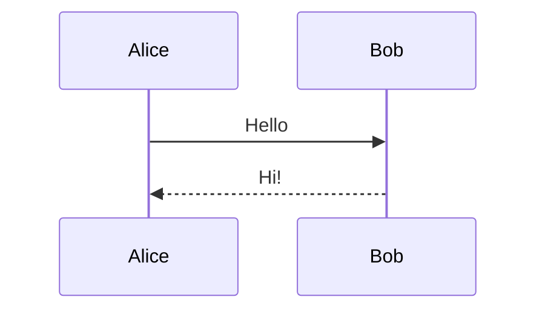

When you push this `.md` file to GitHub, it will automatically render as an SVG diagram in:

- README.md
- Wiki pages
- Issue/PR descriptions and comments

---

## **2. Supported diagram types**

GitHub supports the full Mermaid feature set, including:

- Flowcharts (`flowchart LR` or `TD`)
- Sequence diagrams (`sequenceDiagram`)
- Class diagrams (`classDiagram`)
- State diagrams (`stateDiagram-v2`)
- Entity Relationship diagrams (`erDiagram`)
- Gantt charts (`gantt`)
- Pie charts (`pie`)
- Mindmaps (`mindmap`)
- Git graphs (`gitGraph`)

Example: **sequence diagram**

````markdown

````
