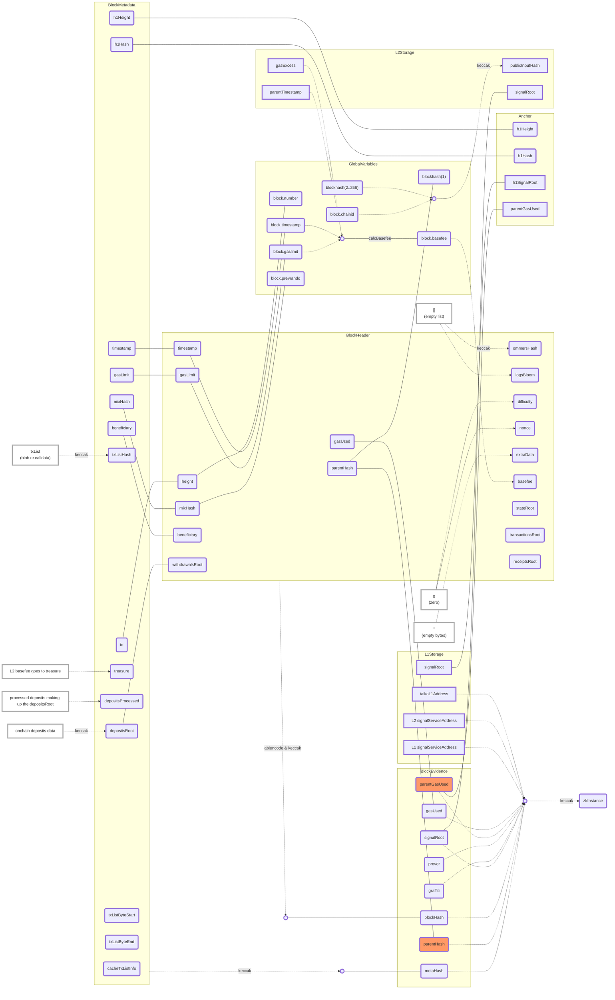

# Taiko proves L2 blocks

This document specifies how the Taiko protocol, client, and circuits work together to prove L2 blocks.

# The *txList*

The **`txList`** of a Layer 2 (L2) block will eventually be part of a blob in the Layer 1 (L1) Consensus Layer (CL) - right now it is within the calldata. 
It is meant to be a list of RLP-encoded L2 transactions, with only its length and commitment available to the L1 Execution Layer (EL). The length is checked when a block is proposed, but we need to prove whether the **`txList`** is valid or not using ZKP:

A valid **`txList`**:

- Has a byte-size smaller than **`maxBytesPerTxList`** (also enforced in contracts).
- Can be RLP-decoded into a list of transactions without trailing space.
- Contains no more transactions (valid and invalid) than the protocol constant **`maxTransactionsPerBlock`**.
- Has a total gas limit for all valid transactions not exceeding the protocol constant **`blockMaxGasLimit`**.

ZKP must prove whether the **`txList`** is valid or invalid. For an invalid **`txList`**, the L2 block will be empty, except for an anchor transaction.

For a valid **`txList`**, ZKP must also prove whether each enclosed transaction is valid or invalid. All valid transactions will be part of the actual L2 block.

A valid transaction (defined in the Ethereum Yellow Paper):

- Has a valid transaction signature.
- Has a valid transaction nonce (equivalent to the sender account's current nonce).
- Has no contract code deployed on the sender account (see EIP-3607 by Feist et al. [2021]).
- Has a gas limit no smaller than the intrinsic gas, **`g0`**, used by the transaction; and the sender account balance contains at least the cost, **`v0`**, required in up-front payment.

In contrast, the previous implementation allowed for invalid blocks that were skipped. The new protocol maps all (valid and invalid) **`txLists`** into L2 blocks.

## Data Consistency

Note that `txList` is not directly know to L1 contracts, therefore, ZKP shall further prove that the chosen `txList` is a slice of the given blob data (from `meta.txListByteStart` to `meta.txListByteEnd`) and the blob’s hash or polynomial commitment (PC) is `meta.blobHash` — not the `txList`’s hash or PC). ( @todo/question: blobHash is not part of the contracts anymore.)

## Anchor Transactions

Every L2 block has exactly one anchor function call as its first transaction.

ZKP must prove that *TaikoL2.anchor(...)* is the first transaction in the block, with the correct input parameters and gas limit, signed by the gold-touch address, and did not throw.

- The anchor transaction's `to` address must be the registered `taiko_l2` address, which is hashed into the ZKP `instance`. And the `tx.origin`  must be the golden touch address.
- The anchor transaction's ABI must be:
    
    **`function anchor(bytes32 l1Hash, bytes32 l1SignalRoot, uint64 l1Height, uint64 parentGasUsed)`**
    
- A circuit will verify the integrity among: `l1Hash`, `l1SignalRoot`, and `l1SignalServiceAddress`
- `l1SignalServiceAddress`, `l2SignalServiceAddress` and `parentGasUsed` are directly hashed into of the ZKP's instance
- `l1Height` and `l1Hash` are both part of the block metadata (`meta.l1Height` and `meta.l1Hash`), the `metaHas` is used to calculate the ZKP instance.
- `l1SignalRoot` is part of the evidence and is also used to calculate the ZKP instance.
- The transaction's status code is 0 (success).
- The transaction's origin & msg.sender must be `LibAnchorSignature.K_GOLDEN_TOUCH_ADDRESS`.
- The transaction's signature must be the same as `LibAnchorSignature.signTransaction(...)`.
- The actual value of the input parameters must be consistent with the values used to hash the ZKP instance (see [**LibProving**](https://github.com/taikoxyz/taiko-mono/blob/80da7124a2e7340f65aa88561f51b69a79404577/packages/protocol/contracts/L1/libs/LibProving.sol#L118)).

Note that the anchor transaction emits a `Anchored` event that may help ZKP to verify block variables. See below.

### Anchor Signature

ZKP shall also check the signature of the anchor transaction:

- The signer must be TaikoL2.GOLDEN_TOUCH_ADDRESS.
- The signature must use `1` or `2` as the `K` value. See *TaikoL2Signer.sol*.
- `K=1` must be used unless [….forgot]

[EDIT: this will become a new transaction type]

# The *BlockMetadata*

This struct represents the metadata of a block. The data will be hashed and be part of the public input. So anything within this struct, will be hashed and put into ZKP `instance`.

- `id`: Represents the block height in L2.
- `timestamp`: The block timestamp in L2.
- `l1Height`: The actual block height in L1.
- `l1Hash`: The actual block hash in L1.
- `mixHash`: Salted random number to accommodate multiple L2 blocks fitting into one L1 block.
- `depositsRoot`: Matches the withdrawalsRoot in the L2 header.
- `txListHash`: Hash of the transaction list in L2.
- `txListByteStart`: Byte start of the transaction list in L2.
- `txListByteEnd`: Byte end of the transaction list in L2.
- `gasLimit`: Gas limit for the L2 block.
- `beneficiary`: The address of the beneficiary in L2.
- `cacheTxListInfo`: Indicates whether the transaction list info should be cached or not.
- `treasure`: The address where the base fee goes in L2.
- `depositsProcessed`: The initiated L1->L2 deposits that make up the depositRoot.

## Block variables

There are the following [**block level variables**](https://docs.soliditylang.org/en/v0.8.18/units-and-global-variables.html) accessible to EVM, but their values are not part of the MPT.

- `blockhash(uint blockNumber) returns (bytes32)`: hash of the given block when `blocknumber` is one of the 256 most recent blocks; otherwise returns zero
- `block.basefee` (`uint`): current block's base fee ([EIP-3198](https://eips.ethereum.org/EIPS/eip-3198) and [EIP-1559](https://eips.ethereum.org/EIPS/eip-1559))
- `block.chainid` (`uint`): current chain id
- `block.coinbase` (`address payable`): current block miner's address
- `block.difficulty` (`uint`): current block difficulty (`EVM < Paris`). For other EVM versions, it behaves as a deprecated alias for `block.prevrandao` ([EIP-4399](https://eips.ethereum.org/EIPS/eip-4399))
- `block.gaslimit` (`uint`): current block gaslimit
- `block.number` (`uint`): current block number
- `block.prevrandao` (`uint`): random number provided by the beacon chain (`EVM >= Paris`)
- `block.timestamp` (`uint`): current block timestamp as seconds since Unix epoch

We need to verify when these variables are accessed within the EVM, their values are consistent with the block metadata and the actual L2 block header.

- `blockhash`: EVM allows access to the most recent 256 block hashes. All these hashes are available inside the plonk lookup table. ZKP must prove that the parent hash, `blockhash(block.number - 1)`, has the same value as in the block header and is also the same value used to calculate the ZKP instance.
- The other 255 hashes, `blockhash(block.number - 256)` to `blockhash(block.number - 2)` are checked in the anchor transaction to simplify circuits. Therefore, as long as the anchor transaction is zk-proven, these 255 ancestor hashes are proven indirectly.
- `block.basefee`: this field is currently always 0, as EIP-1559 is not enabled. Therefore, the ZKP must verify the value is always 0.
- `block.chainid`: this field is also checked by the anchor transaction, so no extra ZKP circuits are required.
- `block.coinbase`: ZKP must verify the value must be the same as `meta.beneficiary`. Again, the metadata hash is part of the ZK instance.
- `block.difficulty`: this is now the same as `block.prevrandao`, so we only check `block.prevrandao`.
- `block.gaslimit`: ZKP must verify this value must equal `meta.gasLimit`.
- `block.gasUsed`: ZKP must verify this value must be smaller than `meta.gasLimit`.
- `block.number`: this must be checked against the block header and `meta.id`.
- `block.prevrandao`: this must be checked against the `mixHash` field in the L2 block header and `meta.mixHash`.
- `block.timestamp`: this must be checked against the `timestamp` field in the L2 block header and `meta.proposedAt`.

## Block Header

The block header is no longer presented to L1 contracts; therefore, ZKP must verify the integrity of the block header and ensure the block header can hash into the same value as `evidence.blockHash`, which is part of the ZK instance input.

In addition, ZKP must also prove the following:

- `parentHash` must be the same as `evidence.parentHash`.
- `ommersHash` must be `0x1dcc4de8dec75d7aab85b567b6ccd41ad312451b948a7413f0a142fd40d49347`.
- `beneficiary` must be `meta.beneficiary` (duplicated, as stated above).
- `logsBloom` must be a bytes32[8] with all zeros.
- `difficulty` must be `meta.mixHash`.
- `height` must be `meta.id`.
- `gasLimit` == `meta.gasLimit`.
- `gasUsed` ≤ `gasLimit` (we are assuming the EVM proof will verify that gasLimit has the right value), and `gasUsed` == `evidence.gasUsed`
- `timestamp` == `meta.proposedAt`.
- `extraData` == "".
- `mixHash` == `meta.mixHash`.
- `nonce` == 0.
- `baseFeePerGas` == 0.
- `withdrawalsRoot` == `0x56e81f171bcc55a6ff8345e692c0f86e5b48e01b996cadc001622fb5e363b421`  according to [https://github.com/ethereum/go-ethereum/blob/master/core/types/hashes.go#L41](https://github.com/ethereum/go-ethereum/blob/master/core/types/hashes.go#L41)

Note that some of the above header field checks are duplicates of checks from the Block Variable section.

## Signal Storage Root

ZKP also needs to prove cross chain signal service’s storage roots have the right value.

- **For L2 Signal Service**:  the storage root is the second parameter in the anchor transaction. ZKP shall verify that the storage root of the L2 Signal Service address indeed has this given value by using zkEVM storage proof.
- **For L1 Signal Service**: the storage root verification shall be done in circuits by using a Merkle proof as witness against `meta.l1Hash`. The `l1SignalRoot` value is not directly provided by L1 smart contracts as it is not available to EVM and must be queried by L2 client from a L1 node.

## Data cross-verification chart

