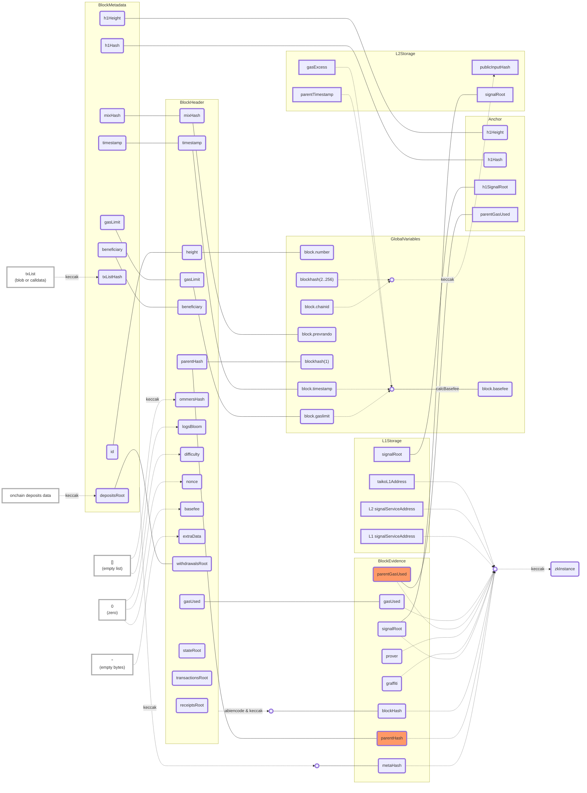

```mermaid
graph LR
classDef default stroke-width:4px;

m_id --- h_height --- v_block_number;
m_gas_limit --- h_gas_limit --- v_block_gaslimit;
m_timestamp --- h_timestamp  --- v_block_timestamp;
m_h1_height --- a_h1_height;
m_h1_hash --- a_h1_hash;
m_mix_hash --- h_mix_hash --- v_block_prevrando;
tx_list -.->|keccak| m_txlist_hash;
m_beneficiary --- h_beneficiary;
h_parent_hash --- v_blockhash_1 & e_parent_hash;
empty_list -.->|keccak| h_ommers_hash;
empty_list -.-> h_logs_bloom;
zero -.-> h_difficulty;
zero -.-> h_nonce;
zero -.-> h_basefee;
empty_string -.-> h_extra_data;

v_block_chainid -.-> dot1;
v_blockhash_others -.-> dot1 -.->|keccak| s_public_input_hash;


v_block_gaslimit -.-> dot2;
v_block_timestamp -.-> dot2;
s_parent_timestamp -.-> dot2;
s_gas_excess -.-> dot2 ---|calcBasefee| v_block_basefee;

processed_deposits -.->|keccak| m_deposits_root --- h_withdrawals_root;

b_signal_root --- a_h1_signal_root;
h_gas_used --- e_gas_used;

BlockMetadata -.->|keccak| dot4((" ")) --- e_meta_hash -.-> dot3((" ")) -.->|keccak| zk_instance;
e_parent_hash & e_block_hash & e_signal_root & e_graffiti & e_prover & e_parent_gas_used & e_gas_used -.-> dot3;
b_l1_signal_service_addr -.-> dot3;
b_l2_signal_service_addr -.-> dot3;
b_l1_taiko_addr -.-> dot3;

e_signal_root --- s_signal_root
e_parent_gas_used --- a_parent_gas_used
BlockHeader -.->|abiencode & keccak| dot5((" ")) o--- e_block_hash

subgraph BlockMetadata
m_id(id)
m_gas_limit(gasLimit)
m_timestamp(timestamp)
m_h1_height(h1Height)
m_h1_hash(h1Hash)
m_mix_hash(mixHash)
m_txlist_hash(txListHash)
m_beneficiary(beneficiary)
m_deposits_root(depositsRoot)
end


subgraph BlockHeader
h_height(height)
h_gas_limit(gasLimit)
h_gas_used(gasUsed)
h_timestamp(timestamp)
h_mix_hash(mixHash)
h_beneficiary(beneficiary)
h_parent_hash(parentHash)
h_ommers_hash(ommersHash)
h_state_root(stateRoot)
h_transactions_root(transactionsRoot)
h_receipts_root(receiptsRoot)
h_logs_bloom(logsBloom)
h_difficulty(difficulty)
h_extra_data(extraData)
h_nonce(nonce)
h_basefee(basefee)
h_withdrawals_root(withdrawalsRoot)
end

subgraph GlobalVariables
v_block_number(block.number)
v_block_gaslimit(block.gaslimit)
v_block_timestamp(block.timestamp)
v_block_prevrando(block.prevrando)
v_blockhash_1("blockhash(1)")
v_blockhash_others("blockhash(2..256)")
v_block_chainid("block.chainid")
v_block_basefee("block.basefee")
dot1((" "))
dot2((" "))
end


subgraph Anchor
a_h1_height(h1Height)
a_h1_hash(h1Hash)
a_h1_signal_root[h1SignalRoot]
a_parent_gas_used[parentGasUsed]
end

subgraph L1Storage
b_signal_root[signalRoot]
b_l1_taiko_addr[taikoL1Address]
b_l1_signal_service_addr[L1 signalServiceAddress]
b_l2_signal_service_addr[L2 signalServiceAddress]
end


subgraph L2Storage
s_public_input_hash[publicInputHash]
s_parent_timestamp[parentTimestamp]
s_gas_excess[gasExcess]
s_signal_root[signalRoot]
end


subgraph BlockEvidence
e_meta_hash(metaHash)
e_parent_hash(parentHash):::forkchoice
e_block_hash(blockHash)
e_signal_root(signalRoot)
e_graffiti(graffiti)
e_prover(prover)
e_parent_gas_used(parentGasUsed):::forkchoice
e_gas_used(gasUsed)

classDef forkchoice fill:#f96
end

classDef constant fill:#fff, stroke:#AAA;

zero["0\n(zero)"]:::constant
empty_string["''\n(empty bytes)"]:::constant
empty_list["[]\n(empty list)"]:::constant
tx_list["txList\n(blob or calldata)"]:::constant
processed_deposits["onchain deposits data"]:::constant
zk_instance(zkInstance)
```
