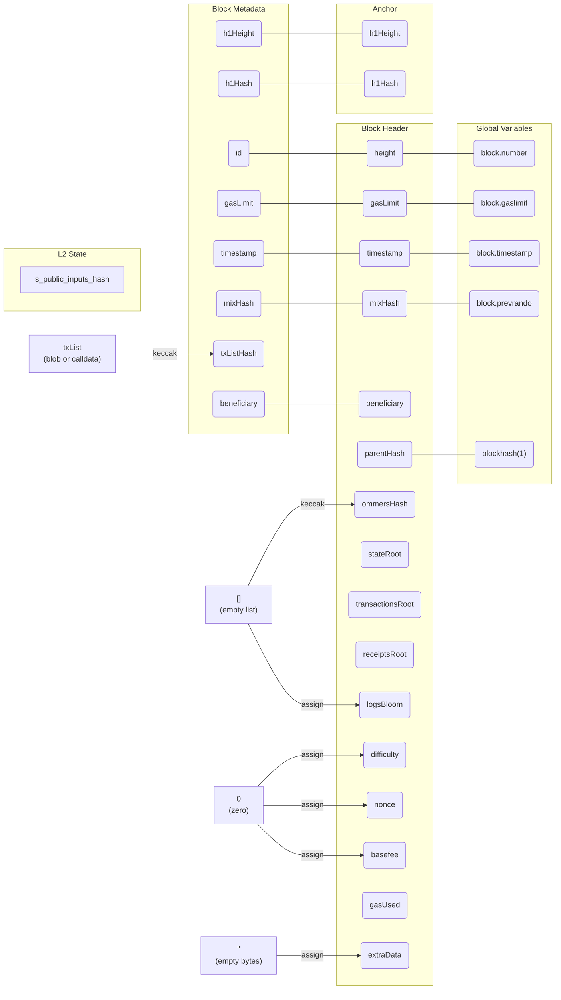

```mermaid
  graph LR

  m_id(id) --- h_height(height) --- v_block_number(block.number);
  m_gas_limit(gasLimit) --- h_gas_limit(gasLimit) --- v_block_gaslimit(block.gaslimit);
  m_timestamp(timestamp) --- h_timestamp(timestamp)  --- v_block_timestamp(block.timestamp);
  m_h1_height(h1Height) --- a_h1_height(h1Height);
  m_h1_hash(h1Hash) --- a_h1_hash(h1Hash);
  m_mix_hash(mixHash) --- h_mix_hash(mixHash) --- v_block_prevrando(block.prevrando);
  tx_list["txList\n(blob or calldata)"] -->|keccak| m_txlist_hash(txListHash) ;
  m_beneficiary(beneficiary) --- h_beneficiary(beneficiary);

  h_parent_hash(parentHash) --- v_blockhash_1("blockhash(1)");
  empty_list["[]\n(empty list)"] -->|keccak| h_ommers_hash(ommersHash);
  h_state_root(stateRoot);
  h_transactions_root(transactionsRoot);
  h_receipts_root(receiptsRoot);
  empty_list -->|assign| h_logs_bloom(logsBloom);
  zero["0\n(zero)"] -->|assign| h_difficulty(difficulty)
  zero -->|assign| h_nonce(nonce)
  zero -->|assign| h_basefee(basefee)
  h_gas_used(gasUsed)
  empty_string["''\n(empty bytes)"] -->|assign| h_extra_data(extraData)

  subgraph Block Metadata
  m_id
  m_gas_limit
  m_timestamp
  m_h1_height
  m_h1_hash
  m_mix_hash
  m_txlist_hash
  m_beneficiary
  end

  subgraph Block Header
  h_height
  h_gas_limit
  h_gas_used
  h_timestamp
  h_mix_hash
  h_beneficiary
  h_parent_hash
  h_ommers_hash
  h_state_root
  h_transactions_root
  h_receipts_root
  h_logs_bloom
  h_difficulty
  h_extra_data
  h_nonce
  h_basefee
  end

  subgraph Global Variables
  v_block_number
  v_block_gaslimit
  v_block_timestamp
  v_block_prevrando
  v_blockhash_1
  end


  subgraph Anchor
  a_h1_height
  a_h1_hash
  end


  subgraph L2 State
  s_public_inputs_hash
  end
```
