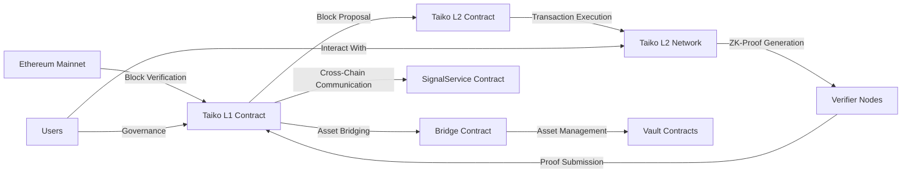
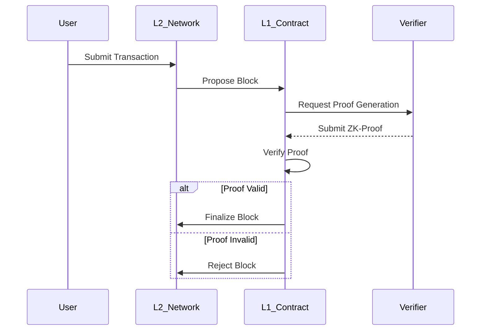
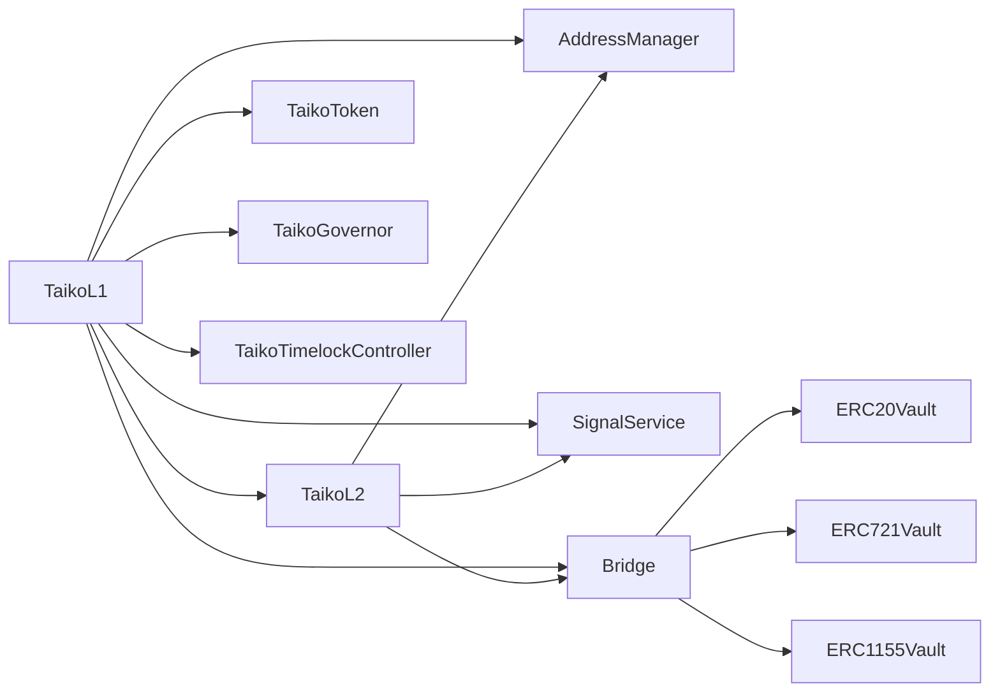
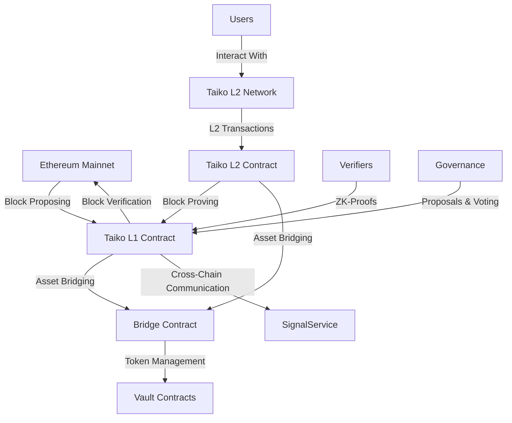
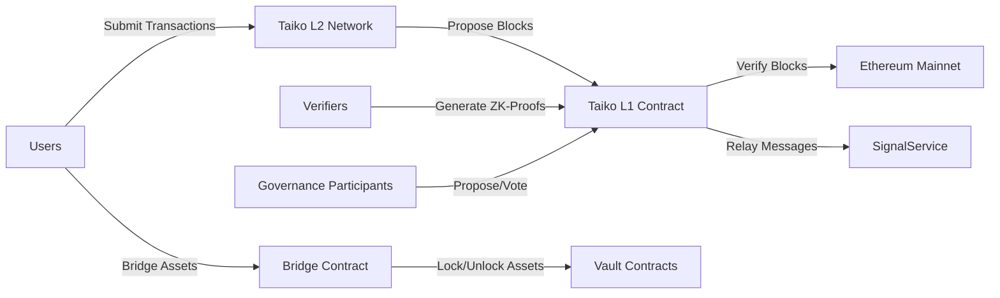
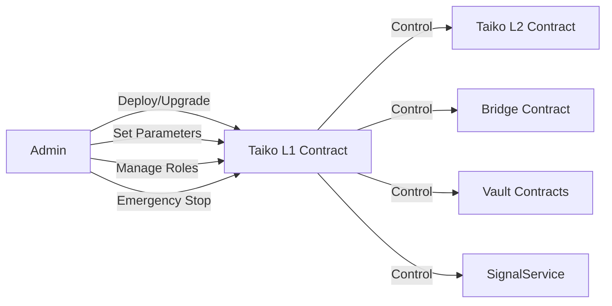
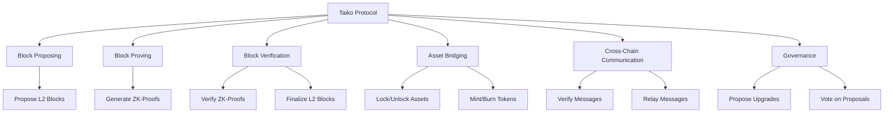
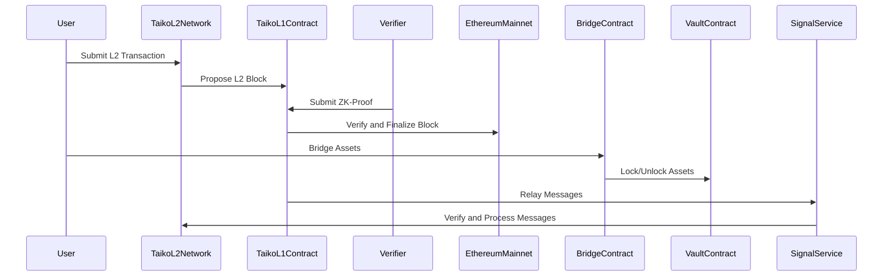
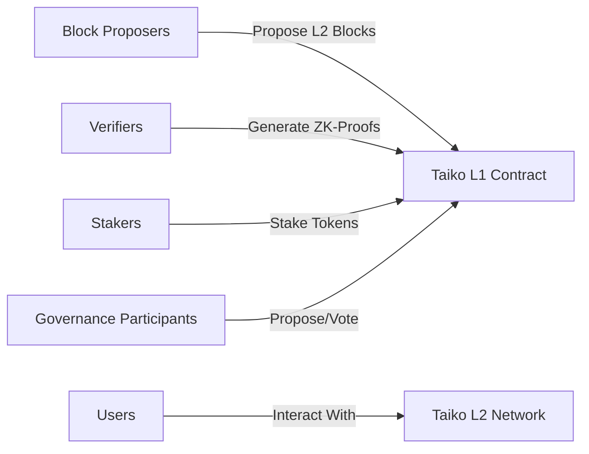

### Diagrams, admin/systemic/technical/integration risk discussions of the Taiko protocol.

**Diagrams:**
To better understand the architecture and workflow of the Taiko protocol.

1. System Overview Diagram:

Overview of the main components and their interactions within the Taiko protocol. It illustrates the flow of block proposals, verification, and finalization between the Ethereum mainnet and the Taiko L2 network, as well as the role of the Bridge Contract, Vault Contracts, and SignalService Contract in facilitating asset transfers and cross-chain communication.

2. Consensus and Block Verification Diagram:

The consensus and block verification process in the Taiko protocol. It shows the flow of transactions from users to the L2 network, the block proposal to the L1 contract, the generation and submission of ZK-proofs by verifiers, and the verification and finalization of blocks based on the validity of the proofs.

**Admin/Systemic/Technical/Integration Risk Discussions:**

1. Admin Risks:

   - Centralization of power: The Taiko protocol relies on certain admin roles, such as contract owners and protocol developers, who have privileged access and control over the system. There is a risk of centralization if these roles are not properly managed or if there is a concentration of power in a few individuals or entities.
   - Governance risks: The governance mechanism in the Taiko protocol allows token holders to propose and vote on protocol upgrades and parameter changes. However, there are risks associated with the governance process, such as low voter participation, manipulation of voting power, or the passage of malicious proposals.
   - Access control risks: Proper access control mechanisms must be in place to ensure that only authorized entities can perform critical operations, such as proposing blocks, verifying proofs, or managing bridge contracts. Inadequate access controls can lead to unauthorized actions and compromise the security of the system.

2. **Systemic Risks:**

   - Economic incentives: The Taiko protocol relies on economic incentives to encourage participation and maintain the security of the network. However, misaligned incentives or unintended consequences in the token economics can lead to systemic risks, such as lack of participation, concentration of power, or market manipulation.
   - Network effects: The success and adoption of the Taiko protocol depend on network effects and the growth of its ecosystem. Insufficient network effects or a lack of user and developer adoption can pose systemic risks to the long-term sustainability and viability of the protocol.
   - Regulatory risks: The regulatory landscape for blockchain and Layer 2 solutions is still evolving. Changes in regulations or legal requirements can impact the operation and adoption of the Taiko protocol, creating systemic risks for the ecosystem.

3. **Technical Risks:**

   - Smart contract vulnerabilities: The Taiko protocol heavily relies on smart contracts for its core functionalities. Any vulnerabilities or bugs in the contract code can lead to technical risks, such as fund loss, system malfunction, or exploitation by malicious actors.
   - ZK-proof security: The security of the Taiko protocol depends on the robustness and reliability of the zero-knowledge proof system used for block verification. Any weaknesses or flaws in the ZK-proof implementation can compromise the integrity of the system and pose technical risks.
   - Scalability and performance: The Taiko protocol aims to provide a scalable and efficient Layer 2 solution. However, there are technical risks associated with the scalability and performance of the system, such as network congestion, high gas costs, or limitations in transaction throughput.

4. **Integration Risks:**
   - Cross-chain communication: The Taiko protocol involves cross-chain communication and message passing between the Ethereum mainnet and the Taiko L2 network. Risks can arise from the integration and synchronization of state updates, bridge transfers, and other critical events across the two networks.
   - Ecosystem integration: The Taiko protocol interacts with various external components, such as wallets, dApps, and other blockchain networks. Integration risks can occur due to compatibility issues, API changes, or dependencies on third-party services.
   - Upgradability and migration: As the Taiko protocol evolves, there may be a need for upgrades, migrations, or changes to the system. Integration risks can arise during these processes, such as data loss, compatibility issues, or disruptions to the network.

#### Explanation:

The Taiko protocol is a complex system that involves multiple components, actors, and interactions. The architecture diagram provides a high-level overview of the main building blocks, including the Ethereum mainnet, Taiko L1 Contract, Taiko L2 Contract, Bridge Contract, Vault Contracts, SignalService Contract, and Verifier Nodes.

The workflow of the Taiko protocol starts with users submitting transactions to the Taiko L2 network. These transactions are collected by block proposers, who compress them into proposed blocks and submit them to the Taiko L1 Contract on the Ethereum mainnet. Verifier nodes then generate ZK-proofs to attest to the validity of the proposed blocks and submit these proofs to the L1 contract for verification.

If the proofs are valid, the L1 contract finalizes the block and updates the L2 state. The Taiko L2 Contract on the L2 network receives the updated state and continues processing transactions. If the proofs are invalid, the block is rejected, and the L2 network continues with the previous state.

The Bridge Contract and Vault Contracts facilitate the transfer of assets between the Ethereum mainnet and the Taiko L2 network. Users can lock assets on the mainnet, and corresponding tokens are minted on the L2 network. Similarly, tokens can be burned on the L2 network, and the corresponding assets are unlocked on the mainnet. The SignalService Contract enables cross-chain communication and message passing between the two networks.

The Taiko protocol also includes a governance mechanism that allows token holders to propose and vote on protocol upgrades and parameter changes. This governance process is executed through the Taiko L1 Contract and ensures the decentralized evolution and improvement of the protocol.

However, the Taiko protocol is not without risks. Admin risks arise from the centralization of power and the need for proper access control and governance mechanisms. Systemic risks can occur due to misaligned incentives, insufficient network effects, or changes in the regulatory landscape. Technical risks are associated with smart contract vulnerabilities, ZK-proof security, and scalability challenges. Integration risks can arise from cross-chain communication, ecosystem integration, and upgradability processes.

> To mitigate these risks, the Taiko protocol must implement robust security measures, conduct thorough audits and testing, and establish clear governance and access control policies. Continuous monitoring, upgrades, and community engagement are essential to address emerging risks and ensure the long-term success of the protocol.

## 1. Architecture Overview

The Taiko protocol consists of several key components that work together to enable a based rollup solution. The main contracts and their interactions are depicted in the following diagram:

- **TaikoL1**: The main contract on the Ethereum network that manages block proposing, proving, and verification.
- **TaikoL2**: The contract pre-deployed on the Taiko L2 network that handles L2 block processing and anchoring to L1.
- **TaikoToken**: The native token of the Taiko protocol, used for staking and governance.
- **TaikoGovernor**: The governance contract that manages protocol upgrades and parameter changes.
- **TaikoTimelockController**: A timelock controller contract that enforces a delay on sensitive actions.
- **AddressManager**: A contract that manages the addresses of various protocol components.
- **SignalService**: A contract that facilitates cross-chain communication and message verification.
- **Bridge**: The main contract that handles asset bridging between Ethereum and Taiko L2.
- **ERC20Vault**, **ERC721Vault**, **ERC1155Vault**: Contracts that manage the storage and bridging of different token standards.

## 4. Codebase Quality Analysis

The Taiko codebase follows a modular and well-structured design, with contracts organized into relevant directories based on their functionality. The code is written in Solidity and adheres to common best practices and standards.

### 4.1 Code Quality

- The codebase maintains a consistent coding style and follows the Solidity naming conventions.
- Functions and variables are appropriately named, enhancing code readability and understandability.
- The use of libraries, such as `LibAddress`, `LibMath`, and `LibTrieProof`, promotes code reusability and modularity.
- The codebase includes comprehensive error handling, with custom error messages defined for various failure scenarios.
- The contracts make use of access control modifiers, such as `onlyOwner` and `onlyFromNamed`, to restrict access to critical functions.

### 4.2 Documentation and Comments

- The codebase includes natspec comments for most functions and contracts, providing a clear understanding of their purpose and behavior.
- Critical sections of the code are accompanied by inline comments explaining the logic and reasoning behind certain decisions.
- The repository includes a detailed README file that provides an overview of the Taiko protocol and guides developers on how to set up and interact with the contracts.

### 4.3 Testing and Verification

- The codebase includes a comprehensive test suite that covers various scenarios and edge cases.
- The use of the `hardhat` development environment and testing framework ensures a standardized and efficient testing process.
- The contracts undergo thorough unit testing, with each critical function and component being tested individually.
- Integration tests are conducted to verify the interaction between different contracts and components.

## 5. Centralization Risks and Admin Control Abuse

The Taiko protocol incorporates several mechanisms to mitigate centralization risks and prevent admin control abuse. However, there are a few areas that require careful consideration:

### 5.1 Contract Ownership

- Each contract in the Taiko protocol has an owner who possesses elevated privileges, such as the ability to upgrade the contract code and perform specific actions.
- While the ownership model allows for efficient contract management and upgrades, it introduces a level of centralization risk.
- Mitigation: Implement a multi-sig wallet or a decentralized governance mechanism for contract ownership to distribute control and reduce the risk of a single point of failure.

### 5.2 Special Roles

- The protocol defines special named roles, such as `proposer`, `proposer_one`, and `bridge_pauser`, which grant certain privileges to specific addresses.
- These roles can be configured to `address(0)` to disable the associated functions.
- Mitigation: Regularly review and audit the assignment of special roles to ensure they are assigned to trusted and accountable entities. Consider implementing time-limited or rotatable roles to reduce the impact of potential abuse.

### 5.3 Governance

- The `TaikoGovernor` contract manages protocol upgrades and parameter changes through a decentralized governance process.
- While decentralized governance reduces centralization risks, it is essential to ensure that the governance process is fair, transparent, and resistant to manipulation.
- Mitigation: Implement robust governance mechanisms, such as time-locks, multi-sig approvals, and community voting, to prevent unilateral control and ensure broad stakeholder participation.

## 6. Mechanism Review

### 6.1 Merkle Proof Verification

The Merkle proof verification process is a critical component of the Taiko protocol, ensuring the integrity of state transitions and cross-chain communication. The `LibTrieProof` library handles the verification of Merkle proofs.

- The `verifyMerkleProof` function takes the root hash, account address, slot, expected value, account proof, and storage proof as input.
- It verifies the account proof using the `SecureMerkleTrie.get` function from the `optimism/trie` library.
- If the account proof is valid, it extracts the storage root from the account state.
- It then verifies the storage proof using the `SecureMerkleTrie.verifyInclusionProof` function.
- The function returns the verified storage root.

Potential Issues:

- The security of the Merkle proof verification heavily relies on the correctness and security of the `optimism/trie` library. Any vulnerabilities in this library could compromise the verification process.
- The `verifyMerkleProof` function assumes that the provided proofs are correctly formatted and consistent with the expected data. Maliciously crafted proofs could potentially exploit edge cases and bypass the verification.

Recommendations:

- Regularly update and audit the `optimism/trie` library to ensure its security and correctness.
- Implement additional input validation checks to ensure the consistency and validity of the provided proofs.
- Consider implementing additional checks and error handling to cover edge cases and prevent potential exploits.

### 6.2 Multi-Hop Bridging

The Taiko protocol supports multi-hop bridging, allowing assets to be transferred across multiple chains. The `SignalService` contract plays a crucial role in this process.

- The `proveSignalReceived` function verifies the inclusion of a signal in the source chain's state during the multi-hop bridging process.
- It iterates over the provided `HopProof` array, verifying each hop using the `_verifyHopProof` function.
- The function checks the validity of the hops by ensuring that the last hop's chain ID matches the current chain ID and that the intermediate hops' chain IDs are not zero and do not match the current chain ID.

Potential Issues:

- The current implementation does not explicitly prevent self-referential hops, where a hop's chain ID matches one of the previous hops' chain IDs. This could potentially lead to unexpected behavior or loss of funds if a malicious user constructs a proof with self-referential hops that bypass the loop detection.
- The security of the multi-hop bridging process relies on the correctness and security of the underlying bridge contracts and the `SignalService` contract. Any vulnerabilities in these components could compromise the entire bridging process.

Recommendations:

- Implement explicit checks to detect and prevent self-referential hops in the `proveSignalReceived` function. This can be done by maintaining a mapping or array of visited chain IDs and ensuring that each hop's chain ID is unique.
- Conduct thorough security audits of the bridge contracts and the `SignalService` contract to identify and address any potential vulnerabilities.
- Implement comprehensive error handling and input validation to cover edge cases and prevent potential exploits.

### 6.3 Bridge Message Hashing

The `Bridge` contract includes a `hashMessage` function that generates a hash of a bridge message using the `keccak256` hash function.

- The `hashMessage` function takes an `IBridge.Message` struct as input, which contains various fields such as the message ID, source and destination chain IDs, owners, recipient, value, fee, gas limit, data, and memo.
- It encodes the `IBridge.Message` struct using `abi.encode` and then hashes the encoded message using `keccak256`.
- The resulting hash is returned.

Potential Issues:

- The security of the bridge message hashing relies on the collision resistance of the `keccak256` hash function. While `keccak256` is considered secure and widely used, it is important to stay updated with any new cryptographic advancements or potential weaknesses discovered in the future.
- The `IBridge.Message` struct includes various fields that collectively contribute to the uniqueness of the message hash. Any changes to the struct or the inclusion of additional fields could potentially impact the collision resistance of the hashing scheme.

Recommendations:

- Regularly review and assess the security of the `keccak256` hash function and stay informed about any new cryptographic advancements or potential weaknesses.
- Carefully manage any changes to the `IBridge.Message` struct and assess the impact on the hashing scheme. Ensure that any modifications maintain the uniqueness and collision resistance of the message hashes.
- Consider implementing additional checks and validations on the input fields of the `IBridge.Message` struct to prevent any potential manipulation or inconsistencies.

### 6.4 Proof Contestation

The Taiko protocol allows for the contestation of proofs to ensure the validity of state transitions. The proof contestation mechanism is implemented in the `LibProving` library.

- The `proveBlock` function handles the proof submission and contestation process.
- If a submitted proof is contested, the function checks if the proof's tier matches the previous transition's tier and if the contest bond is non-zero.
- If the conditions are met, the function allows the proof to be contested by calling the `_checkProverPermission` function, which verifies if the caller is allowed to contest the proof based on the proving window and the assigned prover.
- If a proof is successfully contested, the transition state is updated, the contest bond is transferred from the contester to the contract, and a `TransitionContested` event is emitted.

Potential Issues:

- The current implementation relies on the `provingWindow` parameter to limit the time for contestations. If this parameter is not set appropriately, it could allow for prolonged delays in block confirmation.
- The protocol may lack sufficient measures to prevent repeated contestations by the same contester or group of contesters, potentially leading to delays and inefficiencies.
- The incentive structure for contestations may not be adequately balanced, allowing for frivolous contestations or discouraging legitimate challenges.

Recommendations:

- Carefully review and adjust the `provingWindow` parameter to ensure it provides an appropriate balance between allowing sufficient time for legitimate contestations and preventing prolonged delays.
- Implement additional measures to prevent repeated contestations, such as introducing a cooldown period or increasing the contest bond for repeated contestations by the same contester or group.
- Regularly assess and fine-tune the incentive structure for contestations to maintain a healthy balance between encouraging legitimate challenges and discouraging frivolous contestations.
- Conduct thorough testing and simulation of various contestation scenarios to identify and address any potential vulnerabilities or gaming opportunities.

### 6.5 Block Proposing Ring Buffer

The Taiko protocol utilizes a block proposing ring buffer to manage the block proposal process. The ring buffer is implemented in the `TaikoL1` contract.

- The `proposeBlock` function is responsible for proposing new blocks and adding them to the ring buffer.
- The ring buffer has a fixed size determined by the `config.blockRingBufferSize` parameter.
- Blocks are added to the ring buffer using the `proposeBlock` function, which appends the proposed block to the buffer and increments the `state.slotB.numBlocks` counter.
- The ring buffer allows for a maximum of `config.blockMaxProposals` blocks to be proposed ahead of the last verified block.

Potential Issues:

- If an attacker can propose blocks faster than they can be verified and processed, they could potentially fill up the ring buffer and halt the chain.
- The attacker would need to have sufficient resources and network power to propose blocks at a high rate consistently.
- The vulnerability arises if the block verification and processing rate cannot keep up with the block proposal rate, leading to an accumulation of unverified blocks in the ring buffer.

Recommendations:

- Implement rate limiting mechanisms to prevent an attacker from proposing blocks at an excessively high rate. This can include dynamic adjustments based on network conditions or time-based restrictions on block proposals.
- Ensure that the `config.blockMaxProposals` parameter is set appropriately based on the expected network throughput and verification capacity. This parameter should strike a balance between allowing sufficient block proposals and preventing an attacker from overwhelming the system.
- Regularly monitor the block proposal and verification rates to identify any abnormal behavior or potential attacks. Implement monitoring and alerting systems to detect and respond to such situations promptly.
- Consider implementing additional safeguards, such as prioritizing the verification of blocks based on certain criteria (e.g., block proposer reputation) to mitigate the impact of potential attacks.

### 6.6 L2 Anchor Transactions

L2 anchor transactions play a crucial role in maintaining the integrity and security of the Taiko L2 chain. The `TaikoL2` contract includes the `anchor` function, which handles the anchoring of L1 block details to L2.

- The `anchor` function is responsible for verifying and storing the L1 block details, including the block hash, state root, block ID, and parent gas used.
- It performs various checks, such as validating the input parameters, verifying the sender's permission, and checking the ancestor hashes.
- The function calculates the base fee for the L2 block using the `_calc1559BaseFee` function and compares it with the current block's base fee. If there is a mismatch and the fee check is not skipped, the function reverts.
- If the provided L1 block ID is greater than the last synced block by a certain threshold, the function syncs the L1 state root with the signal service.
- The function updates the `l2Hashes` mapping, stores the parent block hash, and updates the `publicInputHash`.

Potential Issues:

- The security of the anchoring process relies on the correctness and integrity of the provided L1 block details. If an attacker can manipulate or provide invalid L1 block details, it could compromise the integrity of the L2 chain.
- The `anchor` function performs various checks and validations, but there may be edge cases or scenarios that are not fully covered, potentially leading to inconsistencies or vulnerabilities.
- The function interacts with the signal service to sync the L1 state root. Any vulnerabilities or issues in

## Conceptual Overview of the Taiko Protocol

Taiko is a decentralized, Ethereum-compatible rollup protocol that aims to provide scalability and faster transaction processing while maintaining the security and decentralization of the Ethereum network. It utilizes a unique "based" rollup approach, which means it is inspired by, secured by, and sequenced by Ethereum.

The Taiko Protocol leverages zero-knowledge proofs (ZK-proofs) to validate and compress transactions, reducing the amount of data stored on the Ethereum mainnet. This allows for higher transaction throughput and lower gas fees compared to directly executing transactions on Ethereum.

## System Overview

The Taiko Protocol consists of several key components that work together to enable efficient and secure transaction processing:

1. **Taiko L1 Contract**: The main contract deployed on the Ethereum mainnet that manages block proposing, proving, and verification. It interacts with other components of the Taiko Protocol.

2. **Taiko L2 Contract**: The contract deployed on the Taiko L2 network that handles L2 block processing and anchoring to the Ethereum mainnet.

3. **Taiko Token**: The native token of the Taiko Protocol used for staking, governance, and incentivizing participants.

4. **Bridge**: A smart contract that facilitates the transfer of assets between the Ethereum mainnet and the Taiko L2 network.

5. **Vaults**: Contracts responsible for managing the storage and bridging of different token standards (ERC20, ERC721, ERC1155) between the Ethereum mainnet and the Taiko L2 network.

6. **SignalService**: A contract that enables cross-chain communication and message verification between the Ethereum mainnet and the Taiko L2 network.

7. **Verifiers**: Off-chain actors who generate ZK-proofs to validate the correctness of state transitions and transactions on the Taiko L2 network.

## Breakdown of Functions

The Taiko Protocol implements several key functions to ensure secure and efficient transaction processing:

1. **Block Proposing**: Block proposers submit new L2 blocks to the Taiko L1 Contract, which includes the compressed transactions and state transitions.

2. **Block Proving**: Verifiers generate ZK-proofs to validate the correctness of the proposed blocks and submit them to the Taiko L1 Contract.

3. **Block Verification**: The Taiko L1 Contract verifies the submitted ZK-proofs and finalizes the L2 blocks, updating the state on the Ethereum mainnet.

4. **Asset Bridging**: Users can transfer assets between the Ethereum mainnet and the Taiko L2 network using the Bridge contract and the associated Vault contracts.

5. **Cross-Chain Communication**: The SignalService contract facilitates the verification and relay of messages between the Ethereum mainnet and the Taiko L2 network.

6. **Governance**: The Taiko Protocol includes governance mechanisms that allow token holders to propose and vote on protocol upgrades and parameter changes.

## Roles in the System

The Taiko Protocol involves various roles and participants:

1. **Block Proposers**: Entities responsible for proposing new L2 blocks to the Taiko L1 Contract.

2. **Verifiers**: Off-chain actors who generate ZK-proofs to validate the correctness of proposed blocks and state transitions.

3. **Stakers**: Token holders who stake their Taiko tokens to participate in the protocol's security and governance.

4. **Users**: Individuals or applications that interact with the Taiko L2 network, executing transactions and utilizing its scalability benefits.

5. **Governance Participants**: Token holders who participate in the governance process by proposing and voting on protocol upgrades and changes.

## Architecture and Workflow

The Taiko Protocol follows a specific workflow to process transactions and ensure the security and integrity of the system:

1. **L2 Transaction Execution**: Users submit transactions to the Taiko L2 network, where they are executed and included in L2 blocks.

2. **Block Proposing**: Block proposers compress the L2 transactions and state transitions into a proposed block and submit it to the Taiko L1 Contract on the Ethereum mainnet.

3. **Proof Generation**: Verifiers generate ZK-proofs off-chain to validate the correctness of the proposed block and state transitions.

4. **Proof Submission**: Verifiers submit the generated ZK-proofs to the Taiko L1 Contract for verification.

5. **Block Verification**: The Taiko L1 Contract verifies the submitted ZK-proofs and finalizes the L2 block, updating the state on the Ethereum mainnet.

6. **Asset Bridging**: Users can transfer assets between the Ethereum mainnet and the Taiko L2 network using the Bridge contract and the associated Vault contracts. The Bridge contract handles the locking and unlocking of assets, while the Vault contracts manage the storage and minting/burning of tokens on the respective networks.

7. **Cross-Chain Communication**: The SignalService contract facilitates the verification and relay of messages between the Ethereum mainnet and the Taiko L2 network, enabling seamless communication and interoperability.

8. **Governance**: Token holders can participate in the governance process by proposing and voting on protocol upgrades and parameter changes. The governance mechanism ensures the decentralized evolution and improvement of the Taiko Protocol.

This architectural design and workflow enable the Taiko Protocol to provide a scalable and efficient Layer 2 solution while leveraging the security and decentralization of the Ethereum network.

Risk Assessment:

---

The Taiko Protocol, being a complex system, inherently involves certain risks that need to be carefully considered and mitigated.

1. **Smart Contract Vulnerabilities**: As with any smart contract-based system, the Taiko Protocol is susceptible to potential vulnerabilities in its contract code. Any bugs or exploits in the contract logic could lead to financial losses, system disruption, or compromise of user funds.

   Mitigation: Thorough security audits, code reviews, and testing should be conducted to identify and address any vulnerabilities in the smart contract code. Adopting best practices in contract development, such as using well-tested libraries and following secure coding guidelines, can help minimize the risk of vulnerabilities.

2. **Consensus and Block Verification**: The Taiko Protocol relies on a proof-based consensus mechanism, where verifiers generate ZK-proofs to validate the correctness of proposed blocks. If there are any flaws or weaknesses in the consensus algorithm or the ZK-proof generation process, it could potentially lead to invalid blocks being accepted or valid blocks being rejected.

   Mitigation: Rigorous testing and formal verification of the consensus algorithm and ZK-proof generation process should be performed to ensure their correctness and resilience against potential attacks. Continuously monitoring the network for any abnormalities or suspicious activities can help detect and mitigate any issues promptly.

3. **Bridge Security**: The Taiko Protocol involves asset bridging between the Ethereum mainnet and the Taiko L2 network. The security of the Bridge contract and the associated Vault contracts is crucial to prevent unauthorized access, theft, or loss of bridged assets.

   Mitigation: Implementing robust access controls, multi-sig mechanisms, and thorough testing of the Bridge and Vault contracts can help ensure the security of bridged assets. Regular security audits and monitoring of the bridging process can help identify and address any potential vulnerabilities or suspicious activities.

4. **Governance Risks**: The Taiko Protocol incorporates a governance mechanism that allows token holders to propose and vote on protocol upgrades and changes. However, governance processes can be subject to various risks, such as low voter participation, centralization of voting power, or malicious proposals.

   Mitigation: Designing a fair and inclusive governance model that encourages active participation from a diverse range of stakeholders can help mitigate governance risks. Implementing safeguards, such as proposal thresholds, time-locks, and multi-sig requirements, can prevent malicious or hastily made changes to the protocol.

5. **Operational Risks**: The Taiko Protocol relies on the proper functioning and coordination of various components, including block proposers, verifiers, and the underlying infrastructure. Operational failures, such as network disruptions, node failures, or human errors, can impact the system's performance and reliability.

   **Mitigation**: Implementing robust monitoring and alerting systems, as well as having well-defined incident response procedures, can help quickly detect and resolve operational issues. Regular testing, failover mechanisms, and redundancy measures can enhance the system's resilience against operational risks.

**Architecture Overview Diagram:**

System Overview Diagram:

Admin Flow Diagram:

Breakdown of Functions Diagram:

Architecture and Workflow Diagram:

Roles in the System Diagram:

**Contract Markdown Table:**

| Contract Name        | Description                                                                      | Risk Considerations                                                    |
| -------------------- | -------------------------------------------------------------------------------- | ---------------------------------------------------------------------- |
| Taiko L1 Contract    | Manages block proposing, proving, and verification on the Ethereum mainnet       | Smart contract vulnerabilities, consensus and block verification risks |
| Taiko L2 Contract    | Handles L2 block processing and anchoring to the Ethereum mainnet                | Smart contract vulnerabilities, operational risks                      |
| Bridge Contract      | Facilitates asset bridging between the Ethereum mainnet and the Taiko L2 network | Bridge security risks, smart contract vulnerabilities                  |
| Vault Contracts      | Manage the storage and bridging of different token standards                     | Smart contract vulnerabilities, asset management risks                 |
| SignalService        | Enables cross-chain communication and message verification                       | Smart contract vulnerabilities, message relay risks                    |
| Governance Contracts | Implement governance mechanisms for protocol upgrades and parameter changes      | Governance risks, centralization risks                                 |

This table provides an overview of the key contracts in the Taiko Protocol, along with their descriptions and the associated risk considerations. It's crucial to thoroughly audit and test these contracts to identify and mitigate any potential vulnerabilities or risks.

### Time spent:

25 hours
