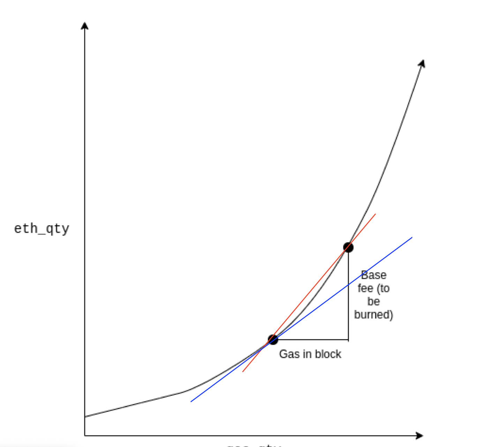

# Taiko L2 EIP-1559

## The overall design

The EIP-1559 base fee per gas (base fee) on Taiko L2 is calculated by Taiko L1 protocol contracts and injected into the block's metadata. The Taiko client should skip calculating the base fee value, stop burning the base fee, and send it to a named address ("treasury") specified in Taiko L1 protocol contracts, which will be verified by Taiko ZKP.

## Basefee Calculation

We use Vitalik's idea proposed here: https://ethresear.ch/t/make-eip-1559-more-like-an-amm-curve/9082 (read it first!). The x-axis represents the current gas _excess_, the y-axis is the ether amount. When some gas is sold, excess goes up, and the difference of the new and the old y value is the total cost of the gas purchase, or $$cost(gasAmount) = e^{(gasExcess + gasAmount)} -e^{gasExcess}$$, and $$basefee(gasAmount) = cost(gasAmount)/gasAmount$$.

A nice property of the $e^x$ curve is that for a chosen gas target $T$, the base fee ($basefee(T)$) for a block with $T$ gas and the base fee ($basefee(2T)$) for a block with $2T$ gas always have the fixed ratio: $$R == basefee(2T)/basefee(T)$$ regardless of the current _gas excess_ value, $T$ and $R$ together determine the shape of the curve. In Ethereum, $T$ is 15 million and $R$ is 12.5%; it's yet to be decided what value we should use in Taiko.

### Implementation of $e^x$

We steal the `exp(x)` implementation from https://github.com/recmo/experiment-solexp/blob/main/src/test/FixedPointMathLib.t.sol. This implementation has a limitation: the range is input parameter `x` is `[-42.139678854, + 135.305999369]` with 18 decimals/precision. In our case, we need to map gas excess to the range of `[0, K]` where `K` equals `135.305999369` or `135305999368893231588` in fixed point integer form.

The $e^x$ curve can be expressed using $$py=e^{qx}$$, as you can see below: the two parameters $p$ and $q$ defines the shape/slope of the curve. We need to find the right value for them, otherwise, the base fee movement will not be as expected.

(the plot above is available at https://www.desmos.com/calculator/yncurfx3ar)

## Scaling

The following is how we calculate $p$ and $q$. Assuming the max gas excess $M$, a uint64. then $q = 135305999368893231588/M$ (internally we keep $q'=q <<64$ as it fits into a uint64).

We also assuming the initial value of gasExcess is $M/2$; and the initial basefee (the fee for purchasing 1 gas) is $b_0$, or $$b_0=p e^{(M/2 + 1)} + p e^{M/2}$$, so $$p = b_0/(e^{(M/2 + 1)} + e^{M/2})$$.

It turns out the initial value of gasExcess doesn't really matter for the above calculation due to the nature of the e-curve. But choosing $M/2$ allows price to go up and down by the same max amount.

## Adjust the slope

To adjust the slope of the curve to satisfy $R == basefee(2T)/basefee(T)$, we simply need to choose $M$ and $b_0$. $b_0$ is simply to decide -- if we believe the cost of a L2 transaction is $1/n$ of the same L1 transaction, we simply use the current L1 base fee divided by $n$. Then we can simply tune $M$ to make sure $R == basefee(2T)/basefee(T)$ holds. This is very simply manually a try-and-adjust approach as shown in `Lib1559Math.t.sol`. The TaikoL1 contract will check if $R == basefee(2T)/basefee(T)$ holds but will not calculate $M$ for us.

## Implementation Difference

Our implementation computes the basefee prior to applying the gas used by the current block (indicated by the blue line in the image below), in contrast to Vitalik's concept, which calculates the average basefee by also taking into account the gas consumption of the current block (represented by the red line).

