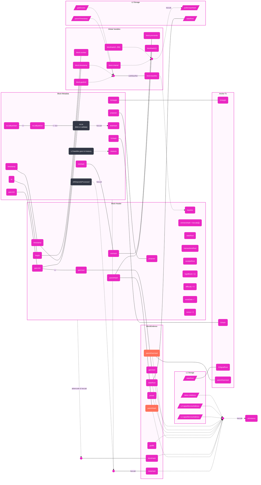

# How Taiko proves L2 blocks

This document specifies how the Taiko protocol, client, and circuits work together to prove L2 blocks.

## Data

### Transaction List

The transaction list, `txList`, of a Layer 2 (L2) block will eventually be part of a blob in the Layer 1 (L1) Consensus Layer (CL) -- right now it is within the calldata.
It is meant to be a list of RLP-encoded L2 transactions, with only its length and commitment available to the L1 Execution Layer (EL). The length is checked when a block is proposed, but we need to prove whether the `txList` is valid or not using a ZKP.

A valid `txList` (until [issue #13724](https://github.com/taikoxyz/taiko-mono/issues/13724) is enabled and implemented):

- Has a byte-size smaller than the protocol constant _`blockMaxTxListBytes`_ (also enforced in contracts);
- Can be RLP-decoded into a list of transactions without trailing space;
- Contains no more transactions (valid and invalid) than the protocol constant _`blockMaxTransactions`_;
- Has a total gas limit for all valid transactions not exceeding the protocol constant _`blockMaxGasLimit`_;

ZKP must prove whether the `txList` is valid or invalid. For an invalid `txList`, the corresponding L2 block will only have an anchor transaction.

For a valid `txList`, ZKP must also prove whether each enclosed transaction is valid or invalid. All valid transactions will be part of the actual L2 block with an anchor transaction as the very first one.

A valid transaction (defined in the Ethereum Yellow Paper):

- Has a valid transaction signature.
- Has a valid transaction nonce (equivalent to the sender account's current nonce).
- Has no contract code deployed on the sender account (see EIP-3607 by Feist et al. [2021]).
- Has a gas limit no smaller than the intrinsic gas, _`g0`_, used by the transaction.
- The sender account balance contains at least the cost, _`v0`_, required in up-front payment.
- The transaction has a gas limit that is smaller or equal to the amount of gas left in the block (with the block gas limit being the protocol constant _`blockMaxGasLimit`_).
- The transaction has a base fee that is greater than or equal to the base fee of the block.

#### Slicing and Consistency

Note that the data of `txList` cannot be assumed to be directly accessible to L1 contracts, and so the ZKP shall further prove that the chosen `txList` is a slice of the given blob data. The `blobHash` opcode will be available when EIP-4844 is merged into Ethereum.

### Anchor Transactions

Every L2 block has exactly one anchor function call as its first transaction.

The ZKP must prove that _TaikoL2.anchor(...)_ is the first transaction in the block, with the correct input parameters and gas limit, signed by the so called golden-touch address, and that the transaction executed successfully.

- The anchor transaction's `to` address must be the registered `taiko_l2` address, which is hashed into the ZKP `instance`. And the `tx.origin` must be the golden touch address.
- The anchor transaction's ABI must be:

```solidity
function anchor(
 bytes32 l1Hash,
 bytes32 l1SignalRoot,
 uint64 l1Height,
 uint64 parentGasUsed
) external;
```

- A circuit will verify the integrity among: `l1Hash`, `l1SignalRoot`, and `l1SignalServiceAddress`.
- `l1SignalServiceAddress`, `l2SignalServiceAddress` and `parentGasUsed` are directly hashed into the ZKP's instance.
- `l1Height` and `l1Hash` are both part of the block metadata (`meta.l1Height` and `meta.l1Hash`), the `metaHash` is used to calculate the ZKP instance.
- `l1SignalRoot` is part of the evidence and is also used to calculate the ZKP instance.
- The transaction's status code is 1 (success).
- The transaction's `tx.origin` and `msg.sender` must be _`LibAnchorSignature.K_GOLDEN_TOUCH_ADDRESS`_.
- The transaction's signature must be the same as `LibAnchorSignature.signTransaction(...)`.
- The transaction fee must be 0.

Note that the anchor transaction emits an `Anchored` event that may help ZKP to verify block variables. See below.

#### Anchor Signature

ZKP shall also check the signature of the anchor transaction:

- The signer must be _`TaikoL2.GOLDEN_TOUCH_ADDRESS`_.
- The signature must use `1` as the `k` value if the calculated `r` is not `0`, otherwise, `k` must be `2`. See [LibL2Signer.sol](https://github.com/taikoxyz/taiko-mono/blob/main/packages/protocol/contracts/L2/LibL2Signer.sol).

### Block Metadata

This struct represents a proposed L2 block. This data will be hashed and be part of the public input to the circuits.

```solidity
struct BlockMetadata {
 uint64 id;
 uint64 timestamp;
 uint64 l1Height;
 bytes32 l1Hash;
 bytes32 mixHash;
 bytes32 blobHash;
 uint24 txListByteStart;
 uint24 txListByteEnd;
 uint32 gasLimit;
 address proposer;
 address treasury;
 TaikoData.EthDeposit[] depositsProcessed;
}
```

- `id`: Represents the block height in L2.
- `timestamp`: The block timestamp in L2.
- `l1Height`: The actual block height in L1.
- `l1Hash`: The actual block hash in L1.
- `mixHash`: Salted random number to accommodate multiple L2 blocks fitting into one L1 block.
- `blobHash`: Hash of the transaction list in L2.
- `txListByteStart`: Byte start of the transaction list in L2.
- `txListByteEnd`: Byte end of the transaction list in L2.
- `gasLimit`: Gas limit for the L2 block.
- `proposer`: The address of the proposer in L2.
- `treasury`: The address where the base fee goes in L2.
- `depositsProcessed`: The initiated L1->L2 Ether deposits that make up the depositRoot.

### Global Variables

The following [**block level variables**](https://docs.soliditylang.org/en/v0.8.18/units-and-global-variables.html) are accessible to the EVM, but their values are not part of the MPT so we need a different way to verify their correctness.

- `blockhash(uint blockNumber) returns (bytes32)`: hash of the given block when `blocknumber` is one of the 256 most recent blocks; otherwise returns zero
- `block.basefee` (`uint`): current block's base fee ([EIP-3198](https://eips.ethereum.org/EIPS/eip-3198) and [modified EIP-1559](./L2EIP1559.md))
- `block.chainid` (`uint`): current chain id
- `block.coinbase` (`address payable`): current block miner's address
- `block.prevrandao` (`uint`): alias for `block.prevrandao` ([EIP-4399](https://eips.ethereum.org/EIPS/eip-4399))
- `block.gaslimit` (`uint`): current block gaslimit
- `block.number` (`uint`): current block number
- `block.prevrandao` (`uint`): random number provided by the beacon chain
- `block.timestamp` (`uint`): current block timestamp in seconds since the Unix epoch

We need to verify when these variables are accessed within the EVM, their values are consistent with the current world state, the block's metadata and the actual L2 block's block header:

- `blockhash`: EVM allows access to the most recent 256 block hashes. All these hashes are available inside the plonk lookup table. ZKP must prove that the lookup table is consistent with L2's historical values.
- `blockhash(block.number - 1)`, has the same value as in the block header and is also the same value as the parent block's hash on L2.
- The other 255 hashes, `blockhash(block.number - 256)` to `blockhash(block.number - 2)` are checked in the anchor transaction to simplify circuits. Therefore, as long as the anchor transaction is zk-proven, these 255 ancestor hashes are proven indirectly.
- `block.basefee`: verified to be the correct value in the anchor transaction.
- `block.chainid`: this field is also checked by the anchor transaction, so no extra ZKP circuits are required.
- `block.coinbase`: ZKP must verify the value must be the same as `meta.proposer`. Again, the metadata hash is part of the ZK instance.
- `block.prevrandao`: this is now the same as `block.prevrandao`, so we only check `block.prevrandao`.
- `block.gaslimit`: ZKP must verify this value must equal `meta.gasLimit`.
- `block.number`: this must be checked against the block header and `meta.id`.
- `block.prevrandao`: this must be checked against the `mixHash` field in the L2 block header and `meta.mixHash`.
- `block.timestamp`: this must be checked against the `timestamp` field in the L2 block header and `meta.proposedAt`.

### Block Header

Not all block header data is available in the L1 contracts; therefore, the ZKP must verify the integrity of the block header and ensure the block header hashes into the same value as `evidence.blockHash`, which is part of the ZK instance input.

```solidity
struct BlockHeader {
 bytes32 parentHash;
 bytes32 ommersHash;
 address proposer;
 bytes32 stateRoot;
 bytes32 transactionsRoot;
 bytes32 receiptsRoot;
 bytes32[8] logsBloom;
 uint256 difficulty;
 uint128 height;
 uint64 gasLimit;
 uint64 gasUsed;
 uint64 timestamp;
 bytes extraData;
 bytes32 mixHash;
 uint64 nonce;
 uint256 baseFeePerGas;
 bytes32 withdrawalsRoot;
}
```

In addition, ZKP must also prove the following:

- `parentHash` must be the same as `evidence.parentHash`.
- `ommersHash` must be the keccak256 of `[]`,or `0x1dcc4de8dec75d7aab85b567b6ccd41ad312451b948a7413f0a142fd40d49347`.
- `proposer` must be `meta.proposer` (duplicated, as stated above).
- `logsBloom` must be a `bytes32[8]` with all zeros.
- `difficulty` == 0.
- `height` must be `meta.id`.
- `gasLimit` == `meta.gasLimit`.
- `gasUsed` must be the sum of all gas used by all valid transactions in the block.
- `timestamp` == `meta.proposedAt`.
- `extraData` == "".
- `mixHash` == `meta.mixHash`.
- `nonce` == 0.
- `baseFeePerGas` == `block.basefee`

Note that some of the header field checks above are duplicates of checks done in the Global Variable section.

### Signal Storage

The ZKP also needs to prove that the cross chain signal service’s storage roots have the correct values.

- **For L2 Signal Service**: the L1 storage root of the signal service is the second parameter in the anchor transaction. The ZKP shall verify that the storage root of the L1 Signal Service address has the given value by using an MPT proof against the state root stored in `meta.l1Hash` for the `l1SignalServiceAddress` account. This MPT proof must be queried by the L2 client from an L1 node.

- **For L1 Signal Service**: the L2 storage root verification will be done in the circuits by using an MPT proof against the post block state root for the `l2SignalServiceAddress` account.

### EIP-1559

In the Taiko L2 protocol, instead of being burned, the basefee is transferred to a designated `treasury` address. To ensure the integrity of this process, the ZKP needs to verify that the treasury address specified by the Taiko L1 contract is indeed the intended recipient.

### LibProving Verification

The actual value of the public input parameters must be consistent with the values used to hash the ZKP instance (see [**LibProving**](https://github.com/taikoxyz/taiko-mono/blob/945dabc09a668678aca1296e91d567b45ad37922/packages/protocol/contracts/L1/libs/LibProving.sol#L182)).

## Data Cross-Verification in Circuits

To help people to visualize all the above elements. Here is a diagram:


