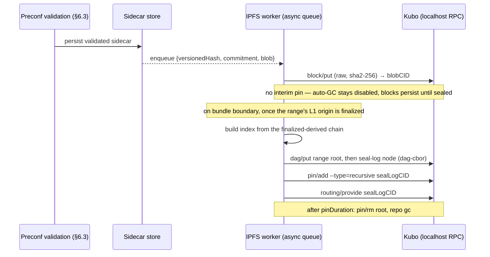

# L2-Native Ephemeral Blobs

This document specifies **ephemeral native blob support** for Taiko Alethia: accepting EIP-4844 type-3 (blob-carrying) transactions on the L2 itself, with blob bodies retained and served by Taiko's node network for a bounded window and **never posted to L1**.

- **Status**: Draft for review
- **Target**: the next hard fork after Unzen (placeholder `V7` throughout; fork gate `IsV7(timestamp)`)
- **Depends on**: Unzen (Cancun+Prague+Osaka EVM on L2, zk-gas metering), Shasta derivation
- **Related**: [#19832 — Explore L2 blob support](https://github.com/taikoxyz/taiko-mono/issues/19832), [Derivation.md](./Derivation.md), [zk_gas_spec.md](./zk_gas_spec.md)
- **Code references**: `file:line` citations refer to taiko-mono `8843a78` and the taiko-geth revision pinned by `packages/taiko-client/go.mod` (`v1.18.1-0.20260715122422-ca164c06e00c`); re-verify before implementation

The key words MUST, MUST NOT, SHOULD, and MAY are to be interpreted as described in RFC 2119.

---

## 1. Motivation

Ethereum's blob support decomposes into (a) a small EVM surface, (b) a mechanical fee market, and (c) a large availability apparatus that lives in the consensus layer. Unzen already shipped (a) on Taiko L2 — `BLOBHASH`, `BLOBBASEFEE`, and the KZG point-evaluation precompile are live, zk-gas-metered features, and L2 headers carry `blobGasUsed`/`excessBlobGas` (pinned to zero). Type-3 transactions are excluded at exactly one point: the block sealer skips them.

Enabling them natively gives Taiko:

- **Price-independent data availability**: a fee lane whose floor and ceiling Taiko controls, insulated from L1 blob-fee spikes.
- **Preconfirmation-speed availability**: blob data usable by consumers in ~2s, vs 12s L1 slots plus batch cadence.
- **A DA product for L3s and data-heavy applications** (rollups settling on Taiko, coprocessor inputs, orderbook/game state, preconfirmation metadata) inside Taiko's own trust envelope — today such users must pay L2 execution gas for calldata (which then also lands in Taiko's L1 blobs) or leave the trust zone for an external DA committee.
- **Completed equivalence**: post-Unzen, the blob transaction — introduced in Cancun, still current through Osaka — is the only piece of mainnet's transaction/EVM surface Taiko rejects. No production L2 accepts type-3 transactions (verified August 2026: OP Stack invalidates them by spec; Arbitrum, Linea, Scroll, zkSync Era, and Polygon zkEVM lack the type; the sole experiment is a QuarkChain/EthStorage beta testnet); Taiko would be the first.

### Non-goals

- **No L1-grade availability claim for blob bodies.** Bodies are guaranteed by Taiko's bonded operator set and retention policy (§7), not by Ethereum consensus. This is explicitly a different, documented guarantee tier.
- **No re-posting of bodies to L1** (the "design A" alternative, §14). Re-posted blobs cost L1 blob gas again and, at full rate, would consume a large share of total L1 blobspace.
- **No change to the rollup's security model.** State derivation from L1 remains complete and deterministic without any blob body (§2).

## 2. Core invariant

> **Execution state never depends on blob bodies — only on `blobVersionedHashes` carried inside transaction envelopes.**

This is EIP-4844's own design and it transfers verbatim to L2:

1. A type-3 transaction's canonical RLP encoding (the form that enters txlists and therefore L1 blobs via the proposal manifest) contains the versioned hashes but **no sidecar**. Today's manifest encoding of a type-3 transaction is already correct.
2. The state transition function reads only the hashes (`BLOBHASH`, intrinsic blob-gas accounting). Two nodes with the same txlist compute identical state whether or not either ever saw a blob body.
3. Therefore **L2 block derivation and proving MUST NOT depend on blob-body availability**. A lost body strands the application that paid for it; it cannot fork the chain, halt derivation, or make a proposal unprovable.

Consequence: unlike L1 — where `is_data_available()` gates block import in fork choice — availability on Taiko is enforced *before* inclusion (preconfirmation policy, §6) and *after* inclusion by operator obligation (§7), never by the derivation pipeline.

## 3. Constants

| Name | Value | Notes |
| --- | --- | --- |
| `BLOB_BYTES` | `131_072` | 4096 field elements × 32 bytes, unchanged from EIP-4844 |
| `GAS_PER_BLOB` | `131_072` | unchanged from EIP-4844 |
| `TARGET_BLOBS_PER_BLOCK` | `1` | launch value; sign-off in §13 phase 1, trade-offs in §15.2 |
| `MAX_BLOBS_PER_BLOCK` | `3` | launch value; tunable per fork |
| `MAX_BLOBS_PER_TX` | `2` | strictly below `MAX_BLOBS_PER_BLOCK` so a single transaction cannot monopolize a block's blob lane (mirrors L1, where the EIP-7594 per-tx cap of 6 sits below the post-BPO2 per-block max of 21) |
| `TARGET_BLOB_GAS_PER_BLOCK` | `131_072` | `TARGET_BLOBS_PER_BLOCK × GAS_PER_BLOB` |
| `MAX_BLOB_GAS_PER_BLOCK` | `393_216` | `MAX_BLOBS_PER_BLOCK × GAS_PER_BLOB` |
| `MIN_BLOB_BASE_FEE` | `1` wei | absolute floor |
| `BLOB_BASE_FEE_UPDATE_FRACTION` | `2_225_331` | ≈ +12.5% per full block at sustained max, mirroring L1's per-block max growth rate (§5) |
| `BLOB_BASE_COST` | `8_192` | EIP-7918-style reserve-floor coupling to the execution base fee (§5) |
| **`BLOB_RETENTION_SECONDS_MIN`** | **`6_291_456`** | **≈ 72.8 days = 4 × Ethereum's `MIN_EPOCHS_FOR_BLOB_SIDECARS_REQUESTS` (4096 epochs × 384 s). Design requirement: at least 4× L1's retention window.** |
| `BLOB_RETENTION_SECONDS_DEFAULT` | `7_776_000` | 90 days; default node configuration, MUST be ≥ `BLOB_RETENTION_SECONDS_MIN` for serving nodes |
| `MAX_BLOB_TXS_PER_ACCOUNT_POOL` | `16` | blobpool per-account cap (upstream geth default) |

Versioned-hash version byte remains `0x01` (`0x01 ‖ sha256(kzg_commitment)[1:]`); KZG parameters (BLS12-381, the EF ceremony trusted setup) are unchanged from L1. **Sidecars use the Osaka-era cell-proof format end-to-end** — `BlobSidecarVersion1` in geth's type nomenclature: `blob ‖ commitment ‖ 128 cell proofs`, ≈6 KiB of proofs per blob (<5% overhead). Engine *method* numbering differs from the type constants: `getBlobsV1` serves the older single-proof `BlobSidecarVersion0`, while `getBlobsV2`/`V3` serve `Version1`: it is the format the post-Fusaka blobpool stores, the only format `engine_getBlobsV2` serves (taiko-geth `eth/catalyst/api.go:746`, which also returns null if any requested hash is unavailable), and the wrapper current wallets/SDKs already produce for L1. Mandating the older single-proof wrapper would strand transactions at the §6 hand-off; using cell proofs from day one also makes the §7.3 sampling upgrade format-free.

## 4. Consensus rules (provable, fork-gated on `IsV7`)

### 4.1 Transaction validity

A type-3 transaction's structure and validity follow EIP-4844 (Osaka revision) verbatim; Taiko's §3 schedule caps apply on top as consensus limits. In a V7+ block:

1. `to != nil`; `len(blobVersionedHashes) ∈ [1, MAX_BLOBS_PER_TX]`; every hash has version byte `0x01`.
2. `maxFeePerBlobGas ≥ block.blobBaseFee`, and the sender's balance check covers `blobGasUsed × maxFeePerBlobGas` alongside execution gas; the amount actually debited is `blobGasUsed × blobBaseFee` (the prevailing §5 lane price), per EIP-4844.
3. Blob gas used by the block ≤ `MAX_BLOB_GAS_PER_BLOCK` (§3, Taiko-specific). At derivation, a type-3 transaction whose inclusion would exceed a §3 cap is skipped individually — the same deterministic per-transaction rule as any other validity failure — so an adversarial txlist can never yield an over-cap or unprovable block. Selection is greedy in txlist order: a type-3 transaction is included iff the running blob-gas total plus its own remains ≤ `MAX_BLOB_GAS_PER_BLOCK`, otherwise it is skipped and processing continues — the identical rule in sealer and prover, with over-cap txlists among the mandatory test vectors. Skip-based construction is not new consensus logic: unlike L1 gossip blocks, a based rollup's blocks are *derived* from adversarial L1-committed txlists, and every Taiko block is already sealed by exactly this filtering path (`sealBlockWith` skips invalid transactions individually; the prover replicates the same construction) — the blob-gas cap simply joins the existing per-transaction checks.
4. The **anchor transaction is never type-3** (unchanged anchor validation).
5. Type-3 transactions in blocks with `timestamp < V7_TIME` remain invalid (current behavior).

### 4.2 Header validity

For V7+ blocks, `blobGasUsed` and `excessBlobGas` MUST be computed per EIP-4844 with the §3 schedule:

```
header.blobGasUsed  = sum(len(tx.blobVersionedHashes) × GAS_PER_BLOB for tx in block)
header.excessBlobGas = calc_excess_blob_gas(parent, ...)   # EIP-4844 + §5 reserve floor
```

The driver's current "must be zero" assertions (`packages/taiko-client/driver/chain_syncer/event/blocks_inserter/common.go:400-407`) become "must match the computed values" at the fork gate. At the boundary, the first V7 block treats its pre-V7 parent as `excessBlobGas = blobGasUsed = 0` — exactly the values the driver has pinned since Unzen — so the lane starts at `MIN_BLOB_BASE_FEE`, mirroring how L1's lane started at Cancun activation. Note the deliberate activation behavior of §5's reserve floor: the floor prevents decay but never lifts the price directly, so from `excessBlobGas = 0` the lane opens at 1 wei and climbs toward the execution-linked floor only as usage accumulates excess. This is accepted (a near-zero launch price is desirable); no artificial excess initialization is performed. `parentBeaconBlockRoot` remains pinned to the zero hash (there is no beacon chain on L2); `requestsHash` remains the empty-requests hash.

### 4.3 Derivation rules

1. Block import and derivation from L1 MUST NOT require blob bodies (§2). There is **no availability precondition** anywhere in the derivation pipeline.
2. The manifest `SignedTransaction` schema ([Derivation.md](./Derivation.md)) is extended with the type-3 fields `maxFeePerBlobGas` and `blobVersionedHashes`. This extends Derivation.md's typed field table only — on the wire, manifests carry canonical RLP envelopes (no sidecar), which already encode these fields, so no encoding change occurs (§2). Txlist byte accounting (`maxBytesPerTxList`) is unchanged: bodies never count, so a blob transaction costs L1 DA only its ~small envelope.
3. **Type-3 transactions are not force-includable at launch.** A type-3 transaction inside a forced-inclusion source is skipped **individually** at derivation/sealing — like any other per-transaction validity failure — leaving the source's remaining transactions untouched. This is not a new semantic: today's sealer already drops prohibited or invalid transactions one at a time, never source-fatally, including type-3 specifically (`taiko-geth/miner/taiko_worker.go:277-281`), so V7 carries existing behavior forward, and the skip is part of the proven state transition — provers replay the same deterministic selection rule; source-level default-manifest replacement stays reserved for framing/decode failures (Derivation.md). The narrow blast radius matters: one prohibited transaction never censors an otherwise-valid forced source. Rationale for the restriction itself: forced inclusion exists for censorship resistance, which for blob bodies would require L1-posted data (design A); guaranteeing it is deferred (§15). It MUST be documented prominently to users: if all preconfers censor blob transactions, there is no forced path for them. Provenance is deterministic, not inferred: `DerivationSource.isForcedInclusion` is committed on-chain inside the proposal (`IInbox.sol:52-57`), each forced source derives its own block, and the skip rule is scoped exactly to blocks derived from sources with `isForcedInclusion = true` — the sealer and prover replay the same flag from the same committed data. Derivation.md MUST be updated at V7 to state this per-transaction rule explicitly.
4. Blocks derived without preconfirmation (L1-only sync) execute type-3 transactions normally using the envelope hashes; the local sidecar store records a gap for later backfill (§7.2). This includes adversarial proposals that bypassed preconf validation entirely: sidecar-less type-3 envelopes execute normally — availability suffers, derivation never does (abuse of this tolerance is analyzed in §12.5).

### 4.4 zk-gas

No new zk-gas dimension is required: bodies are never proven, `blobhash`/`blobbasefee` already carry Unzen multipliers (13/15), and the point-evaluation precompile is priced at 859 ([zk_gas_spec.md](./zk_gas_spec.md)). Type-3 envelope processing (hash-array handling, blob-gas accounting) is covered by standard per-transaction intrinsic zk-gas; the V7 zk-gas schedule revision MUST confirm parity against the reference REVM table for Osaka's blob-gas checks, and prover-parity vectors for the full type-3 STF (validity rules, blob-gas accounting, header fields) are a hard gate for the devnet phase (§13). The STF work is consensus-critical but upstream-inherited from revm/reth — "near-zero" refers to net-new circuit work, not to skipping verification.

## 5. Blob fee market

A second EIP-1559-style lane, exactly as on L1, with Taiko-chosen parameters:

```
blob_base_fee = fake_exponential(MIN_BLOB_BASE_FEE, excess_blob_gas, BLOB_BASE_FEE_UPDATE_FRACTION)
```

- `excess_blob_gas` accumulates `parent.excessBlobGas + parent.blobGasUsed − TARGET_BLOB_GAS_PER_BLOCK`, floored at 0.
- **Reserve floor — exactly EIP-7918's mechanism as deployed on L1 in Fusaka (mainnet, Dec 3 2025)**, enforced through the excess update, never as a `max()` clamp on the fee — an **anti-decay floor on the price path, not an instantaneous lower bound**: the current price can sit below it until usage accumulates excess (§4.2). `BLOB_BASE_COST = 8192` and the mechanism itself are the deployed L1 values; `BLOB_BASE_FEE_UPDATE_FRACTION = 2_225_331` is deliberately **Taiko-specific** — derived as `⌊(MAX − TARGET) × GAS_PER_BLOB / 0.1178⌋` with `ln(1.125) ≈ 0.117783` rounded to four decimals (L1's own fractions are likewise nearby integers rather than exact roundings), giving a realized max growth of ≈ ×1.12502 per full block; copying an L1 fraction (post-BPO2: `11_684_671`) here would be wrong, and vice versa. Normatively:

  ```python
  def calc_excess_blob_gas(parent):
      # reserve condition: blob base fee below the execution-linked floor (≈ baseFee/16)
      if BLOB_BASE_COST * parent.base_fee_per_gas > GAS_PER_BLOB * fake_exponential(MIN_BLOB_BASE_FEE, parent.excess_blob_gas, BLOB_BASE_FEE_UPDATE_FRACTION):
          # below the floor the excess never decays; it grows with usage, scaled by (MAX−TARGET)/MAX
          return parent.excess_blob_gas + parent.blob_gas_used * (MAX_BLOB_GAS_PER_BLOCK - TARGET_BLOB_GAS_PER_BLOCK) // MAX_BLOB_GAS_PER_BLOCK
      return max(0, parent.excess_blob_gas + parent.blob_gas_used - TARGET_BLOB_GAS_PER_BLOCK)
  ```

  The branch structure, the `(MAX − TARGET) // MAX` scaling, and `BLOB_BASE_COST = 2**13` were re-verified verbatim against the EIP's Specification section on 2026-08-13; the deployed EIP contains **no** `max()` clamp on the price function — the floor acts solely through this update rule. All arithmetic is unsigned integer; `//` is floor division. Below the floor the price never decays: it **holds** at exactly zero usage and rises gently with any nonzero usage (scaled by `(MAX − TARGET)/MAX`) — EIP-7918's intended behavior, not an omission; above the floor the standard update applies unchanged. With Taiko's small execution base fee this floor is intentionally low — the product is *cheap*; spam protection comes from the exponential lane and the per-block cap (§12.2), not the floor.
- `BLOB_BASE_FEE_UPDATE_FRACTION = 2_225_331` gives ≈ ×1.125 per fully-utilized block — the same per-block max growth as L1. Taiko blocks are ~6× more frequent than L1 slots, so in wall-clock the market reacts ~6× faster; this is deliberate (faster spam shutdown, §12.2).
- **Fee routing — launch with the L1 burn.** At V7, blob fees keep stock EIP-4844 semantics: debited in `buyGas`, credited to no one. This keeps the launch state-transition delta at exactly "standard Osaka blob rules", with no bespoke credit path to build in geth/reth or mirror in the prover — keeping §9's prover delta small. Routing a share of blob fees to serving operators (e.g. along `basefeeSharingPctg`, compensating the §7.1 obligation) is a real incentive question, but it is a self-contained follow-up fork (§15.5), not a launch requirement; nothing else in this design depends on it.

`BLOBBASEFEE` returns the real lane price from the fork onward (it currently returns 1 wei, `excessBlobGas = 0`). Reference test vectors for `calc_excess_blob_gas` — floor and non-floor branches at zero, target, and max usage, plus the fork-activation boundary (§4.2) and the sub-threshold edge where the execution base fee is below `GAS_PER_BLOB / BLOB_BASE_COST = 16 wei` — MUST accompany the implementation.

## 6. Data flow

```mermaid
sequenceDiagram
    participant U as User / L3 batcher
    participant EL as taiko-geth / taiko-reth (blobpool)
    participant P as Preconfer (driver + sealer)
    participant N as Taiko nodes (preconf P2P)
    participant S as Sidecar store (per node)
    participant L1 as L1 Shasta inbox

    U->>EL: eth_sendRawTransaction (EIP-4844 network wrapper: tx + blobs + commitments + cell proofs)
    EL->>EL: pool validation (hash↔commitment↔proof)
    P->>EL: txPoolContentWithMinTip
    P->>EL: engine_getBlobsV2(versionedHashes)
    EL-->>P: sidecars for included type-3 txs
    P->>N: preconf envelope = payload + blobSidecars[]
    N->>N: validate count/order + recompute hash per sidecar
    N->>S: persist sidecars (retention ≥ 72.8d)
    P->>L1: propose(manifest)  — envelopes only, hashes inside, no bodies
    Note over L1: L1 sees 32-byte hashes; bodies never leave the Taiko network
    U->>S: GET /blobs/{versionedHash} (any serving node, until pruned)
```

Steps in prose:

1. **Submission.** Users submit wrapped blob transactions to any Taiko RPC — the standard EIP-4844 network wrapper that `eth_sendRawTransaction` accepts on L1 mainnet today, in its post-Osaka cell-proof (V1) form (§3), so existing libraries need no changes beyond the RPC URL. The execution client's blobpool validates commitments/proofs against versioned hashes and holds the sidecars (upstream geth/reth machinery, already present).
2. **Selection.** The sealer includes type-3 envelopes like any transaction (removing the current skip at `taiko-geth/miner/taiko_worker.go:277-281`), subject to §4 limits. After building a payload, the driver pulls sidecars for the included hashes from the local pool via `engine_getBlobsV2` (already implemented upstream in taiko-geth). `getBlobsV2` is all-or-nothing — null if any requested hash is unavailable — so on a null response the builder MUST NOT publish the envelope: it identifies the gaps (via `engine_getBlobsV3` partial responses — present in the pinned taiko-geth, `eth/catalyst/api.go:721` — or per-hash pool queries), rebuilds the payload without the affected type-3 transactions, and retries (bounded, with backoff and metrics). A builder can never legitimately publish an envelope it cannot fully equip with sidecars (§6.3), and it MUST verify the one-validated-sidecar-per-hash-occurrence invariant itself before publishing — never relying on the engine API's all-or-nothing contract, which is an upstream implementation detail that may differ in taiko-reth or future forks. Sidecar retrieval MUST complete — and the sidecars MUST be persisted to the builder's own store — before the block is imported or announced; blobpool retention after import (eviction and limbo behavior) is client-specific and MUST NOT be relied upon.
3. **Preconf propagation.** The preconfirmation envelope gains a `blobSidecars` field. Receiving nodes MUST verify, for each type-3 transaction, that sidecars are present, ordered, that `versioned_hash(commitment) == tx.blobVersionedHashes[i]` — the exact check the driver already runs against L1 blob servers (`packages/taiko-client/pkg/rpc/blob_datasource.go:210-218`) — and that the blob **bytes** are bound to that commitment: either re-derive the commitment from the blob (the driver's existing path), or compute the 128 cells **from the received blob** and batch-verify the sidecar's proofs against the commitment at those cells' indices (the L1 pool-ingress check). Verifying supplied cells without recomputing them from the blob binds nothing and MUST NOT be accepted. A node that validated via commitment re-derivation alone has not checked the sidecar's 128 cell proofs: it MUST batch-verify them (or recompute them from the blob) before serving them, and the §7.2 API MUST NOT return unverified `proofs`. Duplicate versioned hashes — within one transaction or across a block's transactions — are legal under EIP-4844: the envelope carries one sidecar entry per hash occurrence, ordered by `(txIndex, blobIndex)` in the final payload (entries for duplicates are byte-identical), stores dedupe by hash, and `engine_getBlobsV2` returns the same sidecar at each requested position. An envelope failing this MUST NOT be propagated or imported as a preconfirmed block. This extends `ValidateExecutionPayload` (`packages/taiko-client/driver/preconf_blocks/server.go:923-962`) and the Rust ingress validation.
4. **Persistence & serving.** **Serving nodes** (§7.2 roles: preconfers MUST, RPC providers SHOULD) persist validated sidecars durably **before** importing the block they accompany — the receiver-side mirror of step 2's builder rule, so a crash can never yield a preconf-imported block whose bodies the custody set never retained — then serve them for at least the retention window and prune afterwards. Non-serving nodes MUST still validate sidecars to accept the envelope (§6.3) but MAY discard them immediately after import (`--taiko.blobs.serve=false`); they never expose the serving API and carry no storage obligation.
5. **L1 proposal.** Unchanged. The manifest carries canonical envelopes; **no inbox, wrapper, or forced-inclusion contract changes are required**.

Worst-case added preconf bandwidth: `MAX_BLOBS_PER_BLOCK × (BLOB_BYTES + 128×48 B proofs + 48 B commitment) ≈ 402 KiB` per ~2s block ≈ 1.65 Mbit/s — negligible for operator-grade preconfers.

## 7. Availability guarantee and retention

### 7.1 Guarantee tier at launch: bonded-operator custody

The availability guarantee is: **a preconfer MUST NOT include a type-3 transaction whose sidecars it does not possess, and MUST retain and serve every sidecar it includes for at least `BLOB_RETENTION_SECONDS_MIN`.** Because preconf P2P validation (§6.3) refuses envelopes without sidecars, every honest node that preconf-imported the block also holds the bodies — custody is the natural by-product of validation. At launch every non-forced transaction enters through this path; there is no sidecar-less user route (§12.5).

Today's preconfer set — Nethermind, Chainbound and Gattaca at the time of writing; the on-chain preconfirmation whitelist (`contracts/layer1/preconf/`) is the source of truth and MUST be re-checked at spec freeze — whitelisted and bonded, is the guarantee's anchor: withholding or refusal to serve within the window is attributable operator misbehavior, subject to the same governance/ejection/slashing framework as other preconfirmation faults — enforcement at launch is governance-grade (whitelist ejection, bond forfeiture where applicable), not an automatic on-chain rule. This is deliberately a **committee-grade DA guarantee** — the same trust class as Arbitrum AnyTrust, and stronger than several shipping alternatives (Base Appchains commit batch data to S3). It MUST be documented as such; it is not L1 consensus DA.

Data withholding is not generally attributable on-chain (a node claiming "I asked and got nothing" cannot prove the negative). Launch accepts governance-grade evidence (signed requests, monitoring probes by other operators); a protocol-native challenge is out of scope (§15).

### 7.2 Retention and serving

- **Requirement (this design's headline parameter): the network MUST retain and serve blob bodies for at least `BLOB_RETENTION_SECONDS_MIN = 6_291_456 s ≈ 72.8 days — 4× Ethereum's 18.2-day sidecar window.`** Taiko out-retains L1 by design; retention length is a product feature.
- Node roles:
  - **Serving nodes** (preconfers MUST; public RPC providers SHOULD): retain ≥ the minimum window (default config 90 days) and expose the serving API, and SHOULD export retention/serving metrics so §7.1 under-retention is externally observable — at minimum `taiko_blob_store_oldest_age_seconds` (retention horizon), `taiko_blob_store_backfill_gaps` (missing bodies inside the window), and `taiko_blob_served_total{endpoint}`.
  - **Other full nodes MAY prune at any time** — bodies are never needed for derivation (§2). Retention is a service role, not a validity requirement.
- **Serving API** (mirrors the interface the driver already consumes from L1 blob servers, so client code is reused):
  - `GET /blobs/{versionedHash}` → `{ versionedHash, commitment, data }` — byte-for-byte the schema the existing client parser accepts (`BlobServerResponse`, `packages/taiko-client/pkg/rpc/blob_datasource.go:41-44`), so today's fetch/backfill code works unchanged. Additive optional fields: `proofs` (the 128 cell proofs) and, under the IPFS profile, `blobCID` and `bundleRoots` — an array, since a versioned hash may occur in multiple ranges; servers MAY return any non-empty subset of containing range roots (§7.4) — any returned root suffices for retrieval, since every listed bundle contains the blob; range roots are the convergent identifiers, while the DHT-announced pin roots are seal-log nodes (§7.4.1). Consumers MUST ignore unknown fields. Exact types: `versionedHash` 0x-prefixed 32-byte hex; `commitment` 0x-prefixed 48-byte hex; `data` 0x-prefixed 131,072-byte hex; `proofs` exactly 128 0x-prefixed 48-byte hex strings; `blobCID` a CIDv1 string and `bundleRoots` an array of CIDv1 strings. A binary response (`Accept: application/octet-stream`, blob bytes only) SHOULD also be offered — 0x-hex JSON doubles bandwidth for bulk consumers. Error semantics: `404` for a hash never seen, `410 Gone` for a blob pruned after its retention window.
  - `GET /taiko/v1/blob_sidecars/{l2BlockNumber}` → `{ "data": [ <objects with the same schema as above> ] }`, mirroring the beacon `blob_sidecars` envelope shape (bulk sync/backfill)
- Serving endpoints SHOULD be rate-limited per client, and operators MAY require auth for the bulk endpoint: the §7.1 obligation is availability at reasonable public limits, not unmetered CDN bandwidth. Limits that in practice deny the data within the window count as withholding.
- **Backfill.** A node that imported blocks from L1 derivation without bodies (preconf outage, fresh sync inside the window) SHOULD backfill its store from serving peers via the bulk endpoint. Gaps beyond the window are expected and harmless.
- **Archival.** The existing blob-indexer service (built for Fusaka L1 cell-proof serving, #20446) is extended to archive L2 blobs beyond the window; third-party archival (Blobscan-style indexers, EthStorage) is complementary and permissionless — anyone can archive, since bodies are public and hash-committed. The **IPFS archival profile (§7.4)** standardizes this: deterministic content-addressed bundles that independent archivers converge on bit-for-bit.

### 7.3 Upgrade path: custody-and-sampling

When the operator set decentralizes and demand justifies it, the guarantee can graduate to PeerDAS-style sampling: erasure-extend blobs, distribute column sidecars with cell proofs across node custody groups, and replace full-download validation with sampling. The cell/column machinery is battle-tested upstream since Fusaka. This phase is out of scope for V7 — and because V7 already uses the cell-proof sidecar format (§3), no wire-format change is needed when it arrives.

### 7.4 IPFS archival profile (optional)

An opt-in node profile that replicates received blobs into IPFS. It is a **replication and archival layer, not part of the §7.1 guarantee**: the HTTP serving API (§7.2) remains the primary retrieval path, the bonded-operator obligation remains the availability anchor, and a node running this profile makes no additional protocol promises. What IPFS adds is permissionless, self-verifying, deduplicated distribution — an L3 can pin exactly its own history, community archivers can mirror the chain's blobs without permission, and post-window retrieval gains a second network.

#### 7.4.1 Content addressing and the index

- **One blob = one IPFS raw block.** `BLOB_BYTES = 131_072` is well within IPFS block-size limits (Bitswap's ~1 MiB ceiling; 256 KiB is only the default file-chunking target), so each blob is stored as a single `raw`-codec block with no chunking; its CID is `CIDv1(raw, sha2-256(blob))`. Content addressing is deterministic: every node storing the same blob produces the same CID.
- **Bodies and commitments only — cell proofs are deliberately not archived.** Proofs are derivable from the blob (`compute_cells_and_kzg_proofs`), so archiving them would be redundant data. Archived blobs are verified by commitment re-derivation (cheap). Reconstructing a full `BlobSidecarVersion1` from archive — needed only to re-inject into pool/preconf pipelines, which never consume from IPFS — costs one cell-proof computation per blob: bounded, off the serving path, and acceptable for the archival tier this profile is.
- **The versioned hash cannot be a CID.** `versionedHash = 0x01 ‖ sha256(kzg_commitment)[1:]` commits to the KZG commitment, not to `sha256(blob)`, so a `versionedHash → CID` index is unavoidable. The index is an **untrusted hint**: retrieval is doubly self-verifying — IPFS checks the bytes against the CID, and the consumer re-derives the KZG commitment and checks it against the versioned hash (the same code path used against untrusted L1 blob servers, `packages/taiko-client/pkg/rpc/blob_datasource.go:210-218`). Any gateway, any pinner, zero added trust.
- **Bundles, not per-blob pins.** At target throughput (~43k blobs/day) per-blob pinning would announce ~43k new CIDs/day to the DHT — Kubo's known reprovide scaling cliff. Blobs are therefore grouped into deterministic **bundles**:

| Parameter | Default | Notes |
| --- | --- | --- |
| `IPFS_BUNDLE_BLOCKS` | `1000` L2 blocks | ≈ 33 min at 2s cadence; ≤ `3000` blobs ≈ ≤ 375 MiB (≈ 393 MB) per bundle |
| Bundle boundary | `blockNumber / IPFS_BUNDLE_BLOCKS` | fixed ranges, so independent archivers produce **identical range roots** |
| Sealing rule | range fully derived from a **finalized** L1 origin | deterministic and reorg-proof — the precondition for root-CID convergence |
| Range root (contents node) | dag-cbor node | `{version, chainId, blockRange:[start,end], index:[{versionedHash, commitment, blobCID(link)}...]}` — a pure function of the finalized chain, so its CID is **unconditionally convergent** across archivers |
| Seal-log node (the pinned/announced root) | dag-cbor node | `{contents: link(range root), prev: bytes, skippedRanges: [[start,end]...]}` (`skippedRanges` normally empty) — carries the archiver's sealing lineage |
| Index ordering | one entry per `(blockNumber, txIndex, blobIndex)` **occurrence**, ascending by that key — duplicate versioned hashes appear once per occurrence with identical `versionedHash`/`commitment`/`blobCID`, never deduplicated in the index (the raw blob block is stored once regardless, by content addressing) | canonical dag-cbor encoding ⇒ deterministic root CID |
| `prev` field | the most recent **seal-log** root's CID as its **raw binary CIDv1 bytes** in a definite-length CBOR byte string (no multibase string, deliberately not tag 42); the **empty byte string** for the first bundle | forms an authenticated log of bundles without recursive pins traversing all history; intentionally non-standard as a link — IPLD tooling will not auto-traverse `prev`, and consumers reconstruct the CID from the bytes |
| Encoding | IPLD **DAG-CBOR** | the codec spec already mandates deterministic encoding (definite lengths, minimal integer widths, sorted map keys — length-first then bytewise, per RFC 8949 deterministic encoding as adopted by DAG-CBOR — no floats, links as CBOR tag 42). Additionally normative here: each node is a map with exactly the keys listed above; `index` is an array (not a map) in the stated sort order; `versionedHash`/`commitment` are fixed-length byte strings (32/48); `blobCID` entries are tag-42 links; `prev` is a plain byte string (raw CIDv1 bytes; empty for the first bundle). Reference test vectors MUST ship with the implementation, including a multi-bundle chain exercising `prev` — convergence is only as strong as this row |
| Export format | CAR v1 | one CAR per bundle; also the native input format for Filecoin deals and cold storage |

- Bundles are sealed only when their entire block range derives from a **finalized L1 origin** (beacon-chain finality — a signal the derivation pipeline already tracks), never from preconf-only or merely-proposed state. Finality is what upgrades "same inputs" into a deterministic, reorg-proof cut, so independent archivers sealing at different times still produce bit-identical bundles; blobs that were preconfirmed but never make the finalized-derived chain are simply never sealed. An archiver MUST NOT seal or announce a bundle whose blob set is incomplete: the complete set for a range is determined by the type-3 envelopes in its finalized-derived blocks, and missing bodies MUST first be backfilled (§7.2). If backfill fails, the archiver MUST next attempt to **adopt** the range contents (range root + blobs) from peers or indexers — range contents are self-verifying against the finalized chain's envelope hashes, so adoption requires no trust. Only a range no one anywhere can complete is skipped: it is recorded in the next seal-log node's `skippedRanges`, with `prev` pointing to the most recent seal-log root, so one lost range can never stall the log. Range-root verification never depends on the `prev` chain — `prev`/`skippedRanges` are provenance, so even a catastrophic gap forks only the log's lineage, never any range root's validity. Unsealed-pending ranges are surfaced by the seal-lag metric rather than published divergent.
- Convergence is a feature with a precise scope: **range roots** are pure functions of the finalized chain, so anyone can cross-check an archiver by comparing a single range-root CID — a mismatch there identifies a faulty or dishonest archive. Seal-log CIDs additionally encode lineage (`prev`, `skippedRanges`) and may legitimately differ between honest archivers after a catastrophic gap; only range roots carry the unconditional convergence guarantee.
- **Announcement.** Only seal-log roots receive DHT/IPNI provider records (Kubo `Reprovider.Strategy = "roots"`); range roots are reachable through them, and individual blob CIDs are never announced. Fetching one blob over IPFS means: obtain the bundle root (from a serving node's `GET /taiko/v1/blob_bundles?range=…`, an indexer, or the DHT) → read the index → Bitswap the single raw leaf from a peer holding the bundle. Latency is accordingly worse than the HTTP API — acceptable for archival, wrong for the hot path.

#### 7.4.2 Kubo sidecar with pin-on-receipt

Reference deployment: a Kubo daemon co-located with the Taiko node (same pod / compose service), reached over its local RPC API. The driver's sidecar store gains an asynchronous IPFS worker; **no IPFS operation ever sits on the block-import, preconf-validation, or serving path.**



Node configuration (all under an off-by-default flag group):

| Flag | Default | Purpose |
| --- | --- | --- |
| `--taiko.blobs.ipfs.enabled` | `false` | master switch |
| `--taiko.blobs.ipfs.api` | `http://127.0.0.1:5001` | Kubo RPC endpoint (MUST NOT be publicly exposed; localhost or unix socket only) |
| `--taiko.blobs.ipfs.pinDuration` | `7_776_000 s` (90 d, = `BLOB_RETENTION_SECONDS_DEFAULT`) | `0` = pin permanently (archival nodes) |
| `--taiko.blobs.ipfs.bundleBlocks` | `1000` | bundle boundary; changing it forfeits convergence with default-config archivers |
| `--taiko.blobs.ipfs.fetch` | `false` | adds IPFS (bundle root → leaf) as a last-resort source in the §7.2 backfill chain, after HTTP serving peers |

Operational rules:

1. **Never block, never lose silently.** The worker is a bounded queue with retry; if Kubo is down the queue drains on recovery, and overflow drops oldest entries with a warning metric (`taiko_ipfs_queue_dropped_total`). A periodic reconciliation pass compares the Kubo store against the canonical sidecar store and re-puts anything missed, so drops self-heal for as long as the canonical store retains the blob. The canonical sidecar store is unaffected either way.
2. **Idempotent by construction.** `block/put` of identical bytes yields the same CID; a crash anywhere between put and seal is repaired by re-putting from the canonical sidecar store.
3. **Kubo profile.** Recommended config: `Reprovider.Strategy="roots"` (a standard Kubo strategy from its `all | pinned | roots | mfs | pinned+mfs | flat` set; the reference deployment MUST pin a Kubo version and CI-check this config against it) with automatic GC left off — run the daemon **without** `--enable-gc`; Kubo runs GC only when that flag is set or on a manual `ipfs repo gc`, so unpinned blob blocks survive until sealing and GC happens only as rule 4's explicit sweep (CI-check this against the pinned Kubo version), accelerated DHT client, connection-manager limits sized for a server, `Datastore.StorageMax` ≥ pinned-window volume (≈510 GB at full target — bodies only; the Kubo blockstore holds raw blobs, not proofs, §12.2 math) — expect ~2× disk versus the sidecar store alone, since the Kubo blockstore duplicates the bytes (see §15.7 for the filestore-dedup question). Because individual blobs are never pin roots, nothing per-blob is ever announced — only sealed bundle roots.
4. **Unpinning.** Roots older than `pinDuration` are unpinned, then an explicit `repo gc` sweep reclaims space; the sidecar store's own §7.2 retention is independent.
5. **Metrics.** Queue depth, put/pin failure counters, bundle seal lag (blocks behind canonical head), Kubo repo size.

Interfaces touched: the profile is entirely additive to §9's sidecar store (one new worker + two HTTP endpoints: `GET /taiko/v1/blob_bundles?range=…` returning `{ "data": [ { "blockRange": [start, end], "rangeRoot": CIDv1, "sealLogRoot": CIDv1 } ] }` (block ranges inclusive on both ends) for sealed bundles intersecting the queried range, and inclusion of `blobCID`/`bundleRoots` in the existing `GET /blobs/{versionedHash}` response metadata). No consensus rule, no manifest field, and no contract references IPFS in any way.

## 8. Execution-client changes

| Area | Change | Where |
| --- | --- | --- |
| Sealer | Remove the type-3 skip, gated on `IsV7`; enforce §4 caps during selection. A type-3 tx's canonical envelope counts toward `maxBytesPerTxList` exactly like any other tx — only sidecar bodies are excluded (§4.3.2) — and it additionally charges blob gas | `taiko-geth/miner/taiko_worker.go:277-281`, `commitL2Transactions` |
| Pool (pre-V7 hygiene) | **Immediately** (independent of this design): reject type-3 at the pool while `!IsV7`, with a distinct JSON-RPC error (e.g. `blob transactions are not yet supported on this network`) rather than a generic invalid-tx message. Post-Unzen the blobpool is Cancun-active and `Pending()` is called without `OnlyPlainTxs` (`taiko_worker.go:74-79, 377`), so a blob tx can today enter a proposed txlist only to be dropped by every sealer — the proposer pays L1 DA for dead bytes | `taiko-geth/core/txpool/validation.go` (taiko gate) |
| Pool (V7) | Enable blobpool acceptance; per-account cap `MAX_BLOB_TXS_PER_ACCOUNT_POOL`; accept the cell-proof (`BlobSidecarVersion1`) wrapper per §3 | upstream blobpool, config |
| Fee market | Activate the §3/§5 schedule via `TaikoChainConfig.BlobScheduleConfig` (the field already exists, currently carrying inert L1 defaults — replace with Taiko entries keyed to V7). Blob fees burn at launch per §5, so the launch STF carries no bespoke credit path | `taiko-geth/params/taiko_config.go:81-87` |
| Headers | Real `blobGasUsed`/`excessBlobGas` computation post-fork | upstream + fork gate |
| APIs | `txPoolContentWithMinTip` unchanged (envelopes only); `engine_getBlobsV2` already present and becomes the sidecar hand-off to the driver | `taiko-geth/eth/catalyst` |
| Nethermind (devnet) | Flip `"BlobsSupport": "Disabled"` → enabled at V7; add Taiko blob schedule to chainspec | `packages/taiko-client/internal/docker/nodes/nmc/taiko-devnet.cfg:9-11`, chainspec template |

The taiko-reth migration (in progress) inherits all of the above from upstream reth's complete 4844 implementation; reth is the natural vehicle for this fork.

## 9. Client (driver / proposer / preconf) changes

| Area | Change | Where |
| --- | --- | --- |
| Preconf envelope | Add `blobSidecars` behind a bumped envelope/codec version (Go + Rust): V7-aware nodes accept both forms until the fork timestamp, after which sidecar-less envelopes containing type-3 txs are invalid; clients upgrade ahead of the fork via the normal preconf rollout path; validation per §6.3 | `packages/taiko-client/driver/preconf_blocks/server.go:923-962`; `packages/taiko-client-rs/crates/whitelist-preconfirmation-driver/src/importer/{ingress,validation}.rs`, `codec.rs` |
| Import | Relax the `== 0` pins on blob header fields at the fork gate; verify against computed values | `packages/taiko-client/driver/chain_syncer/event/blocks_inserter/common.go:378-407` |
| Sidecar store | New component: persist / prune / serve / backfill per §7.2, gated by `--taiko.blobs.serve` and `--taiko.blobs.retention` (serve defaults on only where §7.2 obliges it); reuses the KZG re-derivation code | new; validation code from `packages/taiko-client/pkg/rpc/blob_datasource.go:173-218` |
| Proposer | No structural change (canonical RLP already excludes sidecars). Manifest schema/docs gain the two type-3 fields (§4.3.2) | `packages/taiko-client/bindings/manifest/manifest.go`; Derivation.md |
| Prover (raiko) | No body proving. STF gains Osaka blob-gas validity rules — inherited from revm/reth. zk-gas already priced (§4.4) | raiko STF config |
| L1 contracts | **None required.** Optional later: availability-attestation/bond registry (§15) | — |

## 10. Wallets, tooling, RPC

- viem/ethers/alloy already construct and send type-3 transactions; pointing them at a Taiko RPC works once the pool accepts them. Docs + examples needed (blob fee estimation via `eth_blobBaseFee`, which activates with the lane).
- Explorer support: a Blobscan-style view over the sidecar stores (the blob-indexer already speaks the format).
- **Compatibility note (MUST document):** `BLOBBASEFEE` has returned a constant 1 wei since Unzen; from V7 it returns a live lane price that can rise. Any contract deployed in the interim that assumes the constant must be flagged in upgrade communications.
- `eth_getBlockByNumber` etc. expose `blobGasUsed`/`excessBlobGas` per upstream behavior; receipts expose `blobGasPrice`/`blobGasUsed` for type-3 txs.

## 11. Semantics vs L1 (documentation requirement)

This table MUST appear in user-facing docs:

| Property | Ethereum L1 | Taiko L2 (this design) |
| --- | --- | --- |
| Tx type, hashes, opcodes, precompile | EIP-4844 / Osaka | identical |
| Fee lane | excess-blob-gas market, 7918 floor | identical mechanism, Taiko schedule (§3) |
| Who guarantees bodies | consensus: block import gated on availability (PeerDAS sampling) | bonded preconfer set + serving policy; import never gated |
| Retention | 4096 epochs ≈ 18.2 days | **≥ 72.8 days (4×), default 90 days** |
| Forced inclusion of blob txs | n/a (L1 is the base layer) | **not supported at launch** (§4.3.3); the §15.3 envelope-only variant, if ever adopted, is a distinct lower availability tier |
| Body loss consequence | impossible for canonical blocks | possible if all obligated operators fail; chain unaffected, buyer refunded nothing |

## 12. Security considerations

### 12.1 Withholding grief

A malicious preconfer could include a type-3 tx and withhold the body. Bounded impact: the chain is unaffected (§2); the buyer paid blob fees for nothing. Mitigations: preconf P2P refuses sidecar-less envelopes (so withholding requires the preconfer to also fork its preconf announcements — detectable by other operators); monitoring probes against the serving API; governance ejection/slashing. Residual risk equals the committee honesty assumption and is documented (§11).

### 12.2 Storage/bandwidth DoS

- All figures below use the full stored sidecar record — blob + 128 cell proofs + commitment = `137_264 B ≈ 134 KiB` — not bare `BLOB_BYTES`.
- Hard ingest ceiling: `3 × 137_264 B / 2 s ≈ 201 KiB/s ≈ 17.8 GB/day`, i.e. ≤ ≈1.30 TB over the minimum window (≈1.60 TB at the 90-day default) — the mathematical bound, not the expected state.
- Sustained-max is self-extinguishing: each fully-utilized block adds `(MAX−TARGET) × GAS_PER_BLOB = 262_144` to `excess_blob_gas`, multiplying the price by ≈ 1.125; ~195 consecutive full blocks (≈ 6.5 minutes) multiply it by 10¹⁰. The exponential lane, not the floor, is the anti-spam mechanism — same as L1, reacting ~6× faster in wall-clock.
- Steady state at 100% of target: `1 × 137_264 B / 2 s ≈ 67 KiB/s ≈ 5.9 GB/day` → ≈ 432 GB per 72.8-day window (≈ 534 GB at the 90-day default). Provisioning guidance: size for target-rate steady state with margin — ≥ 1 TB covers the 90-day default at full target ≈1.9× over; the adversarial ceilings above are self-extinguishing economic impossibilities to *monitor* against (disk-pressure rule below), not to pre-provision. Non-serving nodes carry nothing. All storage figures are decimal (GB/TB).
- Local storage pressure MUST degrade only the blob store (shed data beyond the window oldest-first, alert via metrics); it MUST NOT cause a node to reject, delay, or fail import of otherwise-valid blocks or preconf envelopes. If pressure occurs while all retained data is still inside the window, import still never blocks: a serving node MAY evict oldest-within-window as a last resort, which is a §7.1 serving-obligation breach surfaced by `taiko_blob_store_backfill_gaps` and a critical alert — for obligated preconfers, full-window capacity is therefore a de facto hard hardware requirement.
- Per-account pool caps and the standard blobpool eviction rules bound mempool exposure.

### 12.3 Interaction with zk-gas block truncation

Unzen's zk-gas meter can truncate a block mid-list. Truncation semantics for type-3 txs are identical to any tx: an excluded tx contributes no blob gas and its sidecars are not gossiped for that block. `excessBlobGas` accounting uses post-truncation `blobGasUsed` only, and the preconf envelope's sidecars are assembled from the post-truncation payload exclusively, in final transaction order.

### 12.4 Censorship

With no forced-inclusion path for type-3 (§4.3.3), a censoring preconfer set can exclude blob txs entirely. Users retain the trivial fallback that exists today: posting data as calldata (censorship-resistant via forced inclusion, at calldata prices). Accepting this asymmetry at launch is a documented trade-off; §15 sketches the design-A hybrid that would close it.

### 12.5 Fake-hash (sidecar-less) inclusion

A type-3 envelope is consensus-valid with *any* 32-byte hashes carrying the `0x01` version byte — nothing in the STF requires a body to exist (§2, deliberately). A proposer could therefore include envelopes whose hashes correspond to no blob anywhere: blob gas is consumed, `excessBlobGas` rises, and no body is ever held — spam without the bandwidth/storage cost §12.2 assumes, and a buyer of such a transaction receives no availability.

Launch containment: block production is not permissionless. Every non-forced transaction enters through the bonded preconfer whitelist — the on-chain preconf whitelist is also the inbox's proposer checker, so proposing and preconfirming are the same bonded, permissioned role at launch; a direct-to-L1 proposal that bypasses preconf gossip remains possible for that role, but never anonymous — whose §6.3 validation refuses sidecar-less type-3 envelopes; forced inclusion excludes type-3 entirely (§4.3.3). A sidecar-less type-3 transaction in a canonical block therefore implies a misbehaving bonded operator — the same attributable, slashable fault class as §12.1 withholding — and the attacker pays the very lane price they are pumping, which §5's exponential market makes increasingly expensive to sustain. §4.3.4's tolerance of sidecar-less envelopes is defense-in-depth for derivation, not a user-reachable path.

Before proposing becomes permissionless, this vector MUST be re-closed — e.g. by making type-3 validity conditional on preconf-path provenance, or by requiring availability attestations at inclusion time (§15.4). Treat that as a hard precondition for removing the proposer whitelist.

### 12.6 Equivalence drift

This design intentionally makes Taiko a superset of Osaka behavior gated on a Taiko fork, with one semantic difference (availability tier) that cannot be observed by the EVM. Contracts written against L1 blob semantics (e.g. proof-of-equivalence verifiers using `0x0A`) behave identically.

## 13. Rollout

| Phase | Content | Gate |
| --- | --- | --- |
| 0 (now) | Hygiene: pool-reject type-3 pre-V7 (§8 row 2, tracked in [#22015](https://github.com/taikoxyz/taiko-mono/issues/22015)); update stale docs (docs.taiko.xyz FAQ still describes a Shanghai EVM); reopen #19832 referencing this spec | hard prerequisite for phases 2+ |
| 1 | Spec review (this document), parameter sign-off (`TARGET/MAX`, retention default, update fraction) | protocol + client teams |
| 2 | Devnet: taiko-reth + Rust driver implementation; `--taiko.devnet-v7-time 0`; Nethermind chainspec flip; bandwidth/storage soak at max utilization | internal devnet |
| 3 | Hoodi testnet fork; explorer + blob-indexer integration; IPFS archival profile pilot (§7.4); L3 pilot (an OP-stack or Taiko-stack L3 posting via L2 blobs) | Hoodi |
| 4 | Mainnet V7 activation; preconfer serving obligations added to operator agreements | governance |
| 5+ | Sampling upgrade (§7.3); forced-inclusion hybrid (§15); RIP submission for cross-rollup standardization of L2 blob semantics | later forks |

## 14. Alternatives considered

- **A — re-posted blobs (L1-inherited availability).** Bodies appended to the proposal's L1 blobs; prover adds a KZG proof-of-equivalence per blob linking the re-posted body to the L2 versioned hash. Full L1 security, but users pay L1 blob gas again (never cheaper than using L1 directly), and at scale it consumes L1 blobspace — the objection that helped close the one prior attempt at L2 blob support (op-specs PR #383). Kept as a possible paid add-on for L3s that require L1-grade DA; composable with this design per-transaction later.
- **C — external DA (Celestia/EigenDA/EthStorage pointer).** Imports a third-party trust zone and token; not "native". EthStorage remains interesting as post-window archival (§7.2).
- **Do nothing.** L3s and data-heavy apps on Taiko keep paying L2 execution gas for calldata that also lands in L1 blobs, or leave the trust envelope; Taiko's Osaka equivalence stays incomplete at exactly one transaction type.

## 15. Open questions

1. Fork name and timestamp for `V7`; whether Nethermind ships it simultaneously (devnet chainspec suggests yes).
2. Launch parameters: is `TARGET 1 / MAX 3` right? A single L3 posting one blob per ~2 blocks consumes half the target; raising to 2/4 doubles the steady-state (target-rate) storage bound and raises the adversarial ceiling by one third (§12.2). Likewise `MAX_BLOBS_PER_TX = 2` vs `3`.
3. Forced-inclusion hybrid: per-transaction design-A (body carried in the forced-inclusion L1 blob + equivalence proof) to close §12.4 — worth the prover complexity? A cheaper middle path to evaluate: force-include only the type-3 **envelope** (state needs only hashes, so it executes normally) while documenting that forced-path bodies carry no custody guarantee — this restores censorship resistance for the transaction's execution effects, at the cost of an exception to the "every included blob was preconf-validated and held" invariant; if pursued, it is a distinct availability tier requiring its own threat model.
4. Protocol-native availability attestations/bonds (k-of-n signed custody receipts recorded cheaply on L1) vs. governance-grade enforcement — needed before permissionless preconfers.
5. Post-launch blob-fee routing (§5 launches with the L1 burn): should a future fork credit the including preconfer, split across all serving nodes (serving is network-wide, inclusion is individual), or keep the burn? Any credit is a state-transition + prover-parity change and warrants its own fork; this SHOULD be resolved before mainnet activation (phase 4), since with the launch burn the serving obligation is compensated only implicitly.
6. RIP submission timing: standardize before or after mainnet ship.
7. IPFS profile (§7.4): accept ~2× disk from a duplicated Kubo blockstore (simple, robust) or pursue filestore/`--nocopy` dedup against the sidecar store (fragile historically)? And should sealed bundle CARs feed an incentivized persistence tier (Filecoin deals consume CARs natively; EthStorage as an alternative)?

## Appendix A — retention arithmetic

```
Ethereum window   = MIN_EPOCHS_FOR_BLOB_SIDECARS_REQUESTS × SECONDS_PER_EPOCH
                  = 4096 × 384 s = 1_572_864 s ≈ 18.2 days
Taiko minimum     = 4 × 1_572_864 s = 6_291_456 s ≈ 72.8 days   (BLOB_RETENTION_SECONDS_MIN)
Taiko default     = 7_776_000 s = 90 days                        (BLOB_RETENTION_SECONDS_DEFAULT)
```

## Appendix B — manifest `SignedTransaction` delta

Two fields join the documented schema (encoding is the canonical Osaka envelope; no wrapper, no sidecar):

| Field | Type | Present when |
| --- | --- | --- |
| `maxFeePerBlobGas` | `uint256` | `txType == 0x03` |
| `blobVersionedHashes` | `bytes32[]` | `txType == 0x03` |
