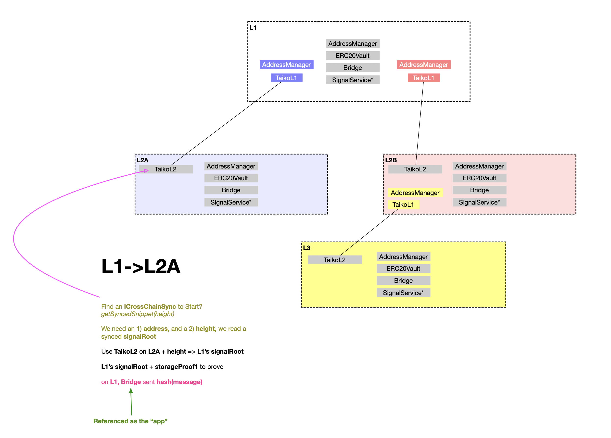
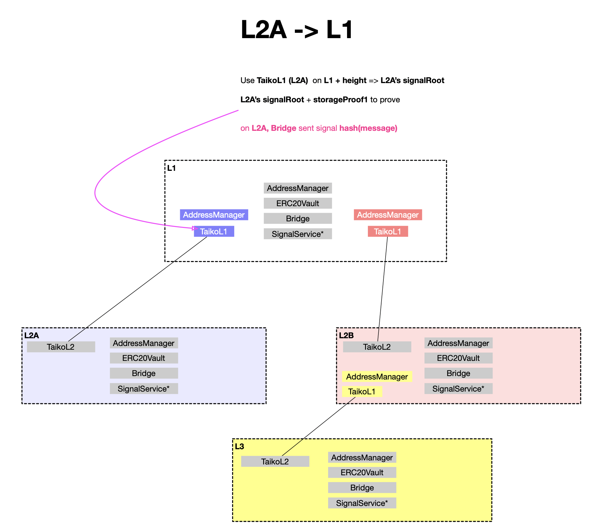
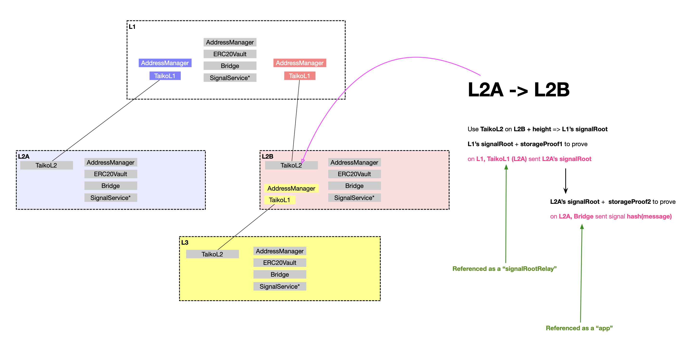
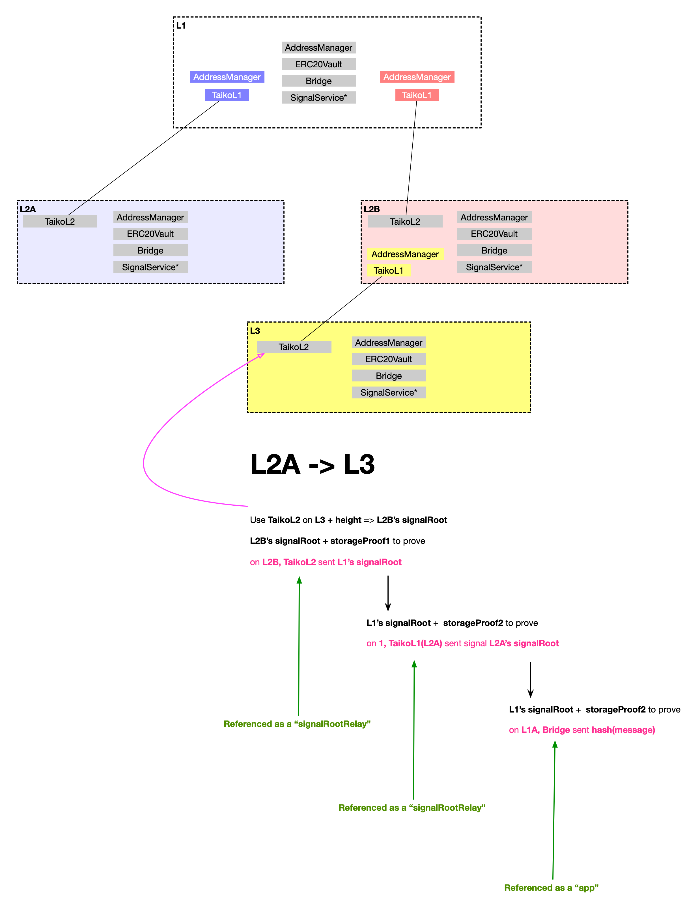

# Deployment for Multi-Hop Briding

We expect that bridging acorss multiple layers are supported natively by Taiko. I'd like to explain how this is done.

First of all, we need to ensures some contracts are shared by multiple Taiko deployments. For example, if we deploy two layer 2s, L2A and L2B, if we would like users to deposit Ether to L2A, then bridge Ether from L2A directly to L2B, then withdraw the Ether on L1, then the contract that holds Ether must be shared by L2A and L2B.

## Shared contracts

On L2 or any laer, then following contracts shall be deployed as sigletonsshared by multiple TaikoL1 deployments.

- SignalService
- Bridge
- and all token vaults e.g., ERC20Vault
- An AddressManager used by the above contracts.

There are some inter-dependency among these shared contracts. Specificly

- Bridge.sol depends on SignalService;
- Token vaults depend on Bridge.sol;

These 1-to-1 dependency relations are acheived by AddressResolver with a name-based address resolution (lookup).

### SignalService

SignalService also uses AuthorizableContract to authorize multiple TaikoL1 and TaikoL2 contracts deployed **on each chain** that is part of the path of multi-hop bridging.

For each TaikoL1/TaikoL2 contractswe need to perform:

```solidity
// 1 is Ethereum's chainID
SignalService(ss).authorize(address(TaikoL1A), 1);
SignalService(ss).authorize(address(TaikoL1B), 1);

// 10001 is the L2A's chainId
SignalService(ss).authorize(address(TaikoL2A, 10001);

// 10002 is the L2B's chainId
SignalService(ss).authorize(address(TaikoL2B, 10002);
...
```

The label **must be** the id of the chain where the smart contract has been deployed to.

To guarantee this design works, each pre-deployed contract must have a unique address on L2 and L3 chains, incorporating the chain ID into the address (as a prefix).

### Bridge

Bridge depends on a local SignalService .Therefore, we need to registered the service as:

```solidity
addManager.setAddress(block.chainId, "signal_service", localSignalService);
```

Bridge also need to know each and every conterparty bridge deployed **on each chain** that is part of the path of multi-hop bridging.

```solidity
addManager.setAddress(remoteChainId1, "bridge", remoteBridge1);
addManager.setAddress(remoteChainId2, "bridge", remoteBridge2);
...
```

### ERC20Vault

ERC20Vault (and other token vaults) depends on a local Bridge, you must have:

```solidity
addressManager.setAddress(block.chainId, "bridge", localBridge)
```

Similiar with Bridge, ERC20Vault also needs to know their conterpart vaults **on each chain** that is part of the path of multi-hop bridging. Therefore, we must perform:

```solidity
addressManager.setAddress(remoteChainId1, "erc20_vault", remoteERC20Vault1);
addressManager.setAddress(remoteChainId2, "erc20_vault", remoteERC20Vault2);
...

```

### Dedicated AddressManager

A dedicated AddressManager should be deployed on each chain to support only these shared contracts. This AddressManager shall not be used by the TaikoL1 deployments.

## Bridging

### L1 to L2



### L2 to L1



### L2 to L2



### L2 to L3 on another L2


