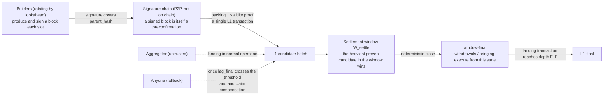
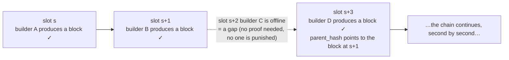
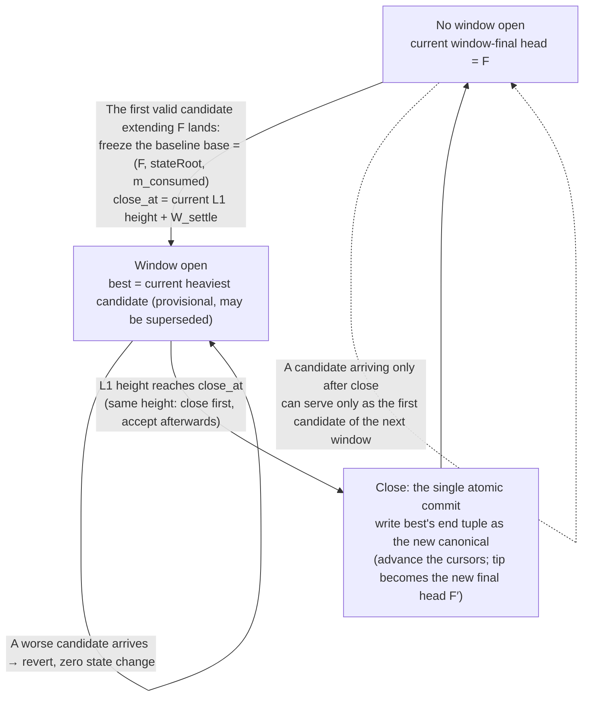

<!-- generated-from: slot-chain-spec.md  sha256:91d20d5cb5d3bb9e -->
<!-- English edition, translated from the Chinese source. The Chinese edition is
     normative: where the two disagree, the Chinese text governs. After editing the
     Chinese source, re-translate this file and update the sha256 above; the drift
     check in build-pdf.py compares them. -->

# Slot-Chain: A Preconfirmation Protocol Built on Slot Signature Chains (v2 Design Specification, Draft v1.51)

> **Status of this document.** This is the successor design to the Taiko preconfirmation
> protocol, superseding the earlier v15 design line (perpetual auction plus epoch-level
> determination; its full text and review record are preserved in the git history, and the
> conclusions worth retaining are given in [`legacy-summary.md`](legacy-summary.md)). The design
> originates in the owner's instruction of 2026-08-25: adopt a sub-epoch failover granularity in
> which rotating builders produce and sign one block per slot, the signatures are strung into a
> chain, and the result is verified by the proof system. This document is the English edition; the Chinese edition is the normative source (see the note at the head of this file).

> **How to read this document.** The main text (§0–§11 together with Appendices A–C) is the
> specification proper and can simply be read in order; a reader in a hurry to grasp the trunk can
> build a full picture from the §0 one-page summary and the §8 liveness accounting table. The many
> parenthetical notes in the main text of the form "（review r39）" or "（independent review round 4,
> finding 2）" are audit traces of the design process — they record which round of adversarial
> review prompted a given rule — and a first reading may skip them outright without any loss of
> understanding; return to them when the provenance of a particular rule needs to be traced. The
> complete per-version change history (from v1.31 onward, including the findings and fixes of every
> review round) is collected in Appendix D and is no longer placed ahead of the main text.

**Contents**: §0 One-page summary · §1 Design goals and non-goals · §2 Roles · §3 Time and
scheduling · §4 Builders (registration / block signing / equivocation slashing) · §5 The signature
chain (legality / canonicality / gaps / deletion residue / body withholding / settlement-window
finality) · §6 Landing (batches / cadence / fallback / recovery / seat economics) · §7 Anchoring and the bridge · §8 Liveness accounting table · §9 Master slashing table ·
§10 Comparison with v15 · §11 Open items and master parameter table · Appendix A Points of
divergence · Appendix B Glossary · Appendix C Executable reference model · Appendix D Change history

---

## 0. One-page summary

**In one sentence:** L2 has one slot per second, and the lookahead — which states "who holds the
right to produce a block in this second" — is published two epochs in advance. The builder whose
turn it is produces a block and signs it, and the signature covers the parent block hash; the
blocks, which are not yet on chain, are thereby strung into a signature chain. The act of packing
this chain onto L1 together with a validity proof is called landing: in normal operation the
aggregator produced by the auction is responsible for it, but when the aggregator goes offline
anyone may do it — because a block's authority comes from the builder's signature, not from the
lander.

The complete path from block production to finality:



**This structure solves three things at once:**

1. **Second-scale liveness.** A builder going offline costs only its own slot (about 1 second), and
   the next builder simply continues producing blocks on top of the last visible chain head. There
   is no window in which "one participant goes offline and the chain stops for tens of minutes".
2. **No L2 consensus is required.** "Who should produce the block in this slot" is decided by the
   lookahead, and "whether this block is legal" is decided by pure-function rules inside the proving
   circuit (verify the signature, verify the lookahead assignment, verify the link) — anyone reading
   L1 computes the same answer, with no voting and no arbiter.
3. **Landing carries no privilege, and the aggregator is not a single point of failure.** The
   signature chain carries its own authority; landing is merely transport. If the designated
   aggregator times out without landing, anyone may pick the signature chain up, land it, and
   collect a reward out of the aggregator's bond.

**What is kept and what is removed (relative to v15):**

| Kept | Removed |
| --- | --- |
| The perpetual auction skeleton for the aggregator seat | Epoch boundary commitments (EBC) and the once-per-epoch irreversible determination |
| The per-block signature chain and the two-tier parent rule (new here, not inherited from v15) | The default derivation rule (§6.8 default derivation) |
| — | **The forced-inclusion queue** — removed wholesale in v1.51 by the owner's decision (simplification), together with forced-only blocks, `P_forced`, the dual queues and `C_force`/`C_bridge`/`F_delay`/`H_force` |
| The "party at fault pays, permissionless substitution" model (fault-paid permissionless fallback) | Total Anarchy mode (§8) — landing itself can already be backstopped permissionlessly, so it is no longer needed |
| The tiered bond / slashing concept | `K_empty`, availability certificates (AC), the `H_cancel` cancellation cascade, and the rest of the machinery supporting the epoch determination |
| The per-block anchor approach to L1→L2 bridging | Handover and seat-switching arbitration mechanisms (replaced by circuit rules) |

**Timeline illustration (slot = 1 second, epoch = 384 slots)** — going offline leaves only a gap,
and the chain does not stop:



The relationship between landing and fallback (details in §6): anyone may take a contiguous segment
of the signature chain plus a validity proof and land it on L1 in a single transaction, making it a
candidate; the heaviest proven candidate within the settlement window `W_settle` is final at the
window close (§5.6). When the aggregator times out without landing, anyone may land, and the reward
is paid out of the aggregator's bond (§6.3).

---

## 1. Design goals and non-goals

**Goals:**

- **[G1] Second-scale continuity of ordering.** If any single participant (a builder or the
  aggregator) goes offline, the interruption of ordering service perceptible to users lasts at most
  a few slots (seconds), not a few epochs (minutes to hours).
- **[G2] No L2 consensus.** The lookahead, legality and canonicality are all pure functions of L1
  data and circuit rules; L2 nodes neither vote nor arbitrate among themselves. This inherits the
  spirit of v15's I1: derivation is a deterministic function of L1 data.
- **[G3] Landing carries no privilege.** Moving an already-signed chain onto L1 requires no identity
  whatsoever; the designated aggregator is merely an efficiency arrangement (avoiding gas
  competition and duplicated proving), not an arrangement of power.
- **[G4] Proof plus a deterministic window is finality （r41 option C revises the original
  "acceptance is finality"）.** A landed batch carries a validity proof, which L1 verifies on the
  spot, and the batch becomes a candidate; at the close of the settlement window the heaviest proven
  candidate is finalized — there is still no optimistic period, no fraud proof and no arbitration,
  and there is no intermediate "proposed but unproven" state, so the entire body of machinery built
  around such an intermediate state (sealing deadlines, cancellation cascades, and most of the
  timing exemptions) is unnecessary.
- **[G5] (withdrawn) An inclusion floor is no longer a goal of this design.** In v1.51 the owner
  decided to remove forced inclusion wholesale, for simplicity. There is therefore **no** entry path
  to L1 that does not depend on builders: whether a transaction gets included depends on whether the
  scheduled builder is willing to include it. If the entire set colludes to censor an address, the
  protocol offers no remedy whatsoever, and that address's funds have no exit path independent of
  the builders. This is an explicitly accepted cost; see the all-cartel row of §8 and the trust model
  below. One thing closes along with it: the blocking-level nonce-preemption gap of r27-1 (DeepSeek
  round 6 Critical 1). With no forced path, the gap has nothing to apply to, and item 12 of §11 is
  retired with it.
- **[G6] A low barrier to entry.** The builder bond is priced at the order of magnitude of "the
  extractable value of a single slot", far below the full collateral for one seat in v15.

**Trust model （normative — the owner's decision, 2026-08-25）:**

- **Builders: honest majority.** We assume that within each lookahead window (on the order of an
  epoch), most of the scheduled builders honestly follow the protocol (producing blocks on time,
  broadcasting block headers and block bodies, and extending the highest available chain head).
- **Aggregators: untrusted.** An aggregator may misbehave arbitrarily — delaying, truncating,
  choosing among forks, colluding with a minority of builders — and the protocol must, under such
  conditions, still hold the bounds given in the §8 table. The scope of those bounds （review
  r12-4's refinement + r20-1's correction of the depth）: the bounds in §8 are liveness bounds
  (advancing finality, seat turnover); the exposure of preconfirmation safety to collusion between
  the aggregator and malicious builders — isolation without slashing, a single-block deep skip of
  depth ≤ `G_max − 1`, and a minority coalition relaying a sparse branch to a depth that can reach
  the length of the unlanded tail (≈ `Δ_lag` + fallback response) — is the safety residual risk
  explicitly priced in §5.4, and it falls outside the "bounded" promise.
- **L1: safe and live.** The standard assumption of every L2. Added to it is one assumption that
  this design explicitly acknowledges, the Bounded-Inclusion Assumption （r42, independent review
  round 5, high 1 — a fixed `W_settle` close and the `D_anchor_max` freshness deadline cannot be
  shown robust from "it will eventually be included" alone）: a candidate or landing transaction that pays a
  sufficient fee is included within `T_include,max` L1 blocks, and the parameters satisfy
  `T_include,max < min(W_settle − P_prove,max − margin, D_anchor_max − D_anchor − Δ_lag,final − P_prove,max)`
  (the setter relations of §11). Targeted L1 censorship exceeding that bound is out-of-model — in
  that case a better candidate may miss the close and a recovery block's anchor may expire — and
  every statement that relies on "robustness under temporary censorship" (including the recovery
  bound of §6.4) is uniformly conditional on this assumption. This gathers the same timing
  dependency, implicit at various layers from v1.28 to v1.40, into a single stated assumption; it is
  not newly introduced trust.

**The honest majority is an economic and social assumption, not one enforced by the protocol
（the refinement of review r5-1）**: the draw is weighted by bond and `w_max` is no defense against
Sybils (§3.2), so a single capital holder could in principle buy up the majority of the weight and
push the system out of the model — of the same kind as the honest-majority assumption of any PoS
chain. This design does not claim that the builder role is entirely trustless or entirely
permissionless; this is the trust model explicitly accepted by the owner (2026-08-25), and what is
bought in exchange is not paying the cost of protocol-level DA to cover collusion by all
participants (the cost identity is given in Appendix A-3). Each promise is calibrated accordingly: the in-model bounds are
given in the §8 table; out-of-model, after v1.51 removed forced inclusion, nothing is guaranteed. A note on the
acceptance criterion （r7-7）: if the acceptance criterion is "no role may be trusted, everything
fully permissionless", this design neither satisfies it nor attempts to — the acceptance criterion
is the trust model accepted by the owner in this section; the user-facing promises, graded into
three tiers, are stated in §5.4.

How much of the assumption each mechanism actually consumes (written out, to keep the assumption
from being quietly strengthened):

- Finality liveness (fallback landing always having a chain available to land) requires only ≥ 1
  honest builder per window (§6.3) — weaker than the assumption, so there is margin;
- The frequency with which preconfirmations are isolated (skips, body withholding) is bounded by the
  share of dishonest builders — this is where "majority" is used, and it is load-bearing there:
  skipping is profitable for the skipper （r5-3）, not a behavior that extinguishes itself for being
  unprofitable;
- Collusion of the entire builder set together with the aggregator (block bodies kept private, the
  chain landable by no one) lies outside the model: the protocol provides no finality guarantee in
  that case （the owner's decision: no in-protocol solution is required）. After v1.51 removed forced
  inclusion, this case has **no defense in depth left**: the former guarantee that "even if the
  assumption is broken, forced transactions and bridge messages still operate independently on L1
  data alone" no longer holds, and a user's inclusion and exit depend entirely on the honesty of the
  scheduled builders;
- **Preconfirmation safety for the tail additionally depends on the completeness of the lander's
  view （review r33; the third non-pure-protocol dependency, standing alongside "honesty"）**: a
  lander that is honest but eclipsed or blinded will land the wrong tail and revoke the
  preconfirmations of a heavier tail that it never saw. The mitigation is "landing depth ≥
  propagation settling" (§5.2), which compresses this risk down to "equivocation (slashable) or
  eclipse (the P2P layer)"; together with "the honest majority is an economic assumption" and
  "liveness under a Byzantine aggregator is conditional on fallback being economically viable", it
  belongs to the explicitly stated non-pure-protocol dependencies.

**Non-goals (not addressed in this version):**

- Per-transaction fair exchange: the preconfirmation receipt is block-level (§5).
- User restitution: slashing is a deterrent, not insurance.
- Resistance to deep L1 reorgs: as with any L2, a deep L1 reorg can roll back L2 state.
- A built-in prover market: the aggregator either brings its own proving capability or procures it.
- **Collusion of the entire builder set plus the aggregator**: under the trust model above this is
  an out-of-model situation. After v1.51 removed forced inclusion there is neither a finality bound
  nor any defense in depth for entry or exit.

---

## 2. Roles

- **Builder**: the set of addresses that have registered with the L1 contract and posted a bond.
  When the lookahead brings a builder's own slot around, it produces a block, signs it, and
  broadcasts it on the P2P network. The builder is the preconfer: the block it signs is itself the
  preconfirmation commitment for the transactions inside that block.
- **Aggregator**: the service provider that holds the sole seat by way of the perpetual auction. It
  has exactly one duty: to pack the signature chain into a batch, generate a validity proof, and
  land it on L1. It does not build, does not order, and holds no discretionary power over content —
  the only residual discretion is "which prefix to land and when to land it", and both are
  constrained by deadlines and by permissionless fallback (§6).
- **Fallback lander**: anyone. A fallback lander appears once the aggregator has timed out and is
  paid under the fault-paid model. This is not a registered role.
- **User**: submits transactions to builders in exchange for preconfirmations. Since v1.51 removed
  forced inclusion, a censored user has no in-protocol remedy.
- **L1 contracts**: the builder registry, the aggregator auction, the candidate entry point (which
  verifies proofs), and the slashing entry point.
- **The proof system**: the circuit that verifies "this segment of the chain is legal and its state
  transition is correct". It is the arbiter of this design.

---

## 3. Time and scheduling

### 3.1 Slots and epochs

- **slot = 1 second**. The time unit of L2. There is at most one block per slot, and a block's
  timestamp is identically the starting second of its slot — the timestamp is not chosen by anyone,
  it is fixed by the lookahead (which eliminates the entire class of problems around the origin of
  timestamps found in Appendix C of v15).
- **epoch = 384 slots** (the current value is retained, aligned with L1's 32 × 12 seconds). In this
  design an epoch is merely a unit of measure (the granularity of lookahead windows and of fee
  settlement); it no longer carries the mechanism-level meaning of "one determination per epoch".

### 3.2 The lookahead

- The lookahead is a mapping `lookahead(slot) → builder address` that gives, for every future slot,
  the unique holder of the right to produce a block.
- **Computation （a pure function; rewritten per review r7-1 — v1.6's "each slot separately takes
  the RANDAO `D_rand` in advance", a 768-slot lookahead horizon, and a single `H_snap` cannot all
  three hold at once: 768 one-second L2 slots are almost exactly 2 L1 epochs, so the per-slot RANDAO
  at the end of the window is not yet final and is later than `H_snap`）:**
  `lookahead(slot) = draw(hash(seed(window), slot), registry_snapshot(window))` — the seed is taken
  once per window, not once per slot:
  - **Window partitioning （the formalization of review r10-5 — if "window" were read as a sliding
    horizon, the same slot would receive different lookahead assignments at different moments,
    destroying the determinism of G2）**: a window is a fixed aligned partition:
    `W(slot) = floor(slot / W_size)`, `W_size = 768` (two L2 epochs); the starting slot of window
    `W` is `W × W_size`, and "the L1 slot corresponding to that start" is converted by the genesis
    mapping `L1_slot(s) = GENESIS_L1 + floor(s / 12)` (an L2 slot is 1 second, an L1 slot is
    12 seconds). The lookahead assignment of any given slot has the same value for every observer at
    every moment.
  - **A unique snapshot height**: the snapshot height of window `W` is
    `H_snap(W) = the L1 slot corresponding to the start of W − D_snap`, where `D_snap` = the
    lookahead horizon `H_look` (2 L1 epochs) + the finality distance `F_final` (2 L1 epochs) +
    margin (1 L1 epoch) = 5 L1 epochs （the fix of review r8-1 — v1.7's `D_snap = 3 epoch` omitted
    the horizon term: the lookahead is required to be computable `H_look` in advance, so the start
    of the furthest window is ≈ now + `H_look`, and its snapshot point = now + `H_look` − 3 epoch =
    now − 1 epoch, which is not yet finalized and can be reorged）. The setter invariant:
    `D_snap ≥ H_look + F_final + margin`. It follows that at every moment at which the lookahead is
    required to be already determined,
    `randao_source(W) = H_snap(W) ≤ finalized L1 head < start of W` — there is only one seed, it
    holds simultaneously for all slots in the window, and the lookahead is fixed before it is used
    and is unaffected by L1 reorgs.
  - **The seed**: the RANDAO of the L1 epoch containing `H_snap(W)` (provable in-circuit via the
    EIP-4788 beacon root); the variation between slots is derived by `hash(seed, slot)`, so no
    independent per-slot entropy source is needed.
  - **The registry snapshot**: the registry state at that same `H_snap(W)`; the entry and exit delay
    (§4.1) guarantees that the snapshot covers the whole window. The circuit's lookahead check for
    every block in the window uses `H_snap(W)` uniformly, independently of each block's own anchor
    block （the uniqueness requirement of r1-9 is thereby satisfied automatically）.
  - **The draw**: deterministic bond-weighted sampling (independent for each slot). The weight of a
    single address is capped at `w_max` (initially 20%). An honest characterization （review r1-7）:
    `w_max` only prevents concentration in a single address and is no defense against a Sybil that
    splits its bond — large capital need only split across several addresses to recapture the
    weight, and it costs not one cent more. The real upper bound on concentration is economic
    (buying weight requires genuinely locking up bond), the same trade-off as v15's acceptance that
    "the highest bidder can keep on winning". The role of `w_max` is operational hygiene; it is not
    a promise of decentralization.
- The full codification of the computation above (the constraint at each step is in the comments;
  for a runnable version with property tests see [`lookahead-model.py`](lookahead-model.py), and the
  sampling operator is the candidate for settling item 18(b) of §11):

  ```python
  W_SIZE = 768              # lookahead window = 768 L2 slots (fixed aligned partition, not a sliding horizon)
  H_LOOK = 768              # lookahead horizon
  D_SNAP_L1 = 5 * 32        # snapshot delay (L1 slots); invariant D_snap ≥ H_look/12 + F_final + margin
  W_MAX = 0.20              # cap on a single address's effective weight (operational hygiene; no defense against a bond-splitting Sybil)

  def window_of(slot):
      # fixed aligned partition: the same slot maps to the same window at every moment and for every observer (r10-5)
      return slot // W_SIZE

  def snapshot_height(w):
      # unique snapshot height = the L1 slot corresponding to the window start − D_snap.
      # the three terms of D_snap guarantee: before the lookahead is used, this height is already
      # L1-finalized — neither the seed nor the registry is affected by an L1 reorg (r8-1)
      return l1_slot_of(w * W_SIZE) - D_SNAP_L1

  def seed(w):
      # seed = the RANDAO of the L1 epoch containing the snapshot height (provable in-circuit via the EIP-4788 beacon root).
      # taken once per window, not once per slot: all slots in the window share one entropy source (r7-1)
      return hash("seed", randao_at(snapshot_height(w)))

  def effective_weights(registry):
      # effective weight = min(bond, w_max × total bond). capped once, no iterative renormalization —
      # the excess is voided rather than redistributed; a single linear pass, circuit-friendly
      total = sum(registry.values())
      return {a: min(b, W_MAX * total) for a, b in registry.items()}

  def lookahead(slot):
      # lookahead(slot) = draw(hash(seed(window), slot), registry_snapshot(window)).
      # the registry snapshot and the seed are taken at the same height (r1-9 uniqueness); the variation between slots is derived from the hash
      w = window_of(slot)
      reg = registry_at(snapshot_height(w))
      r = hash(seed(w), slot)
      return weighted_pick(reg, r)

  def weighted_pick(registry, r):
      # deterministic weighted sampling (the candidate operator for settling §11-18(b)):
      #  1. addresses in a fixed order by registration index (an order intrinsic to the snapshot, preventing grinding on the registered name);
      #  2. prefix sums of the capped weights (fixed-point integer wei, no floating point);
      #  3. x = r mod total weight; whichever prefix interval x falls into determines the address selected.
      # probability of being selected = share of effective weight; in-circuit = one prefix-sum pass + one modulo + one lookup
      eff = effective_weights(registry)
      addrs = sorted_by_registration_index(registry)
      x = r % sum(eff[a] for a in addrs)
      acc = 0
      for a in addrs:
          acc += eff[a]
          if x < acc:
              return a
  ```

- **Lookahead availability**: at any moment, the lookahead for at least the next `H_look = 768`
  slots (about 12.8 minutes) is already determined and computable by anyone (the remainder of the
  current window plus the whole of the next window; the horizon term of `D_snap` guarantees that the
  next window's snapshot is already finalized). The temporal geometry of snapshots, windows and the
  lookahead horizon:

  ```mermaid
  flowchart LR
      HS["Snapshot point H_snap(W)<br/>= start of window W − D_snap<br/>take the RANDAO seed + registry snapshot<br/>(already L1-finalized, immune to reorgs)"] -->|"D_snap ≥ H_look + F_final + margin<br/>(= 5 L1 epochs)"| WS["Start of window W<br/>slot = W × W_size"]
      WS -->|"W_size = 768 slots<br/>fixed aligned partition, not a sliding window"| WE["End of window W"]
      WS -.->|"the lookahead is fixed before it is used:<br/>at any moment ≥ H_look = 768 slots are computable"| WE
  ```
- **Why "the hash of the most recent proof" is not mixed in as entropy （the owner's suggestion; a
  deliberate divergence here — see Appendix A-1）:** one and the same statement can generate an
  unbounded number of byte-distinct valid proofs (proof generation carries randomness of its own),
  so a proof hash is entropy that the prover producing it can re-grind at zero cost — mixing it in
  would amount to handing part of the control over the lookahead to the aggregator. Pure L1 beacon
  randomness can be biased by L1 proposers by roughly one bit each, but it is good enough for a use
  such as the lookahead and introduces no new controlling party. The principle: entropy comes only
  from the L1 consensus layer, and the moment at which its value is taken is earlier than the
  lookahead window.
- **A known cost, stated openly:** a public lookahead means that "who produces the block in the next
  second" is public, so a targeted DoS against a builder about to produce a block is theoretically
  feasible. Mitigations: a slot is only 1 second long (the attack window is minuscule),
  builders can use sentry or private networks, and a slot that is DoS'd merely turns into a gap
  (§5.3). Ethereum itself runs with the same public lookahead.

---

## 4. Builders

### 4.1 Registry

- Maintained by an L1 contract. Registration requires posting a bond `B_builder`, which serves two purposes (one account, two red lines):
  - **Equivocation slashing allowance `L_eq`** (ETH). The pricing base is the cumulative exposure over a window, not a single slot
    （the fix from review r1-5）: before a builder has been slashed for the first time and that slashing has taken effect (`δ_slash` in §4.3),
    it can pre-sign both forks in bulk for every slot it holds in the lookahead for the current window, so
    `L_eq ≥ the maximum number of lookahead slots held by that builder within one exposure horizon × the worst-case extractable value per slot ×
    a safety factor`, where the exposure horizon = the remaining lookahead window + `δ_slash` + a margin for detection and submission latency
    （review r2-3: an equivocator can still cross into the next window and keep signing before the first slashing takes effect, so the horizon
    cannot be counted over a single window alone）. Computed with `w_max` = 20% and a window of 768 slot, the magnitude is a cumulative
    exposure on the order of one to two hundred slots. The legitimate way to push this number down is to shorten the slashing-effectiveness
    delay and the detection latency, not to pretend that the exposure is only one slot.
    The concrete valuation method is calibration content under item 2 of §11.
  - **Nuisance buffer**: a small amount covering the handling cost of sporadic violations.
  - **The honest upper bound of `L_eq` （review r5-5）**: `L_eq` is priced against an estimate of the extractable value visible to the protocol;
    for value external to the protocol (bribes, cross-domain positions, downstream value on the bridge) the protocol can give no upper bound — so
    the equivocation deterrent is a "deterrent priced against an estimate", not a guarantee against arbitrary external incentives. Any party that
    relies on commitments exceeding the size of the bond must price that residual risk itself (the same honesty clause as "deterrence, not
    compensation" in v15 §5.2; compensating users is a non-goal to begin with, §1). Evidence is idempotent: multiple pieces of equivocation
    evidence against the same builder trigger slashing only once (`L_eq` is confiscated in full, in one shot, and any later evidence is a no-op)
    — the total deterrence ceiling for a single builder is exactly `L_eq`, which is precisely why §4.1 prices it against the exposure horizon as a
    whole and why §4.3 uses `δ_slash` to freeze the builder's remaining slots into gaps as quickly as possible.
- **Entry/exit delay and bond retention period （made explicit by review r10-4; wording clarified by r22-6）**: after an exit request,
  every slot already scheduled to the builder in the lookahead remains valid (it either produces a block or becomes a gap) — any lookahead entry
  that has already entered a window's snapshot `H_snap(W)` is valid throughout that window without exception, and does not lapse even if that
  address subsequently (after the snapshot height) exits the registry (the earlier blanket statement that "the lookahead never contains an address
  that is no longer registered" was ambiguous: an address that exits after the snapshot does still appear in the already-fixed lookahead, and the
  correct formulation is "its scheduled slots remain valid and are handled as either a block or a gap"); moreover, the actual unlocking of the
  bond must wait until all of that builder's slashing exposure has expired — setter invariant:
  **exit delay ≥ the distance to its last scheduled slot + `δ_slash` + a margin for detection and submission latency**,
  the same formula as the exposure horizon of `L_eq` above. Otherwise a builder could equivocate in bulk shortly before exiting and reclaim its
  bond ahead of the evidence being submitted and taking effect, zeroing out the deterrent.
- Registry capacity cap `N_max` (initially 64): decentralized enough, while keeping lookahead verification inside the circuit cheap.
  Applicants beyond the cap compete for seats ranked by bond (detailed rules pending, §11).

### 4.2 Block production and signing

- The builder whose turn it is at slot `s` constructs a block header:

  ```text
  header = (chainId, slot, parent_hash, anchor, final_ref(tier (ii) blocks only, zero otherwise),
            txs_root, state_root_claim(optional), coinbase, gas_used, ...)
  sig    = the builder's signature over keccak(header)
  ```

  Key fields:
  - `slot`: the slot number of this block; `timestamp` is uniquely determined by it and does not exist separately.
  - `anchor`: the L1 block referenced by this block （the freshness baseline and the L1→L2 consumption point, §7; added to the field list by review r36,
    a DeepSeek warning — `m_consumed` in §7 is determined by the block header's anchor,
    so it must be a block-header field covered by the signature rather than a batch-level implicit quantity）.
  - `parent_hash`: the hash of the parent block header. Having the signature cover parent_hash is a central element of this design:
    the choice of parent (including "whom to skip") is an explicit act that the builder has signed, not a fuzzy state that can be repudiated afterwards
    （the owner's suggested fix, 2026-08-25; for the analysis see §5.4）. The link uses the hash of the parent block header rather than the parent's signature —
    the hash is structurally necessary (it defines the chain), whereas putting the parent's signature into the child block as well is redundant (the circuit
    verifies every block's signature anyway); it may serve as an evidence-packaging convention at the P2P layer, but it is not a consensus rule.
- **Signing-domain uniqueness invariant （the fix from review r1-8）**: the canonical digest of the block header
  and the signature scheme must be one shared object — the direct verification by the L1 slashing contract (§4.3) and the validity verification
  in the circuit (§5.1) verify exactly the same bytes, the same hash, and the same curve. If BLS (via the EIP-2537 precompile) or a SNARK-friendly
  hash is adopted to reduce circuit cost, both sides must be switched at the same time. The choice of key system is therefore
  a blocking open item (item 6 of §11) that must be settled before the remaining parameters.
- The builder broadcasts (block header + signature + block body) over P2P. This signed block is itself the preconfirmation: the receipt given to the
  user = (block header, builder's signature, inclusion proof of the transaction) — the receipt contains the block header hash and `txs_root`, and
  is publicly forwardable evidence (used in §5.5).
- The decision procedure of the two-tier parent rule (the main statement and its exceptions are given in the next item):

  ```mermaid
  flowchart TD
      S["the builder of slot s picks parent P<br/>(requires parent.slot < s)"] --> G{"gap s − parent.slot ≤ G_max ?<br/>(G_max = 64 slot)"}
      G -->|"yes → tier (i) normal block production"| T1["P need only be a real earlier block in the signature chain<br/>landing status irrelevant: not landed / landed / already final are all fine<br/>(the next block after every landing also takes this tier)"]
      G -->|"no → tier (ii) recovery (a true stall)"| T2["P must satisfy both:<br/>① window-final (its candidate has closed, §5.6)<br/>② L1-final (the landing transaction has reached F_l1 depth)"]
      T2 --> FR["the block header carries final_ref (≤ this block's anchor)<br/>proving that, at signing time, P was already F_l1-final<br/>(closes the pre-signing / race-to-land loop at the F_l1 boundary)"]
      FR --> LAND["at landing time §5.6 additionally checks: P = the current canonical landing tip<br/>tip already advanced → the recovery block is benignly stranded, just rebuild it"]
  ```

- **The parent rule — two tiers, with the criterion being [the size of the gap] rather than the parent's landing status （review r6-1 → reworked in r32, direction B
  recovery redesign; r35 clarified the criterion and the point of evaluation, DeepSeek critical 1/2）**: `parent.slot < s`, and the parent
  satisfies one of the following. The criterion is the gap `s − parent.slot`, evaluated over the structure of the signature chain (the gap + `parent_hash`)
  — the evaluation at signing time, at proving time and at landing time agree, and it does not depend on whether the parent "has landed / is already final"
  at this instant, a state that drifts with time:
  - **(i) Bounded-gap tier (normal block production)**: `s − parent.slot ≤ G_max` (the gap cap, initially 64 slot).
    The parent need only be a real earlier block in the signature chain (`parent_hash` points at it), and its landing status is immaterial
    — not landed, landed but not final, or even already final are all admissible. Normal block production (including the next block after every landing) always
    takes this tier: after a landing, the next block attaches with a small gap to the (landed) chain head, and a gap ≤ `G_max` is legal, so "landed
    but not final" therefore constitutes no coverage hole at all （the resolution of DeepSeek critical 1 — the criterion is the gap, not the landing status,
    so there is no class of parent for which "neither tier applies"）. This tier guards against deep reorgs: `G_max` caps the rollback depth of a single block, and a malicious
    builder that wants to orphan a deeper unlanded tail needs a relayed sparse branch (see the residual risk below).
  - **(ii) Unbounded-gap tier (recovery)**: `s − parent.slot` is arbitrary — but the parent must simultaneously be [window-final]
    （its candidate has already closed in the §5.6 settlement window — r42: `F_l1` depth alone is not enough, since a provisional candidate can still be
    superseded before it closes, and anything built on it would be stranded along with it, independent review round 5 consistency 2; the waiting bound = `max(W_settle, F_l1) + D_anchor`）
    and [`L1-final`] （`L1-final`, i.e. its landing L1 transaction has reached `F_l1` depth; terminology distinction, review r38 DeepSeek warning
    3: "final" here refers specifically to `L1-final` = having reached `F_l1` depth on L1, as distinct from `landed-final` in §6.1
    = the window-final finality of an L2 batch that has passed the close of the settlement window （r41） — the two-tier parent rule always takes `L1-final` as its criterion; for the
    unification of terminology throughout the document see open item 18(c) of §11）. It is entered only when the gap > `G_max` (tier (i) is unavailable, i.e. a true
    stall). Why a large gap may be unbounded: by §5.2 a final landed block can no longer be reorged, so building on top of it
    cannot reorg any landed block; it is therefore safe by construction and needs no `G_max`. This tier is the only
    mechanism for recovery (it replaces the entire old re-anchoring episode machinery, see §6.4). The point of evaluation and the `F_l1` wait （DeepSeek critical
    2）: that the parent "is final and is the current canonical landing tip" is checked by the §5.6 landing rule at landing time, not
    at the moment of signing. Consequently, if a stall begins shortly after a landing and the current landing tip has not yet reached `F_l1`, the recovery block must wait
    for the current tip to become final (an extra ≤ `F_l1`, on the order of minutes) before it can land — building on an older final head would fork off the newer
    tip and be rejected by the §5.6 landing rule. A steady-state catastrophic stall (where the last landing became final long ago) incurs no such wait. Determinism likewise falls back on the landing rule:
    a batch may only extend the current canonical landing tip (§5.6), and a recovery block built on an old tip, if the tip has since advanced, is
    benignly stranded and can simply be rebuilt (there is no episode or deposit that could get out of order; during a true stall the tip does not move, so the recovery block is certain to land). `F_l1` makes
    the predicate "final landed block" stable under shallow L1 reorgs (linked to L1 reorgs in §11).
  - **A tier (ii) block header must carry an L1 reference attesting that [at signing time the parent was already `F_l1`-final] — closing the pre-signing loop at the `F_l1` boundary （review
    r40, independent review round 3 finding 5）**: checking the parent's finality only at landing time hands the aggregator a loop: pre-sign and pre-prove a tier-(ii) block while the tip is not yet
    final, then race to land it in the first L1 block at which the tip has just become final; this gives one iteration every `F_l1`, the
    lag never crosses its threshold, and the honest content has not yet aged to `Δ_prop` and therefore cannot challenge → a sparse forced-only chain lands forever. The fix: the tier
    (ii) block header gains a new field `final_ref` = a reference to an L1 block, and the circuit / L1 entry point verifies that "this L1 block has already witnessed the parent reaching
    `F_l1` depth", with `final_ref` ≤ this block's anchor (available at signing time). The parent must therefore already be
    `F_l1`-final at signing time, and an unfinalized tip cannot be pre-signed; the race-to-land loop is broken (to land a tier (ii) block one must wait until the parent is truly final before signing,
    and by that time the honest content tail has had time to be proved and to land in the settlement window as a heavier candidate, which by §5.6 beats the sparse forced-only
    candidate outright). Normal recovery is unaffected: a recovery block is emitted only after its parent is final anyway.
- **Justification for the value `G_max_landed = ∞` （direction B, the owner's decision, 2026-08-25）**: tier (ii) has no
  cap because the reorg exposure through a landed head is naturally bounded by the length of the unlanded tail, and the tail length is bounded by `Δ_lag`
  — a tail older than `Δ_lag` has already been landed by the fallback, is final, and can no longer be reorged. "Unbounded" therefore does not increase
  the worst-case reorg depth (still ≤ `Δ_lag`, the same bound as the existing residual risk in §5.4), yet it lets a stall of arbitrary duration be recovered in a single hop
  (see §8). A finite value loses at both ends: below the proving latency it can never catch up with a long stall, and set equal to `Δ_lag` the tightening
  is an illusion (nature already gives `Δ_lag`) — for the full argument see Appendix D, entry v1.31.
- **"tail ≤ `Δ_lag`" is conditional, not unconditional （review r36, Codex line 475 P1 — must be stated explicitly）**:
  the claim above that "the tail length is bounded by `Δ_lag`" holds only when permissionless fallback can land an old tail within ≈`Δ_lag`,
  which is exactly the same conditionality as the one §6.3 （r24-4） attaches to the liveness bound under a Byzantine aggregator. If fallback is economically
  infeasible (nobody is willing to be a fallback lander) or the fallback landing transaction is itself censored on L1 (already listed in §6.3/§5.2), the unlanded tail will
  grow without bound as the stall continues, `> Δ_lag`; in that case `G_max_landed = ∞` in tier (ii) lets a single malicious builder orphan
  this over-long tail with one block (no longer requiring the coalition lookahead density of tier (i), which grows harsher as the tail lengthens), and a colluding lander
  that lands it thereby orphans honest preconfirmations reaching far beyond `Δ_lag`. The honest conclusion: the worst-case reorg depth of tier (ii) is
  ≤ the actual unlanded tail length, and it is ≈ `Δ_lag` if and only if the fallback lands on schedule; when the fallback stalls, the depth grows with the
  stall, which is the same condition and the same root cause as the possibility in §6.3 that finality stalls indefinitely (no protocol-level DA + fallback economics / L1
  censorship resistance). This is not a hole newly introduced by `∞` (a relayed coalition in tier (i) can equally orphan an entire over-long tail, merely at greater expense),
  but `∞` lowers the builder-side cost in that regime to "one person, one block", and this must be spelled out together with the optimistic annotation of `≤ Δ_lag`.
  r41 note: under the same "someone is willing to land" condition, the §5.6 settlement window turns this kind of orphaning branch into a self-defeating move (a heavier
  honest tail candidate simply overrides it inside the window), but when "nobody provides the fallback / the fallback is censored on L1" the window may contain only malicious candidates —
  the conditionality is unchanged, only the failure mode shifts from "the malicious chain becomes final" to "the malicious chain becomes final in an uncontested window". This is still stated honestly.
- **Deep-reorg residual risk （review r20-1, restated under tiers (i)/(ii)）**: no protocol-level DA ⇒ L1 cannot see the unlanded tail ⇒
  a colluding lander can always land a legal branch that excludes certain unlanded blocks, orphaning the preconfirmations they contain. The worst
  case depth = the unlanded tail length ≈ `Δ_lag` + the fallback response time (once a tail is landed it is final). The builder-side cost under
  the two-tier rule: in tier (i) a single block reaches ≤ `G_max − 1`, and going deeper requires a relayed sparse coalition; in tier (ii) a single block already suffices to offer
  a branch whose parent is a landed head and which orphans at most the entire unlanded tail. But both take effect only when landers collude
  — an honest lander follows the §5.2 fork choice, lands the heaviest tail and ignores such short branches (see the lander strategy in §5.2);
  the worst-case depth (≤ `Δ_lag`) and the binding constraint that "lander collusion is required" are both unchanged, and all that changes is that tier (ii)
  lowers the builder-side cost of a fully orphaning branch from "a dense coalition" to "a single malicious builder". This is a residual risk explicitly accepted under
  the trust model of §1 (the cost identity in Appendix A-3), and it breaks only the tier-2 commitment (§5.4, which already declares that it can be revoked by a single
  malicious builder). `G_max` (tier i) remains the governance knob that suppresses the feasibility of a sparse coalition.

### 4.3 Equivocation slashing (verified directly on L1)

- **Definition of the fault**: the same builder signs two byte-wise different block headers for the same `slot`.
- **Evidence and enforcement**: anyone may submit the two (block header, signature) pairs to the L1 slashing contract; the contract verifies
  the two signatures + same slot + different hashes directly on chain — no zero-knowledge proof and no arbitration period are needed, and once verification passes
  `L_eq` is slashed, of which ≥ 80% is burned and the remainder is paid to the submitter (following v15's burn-dominant principle, which prevents self-slashing arbitrage).
- **The point at which a slashing takes effect is a deterministic, slot-based rule （the fix from review r1-4）**: if the timestamp of the L1 block
  that includes the slashing transaction corresponds to L2 slot `s_0`, then the slashing takes effect from slot `s_0 + δ_slash` (initially
  `δ_slash` = 64 slot): once it is in effect, every slot already scheduled to that builder in the lookahead is treated as a gap —
  the circuit rule: when a batch lands, the L1 contract hands the list of (slashed party, effective slot) entries it has itself recorded to the proof verification as a
  verified input; any block within the batch that is "signed by a party whose slashing is already in effect, with slot ≥ the effective slot"
  is invalid. Effectiveness is delimited by slot (rather than by each block's anchor block), which guarantees that all forks agree on the judgement of "who has already been
  slashed", so that no anchoring race exists. Without this clause, a slashed builder with a zero bond could still produce legal blocks
  (§4.1 and §5.1 would then contradict each other).
- **Effectiveness must additionally be pinned to [the point of batch acceptance], closing off the backfilling of historical slots （review r39, independent review round 2 finding 5）**:
  the rule above decides purely by `header.slot ≥ effective slot`, yet `header.slot` is filled in by the signer itself — a slashed,
  zero-bond old key can, after the slashing has taken effect, sign a historical block with `header.slot < effective slot`, bypass that comparison and
  keep producing legal blocks (which can also be used to grief with a stale tip, §6.4 / independent review finding 5). The criterion （r41, option C） = the L1 landing time
  of the [candidate batch] the block belongs to — inherently unforgeable, replacing the commitment timestamp of v1.40 (the commitment layer was deleted along with the old §5.7)
  and the `δ_land` guess of v1.39 （independent review round 4 finding 7 pointed out its dilemma: inside the grace window it lets backfills through, outside it kills in-flight blocks
  by mistake）: once a slashing has taken effect on L1, no candidate batch whose [L1 landing time ≥ the effective time] may contain a block from that signer
  — regardless of what `header.slot` says; in candidates that had already landed (provisional or window-final) before the effective time, that signer's
  blocks are grandfathered in as valid. A candidate's landing time is an intrinsic, unforgeable property of the L1 transaction: a historical block backfilled after the fact can only appear in
  a candidate that lands after the effective time → it is necessarily rejected; a block that had already landed inside some candidate before the effective time → it is retained. The cost （stated honestly; wording corrected by r42 — independent review round 5 pointed out that "no other builders are harmed" was untrue）: that signer's
  in-flight blocks, signed before the effective time but not yet landed in any candidate by then, are rejected along with the rest — and the honest successor blocks built on them are
  stranded in cascade because their `parent_hash` runs through such a block (when the equivocator broadcasts only one of the two forks, honest successors all build on it; when `δ_slash` is shorter than
  the time to prove the first batch, every candidate that contains it after the effective time is rejected). This still falls within the already-accepted residual risk of "slashable equivocation + ≤ the actual tail depth",
  but the pricing of `L_eq` and the user-facing semantics must acknowledge this successor-cascade exposure; no `δ_land` grace parameter is needed (deleted).
- This class of fault is submitted by a challenger and verified mechanically by L1: one level stronger than the
  preconf-vs-record variant in v15 (§7b) that relied on an L2 evidence chain — zero delay after submission, no watchtower needs to run a proof, and all that is required is
  that someone be willing to submit (there is a bounty, so it is paid permissionless work).

---

## 5. The signature chain: validity, canonicality, preconfirmation semantics

### 5.1 Single-block validity (circuit rules)

A block is valid if and only if all of the following hold (all of them circuit-verifiable):

1. The signature is valid and the signer = `lookahead(slot)` (the lookahead is recomputed inside the
   circuit from L1-anchored data). There is no exception to this rule (after v1.51 removed forced
   inclusion, the `P_forced` forced-only-block exemption went with it — the right to produce a block
   belongs to the scheduled builder alone; the cost is that under a full cartel there is no longer an
   any-key escape path for block production, see §8 and §1). This replaces the old
   "three conditions" formulation that was already deleted before v1.31（review r3-3, Codex
   introduced the exception; r35 updated the citation to DeepSeek warning 1; r36 fixed it as a
   precise predicate, Codex line 517 / DeepSeek）;
2. `parent.slot < slot`, and the parent block satisfies one of the two tiers of the §4.2 rule（r32;
   the criterion is the size of the gap, not the parent's landing status, r35）: (i) when the gap
   satisfies `slot − parent.slot ≤ G_max`, the parent may be any real earlier block in the signature
   chain (landing status is irrelevant); (ii) the gap has no upper bound, but the parent must be an
   L1-final landed block. `parent_hash` points to that valid parent. A tier (ii) block additionally
   requires a valid `final_ref`（r41 folds this into the validity rules — independent review round 4,
   consistency 1: v1.40 described it only in §4.2 and did not list it in this section）: `final_ref`
   witnesses that the parent has reached `F_l1`-final and that `final_ref` ≤ this block's anchor
   (§4.2); that the parent "is the current canonical tip" is still checked by §5.6 at landing time
   (every candidate is verified against the frozen window baseline; the two predicates are kept
   separate: at signing time finality is proved by `final_ref`, at landing time canonicality is
   verified by the entry point);
3. `slot` does not run past the range declared by the batch that lands it; the timestamp rule is
   automatically satisfied (= slot);
4. The execution of the transactions in the block is valid (ordinary state-transition verification);
   the anchor tx satisfies the freshness rule (§7) and satisfies the §7 causal-ordering invariant
   `anchor.L1_timestamp ≤ L2 timestamp(slot)`（review r37）; and inbound L1→L2 messages are consumed
   per §7 up to the [unified maximum prefix] — the longest prefix of the FIFO order that
   simultaneously satisfies "count ≤ `C_anchor`" and "cumulative declared gas ≤ the L1→L2 message gas
   share"（review r40, the sole maximum-prefix rule in a block since v1.51 (the forced prefix of the former rule 4 went with §7), eliminating finding 4's contradiction between "exactly
   `min(C_anchor)`" and "overflow as soon as gas is full"）; taking that longest prefix is valid, and
   only taking less than it is invalid（this rules out the indefinite censorship of "using a fresh
   anchor while processing zero inbound messages", r36）.

### 5.2 Canonicality and fork choice

- **The portion already landed on L1（r42 switches this to window semantics and deletes "the first to
  land is permanently canonical"）**: the canonical chain = the chain obtained by stringing together
  the window-final batches at the close of each settlement window (§5.6). Conflicting candidates
  within a window are superseded by the §5.2 total order, and the close settles the matter for life;
  only after the close is a candidate "permanently out".
- **The coordination convention for the unlanded portion (the P2P tail) — the ordering criterion is
  given uniformly by the "best-chain total order" of the next bullet（introduced in review r11-2; r40
  merged the ordering into the total order and deleted the conflicting old standalone "most blocks"
  formulation, independent review consistency 1）**: honest builders/nodes build on the chain head
  that is best under the total order of the next bullet (the old text's "most blocks + highest slot +
  hash" has been folded into levels 2/3/4 of the total order and is no longer listed separately, so
  that it cannot conflict with the total order). Positioning of its effect（review
  r12-4, still holds）: this is an off-chain P2P coordination convention, not a circuit rule or an L1
  entry-point rule — it constrains only the convergence of honest P2P nodes, and cannot constrain the
  fork choice of a malicious aggregator / fallback lander / private relay / L1 proposer; the real
  constraint on malicious landers is given by the §5.6 settlement-window competition (a worse
  candidate is mechanically overridden by a heavier one), and the bounding of the residual deep-skip
  exposure is still found in §5.4.
- **The best-chain total order — shared by three places: fork choice, landing strategy, and the §5.6
  window candidate comparison（introduced in review r39; r40 fixed lane whitewashing, and v1.51 retired the lane; from r41 on it
  serves the settlement window's mechanical comparison）**. This bullet supersedes the v1.35
  "recovery first / frozen dead tail yields" rule — the independent review (rounds 1/2) pointed out
  that that rule would order an honest lander to discard a fully visible, landable, healthy long
  tail, which is wrong: "cannot be extended over P2P" does not mean "should be discarded". Given a
  fork point `F`, the candidate chains extending `F` are compared, in the following order:
  **The object of comparison is a scalar triple, not a pairwise structural comparison（r42 fixes
  independent review round 5, severe 1 — the old "look at the first differing block of the two chains
  to determine the lane" was a pairwise criterion, and a non-transitive cycle `A>B>C>A` can be
  constructed: A=[X,a] vs B=[X,b1..b3] diverge at a/b1, so content wins; B vs C=[Y,c1,c2] diverge at
  X/Y, so block count decides; C vs A again diverge at Y/X, so block count decides — a cycle. Fix:
  the quantities compared must be each candidate's** own invariant scalars, relative to the fixed
  baseline `F` and independent of the object of comparison）. Each candidate chain extending `F`
  independently computes the triple `key = (count, tip_slot, tip_hash)`:
  1. **`count`**: the number of valid blocks starting from `F`;
  2. **`tip_slot`**: the slot of the tip;
  3. **`tip_hash`**: the block-header hash of the tip（the smaller one wins; this is the last level
     and settles the tie-break — r42 abandons "the hash of the first differing child block", which is
     a pairwise quantity, in favor of a scalar belonging to the candidate itself, which guarantees a
     total order）.
  Comparison = the lexicographic order of the triple (count descending, tip_slot descending,
  tip_hash ascending) — a lexicographic order over scalars is naturally reflexive, total
  and transitive, so §5.6's "strictly heavier" relation and the winner at the close are thereby
  well-defined and independent of submission order. (The formalized property test is listed as item
  18 of §11.)
  **`lane` retires in v1.51**: r42 had put `lane` (the class of the first block: a discretionary
  block = content lane, larger; a forced-only block = forced-only lane, smaller) in the leading
  position of the key, so that content chains would outrank forced-only chains and the whitewash of
  r40 finding 3 would be resisted. With forced inclusion removed there are no forced-only blocks, all
  candidates are of the content class, `lane` is constant and draws no distinction at all, so the
  component is dropped. The non-transitive cycle (`A>B>C>A`) that r42 fixed does not come back: its
  root cause was that `lane` had been a pairwise criterion, whereas the three remaining components
  were always scalars belonging to the candidate itself.
  **A "frozen long tail" is no longer discarded**: a long tail whose head lags the wall clock by more
  than `G_max` and can no longer be extended over P2P (no tier-(i) child, and, not being final, no
  tier-(ii) child either) is still the best chain among the candidates — the lander should land it
  first (honoring its preconfirmations) and only then resume producing blocks from its final tip
  (§6.4); landing it does not require extending it over P2P, only proving and posting it. The
  previously feared "deadlock between recovery and fork choice" thereby disappears: first land the
  best chain (frozen ones included) → then recover in one hop from its final tip.
- The final arbiter is still L1: disagreements are resolved once and for all by the §5.6 total order
  at the close of the settlement window（r42）. Equivocators are slashed (§4.3); blocks that forked
  innocently because of a network partition become orphans, and the transactions in them return to
  the mempool to be repacked.
- **The lander's tail-selection strategy（review r33, raised by the owner; from r41 mechanically
  endorsed by the §5.6 settlement window）**: when a lander faces several candidate tails, it applies
  the best-chain total order above to its own view and lands the best one. This no longer needs to be
  a "trusted obligation" — landing a worse chain gets it directly overridden by a heavier candidate
  inside the §5.6 window and its cost is spent for nothing, so landing the best chain is the only
  non-futile strategy; the protocol does not need to judge what a lander "ought to land" (which is
  exactly what v1.39/v1.40 proved cannot be decided mechanically), it only needs to let the heaviest
  proven candidate win. `Δ_prop` is retained as an off-chain strategy reference for the completeness
  of the lander's view（land the frontier where propagation has fully settled, r33）, and is no
  longer any kind of on-chain liability parameter. The handling of "there is a better tail but the
  lander did not see it"（resolved by the settlement window from r41）: some lander did not see the
  heavier tail and landed a worse candidate? — that is fine: anyone who does see it lands the heavier
  tail together with its proof inside the same §5.6 window and directly overrides it. The
  incompleteness of a single lander's view is no longer a safety dependency（the pre-v1.39 premise
  that "landing the wrong thing cannot be corrected" has been eliminated by the window）; overall it
  is still required that at least one participant inside the window has a complete view and is
  willing to land — normal P2P propagation takes seconds and the pending frontier has long since
  spread everywhere, so this condition is naturally satisfied under the §6.3 fallback feasibility;
  network-wide eclipse-grade blinding is delegated to the §11 P2P spec.
- **The visibility assumption and the "economic only, not enforced" characterization（r47, the
  wording confirmed by the owner）**: this design assumes that, under normal P2P propagation, the
  aggregator (and any lander) can in most cases see the currently longest available signature chain —
  but the protocol cannot, and does not attempt to, force a lander to land the longest chain. The
  reason is structural: visibility of the chain can itself be taken away — the simplest example is a
  builder at the tail of the chain withholding the block it has just signed (§5.5 withhold-body /
  withhold-signature); the aggregator cannot obtain it and therefore cannot include it, and that is
  not a fault. Hence "land the longest visible chain" is a rational choice under economic incentives,
  not a slashable obligation: a lander that lands a shorter chain is not penalized, and the
  consequences run through only two economic channels — (i) being superseded by a heavier candidate
  inside the §5.6 window, having paid gas and proving fees for nothing; (ii) under the base-fee
  revenue-sharing rule below (§5.6/§6.5), the shorter the chain landed, the smaller the base on which
  the share is computed. v1.39/v1.40's attempt to turn "ought to have landed but did not" into an
  adjudicable fault, and the refutation of that attempt, is precisely the cautionary example for this
  characterization.
- **A node's local chain-selection rule = the total order above（equivocation forks included, made
  explicit in r47）**: the criterion an L2 node uses to dynamically maintain its "local best signature
  chain" is exactly the triple total order above; no second set of rules is needed. Equivocation is
  heavily slashed under §4.3, but one cannot assume that it does not happen — when it does, two
  signed blocks appear at the same slot and the chain splits in two; the two forks are still two
  individually valid candidate chains, and the triple yields a total order as usual (differing block
  counts are settled by `count`, equal block counts are arbitrated by `tip_slot`/`tip_hash`), so the
  convergence of node views is not interrupted by equivocation; slashing the equivocator (§4.3) is
  orthogonal to chain selection. Why the fee total does not enter the total order（a design
  trade-off, r47）: it was at one point considered to make "the sum of all base fees on the chain"
  one of the ordering inputs. The conclusion is that it cannot enter the canonicality criterion: fees
  are a quantity an attacker can manufacture by paying itself — a malicious builder that stuffs the
  block in its own slot with high-fee self-transfers can make a shorter chain beat an honest longer
  chain on the fee dimension, which amounts to buying out the honest majority's chain-selection
  outcome with capital (and if part of the fees flows back to the lander, the colluder's cost of
  manufacturing those fees is even partly refunded). The total order therefore keeps the number of
  genuinely signed blocks as its primary key (forging one requires stealing a builder's private key
  and cannot be manufactured); the fee total enters only the reward (the §6.5 base-fee sharing) and
  not the ordering — incentive alignment relies on money, canonicality determination relies on
  signatures.
- **Honest bounding（review r1-1, a residual risk that must be stated explicitly）**: before landing,
  an equivocating builder + one colluder willing to land its fork (the aggregator, or any lander
  inside the fallback window, or even a bribed L1 proposer) can make the "other" tail canonical and
  isolate the preconfirmations contained in it. This attack (i) requires one equivocation that L1 can
  slash directly (the cost = `L_eq`, priced by the exposure accumulated over the window, §4.1); (ii)
  has a depth bound = the length of the unlanded tail. The tail length is not "hard" capped by
  `Δ_lag`（the review r16-1 correction — v1.15 and earlier claimed that it was）: `lag > Δ_lag` only
  opens the authorization for fallback landing, it does not force any batch to be accepted; while an
  aggregator that withholds landing drags things out, the tail keeps growing throughout the fallback
  response time. The honest depth bound = `Δ_lag` + the fallback response time (one round of proving
  + landing ≈ 10–15 min ≈ 2–3 epochs), and it can be stretched further by sustained L1-level
  censorship of the fallback transaction — the latter being the most expensive censorship class,
  already priced in §6.3. This is a soft upper bound plus an explicitly stated response-time
  assumption, not a hard cap. Therefore the safety of a preconfirmation before landing is deterrence
  plus bounded depth, not absolute — the user-facing semantics of §5.4 are worded accordingly.
  Keeping the tail short (§6.3) is the principal means of shrinking the payoff of this class of
  attack.
- **Canonicality is still determined by L1 alone (G2) — but L1 does not adjudicate "which chain ought
  to be landed"; the settlement window selects it mechanically**: off-chain fork choice gives honest
  nodes convergence (the total order
  above), while "the best chain wins" is delivered mechanically by the §5.6 settlement window — L1
  does not adjudicate "who ought to land what", it only lets the heaviest proven candidate inside the
  window become final. This design is therefore not "L1 enforces the longest chain" (that would
  require protocol-level DA in order to see the unlanded tail) but "L1 picks the heaviest among the
  already-landed, already-proven candidates" — no DA, no ex post adjudication; it is the mechanical
  middle point chosen by the owner under the §1 constraints（option C, r41）.

### 5.3 Gaps

- No valid block appears at slot `s` (the builder went offline, was DoSed, or its block body did not
  propagate), the chain is left empty at `s`, and the builder at `s+1` builds on an earlier chain
  head. Gaps are handled as a normal case, not as an anomaly: no proof of "why it is missing" is
  required, and nobody is slashed for a gap (producing a block is an opportunity, not an obligation —
  inheriting the principle of v15 §9.3, but now applying to every slot).
- The cost of a gap is absorbed by incentives: a skipped slot earns no fees, and users who hold
  preconfirmations settle accounts with that builder's reputation. Nuisance-level chronic absence is
  handled by the registry's liveness rules (an optional item, §11).

### 5.4 Deletion vs. gaps: what the signature chain fixes and what remains (stated explicitly)

The parent-block-hash chaining fix raised by the owner has precisely the following effect:

- **Fixed: the aggregator's selective deletion.** Because a child block's signature covers
  `parent_hash`, pulling a block out of the middle of the chain breaks the chain for every successor
  and the proof necessarily fails. Over a signature chain, the aggregator retains only the power to
  take a prefix: land `[..m]` and leave `[m+1..k]` outside the chain.（The deep-reorg path in which "a
  malicious builder starts a short alternative branch from an old point without equivocating, for the
  aggregator to fork-choose" — a single block is capped by `G_max`, but a relayed sparse branch can
  reach the entire unlanded tail; see the two-tier bound of r20-1 in §4.2 and below; r22-4 deleted
  the old sentence here that sweepingly said "capped within `G_max`", which contradicted the text
  below.）And the suffix that is left behind still attaches to the new L1 chain head, so the next
  batch (anyone's) can land it just the same — truncation is delay, not destruction. Together with
  the landing deadline (§6.3), a malicious truncation by the aggregator buys little.
- **What remains: the skip by an adjacent builder — and it is profitable（the review r5-3
  correction）.** Builder `s+1` builds on `s−1` and claims never to have seen the block at `s` —
  which cannot be falsified inside the protocol ("I did not receive it" is unprovable). v1.4
  previously extrapolated "the actor gains nothing" onto skipping, which was wrong: the skipper can
  repack the high-priority-fee transactions and the MEV from the skipped block `s` into its own block
  and still collect the entire revenue of its own slot — a skip is a profitable, non-slashable
  revocation of preconfirmations that a single untrusted builder can carry out on its own. Four
  points of honest bounding: (1) the choice is fixed by a signature and publicly visible (`parent_hash`
  in black and white, plus the signed block at `s` circulating over P2P), so attribution has hard
  evidence; (2) the one-shot payoff of an adjacent skip is bounded by the fee/MEV transfer of one
  slot;
  **Deep skip / sparse private branch（clarified in review r11-2; depth corrected in r20-1）**: with a
  single block, one malicious builder can, in a single deep skip, affect at most `G_max − 1` unlanded
  blocks; but a minority coalition that relays several blocks along a private branch（each hop keeping
  the parent distance ≤ `G_max`, every block valid and with no equivocation, r20-1 of §4.2）can
  affect the entire unlanded honest tail. The coordination convention as revised in §5.2 makes the
  honest network not follow such a fork, so it must be landed on L1 ahead of the others in order to
  take effect. The crux of the race（review r12-4）: if the colluding lander is only a fallback
  lander, this really is a race against the honest batch already in flight (the window ≈ the normal
  landing cadence, and the fallback right does not open at all before `lag > Δ_lag`); if the colluder
  is the incumbent aggregator, then during normal operation it is the only routine lander and there
  is no race to speak of. This combination is a security residual risk that this design prices
  explicitly, and its depth bound splits into three tiers according to the form of the attack（r20-1
  had two tiers; v1.31 direction B added the single-block-via-landed-head path of tier (ii)）:
  - **Tier (i), single-block deep skip (unlanded parent)**: depth ≤ `G_max − 1` (a tail of roughly 1
    minute), one malicious slot;
  - **Tier (i), relayed sparse branch**: depth ≤ the unlanded tail ≈ `Δ_lag` + the fallback response,
    at the cost that the coalition must hold one scheduled slot in every `G_max` window of the tail
    (the density requirement becomes harsher as `G_max` is tuned smaller);
  - **Tier (ii), single block via a landed head（new in v1.31, `G_max_landed = ∞`）**: one malicious
    builder produces a block whose parent is a final landed head, and in a single step can supply a
    branch that isolates up to the entire unlanded tail, with no coalition density required.
    **Precondition（review r35, DeepSeek warning 4）**: for that branch to be landable on L1 by a
    colluding lander, its final parent block must at the same time be the current canonical landed
    tip (§5.6 only lets candidates that extend the current tip land) — that is, the current tip must
    itself already be final. In steady state the tip is usually already final, so the precondition
    usually holds and the threat is not weakened; the point here is only to state the residual risk
    accurately (when the tip is not final, this single-block attack must first wait for the tip to
    become final, which has the same origin as the `F_l1` wait for recovery in §4.2).
    **The depth upper bound ≤ the length of the unlanded tail**, which lowers the builder-side cost
    of a fully isolating branch from "a dense coalition" to "one person, one block"; the worst-case
    depth and the binding constraint that "a lander must collude" both stay unchanged — this is the
    price accepted for `G_max_landed = ∞`, in exchange for one-hop recovery from a stall of arbitrary
    length (§6.4/§8). "≈ `Δ_lag`" is a conditional upper bound（review r36, Codex line 475 P1）: the
    tail length is ≈ `Δ_lag` only if permissionless fallback lands on schedule (the same condition as
    the §6.3 liveness bound under a Byzantine aggregator); when fallback stalls, or the landing
    transaction is censored by L1, the tail grows without bound along with the stall, and a single
    tier-(ii) block can isolate a tail far longer than `Δ_lag` — see that conditional argument in
    §4.2 for details. This is not unique to `∞` (a tier-(i) relay coalition can likewise isolate an
    over-long tail, merely at greater cost), but `∞` lowers the cost in that regime to one person and
    one block, and this must be stated honestly alongside it.
  The frequency of both tiers is ≤ the number of scheduled slots the coalition obtains, everything is
  attributable throughout (the parent choice is signed and on record, and the aggregator's truncated
  landing is public on L1), the only mechanical deterrents are seat value and reputation, and the
  protocol does not slash builders; but from r41 on, for these isolating branches actually to be
  finalized they must in addition beat a heavier honest candidate inside the §5.6 settlement window —
  as soon as somebody lands the honest tail together with its proof into the window, the isolating
  branch is self-defeating; the residual risk narrows to "nobody lands the honest tail inside the
  window" (the fallback feasibility condition, §6.3). Complete structural elimination still requires
  protocol-level DA (Appendix A-3), which is not adopted, per §1. `G_max` is thereby a governance
  knob: tuning it up strengthens gap tolerance (§6.4), tuning it down raises the coalition's
  scheduling density required for a relayed sparse branch. The direct repacking payoff is still
  bounded by the capacity of the attacking block itself; the frequency of both kinds of skip is
  bounded by the fraction of dishonest builders — the "honest majority" of the §1 trust model is
  load-bearing exactly here (this is not conservative redundancy);
  (3) the harm to users is layered: pure "inclusion"-class commitments are usually honored in the
  next slot via repacking (the skipper has exactly the incentive to collect the fees of those
  transactions), while what is genuinely broken are the "ordering / exact state"-class commitments;
  (4) the handling = public attribution + the registry's liveness/reputation rules (item 1 of §11) +
  users penalizing repeat offenders with their flow. This is a deterrence-grade residual risk, which
  this design accepts and states explicitly; structural elimination requires protocol-level DA /
  availability proofs (for the cost identity see Appendix A-3).
- **Corollary — preconfirmation semantics（the version written for user documentation, the honest
  version after reviews r1-1/r1-6）:** there are four ways in which the preconfirmation of a signed
  block can be broken:
  1. The builder that signed it equivocates and a colluding party lands the other fork — the cost is
     being slashed directly by L1 for `L_eq`, priced by the exposure accumulated over the window
     (§4.1); the isolable depth is ≤ `Δ_lag` + the fallback response time（a soft upper bound, the
     r16-1 correction — see the honest bounding in §5.2）;
  2. Some later builder skips it — profitable for the skipper (fee/MEV transfer) and not
     slashable（r5-3）; publicly visible and fixed by a signature; an adjacent skip affects a single slot, a
     single-block deep skip affects at most `G_max − 1` unlanded blocks, and a minority coalition's
     relayed sparse branch can reach the entire unlanded tail（r20-1）; it generally has to win the
     landing race（r11-2, §5.2）— but no race is needed when the incumbent aggregator
     colludes（r12-4, the explicitly priced residual risk above）; the frequency is bounded by the
     honest-majority assumption; pure inclusion-class commitments are usually honored via repacking
     (§5.4 above);
  3. The builder that signed it withholds the block body (§5.5) — the block can never be landed, the
     preconfirmation lapses as a matter of course, and the handling is likewise deterrence-grade;
  4. **A deep L1 reorg** — a residual risk shared by every L2.
  The correct statement is this: no single participant can annul a batch of preconfirmations "at no
  cost and silently" — every path either pays a slashing that L1 can verify directly, or leaves a
  public record of behavior with a signature on file; but "collusion that can afford the cost" can do
  it within a bounded depth. This is still stronger than the single seat of v15 (where the silence of
  one seat annulled the entire epoch's service with nobody able to substitute), but it is not an
  absolute guarantee and should not be advertised to users as an absolute guarantee.
  **The product must distinguish three tiers of commitment（adopted in review r7-7）**: (1) inclusion
  intent — the transaction will get on chain, and this usually survives skips/withheld bodies (via
  repacking); (2) ordering/state preconfirmation — in this design it can be profitably revoked by a
  single malicious builder in the next slot（r5-3）, and is backed only by frequency bounds and
  public attribution, with no slashing; (3) landed finality on L1 — absolute (up to the L1 reorg
  depth). User-facing wording must be honestly labeled by tier, and tier 2 must not be advertised as
  a strong safety commitment.

### 5.5 Signing the header without publishing the body (withhold-body) — a known non-slashable misbehavior（the review r1-6 fix）

- **The behavior**: the builder broadcasts (block header + signature) but withholds the block body.
  The consequences: later builders cannot compute its state and can only skip it; the aggregator
  cannot obtain the data and can never land it; the preconfirmations of users holding receipts lapse.
- **Structural self-healing（one half of review r2-1）**: a builder can only build on a parent block
  whose body it holds and whose state it can execute out — this is a physical fact of execution, and
  need not be "required" as a rule. A suffix whose bodies are withheld will therefore be
  automatically bypassed as soon as the first non-colluding builder's turn comes (it has no choice
  but to attach to the last available block), producing an available fork that anyone can land. For a
  withheld-body chain to hold up the finality of the whole chain, every scheduled builder after it
  would have to keep colluding to share the bodies privately — that is the full-cartel case. Since
  v1.51 removed forced inclusion there is no backstop clause left in the protocol for it; see §8.
- **The characterization, stated explicitly**: this is not a slashable fault — "it has the body but
  does not publish it" is unprovable inside the protocol (the same undecidability as "skipping" has
  at its root). This design does not pretend to solve it; the handling is:
  1. **Preconfirmations before landing explicitly carry a DA assumption**: user documentation must
     state that "a preconfirmation before landing relies on best-effort availability of the block
     body on the P2P network, with no protocol-level DA guarantee";
  2. The receipt format (§4.2) leaves the victim user holding (block header + signature + inclusion
     proof) — public evidence of the withholding behavior, for use by the reputation system and by
     off-chain accountability;
  3. The withholder itself gains nothing (its block earns no fees and is bound to be skipped), so
     this is purely spiteful behavior, and deterrence rests on reputation and the registry's liveness
     rules (item 1 of §11).
- The honest conclusion of this design is therefore（updated in r41 — option C withdraws "landing the
  wrong chain is slashable" and replaces it with mechanical competition inside the window）: **the
  slashable faults are the two classes that L1 can adjudicate mechanically — equivocation (§4.3) and
  landing-timeout strikes (§6.3)**; a lander landing a worse chain is not a "slashable fault" but
  "self-defeating"（inside the §5.6 window it is overridden by a heavier proven candidate and its
  cost is spent for nothing — there is neither a need nor an ability to adjudicate "what ought to be
  landed" mechanically; this is the conclusion of independent review rounds 3/4）; skipping and
  withholding bodies at the builder level remain non-slashable. The wording of §9 and §10 is updated
  accordingly.
  An honest inventory of the weak-enforcement class（the review r12-6 correction — this passage once
  retained the pre-r5-3 conclusion that "the weak-enforcement class contains no profitable attack",
  which directly contradicts §5.4）: withholding a body usually yields no direct protocol revenue;
  skipping (deep skipping included) can capture fees/MEV and can revoke ordering/state-class
  preconfirmations, and is not slashable — the only handling is frequency bounds (honest majority)
  and public attribution.

### 5.6 Settlement windows and heaviest-proven-batch finality (settlement-window finality) — mechanical, DA-free tail protection （review r41, the owner's decision, option C）

> **This section supersedes in its entirety the "challenge slashing" of v1.39 (old §5.6) and the "chain-head commitment accumulator" of v1.40 (old §5.7).**
> Independent review rounds 3 and 4 proved the fatal weakness common to those two layers: for L1 to adjudicate mechanically that "the lander skipped a better chain",
> L1 must be able to prove that that chain existed at the time, that its block bodies were available, and that its execution was valid — without full DA plus a challenge/deposit/generational-ledger
> state machine this simply cannot be done, and doing it would be episode-level complexity flowing back in. On this basis the owner decided to change the root of the design (option C): no longer to adjudicate after the fact
> that a chain "should have been landed but was not", but instead to relax finality from "the first batch to be proven is final" to "the 【heaviest proven
> batch】 inside the settlement window wins and is final". A "better chain" therefore need not be recognized by L1 after the fact — it lands on its own, carrying its proof,
> and wins outright inside the window. Comparison takes place only among candidates that have all landed and all passed validity proving, hence:
> - **No block-body availability problem** （round 4 finding 1 disappears）: a chain that cannot produce its block bodies can never become a candidate at all, and nobody is punished on its account;
> - **No commitment-ledger/poisoning problem** （round 4 finding 2 disappears）: there is no cross-window commitment state whatsoever; every window starts afresh from
>   the current final head;
> - **No challenge/deposit/slashing state machine**: there is no `L_land`/`L_chal`/`L_commit`, no evidence submission, no rebuttal, no response period — landing a worse
>   chain is not a "punishable fault" but a self-defeating futility (inside the window it is simply overwritten by a heavier candidate, and the gas and proving fees are wasted).
> Finality is still delivered by the proving system plus a deterministic window — only batches carrying a validity proof may compete, and window close is
> a deterministic L1 height; the price is that finality waits one additional `W_settle` (see §6.2; the seconds-scale preconfirmation experience is unchanged).

The window lifecycle in a single diagram (in one-to-one correspondence with the pseudocode below and with the executable model of Appendix C):



- **Candidates and the settlement window — including the 【baseline freeze + candidate versioning + close commit】
  state machine （r42 fixes independent review round 5 severe 2: v1.41 had the first provisional candidate immediately advance the canonical cursors/
  state, so that a second, heavier candidate's starting cursor would not match and it could not even enter the contest — a restoration of "the first to land wins permanently"）**: let the current window-final
  head be `F`. Opening the window immediately freezes the baseline tuple `base = (F, F.stateRoot, m_consumed)`;
  every candidate inside the window is verified against the same frozen `base` (the proof's starting cursor/state root = `base`, consuming the same queue head),
  and passing verification records only that candidate's own end tuple `end_i = (tip_i, stateRoot_i,
  m_consumed_i)` together with its §5.2 weight `key_i` — provisional acceptance changes no canonical state (it does not advance
  cursors, does not switch parents, and does not execute bridge effects). At window close, only the `end` tuple of the current heaviest candidate (the one with the largest `key`)
  is committed atomically, in one step, as the new canonical state; its tip becomes `F'`, and the next window starts from the new `base` derived from `F'`. Pseudocode:

  ```text
  openWindow(F):        base ← (F, F.stateRoot, m_consumed); best ← ⊥; close_at ← L1.now + W_settle
  acceptCandidate(c):   requires best=⊥ ∨ L1.now < close_at; # close precedes acceptance (r44 normalization, W2):
                                                                # at the same L1 height, closeWindow is evaluated first, acceptance afterwards;
                                                                # a candidate arriving after that point can only open the next window
                        if best=⊥: openWindow(current window-final head);   # the first candidate opens the window
                        verify(c.proof, from = base);                       # all candidates share one frozen baseline
                        requires best = ⊥ ∨ key(c) > key(best);             # §5.2 triple lexicographic order, strictly heavier
                        best ← (c.end, key(c))                              # bookkeeping only, canonical untouched
  closeWindow():        requires L1.now ≥ close_at ∧ best ≠ ⊥;
                        canonical ← best.end;                               # the single atomic commit
                        credit(best.beneficiary,
                               φ_land × Σ base_fee(best))                   # the base-fee share is booked at close (§6.5, r47)
  ```
  (What the baseline freeze covers is 【the cursors and the state】; it does not include queue contents （r46 clarification, DeepSeek-on-v1.45 W2）:
  the forced-inclusion/message queues on L1 are append-only, entries are referenced by global sequence number, and an entry's content is immutable once enqueued — so there is no need to "freeze
  a queue snapshot": two candidates starting from the same frozen cursor necessarily read the same content at every sequence position; new entries enqueued midway through the window
  are visible and determinate to any later candidate "whose blocks can reach them" (a heavier candidate legitimately consumes more), and the window state remains a pure function of L1 history —
  enqueue events included. In implementation this requires the queue commitment to be organized per-entry and append-only (a hash chain or an MMR), and
  proofs to reference entries by sequence number; a "single mutable queue root as of the moment of landing" must not be used as a public input — otherwise the public inputs of successive candidates within a window
  would drift. Model property P12. `closeWindow` may be called by anyone, or folded into the first transaction of the next window as a lazy close; the adjudication order at one and the same L1 height is
  normalized to "close precedes acceptance" — candidates arriving at or after the `close_at` height do not take part in this window and can only be the first candidate of the next
  window, and any implementation (including lazy close) must be consistent with that semantics （r44, W2; the `replay` of the executable model is exactly this semantics,
  Appendix C P5b/P6）; the window state and `best` are both pure functions of L1
  history, and under a shallow L1 reorg they roll back together with L1 — folded into item 9 of §11.) Stated honestly: this is a small window
  state machine (three actions: baseline freeze / candidate versioning / close commit) — far smaller than challenge/deposit/DA or the old episode, but
  v1.41's claim of "no extra state machine" was inaccurate, and r42 corrects it. The atomic advance rule for the `m_consumed` cursor of §7 is correspondingly re-read: both the starting check and the advance
  are relative to the window baseline and the close commit, and no longer to "whoever lands first advances".
- **Why "the heaviest proven batch" is by itself a mechanical protection of the tail**: an honest lander brings the complete honest tail (necessarily the heaviest under the §5.2 total order —
  under an honest majority, any branch that excludes honest blocks contains fewer blocks, see §5.4) onto L1 together with its proof, and it wins outright.
  What if a malicious lander gets ahead by landing a worse chain? Inside the window it is overwritten by the honest candidate; nothing is left on chain and no compensation has to be adjudicated,
  and the malicious party has paid L1 gas plus proving fees for nothing (a natural griefing cost that requires no design). Every "how do we prove that it should have landed at the time" difficulty of the old v1.39/v1.40
  ceases to exist: the chain that ought to land lands by itself and wins, and nobody needs to prove "that it once existed".
- **"Sniping" at window close is benign （self-review rounds 1 and 2）**: what if someone lands a slightly heavier candidate at the very last moment before close?
  Under the total order, "heavier = more genuine signed blocks" — forgery is impossible (forging would require stealing a builder's private key), so a heavier
  candidate necessarily contains more genuine preconfirmed blocks, and its winning is better for users (a more complete tail is finalized). The only party harmed
  is the earlier lander, in gas — an economic residual risk, not a safety residual risk. A fixed window therefore suffices, with no need for a chess clock or extensions (an extension would instead introduce
  gameable timing). Withholding a block body and releasing it late (a builder withholds the body → the fallback lands the visible tail → before close the attacker releases the body, lands the full tail and
  overwrites it) is the same story: the result is that a more complete tail is finalized, and the fallback lander that was "overwritten" loses gas — handled through the fallback-compensation
  path of §6.3 and listed as an economic residual risk.
- **The setter invariant for `W_settle`**: `W_settle ≥ P_prove,max + T_include,max + margin` — this guarantees that, from
  window opening onward, anyone who sees a heavier tail has time to prove it and land it. An honest lander need not wait for the window: it starts proving as soon as it sees the tail,
  so under normal conditions the heaviest candidate is already on its way when the window opens. The steady-state cost is zero: with no competition the window contains only the aggregator's own
  single candidate, and nobody spends an extra cent — the competition mechanism is exercised only when the system is under attack.
- **The window state is a pure function of L1 history**: candidates are all L1 transactions, window opening and close are L1 heights, and the current best is the deterministic result of
  transaction-by-transaction comparison — any node that replays L1 obtains the same window state; under a shallow L1 reorg it rolls back together with L1 (folded into
  the atomic-rollback list of item 9 of §11, with no extra state machine).
- **Liveness and anti-spam （self-review rounds 5 and 7）**: superseding requires a strictly greater weight plus a valid proof, so a candidate spammer must pay a real
  proving fee every time and is capped by the length of the real tail — there is no livelock; a candidate arriving after window close is benignly stranded (it targets the old `F`,
  and it suffices to rebuild it onto the new `F'`, the same stranding semantics as in §6.4). The candidate's beneficiary (the reward/refund address) is built into the proof's public inputs,
  so mempool copying cannot change where it points （v15 I8）.
- **Explicitly stated residual risks (stated honestly)**: (a) temporary ordering swings during the window: the "current best candidate" inside a window may be superseded
  by a heavier one, so the temporary head that L2 nodes follow is mutable within the window — this corresponds precisely to the existing tier-2 preconfirmation semantics (revocable, decided by window
  close); it adds no new exposure and merely makes that exposure explicit; withdrawals and bridging execute only from window-final state (§6.1/§6.2).
  (b) **Fallback for excluded blocks**: if the heaviest candidate still excludes certain genuine blocks (for example, an attacker wins some window with a sparse
  branch built on enough slots of its own in the lookahead — under an honest majority this requires a coalition with dense lookahead scheduling, bounded as in §5.4), the excluded transactions return to the mempool as before and are repacked in the next window — the worst-case depth is still ≤ the unlanded tail, the same bound as the existing residual risk of §5.4, and C does not widen it.
  (c) **Finality + `W_settle`**: this is the real cost of option C, and the owner accepts it explicitly (accounted for in §6.2).

## 6. Landing

### 6.1 Batches

- A batch = a contiguous segment of the signature chain `[m+1..k]` (extending from the current window-final head `m`, §5.6) + block-body data (blob) +
  a validity proof that verifies all the rules of §5.1 together with the per-block state transitions.
- **Atomic landing + window finality （r41 option C revision）**: data, proof and state root are still
  submitted in a single transaction and verified on the spot by L1 — there is still no "proposed but not yet proven" intermediate state, no sealing deadline / cancellation horizon /
  cancellation cascade / timing-exemption net (the v15 complexity reduction is retained). But what "verification passed" now yields is the current best
  candidate (provisional) of that window, rather than immediate finality; finality is granted at settlement-window close to the heaviest proven candidate in the window
  (§5.6). Under normal conditions, with no competition, the aggregator's candidate is the only candidate and close is finality — the semantic difference appears only under attack.
  **Withdrawal and L2→L1 bridging effects execute only from window-final state**, never from provisional state.
- Batch size is bounded above by blob capacity and proving cost; batches need not align with epoch boundaries.
- **Future slots must not be landed （the fix from review r5-2 — blocking）**: the `slot` of a batch's last block must be
  ≤ the `L2_slot` corresponding to the timestamp of the L1 block in which it lands (the permitted clock skew is initially 0) — checked at the L1 entry point and
  proven identically in the circuit. The lookahead is published 768 slots in advance; without this constraint a builder could pre-sign blocks for future slots, and
  a batch could push the landed chain head ahead of wall-clock time — destroying the timestamp/anchoring/forced-expiry semantics and artificially driving the
  `lag` of §6.3 negative. Correspondingly, the arithmetic definition of `lag` is truncated below at 0 (safe arithmetic).

### 6.2 Cadence

- Target landing cadence: the aggregator should keep the lag `lag` defined in §6.3 （the number of slots by which the tip of the best provisional candidate trails
  L1 wall-clock time — observable on L1, referring to no P2P state; r41: `lag` is measured on the provisional candidate, so that the liveness
  determination is not dragged down by window delay） within `Δ_lag`. A proving latency of about 10–15 minutes means that in steady state provisional
  landing trails the live chain head by about 15–20 minutes; window-final finality adds one further `W_settle` （≈ one round of proving plus landing,
  §5.6/§11, the explicitly accepted cost of r41 option C） — the decoupling of the preconfirmation experience (seconds-scale) from the finality cadence (minutes-scale) is unchanged,
  and it is the former that users perceive. The ladder of four levels of certainty, and the two lags:

  ```mermaid
  flowchart LR
      P1["Tier 1/2: preconfirmation<br/>builder signature, seconds-scale"] --> P2["provisional landing<br/>the candidate is on L1, and may still be superseded by a heavier one within the window<br/>steady state lag_prov ≈ 15–20 min"]
      P2 -->|"+ W_settle ≈ 20 min"| P3["window-final<br/>withdrawals/bridging execute from here on<br/>steady state lag_final ≈ 35–40 min"]
      P3 -->|"+ F_l1 (minutes-scale)"| P4["L1-final<br/>absolutely final"]
      P2 -.->|"service-observation threshold Δ_lag,prov = 4 epoch ≈ 25.6 min"| P2
      P3 -.->|"fallback/strike threshold Δ_lag,final ≈ 9 epoch ≈ 57.6 min<br/>= Δ_lag,prov + W_settle_max + margin"| P3
  ```
- L2→L1 bridge (withdrawal) delay = landing cadence + `W_settle` (withdrawals execute only from window-final state, §6.1).
- **No fast close (fast path)**: even when a window contains only a single candidate, the full `W_settle` is awaited before finality — a test for "closing early"
  would reintroduce gameable timing, and v1 does not do it; it is listed in §11 as an optimization (for example, "a candidate covering all known signature-chain heads may
  close early" may be introduced only after it has been proven not to be manipulable by block withholding).
- **Two lags, each with its own role （r42, independent review round 5 high 2 / medium 1 — conflating them first switches off the error-correction reward and then understates the revocable
  exposure）**: `lag_prov` = the amount by which the tip of the best provisional candidate trails — used only for observing service cadence
  (governance signals such as whether the aggregator ought to be replaced); `lag_final` = the amount by which the window-final head trails — used for safety/revocable-
  exposure accounting and for fallback accounting (the next item and §6.3). Two thresholds, in one-to-one correspondence （r44, DeepSeek-on-v1.43 C1 — splitting only
  the adjudicated quantity without splitting the threshold would leave the fallback window permanently open）: `Δ_lag,prov` （= the old `Δ_lag`, initially 4 epoch ≈ 25.6 min,
  setter invariant `≥ the upper bound of the normal provisional lag band`, r10-2） applies to `lag_prov`;
  `Δ_lag,final = Δ_lag,prov + W_settle_max(wall-clock conversion) + margin` （initially ≈ 9 epoch ≈ 57.6 min
  — r46 recalibration: r44 once wrote 8 epoch ≈ 51.2 min, but `Δ_lag,prov + W_settle_max` = 128 + 150 L1 slot
  = 55.6 min already exceeds it, so 8 epoch violates the very formula on this same line; once model property P9a was made non-vacuous (deployment values declared independently,
  inequalities cross-checked) this was caught immediately, and the value was changed to 9 epoch = 288 L1 slot, with a margin of 2 min）
  applies to `lag_final`. Rationale: under window finality the steady-state `lag_final ≈ lag_prov + W_settle ≈ 35–40 min`,
  which by itself already exceeds the old threshold of 25.6 min — if fallback/strikes were adjudicated on `lag_final` while the old threshold were retained, the fallback window would be permanently
  open in a completely healthy system, the "cost + markup" reward commitment would remain in force in perpetuity, and a diligent aggregator would accrue strikes continuously until termination; r42's switching
  the adjudicated quantity without raising the threshold is precisely this bug. The honest bound on revocable exposure （medium 1）: although a provisional candidate has already
  landed on L1, it can still be superseded before close, so the worst-case revocable set of tier-2 preconfirmation = the unlanded tail + the provisional
  increment within the window, and the true bound = `Δ_lag,prov` + `W_settle` (wall clock) + fallback response ≈ `Δ_lag,final` + fallback response
  — it can no longer be written as "≈ `Δ_lag`" on its own; elsewhere in this document, the `Δ_lag` appearing in depth bounds of the form "depth ≈ `Δ_lag` + fallback response" is, per
  r44, to be read as the fallback-window-opening threshold `Δ_lag,final` (a new name for the same quantity; the bound is unchanged, only the naming is made honest). In order to pin
  this bound down, `W_settle` is given, besides its lower bound, a consensus upper bound `W_settle_max` (§11; including the margin for wall-clock conversion when L1 slots are missed),
  which is folded into the user-facing semantics and the wording of §5.4.

### 6.3 Landing Obligation and Permissionless Fallback (This Is the Aggregator's Only Obligation)

> **This section was rewritten after review r1-2.** The v1 draft stated the obligation as "cover up to the
> P2P chain head" — but the P2P chain head is a quantity that is not observable on L1, so the obligation
> cannot be enforced mechanically; a malicious aggregator that lands a micro-batch containing only 1 block
> just before every deadline could both "never time out" and let finality fall arbitrarily far behind. The
> fix: move every determination onto the L1-observable **lag**, and make the fallback landing itself the
> incriminating evidence of the aggregator's dereliction.

- **Lag (L1-observable)**: `lag_* = L2 slot number of the current L1 timestamp − slot number of the reference head`;
  taking the tip of the best provisional candidate as the reference head yields `lag_prov`, and taking the
  window-final head yields `lag_final` （the §6.2 split, r42/r44）. Terminological convention （r44 cleanup,
  DeepSeek W3）: in the remainder of this section (window opening / strikes / late fees / threshold-riding
  determinations), bare `lag`/`Δ_lag` are always to be read as `lag_final`/`Δ_lag,final`; `lag_prov`/
  `Δ_lag,prov` carry only the service-level observation of §6.2 and enter no penalty rule; the `Δ_lag`
  appearing in historical calibration notes (r10-2 and others) refers to the single threshold of that time,
  whose value is now inherited by `Δ_lag,prov`. Normative definition （review r2-4）:
  `L2_slot(t) = floor((t − GENESIS_L2) / 1 second)`, where `t` is the timestamp of the L1 execution block in
  which the determination is made (constrained by L1 consensus, a single proposer has only second-scale
  jitter influence); it references no L2 or P2P data. Both quantities are pure functions of L1 state, and
  any contract call can compute them.
- The causal chain of the fallback window and the strikes (the precise definition of each link is given in
  the subsequent items of this section):

  ```mermaid
  flowchart TD
      W["Observe lag_final (a pure function of L1 state)"] --> C{"lag_final > Δ_lag,final ?"}
      C -->|"no"| N["Fallback window closed<br/>Normal case: only the aggregator lands"]
      C -->|"yes"| O["Fallback window open (a state condition, not a timer)<br/>Eligibility and reward commitment are snapshot-held until the settlement window closes"]
      O --> A["Anyone may land a valid candidate<br/>Reward = cost + markup, paid from the aggregator's bond"]
      A --> S{"Whom does a batch accepted during the open-window period come from?"}
      S -->|"not the aggregator"| K1["Fallback strike<br/>accumulated under the G_strike rate limit"]
      S -->|"the aggregator itself (late batch)"| K2["Late fee (priced by the excess, minimum non-zero penalty at equality)<br/>+ late count (independently rate-limited)"]
      K1 --> T{"Cumulative m_agg = 2<br/>or m_agg′ = 4 ?"}
      K2 --> T
      T -->|"yes"| E["Seat terminated → highest standby promoted"]
      T -->|"no"| W
  ```

- **The fallback window is a state condition, not a timer**: whenever `lag_final > Δ_lag,final` （initially
  ≈ 9 epochs ≈ 57.6 minutes = `Δ_lag,prov + W_settle_max + margin`, introduced in r44 and numerically
  recalibrated in r46 — the threshold must be raised together with the quantity it judges; for the
  derivation see §6.2; `Δ_lag,prov` is initially 4 epochs ≈ 25.6 minutes; the calibration of review r10-2 —
  in v1.9 and earlier the initial value was 3 epochs ≈ 19.2 minutes, below the 15–20 minute upper bound of
  the normal lag band that §6.2 itself declares, violating the setter invariant of r6-2,
  `Δ_lag ≥ upper bound of the normal lag band`: the window would open during normal operation and wrongly
  penalize an honest aggregator, so "zero false positives" would fail. After recalibration the margin is
  ≈ 5.6 minutes）, the fallback window is automatically in the open state — anyone may land any valid batch
  and be paid from the aggregator's bond at indexed cost (L1 fees + proving cost + markup) (a transplant of
  the fault-pays model of v15 §6.7). The window does not close because "the aggregator landed a batch" — it
  closes only because `lag_final` falls back within `Δ_lag,final`. Micro-batches are therefore ineffective:
  landing 1 block does not reduce the lag, and the window stays open regardless. Fallback eligibility and
  reward are determined by `lag_final` and are snapshot-held until the settlement window closes （r42,
  independent review round 5, high 2 — if the determination were made on the provisional lag, a malicious
  accomplice could first land a short candidate that zeroes out lag_prov and thereby switch off fallback
  eligibility before an honest heavier candidate lands, cutting off its proving-fee compensation; rational
  fallback landers then withdraw and the bad candidate closes the window unopposed）: once the fallback
  window has opened under `lag_final > Δ_lag,final`, the eligibility and the "cost + markup" reward
  commitment remain valid for every candidate within this settlement window until close; the reward is paid
  to the closing winner and to every candidate that strictly improved the best chain (covering the full
  proving + inclusion cost) — an honest improver overtaken by a heavier candidate does not work for
  nothing, and a short provisional candidate cannot take the eligibility away.
- **Fault and incriminating evidence (mechanically decided on L1)**: one "strike" = a batch from someone
  other than the aggregator was accepted while the fallback window was open. The elegance of this
  definition lies in its zero false positives: if there is simply no block available to land on P2P
  (all builders absent), then nobody can land anything and the aggregator is not struck for "having nothing
  to land"; whereas once someone does land, that very fact proves on L1 that "there was landable content
  and the aggregator did not land it" — the dereliction is self-evidencing by fact, with no need to
  observe P2P. Each strike slashes one tier of the aggregator's liveness bond. Strikes accumulate with the
  duration for which the window stays open and are rate-limited by `G_strike` （review r5-4 introduced the
  de-duplication; r13-1 corrected its granularity — Codex round 5 pointed out that v1.12's "at most once
  per open-window period" is an absolute de-duplication: a fallback account colluding with the aggregator
  lands one deliberate micro-batch right after the window opens, absorbing that period's single strike, and
  thereafter drip-feeds micro-batches so that finality crawls forward arbitrarily slowly, the open-window
  period never closes, `m_agg` is never filled, and the aggregator is never replaced — the shield against
  strike-spamming is turned around and used as the attacker's shield; moreover, each micro-batch that
  advances the landing head also invalidates the proof an honest fallback lander had pre-generated against
  the old chain head, so it cannot win the landing right back）: the unit of a strike is changed to a
  sustained open-window interval — for each full `G_strike` (initially 1 epoch) that an open-window period
  (a contiguous interval in which `lag > Δ_lag`) persists, one strike is counted if ≥ 1 non-aggregator
  batch was accepted within that interval. Two properties are preserved simultaneously: (i) rate limiting
  against spam: however many micro-batches an attacker splits its landings into within the same `G_strike`
  interval, only one strike is counted, and the attacker cannot accelerate time （the original purpose of
  r5-4）; (ii) sustained dereliction necessarily accumulates: as long as the window stays open and fallback
  landings keep occurring, the strike count rises once per `G_strike`, so `m_agg` (2 strikes) is reached
  within ≈ 2 epochs and the aggregator is replaced — the drip-feed stalling of r13-1 falls precisely into
  this branch. The first strike still requires the window to have been continuously open for ≥ `G_strike`
  (the grace period for transient faults is unchanged). The symmetric reverse weaponization (a malicious
  fallback lander drip-feeds micro-batches to invalidate the aggregator's catch-up proofs and to run up
  strikes on its behalf) is met as follows: the aggregator's own batches never incur a strike and it may
  bid arbitrarily high to get in first, and batch proofs must support incremental continuation/aggregation
  from an already-proved prefix (an engineering requirement, folded into §11 item 6) — once a micro-batch
  that advances the chain head no longer forces anyone to re-prove from scratch, the drip-feed's teeth are
  pulled; the residual risk is still "sustained L1-level censorship of the aggregator's landing
  transactions" (the most expensive censorship category, already priced in v15 §11.5), and is explicitly
  accepted. Bond exhaustion is itself termination: late fees and strikes draining the liveness bond through
  the floor (below the minimum maintenance amount, a calibration item) counts as a termination trigger, so
  the fees are also an independent termination path and no longer mere bleeding.
- **A late landing is itself charged — closing the "threshold-riding" strategy （review r3-1, Codex）**:
  counting strikes solely on "a fallback batch was accepted" has one hole: an online malicious aggregator
  can squat right at the threshold — as soon as `lag` just exceeds `Δ_lag` and the fallback window opens,
  it front-runs the fallback lander with its own catch-up batch, closes the window, never takes a strike,
  keeps finality permanently riding the `Δ_lag` line, and burns the fallback lander's proving cost for
  nothing. The fix (equally mechanically decidable on L1): any batch accepted while `lag > Δ_lag` —
  including the aggregator's own — charges the aggregator a late fee priced by the excess (deducted from
  the liveness bond), and the event of the aggregator's own late batch being accepted is recorded in a
  lighter violation counter, which upon reaching `m_agg'` (initially 4) likewise triggers termination. The
  counter is attached to "a late batch was accepted" rather than to "the window was opened" （review r4-2,
  DeepSeek — v1.3 once specified counting per window opening, which contradicts this section's own
  zero-false-positive principle）: the window may open for reasons unrelated to the aggregator, such as all
  builders being absent or a proving-system failure, and in that case nobody can land at all, so any count
  would be unjust; whereas "a late batch was accepted" (whether the aggregator's own or a fallback
  lander's) itself proves on L1 that "there was landable content", so zero false positives holds. The
  threshold-riding front-running loop remains closed: every time the front-runner closes the window it
  necessarily lands a late batch of its own, and every such time is counted. Honest degradation （review
  r7-6）: "not a penny is charged during an externality-caused failure" currently holds fully only for the
  fallback strike; the late fee and the late counter can still hit "the honest aggregator that lands the
  first recovery batch after a network-wide proving-system failure is resolved" (such a recovery batch is
  necessarily late). Fix one: the late counter accumulates under the same `G_strike` rate limit as the
  fallback strike （for each `G_strike` of sustained window opening within whose interval one of the
  aggregator's own late batches was accepted, at most one is counted — r13-1 corrected the granularity of
  both counters together, away from "once per open-window period"; otherwise an aggregator riding the
  threshold with its own micro-batches could likewise pin `m_agg'` at 1）. Fix two:
  the exemption mechanism for systemic proving outages is elevated to a blocking open item (§11 item 8) —
  until it is fully defined and mechanically verifiable, the "zero false positives" claim is limited to the
  fallback strike and does not cover the late fee. The landing gas lost by a front-run fallback lander is
  compensated out of the late fee according to a pre-registered intent (the detailed rules are folded into
  §11 item 3).
- **Closing the zero-penalty reset of "self-wiping the lag + landing a worse chain" （review r39,
  independent review round 2, finding 3-i）**: charging solely on "whether `lag` is `> Δ_lag` at acceptance
  time" gives the aggregator a threshold-pinning loop: it can time its landing exactly at `lag = Δ_lag`
  (not `>`) and land a short chain of its own that overrides the healthy tail;
  acceptance then carries a zero late fee, the lag drops back after landing, and the cycle repeats every
  proving period — finality is suppressed indefinitely at zero penalty and the seat is never replaced. Two
  closures:
  (a) **Landing a worse chain is self-defeating （the main closure, r41 §5.6 settlement window）**: each
     worse short chain it lands is merely one candidate inside the window — anyone can land
     that healthy content tail with a proof into the same window, and by the total order it directly
     overrides the malicious candidate; the malicious candidate wastes gas + proving fees and suppresses
     nothing. "Zero penalty, repeatable" becomes "zero revenue, guaranteed loss", and no evidence
     submission or slashing adjudication is required.
  (b) **The lag debt is settled against the pre-acceptance state, leaving no room for integer
     threshold-riding （review r39; r40 fixed the remaining zero penalty at equality — independent review
     round 3, finding 8）**: the determination for the late fee and the late counter is changed to
     `lag ≥ Δ_lag`, and the fee is priced as `late_units = max(0, preLag − (Δ_lag − 1))` — that is, at
     `lag = Δ_lag` we have `late_units = 1` (the minimum non-zero late fee, no longer an "excess = 0
     exemption point"); the `m_agg'` counter is changed to maintain independently, for "one of the
     aggregator's own late batches was accepted", a rate-limit state keyed on the L1 slot of the last count
     (no longer depending on the old condition "the window has been continuously open for a full
     `G_strike`", which is undefined at the equality point — finding 8 pointed out that the old rate-limit
     definition has neither an open window nor any duration at `= Δ_lag`). Timing a landing precisely at
     `= Δ_lag` is thereby no longer penalty-free and no longer strike-free. Rate-limit units are unified
     （r41, independent review round 4, medium 3）: the normative unit of `G_strike` is L2 seconds
     (1 epoch = 384 L2 seconds); the `m_agg'` rate-limit state stores "the L1 slot of the last count", and
     the comparison converts via `(current L1 slot − last L1 slot) × 12 ≥ G_strike_L2s` — eliminating the
     ambiguity in which "a count of L1 slots is used directly as L2 epochs", which causes a factor-of-12
     discrepancy. The two act together: the self-wiping-lag loop either lands the genuinely better tail
     (harmless) or is overridden inside the window at a pure loss plus a late fee, and the "Byzantine
     aggregator is bounded" claim of §6.3/§8 is restored （under the same fallback-feasibility condition
     that someone within the window is willing to land the honest tail）.
- **Termination and replacement**: an accumulated `m_agg` fallback strikes (initially 2) or `m_agg'` of the
  aggregator's own late batches (initially 4) → the seat is terminated and the highest standby is promoted,
  with a promotion delay of 1 epoch (in this design the aggregator does not issue preconfirmations, so a
  replacement is not perceptible at the service level and the delay can be aggressive).
- **Reward anti-grinding**: the aggregator's service reward is charged by the number of slots that a
  landing advances, not by the number of batches — a micro-batch not only fails to suppress the fallback
  window, it also earns nothing.
- **Aggregator liveness is a "bound under an economic assumption", not a pure protocol bound （review
  r24-4, DeepSeek round 5 W3）**: strikes and `m_agg'` accumulate only when a batch is accepted inside the
  fallback window. If the aggregator silently stops landing and nobody performs a fallback landing —
  because the proving cost exceeds the reward, because of an L1 fee spike, or because no prover is
  available at all — then no strike is produced, the seat does not change hands, and finality may stall
  indefinitely. The bound on the "Byzantine aggregator is bounded" row of the §8 table is therefore
  conditional: it holds if and only if permissionless fallback is economically feasible (someone is willing
  and able to bear the proving and gas cost of the fallback). This is an economic/engineering assumption,
  not protocol-enforced liveness; stating it explicitly is an honesty clause of the same kind as §1's
  "honest majority is an economic assumption". The indexed-cost cap on the fallback reward and the fallback
  incentive under extreme congestion are listed as calibration items in §11 items 3 and 7, and the
  availability/cost of fallback provers is formally folded into the §1 threat model and §11.
- **The availability precondition for fallback （the fix from review r2-1 — this item must be stated
  explicitly）**: a fallback landing requires the block bodies in hand, and before landing, block-body
  availability is only best-effort guaranteed by P2P (§5.5). The exact condition for "the Byzantine
  aggregator is bounded" is therefore: the unlanded tail, or some available fork of it, is available to at
  least one lander willing to perform a fallback. By the structural self-healing of §5.5, this reduces to
  "there exists ≥ 1 non-colluding builder in the lookahead" (which automatically routes around the segment
  whose bodies are withheld and produces a fork that anyone can land) — that precondition is directly
  implied by the §1 trust model (an honest majority of builders) with ample margin, so within the model the
  boundedness of a Byzantine aggregator is unconditional. If the builders and the aggregator collude as a
  whole (bodies kept private, nobody able to land anything), the strike mechanism indeed does not fire —
  which is the correct behavior of the zero-false-positive principle (the stall is then attributable to the
  cartel, not to the individual aggregator); by the §1 trust model that case is out-of-model, the protocol
  offers it no finality guarantee, and after v1.51 removed forced inclusion there is no defense in
  depth either — the former route "a user submits a forced entry → the deadline passes and the lag
  exceeds its limit → anyone advances finality
  with a forced-only block" no longer exists.
- **Key property**: because landing requires no authority (§0 item 3), the fallback requires no new trust.
  Aggregator offline: the sequencing service is entirely unaffected (builders keep producing blocks and
  preconfirmations keep being issued), and finality is maintained near `Δ_lag` by fallback landers.
  Aggregator online but maliciously stalling (Byzantine): micro-batches cannot save it — once the lag
  exceeds the limit the fallback opens, once a fallback landing occurs a strike is counted, and after
  `m_agg` strikes the aggregator is replaced; under the availability precondition of the previous item, the
  worst-case finality lag is pinned at `Δ_lag` + the fallback response time, and is bounded. These two
  cases are listed separately from the full-cartel case in the table of §8.

### 6.4 Stall and Gap Recovery — Ordinary Block Production Takes Over in One Hop via the Landing Head, with No Episode (v1.31, Direction B Redesign)

> **This section wholly replaces the "re-anchor episode" of v1.8–v1.30** (announce / existence challenge /
> deposits `B_ra`, `B_ch` / freshness window / `s_base`, `s_ra` / `Δ_cont` continuation / re-pinning /
> state machine). The foundation of that mechanism was "pinning a block inside a freshness window of
> wall-clock slots", whereas proving latency (10–15 minutes) and L1 landing delay are >> the slot /
> `G_max` (64 seconds) timing window, which makes any timing rule of that kind inherently fragile; across
> roughly eight rounds of review (r23 → r24 → r25 → r28 + round 7 P1 / deposit determinism r29-P2) it
> repeatedly produced second-order holes with the same root, and point patches only relocated them without
> converging. On this basis the owner decided (2026-08-25, Direction B) on a wholesale redesign:
> **recovery is no longer a separate sub-protocol but a direct corollary of the tier (ii) parent rule of
> §4.2.** This redesign has undergone six rounds of adversarial self-review by the designer (see the v1.31
> entry of Appendix D).

After a stall of hours or even days, recovery is merely "one landing + one tier (ii) block":

```mermaid
sequenceDiagram
    participant L as Lander (the aggregator or anyone)
    participant L1 as L1 contract
    participant B as Any returning lookahead builder
    participant P2P as P2P network
    Note over L,P2P: Stall occurs, gap > G_max, wall clock far ahead of the chain head
    L->>L1: ① First land the pre-stall best tail (including the frozen long tail) as a candidate, with a proof
    L1-->>L1: ② Settlement window closes → the tail is window-final, final head = F
    B->>B: ③ Wait for F's landing transaction to reach F_l1 depth (minutes)
    B->>P2P: ④ Sign a tier (ii) recovery block with F as parent (final_ref witnesses that the parent is final)
    Note over B,P2P: One hop reconnects to the wall clock; thereafter normal tier (i) production, independent of stall duration
    L->>L1: ⑤ The recovery batch is proved, landed, and opens a new window as usual
```

- **The mechanism (just one rule)**: when the gap > `G_max` (consecutive absences exceed the cap), or when
  the aggregator withholds landing so that normal block production cannot continue on the unlanded tail —
  any lookahead builder of the current turn takes the current final L1 landing head as parent and produces
  an ordinary block under tier (ii) of §4.2 (a content block). That block's `slot` = the wall-clock slot of its turn, and the parent distance is arbitrary
  (tier (ii) has no cap). L2 sequencing thereby recovers: the landing head is reconnected to near the wall
  clock, and subsequent builders produce blocks on top of it normally (tier (i)). The production/landing of
  the recovery block itself has no announcement, deposit, freshness window, or state machine — it is merely
  an ordinary candidate in the §5.6 settlement window, competing with the other candidates by the total
  order. The ordering rule of landing the best chain first is given in the next item: if a frozen long tail
  exists from before the stall, land it first and recover from its tip, so that its preconfirmations are
  not lost.
- **Land the best (including frozen) chain first, then recover from its final tip — do not discard the tail
  （correction from review r39, superseding v1.35's erroneous "recovery takes priority / the tail yields";
  independent review rounds 1/2, findings 1/2）**: v1.35 once stated that "the frozen long tail from before
  the stall yields to a single recovery block", which is wrong — it would instruct honest landers to
  discard a landable healthy long tail. The correct order is: (1) by the total order of §5.2 the pre-stall
  long tail is still the best chain ("cannot be extended over P2P" ≠ "should be discarded"), so a lander
  lands it first (honoring all of its preconfirmations; the `G_max` gap merely prevents P2P from extending
  it further and does not prevent proving and posting it); (2) once it has landed and reached `F_l1` it
  becomes the new final tip, and the recovery block is produced with that new tip as parent under tier (ii)
  of §4.2, reconnecting to the wall clock in one hop from there. The "recovery vs. fork-choice deadlock"
  thus disappears (not by discarding the tail, but by landing the tail first), and the preconfirmations of
  the healthy long tail are not sacrificed. Only when there genuinely is no longer/better chain (a true
  total stop, with not even a frozen tail) is the recovery block itself the best chain and landed directly.
  Skipping a better tail in order to land a recovery block is self-defeating: anyone can land the better
  tail into the same §5.6 window and it wins （r41）.
- **"One hop" means re-rooting; sustained progress still requires the normal liveness floor （review r36,
  Codex line 916 P1 — a refinement of "≥ 1 builder returns"）**: the recovery block `R` (tier (ii))
  re-roots sequencing onto the landing head in one hop; but `R` is itself an unlanded P2P block, and to
  genuinely reconnect to the wall clock a subsequent builder must extend it within `G_max` (tier (i),
  exactly as for every normal block) — proving and landing `R` takes 10–15 minutes, and during that time
  sequencing continues over P2P on top of `R` (the normal "preconfirmation in seconds, finality in minutes"
  rhythm, not a new problem). "A recovery block never expires" refers precisely to the landing validity of
  `R` (tier (ii) has no gap cap, so `R` can land whenever it is proved), not to `R` being extendable
  without maintenance. The exact condition for recovery liveness is therefore not "one builder produces one
  block" but "lookahead builders keep returning at a density of ≥ 1 per `G_max` window" — that is, the
  `G_max` liveness floor that normal block production already requires. If only a single builder returns
  and its lookahead turns are sparser than once per `G_max`: nobody extends `R` within `G_max` → `R` itself
  freezes (§5.2) → the next builder produces another `R'` on the same old landing head (`R` is unlanded and
  not final, so it cannot be referenced by tier (ii)). This retry loop is benign and loses no ground (the
  landing head has not moved, and each attempt re-roots from the same point); once participation returns
  above the `G_max` floor, some `R` is extended, lands, and recovery completes. This floor is identical to
  the normal block-production floor and is not a new requirement specific to recovery; a genuine long-term
  outage of all participants is a matter for social recovery and is out-of-model. (After v1.51 removed
  forced inclusion there is no longer a parallel "any-key forced-only block" route here — the `G_max`
  density floor can only be met by scheduled builders.)
- **Why a stall of any duration can be recovered in one hop (this is the fundamental improvement over the
  old design)**: tier (ii) imposes no cap in the gap dimension, so a recovery block does not expire because
  its parent distance is too large (there is no "expiry" in the gap dimension). Whether the stall lasted 2
  hours or 2 days, recovery is always "produce one block with the landing head as parent → one round of
  proving → landing". The whole family of problems from the old design in which "proving latency blows
  through the gap freshness window" (r28 / round 7 P1) therefore disappears. Note the distinction of
  dimensions: what is stated here is that the gap does not expire; the other dimension, anchor freshness,
  still applies (see the next item + §7) — "never expires" refers precisely to the former, not the latter,
  and the two are not in conflict.
- **The precise boundary of "one hop" — the transient `F_l1` wait （review r35, DeepSeek critical 2）**: the
  parent of a tier (ii) block must be a final landing head, whereas §5.6 lets only candidates that extend the
  current canonical landing tip land. The two fail to coincide in exactly one transient: the stall begins
  shortly after a landing and the current tip has not yet reached `F_l1`. In that case the recovery block
  can only wait for the current tip to become final (an extra ≤ `F_l1`, on the order of minutes) —
  building on an older final head would fork off the newer tip and §5.6 would refuse the landing. The precise
  recovery bound is therefore max(0, `F_l1` + `D_anchor` − the time the current tip has already existed) +
  one round of proving and landing （r41 added the `D_anchor` term — independent review round 4, medium 2:
  the `final_ref` of a tier (ii) block header must be ≤ the anchor, and the anchor is at least `D_anchor`
  deep, so the L1 block that witnesses the parent's finality must age a further `D_anchor` before it can be
  referenced; the earliest signable point = parent landing + `F_l1` + `D_anchor`）: a steady-state disaster
  stall (in which the last landing is long past that point) degenerates to a pure one hop, while the worst
  transient, a stall starting immediately after a landing, adds a wait of ≤ `max(W_settle, F_l1)` + `D_anchor`
  (≈ 26.4 minutes at the initial values, on the order of minutes — the parent must be both window-final and
  L1-final, so the two waits overlap rather than add, and §4.2 states the same bound). In either case this is independent of the total stall duration (it
  does not grow with 2 hours or 2 days).
- **The constraint anchor freshness places on the recovery block — "never expires" needs a qualifier
  （review r38, Codex P1）**: what tier (ii) eliminates is gap expiry (no gap cap, so `R` is valid however
  far its parent is), but anchor freshness (§7, `D_anchor_max`) still applies: `R` pins its anchor at
  signing time and must land within `landing L1 block height − anchor ≤ D_anchor_max`, failing which `R`'s
  anchor is too stale, does not pass §7, and must be re-signed and re-proved against a fresh anchor. The
  precise statement is therefore: "a recovery block never expires because of the gap" holds, but it must be
  proved and landed within the `D_anchor_max` freshness window of its anchor. The key difference from the
  old re-anchor s_ra: the old `s_ra` freshness window was structurally pinned to `G_max` (a 64-second
  wall-clock window), which proving latency (10–15 minutes) necessarily blows through, whereas
  `D_anchor_max` is a freely settable parameter, and its setter invariant （the full formula is in §11;
  r40 corrected it to `D_anchor_max ≥ D_anchor + P_prove,max + T_include,max + margin` — independent review
  round 3 pointed out that the old formulation omitted the term for the anchor already being `D_anchor` old
  at signing time） guarantees that a recovery block does not expire under normal L1 liveness — the old
  design lost because its window was structurally too small, not because of the mechanism itself. Since
  r41, the stale-anchor tail deadlock is resolved by the window geometry of §7 （`D_anchor_max ≥ D_anchor +
  Δ_lag,final + P_prove,max + T_include,max + margin`, with r44 raising the lag term to the final
  threshold, so that it covers the entire span of fallback authorization — any tail a fallback lander is
  authorized to land necessarily still has a fresh anchor）. If L1 censors `R`'s landing transaction
  continuously for longer than `D_anchor_max` and `R` has not been committed, `R` is rebuilt and re-proved
  with a fresh anchor (with no loss of sequencing) — that case is a degradation of L1 liveness and does not
  occur under the §1 assumption that L1 is safe and live.
- **Determinism and benign stranding （designer self-review round 1）**: the parent of a tier (ii) block = a
  final landing block (having reached the `F_l1` finality depth, so the predicate is stable under shallow
  L1 reorgs; linked to the L1-reorg item of §11); determinism at landing time is backstopped by the §5.6
  landing rule — a batch may only extend the current canonical landing tip. If a recovery block built on an
  old tip finds that the tip has already been advanced → benign stranding, and it need only be rebuilt
  (there is no episode or deposit that can go wrong). And the tip being advanced ⇔ a new landing occurred ⇔
  the chain has not truly stopped; during a genuine stall the tip does not move and the recovery block
  necessarily lands.
- **L1-sync and the forced backlog catch up under per-block caps （designer self-review rounds 4/5; r39
  corrected the wording of the `C_anchor` binding — independent review, consistency 2）**: "one-hop
  recovery" refers precisely to L2 sequencing recovering in one hop; the L1→L2 messages and the forced-entry
  backlog accumulated during a long stall catches up under a per-block cap (v1.51 dropped the forced-entry
  side): the L1→L2 message-processing cursor `m_consumed` advances by
  ≤ `C_anchor` messages per block (§7 — `C_anchor` is bound to the message cursor; the anchor reference
  itself has no per-block advancement cap and may jump to a fresh height in one hop; the earlier text of
  this line, "the anchor's L1 advancement is ≤ C_anchor per block", was a leftover in conflict with §7 and
  has been corrected). The full accounting is therefore: sequencing = 1 hop; L1-sync and the forced backlog
  = `backlog / per-block cap` blocks (after recovery, at 1 block per second, this is usually cleared in
  seconds to minutes).
- **The exact condition for recovery liveness （designer self-review round 2; r39 unified it with
  "sustained progress requires the liveness floor" below — independent review, consistency 6: the
  conflicting old wording "≥ 1 return is enough" was deleted）**: a tier (ii) content recovery block still
  requires `signer = lookahead(slot)`, so the exact precondition for discretionary recovery = lookahead
  builders keep returning at a density of ≥ 1 per `G_max` window (= the `G_max` liveness floor of normal
  block production, not something specific to recovery; a single sparsely returning builder can only
  re-root and cannot sustain progress, see the "'One hop' means re-rooting" item below). After v1.51
  removed forced inclusion **there is no censorship floor left**: the former backstop by any-key
  forced-only blocks no longer holds, and recovery depends entirely on scheduled builders returning.
  An outage of all participants (for example a network-wide client bug) is a matter for
  social recovery and is out-of-model, as it is for any chain. A targeted DoS against near-future lookahead
  builders merely postpones recovery by `≈1/p` slots, which is of the same order as the normal residual
  risk of §3.2 and is not a new hole.
- **Deletion list (relative to v1.30)**: the entire §6.4 episode — announcement/`B_ra`, existence
  challenge/`B_ch`/deposit settlement, parent pinning/re-pinning, freshness floor/`s_base`/`s_ra`,
  `Δ_cont` continuation authorization, and the episode state machine — is deleted in full. The review
  to-dos that disappear with it: r28 (freshness cannot keep up with landing), round 7 P1 (`Δ_cont` shorter
  than proving), and r29-P2 (three contradictions in deposit settlement / no unique winner with multiple
  `H_ch` / a second settlement after `Executed`) — these mechanisms no longer exist, so the problems no
  longer apply. §11 is amended accordingly.
- **The recovery accounting is given in §8** (one hop + one round of proving, including a single hop for a
  long stall; L1-sync catches up according to the backlog). The residual risk is given in §5.4
  (single-block orphaning via the landing head ≤ the unlanded tail ≤ `Δ_lag`, which takes effect only under
  a colluding lander and has the same bound as the existing worst case). The lander's tail-selection
  strategy is given in §5.2.

### 6.5 Aggregator Seat and Economics

- The seat is produced by a perpetual auction (inheriting the v15 §4 skeleton: bonded bidding, the standby
  queue, the `q` delayed transition, bonds, and re-auction upon `T_max` expiry — all carried over, with the
  semantics of `q` and `T_max` unchanged).
- **The fee source must not form a circular dependency with liveness** （review r1-10）: if the service fee
  comes from the protocol fee stream, then when the chain is idle the fee stream dries up and creates the
  loop "underpayment → rationally going offline → dependence on the fallback"; the fallback reward is
  therefore paid solely from the aggregator's bond (already the case, §6.3), and the design of the
  service-fee source (§11 item 4) must guarantee that the aggregator still breaks even when the fee stream
  is insufficient (for example, a minimum service fee backstopped by the treasury). The combination of
  winning the seat cheaply and then slacking off is already closed off by the strike mechanism of §6.3
  (slacking off = strikes = replacement), so all that needs to be handled here is the "honest but underpaid"
  case.
- **The direction of payment is reversed, stated explicitly**: in v15 the seat paid the treasury because it
  held an exclusive sequencing right; in this design the seat is a service post (batching + proving + L1
  gas), and what is auctioned is the lowest service fee rate (a reverse auction, with the service fee paid
  out of protocol fee revenue), with the bond accounted for separately. The bidding dimensions are the pair
  (service fee rate, bond): the lower rate wins, and at equal rates the higher bond wins. Refinement is a
  calibration item of §11.
- MEV and priority fees go to the builder of each slot (coinbase). The aggregator does not touch sequencing
  and therefore structurally has no MEV position — this is intentional.
- **Base-fee share — a positive incentive to land a longer chain （r47, raised by the owner）**: a fixed
  proportion `φ_land` (a §11 calibration item) of the sum of the base fees of all blocks in the candidate
  batch serves as the landing reward and is credited, in the atomic commit at the §5.6 window close, to the
  beneficiary address of the closing winner (the beneficiary is part of the proof's public inputs, per the
  anti-plagiarism clause of §5.6, so mempool plagiarism cannot change where it points); the remaining base
  fee follows the current protocol's destination. Three immediate corollaries: (i) the base of the share
  grows monotonically with chain length — landing a longer chain yields a larger share, which closes the
  loop with §5.2's "landing the longest visible chain is the rational choice"; (ii) a provisional lander
  superseded by a heavier candidate receives nothing (winner takes all) — the opportunity cost of landing a
  short chain = the entire share + the gas and proving fees already paid; (iii) the share is accounted
  atomically at close together with the winner's final tuple, and requires no extra transaction or
  after-the-fact claim. The payment point is the close, not the provisional landing （one point of
  deviation from the owner's suggestion of "sharing directly at landing time"; see Appendix A-4）:
  a provisional candidate can be superseded within the window, so paying on landing would require a
  clawback from the superseded lander, whereas paying at close is equivalent to "the last step of the
  landing procedure settles the accounts automatically" and needs no clawback — the cash flow of users and
  landers differs only by one `W_settle`.
  The existing §6.3 rule that "the reward is charged by the number of slots that a landing advances"
  (reward anti-grinding) continues to apply to the service-fee component; the base-fee share is a
  content-volume incentive layered on top of it, and the two point in the same anti-grinding direction (a
  micro-batch neither suppresses the fallback window nor has much of a share base).

---

## 7. Anchoring and the bridge (L1 → L2)

- The current per-block anchoring pattern is carried over: the first transaction of every block is the anchor transaction (anchor tx), which references an L1 block at depth
  ≥ `D_anchor` (32 L1 slot), is non-decreasing relative to the previous anchor, and whose freshness does not exceed the cap
  (the numerical values carry over the shape of the v15 §6.6 constraints).
- **The anchor may not be later than this block's slot time — the L1→L2 causal-ordering invariant （review r37, Codex line 598 P1）**:
  in addition to being non-decreasing and fresh, it must also hold that `the anchor's L1 timestamp ≤ the L2 timestamp corresponding to this block's slot`
  (equivalently, `L2_slot(anchor.L1_timestamp) ≤ slot`), and this applies to all blocks alike. Why it is
  necessary: §6.1 rule 3 only blocks "future slots", and §7 only blocks "an anchor that is too old", and neither blocks "an old slot paired with a new
  anchor" — a builder could hold back an old slot, then pick after the fact a fresh anchor that has just arrived and that already contains some new L1→L2 message,
  and sign a tier (i) continuation that consumes that message into an L2 block whose slot timestamp is earlier than the L1 block the message originated in; a
  Byzantine aggregator lands it ahead of honest recovery → L1→L2 causal ordering is broken, and the bridge/message deadline semantics based on `block.timestamp`
  are distorted. With this invariant added, a block can never reference L1 state from after its own slot time. It does not
  affect recovery: a recovery block references an L1 block at depth ≥ `D_anchor` (≈ 6.4 minutes ago), whose timestamp is always ≤ the current
  wall-clock slot time, so an honest block satisfies it naturally; this invariant rejects only the malformed combination "old slot + new anchor". The L1 entry point
  and the circuit both prove it (`anchor.L1_timestamp` is a pure function of the referenced L1 block header).
- The time geometry of the anchor's age along the worst-case path (the origin of the `D_anchor_max` setter invariant, Appendix C P9a):

  ```mermaid
  flowchart LR
      T0["Block produced<br/>anchor age = D_anchor, the freshest allowed<br/>(32 L1 slot)"] -->|"aggregator withholds landing and delays<br/>≤ Δ_lag,final (the fallback window-opening threshold)"| T1["fallback authorized"]
      T1 -->|"proving ≤ P_prove,max"| T2["proof complete"]
      T2 -->|"L1 inclusion ≤ T_include,max"| T3["candidate lands<br/>anchor freshness is checked here"]
      T3 --> INV["Invariant: D_anchor_max ≥ D_anchor + Δ_lag,final + P_prove,max + T_include,max + margin<br/>≈ 420 L1 slot ≈ 84 minutes — covers the whole fallback authorization period, so no deadlock exists"]
  ```

- **The solution to the stale-anchor tail deadlock — `D_anchor_max` covers the fallback authorization period （r41, replacing the commitment-time waiver of v1.40
  — the commitment layer has been deleted; independent review round 3, finding 1 and round 4, scenario A）**: when a malicious aggregator withholds landing for a long time, the anchor of an early block of an
  honest tail will, "at landing time", exceed `D_anchor_max` → the tail can then neither be landed (its first block is past the deadline) nor
  be skipped (`parent_hash` runs through it). The solution is parameter geometry, not a new mechanism: the setter invariant
  `D_anchor_max ≥ D_anchor + Δ_lag,final + P_prove,max + T_include,max + margin` （r44: the lag term is
  `Δ_lag,final` — the fallback opens its window on `lag_final`, so the authorization point is later than under the old `Δ_lag`, and the freshness window must cover
  it, or else the C1 fix would in turn break this geometric solution） — that is, the freshness window
  must cover the entire course "from block production, through `lag_final` crossing the threshold and opening the fallback, to the fallback proving and landing it". Consequently, any tail that the fallback is authorized to
  land (produced while `lag_final ≤ Δ_lag,final` and landed by the fallback after the threshold is crossed) necessarily still has a fresh anchor, and no deadlock exists.
  A rough calculation with the initial parameters: 32 + 288 + 75 + 10 + margin ≈ 420 L1 slot (≈ 84 minutes) （r46 raises this in step with the recalibration of `Δ_lag,final`）, which is still a deployable value. For situations
  beyond that window (the fallback too is persistently absent for > D_anchor_max), the stale prefix can no longer be landed and the chain is rebuilt from the window-final head — the same conditional residual risk as
  §6.3 fallback feasibility, stated honestly. The causal-ordering invariant (the previous item) is unaffected.
- Because there is a block every second (under normal conditions), the intake cadence of L1→L2 messages is on the order of seconds — better than the fallback path
  of the forced-only cadence in v15. During a gap, messages are consumed by the next honest block; after v1.51
  removed forced inclusion, inbound messages have no alternative entry route under a full cartel and can only
  wait for scheduled builders to resume producing blocks (§8).
- **The L1→L2 message-processing cap `C_anchor` — bound to the [processing cursor], not to the anchor reference （introduced in review
  r32, self-review round 5; r34 corrected what it is bound to — Codex pointed out that binding it to the anchor would conflict with freshness）**:
  distinguish two independent quantities:
  - **The anchor reference** (which L1 block the block references as its freshness baseline): still non-decreasing + required to be fresh
    (`landing L1 block height − anchor ≤ D_anchor_max`). A recovery block references a current, fresh anchor
    — even if the anchor of its parent (a landed head from days ago) is very old, this one large monotone jump is permitted
    (it merely references a recent L1 block and satisfies freshness), and the anchor itself carries no per-block advance cap.
  - **The L1→L2 message-processing cursor `m_consumed`** （a global message sequence number, not an L1 height — review r39, independent
    review consistency 3: a single L1 height may contain several messages, so a cursor that records only the height would consume messages twice or skip them within that height, and could not
    uniquely prove a "maximum prefix"; hence `m_consumed` = the global sequence number in the inbound message queue, or the equivalent `(L1 height, tx index,
    log index)` triple）: the unique canonical algorithm = [the uniform maximum prefix] （r41 cleaned out the residual text "exactly
    min(entry count)" — independent review round 4, severe 3 pointed out that this residual text and the two-constraint prefix of §5.1 negate each other, which could cause a consensus
    split or leave no legal block）: L1→L2 messages form a public FIFO queue (the contract maintains a queue root + tail cursor, kept separate from
    `m_consumed`); every block must consume the longest prefix of that FIFO that satisfies both "entry count ≤ `C_anchor`" and "cumulative declared gas
    ≤ the L1→L2 message gas share" (restricted to those that have arrived within the height referenced by this block's anchor and are unconsumed; taking
    that longest prefix is legal, and only taking less than it is illegal — as in §5.1 rule 4, with no second "exactly some entry count" criterion). A recovery block
    references a fresh anchor (spanning days of L1), each block digests this prefix, and the remainder is continued by subsequent blocks (`m_consumed` advances
    monotonically). The backlog catch-up bound is correspondingly two-constraint: `backlog drain time = max(ceil(entry count / C_anchor),
    ceil(cumulative gas / the G_l1msg share))` blocks （the bounds of §6.4/§8 are to be read this way; r41 fixed "dividing by entry count alone underestimates the gas bottleneck"）. Without this lower bound, `m_consumed`
    is monotone yet may stagnate: a builder that keeps processing 0 messages while still using a fresh anchor could censor L1→L2 messages indefinitely,
    invalidating the `backlog / C_anchor` catch-up bound of §6.4/§8 （Codex line 1031）. With the lower bound added, the catch-up bound
    is circuit-enforced and redeemable. Consumption is not execution — an inbound message that is illegal against the preceding state is consumed-and-discarded under the same
    consume-and-discard rule as §7.
    **The real anti-censorship bound is `D_anchor_max`, not `C_anchor` alone （review r38, DeepSeek warning 1
    — correcting the overly strong statement "consuming less makes the block illegal"）**: the maximum prefix only forces "consumption of those that have arrived within the height referenced by
    this block's anchor", so a builder that pins its anchor at the oldest height freshness permits (`landed head −
    D_anchor_max`) can legally consume no newer message at all. But this is not indefinite censorship: the anchor
    must satisfy the freshness lower bound `anchor ≥ landing L1 block height − D_anchor_max` and be non-decreasing, so as the landed head advances,
    that lower bound rises, and a message that arrived at height `h` is forced into "within the anchor-referenced height" once `landed head − D_anchor_max > h`
    → it must then be consumed. Hence the worst-case inclusion delay of an L1→L2 message ≈ `D_anchor_max`
    (freshness forces the anchor frontier forward) + `backlog / C_anchor` (the processing rate once it has entered the to-be-consumed set); the two
    parameters jointly bound it, not `C_anchor` alone. （Together with the `anchor ≤ slot time` upper bound of Codex line 598,
    the anchor is squeezed into `[landed head − D_anchor_max, the height corresponding to the slot time]`.）
  Why it is split this way （r34）: the §4.2 tier (ii) recovery block has to reconnect to the wall clock in one jump from a landed head days old. If
  `C_anchor` were imposed on the anchor reference (the error in the original v1.31 text), then the anchor of a recovery block could advance only `C_anchor` from its stale
  parent anchor, would still be stale, and would fail the freshness check — failing precisely on the long stall it is meant to support （Codex r34-1）. Once it is rebound to the
  message-processing cursor: the anchor reference is fresh (satisfying §7) and L2 ordering recovers in one jump; while a huge volume of L1→L2 messages is processed block by block at
  `C_anchor` per block, so a full sync takes `message backlog / C_anchor` blocks (after recovery, 1 block/second, which is fast). This is the same technique and the same shape as
  a fresh reference plus a rate-limited cursor. `C_anchor` is a §11 calibration item.
- **A shared block-level gas budget + a per-message gas cap — sealing off the combined-gas chain stall （review r39, independent review rounds 1/2,
  findings 1/5 — severe; contracted from three parties to two in v1.51 along with the removal of forced inclusion）**: the original risk was that
  the "forced prefix" and "L1→L2 message consumption", two mandatory obligations each with its own quantity, could together burst the block gas
  cap and leave no legal block even with everyone honest. With the forced prefix gone that combination disappears, but **one side alone can still
  reproduce a permanent stall, in a milder form**: if the head of `m_consumed` is an inbound message whose declared gas exceeds "the block cap minus
  the fixed anchor overhead", the maximum prefix that fits is empty at every subsequent block. Blocks stay legal — rule 4 asks for the longest prefix
  that fits, not for a fixed count — but `m_consumed` can never advance past that message, so the inbound message queue is blocked for good while the
  chain itself continues. The damage is confined to the bridge rather than to liveness, which is why the per-message admission cap below is the clause
  that carries the weight (model property P7b constructs exactly this state and confirms the cursor stalls).
  The first two clauses below are therefore retained, and clauses 3/4 restated for two parties (fully deterministic, verifiable by both the circuit and L1):
  1. **A per-item admission gas cap**: inbound L1→L2 messages get a per-item gas cap at enqueue time, and an over-cap item is refused admission —
     this is the load-bearing clause against one-sided deadlock, and it is not relaxed just because the forced queue is gone;
  2. **A shared block-level budget invariant**: `the fixed anchor overhead G_anchor + the L1→L2 message gas share ≤ block_gas_limit`, as a setter
     invariant on the consensus constants; the message side's "guaranteed capacity after deducting the anchor overhead" always fits into the block;
  3. **Deterministic priority and overflow**: the enforced execution order within a block = anchor → L1→L2 message prefix; following `m_consumed`,
     the block "consumes up to its guaranteed capacity, and the remainder deterministically overflows into subsequent blocks" — the cursor is
     advanced only by legal blocks, so a backlog buys delay and cannot buy a chain stall;
  4. **A watermark for lowering parameters**: when `C_anchor` or the message gas share is lowered, the new share must be ≥ the maximum gas among the
     unconsumed entries of the message queue, guaranteeing that in any reachable state there is no item that is "already enqueued yet unable to fit
     within the guaranteed capacity".
  The two separately rate-limited obligations are thereby coordinated by one shared budget, and can no longer be combined into a "no legal block" deadlock. The numerical gas shares
  are folded into §11.

---

## 8. What happens when each role goes offline (liveness accounting, in a single table)

| Who goes offline | What the user sees | Recovery mechanism | Recovery time |
| --- | --- | --- | --- |
| A single builder | Its slot becomes a gap; every other slot proceeds as usual | No recovery is needed; the next slot continues naturally | ~1 second |
| Consecutive absences ≤ `G_max − 1` (63 slots, so the next block's parent distance is ≤ `G_max`) | No new blocks for a few seconds | The next builder resumes under §4.2 tier (i); an absentee that supplies its signature after the fact can also bridge the interval | ~number of offline builders × 1 second |
| Consecutive absences ≥ `G_max` slots, extending to hours or days (catastrophic stall) | No new blocks for the duration of the stall | **Land the best chain first, then recover from its final tip （§5.2/§6.4, r39 correction — the frozen long tail is not lost）**: if a frozen long tail existed before the stall, the lander lands it first (thereby honoring its preconfirmations), and once it has reached `F_l1` the recovery block takes its tip as parent and is produced under §4.2 tier (ii); where there is demonstrably no better chain, the recovery block is itself the best chain and lands directly. Landing a worse candidate is superseded inside the §5.6 window by a heavier one （self-defeating, r41） | **Ordering ≈ one round of proving + landing (≈10–15 minutes, independent of the length of the stall) + the `W_settle` window close （r41） + in the worst case an additional wait of ≤ `F_l1` + `D_anchor` when the stall begins immediately after a landing （r35/r41; this term is absent in steady state）**; where a frozen long tail exists, this includes one round of proving to "land the tail first"; the L1-sync backlog catches up at `C_anchor` per block; **sustained progress requires scheduled builders to keep returning at a window density of ≥1/`G_max` （the normal-mode `G_max` liveness floor, r36）** — after v1.51 removed forced inclusion there is no forced-only floor to serve as an alternative |
| Aggregator goes offline (honest but offline) | **Nothing perceptible** (preconfirmations proceed as usual); finality is deferred | `lag > Δ_lag` → the fallback window opens, anyone may land and a strike is recorded; `m_agg` strikes → the standby is promoted | Finality lag is pinned at `Δ_lag` + the fallback response; 0 interruption of the sequencing service |
| Aggregator online but maliciously stalling (Byzantine, landing micro-batches) | As above | Micro-batches cannot hold lag down → the fallback window opens, strikes are recorded and the seat changes hands exactly as before (§6.3) | As above （**bounded — but conditional on permissionless fallback being economically viable**, r24-4: if nobody performs the fallback, no strike is recorded and the stall can continue indefinitely）; the seat changes hands within `m_agg` strikes |
| Aggregator offline + no standby | As above | Fallback landing remains available throughout (no seat is required); the normal cadence resumes once the auction has cleared | 0 interruption of the sequencing service |
| All builders at once (catastrophe or cartel) — **out-of-model** (§1 trust model) | No new preconfirmations; **transactions already in the pool have no entry path at all** | **After v1.51 removed forced inclusion there is no in-protocol remedy**: the "any-key forced-only block" escape valve is gone and the right to produce a block belongs to scheduled builders alone. The only way out is new builders entering the registry, but they reach the lookahead only after the `D_snap` (5 epoch) snapshot delay plus window alignment, during which the chain is fully stopped | **Unbounded** (it depends on when the cartel breaks up, or when new builders are scheduled in); the latter alone is ≥ `D_snap` + window alignment |
| Builders and aggregator colluding as a whole (block bodies kept private) — **out-of-model** (§1 trust model; the owner's decision is not to solve this inside the protocol) | Preconfirmations are still issued but cannot be trusted; finality stalls, and **correctly** no aggregator strike is produced (the stall is attributed to the cartel) | **No defense-in-depth exit** (v1.51 removed forced inclusion); the only self-healing route is a single builder defecting from the collusion and producing a landable fork (§5.5) | **Unbounded**; everything waits for the collusion to break down |
| Proving-system failure | Preconfirmations proceed as usual; no new finality | **Zero false positives for fallback strikes holds** (nobody can land ⇒ no strike is recorded, §6.3); but the exemption for late fees and late counts **does not yet exist** — until §11 item 8 （blocking） is complete, the first batch landed after recovery is charged under the current rules （r14-1, stated honestly; the exemption is expected to take the form of v15 §10.4 level 3） | Equal to the duration of the failure; the risk of wrongly penalizing the recovery batch remains open until §11 item 8 is closed |

By comparison with v15: there, "one seat goes offline" = a 20–26 minute service interruption (when a standby exists); here the same class of event costs
1 second (a builder) or 0 seconds (an aggregator, which affects only the cadence of finality). This is the reason this design exists.

---

## 9. Master table of slashing and bonds

| Fault | How it is adjudicated | Consequence |
| --- | --- | --- |
| Builder equivocation (two block headers for the same slot) | A challenger submits the two signed block headers and the L1 contract verifies the signatures directly | Slash `L_eq` (≥80% burned, the remainder paid to the submitter) + removal from the registry |
| Builder skips the previous block / is absent | Not a fault (producing a block is an opportunity, not an obligation) | No slashing; a skip is **profitable** for the skipper （fee/MEV transfer, r5-3）. Orphaning depth follows the three tiers of §5.4: an adjacent skip affects a single slot; under **tier (i)** a single-block deep skip orphans at most `G_max − 1` unlanded blocks, and a minority coalition relaying a sparse branch can reach the entire unlanded tail ≈ `Δ_lag` （r11-2/r20-1）; under **tier (ii)** a single malicious builder can, with one block built on a final landed head, orphan at most the entire unlanded tail ≈ `Δ_lag` （v1.31/r35, provided the current landed tip is already final, see §5.4/§4.2）. The worst-case depth is the same in all three tiers, namely **≤ the actual length of the unlanded tail （≈ `Δ_lag` when the fallback lands on schedule, conditional — r41, harmonized with §4.2/§5.4）**; in every tier the attacker must beat any heavier honest candidate inside the §5.6 window before it can become final, the signature is on record for public attribution, and the frequency is constrained by the honest-majority assumption; an absentee forfeits the fee income of its own slot |
| Builder signs a header but withholds the body (withhold-body, §5.5) | Not adjudicable ("it has the body and is not releasing it" cannot be proven) | No slashing; the block is certain to be skipped and the withholder gains nothing at all; the receipt is itself public evidence, and the response is reputational |
| Aggregator dereliction (a successful landing by someone else while the fallback window is open = a strike, §6.3) | Mechanically adjudicated on L1 (the lag state plus the fact that a fallback batch was accepted) | Each strike is penalized at the liveness tier; `m_agg` accumulated strikes → termination + promotion of the standby |
| Aggregator takes a prefix / lands a worse chain (truncating the suffix) | **Not a slashable fault （r41 option C — "what ought to be landed" was shown not to be mechanically adjudicable, independent review rounds 3/4）** | No slashing; landing a worse chain is **self-defeating**: inside the §5.6 settlement window anyone can land a heavier proven candidate and supersede it, so the malicious party has wasted its gas and proving fees; and if only a prefix is taken, the suffix can still enter a subsequent window |
| Anyone submits an invalid batch | The proof fails verification and the transaction reverts | Wasted gas, no protocol consequence |

The structural property of this table, in the honest formulation adopted after review r1-11: every slashable fault is adjudicated either by
direct signature verification on L1 (equivocation) or by a mechanical judgment over the L1 clock and L1 facts (landing strikes) — there is no
class of slashing that requires an L2 evidence chain plus an arbitration period (the watchtower-dependent *slashing* of the v15 §8b kind does not exist here, because
"preconfirmation" and "block" are one and the same signed object, so equivocation is simply signing two headers for one slot and is directly verifiable). There do exist two classes
of misbehavior that are not slashable and are only deterred (skipping and body withholding, §5.4/§5.5) — this design does not eliminate them; the precise
statement （r5-3 correction）: withholding a body yields the actor no benefit, whereas skipping is profitable (the fee/MEV
transfer of a single slot), and its frequency is constrained by the honest-majority assumption of §1 — both leave public signed evidence for attribution.

---

## 10. Detailed comparison with v15 (for readers who have read v15)

- **What became of v15's nine invariants**: I1 (derivation is a pure function) is inherited and strengthened (timestamps and the lookahead are all pure functions);
  the spirit of I2 (a single adjudication / computed-state certificate) is inherited by the landing-timeout adjudication, but there is no longer an epoch adjudication object;
  I3 (the epoch always advances) is replaced by "the L1 chain head can always be advanced by anyone (fallback landing)" — after v1.51 removed
  forced-only blocks this replacement holds only where there is landable content; under a full cartel there is no route anyone can advance;
  I6 (forced content always flows) is **no longer inherited** — v1.51 removed forced inclusion, so this invariant has no counterpart here; I7 (sealing is sender-agnostic)
  is generalized into "landing carries no authority"; I8 (pre-committed beneficiary) is inherited (the recipients of the fallback reward and of the slashing bounty are made
  public inputs of the proof); I9 (safety slashing is denominated in ETH) is inherited by `L_eq`.
- **v15's review legacy is not voided**: the auction skeleton (§4), the at-fault-pays model (§6.7), the anchor freshness constraint
  (§6.6), the burn-dominant split of slashed funds (§8) and the discipline of invariant checks in parameter setters are all carried over directly.
  The parts of v15 that revolved around "one irreversible adjudication per epoch" (EBC, AC, default derivation, anarchy mode,
  cancellation cascade) have no counterpart in this design, so the corresponding historical review findings do not apply.
- **Response to the four criticisms in the assessment document**: the single point of failure is merely relocated → resolved (landing carries no authority, plus lag-based fallback and
  strikes, which are bounded for both the offline and the Byzantine aggregator — §6.3); builder faults are all of the watchtower-dependent class
  → the slashable class is resolved (equivocation is verified directly on L1), but two classes of non-slashable misbehavior (skipping, body withholding)
  remain as deterrence-grade residual risk and are stated explicitly (§5.4/§5.5) — this is "downgraded and explicitly priced", not "eliminated"; fair exchange
  has become load-bearing → partially resolved (intermediate deletion is eradicated by the signature chain; the residual risk is as above); the epoch mechanism needs a rewrite →
  conceded, and this document is that rewrite, whose result is shorter than v15.

---

## 11. Open items

1. **Builder-set size and admission rules**: `N_max`, the weight cap `w_max` on the bond-weighted sampling, the rules for excess
   competition, and liveness requirements (whether prolonged absence should reduce weight).
2. **Pricing of `L_eq`**: a method for estimating the worst-case extractable value of a single slot, and whether governance should adjust it as market conditions change.
3. **Landing parameters**: `Δ_lag,prov`/`Δ_lag,final` （split in r44; defined in §6.2）, `m_agg`, `δ_slash`,
   and the exponential cost cap on the fallback reward;
   **recovery parameters (after the v1.31 direction-B redesign)**: `F_l1` (the L1 finality
   depth of the final landed block in tier (ii)), `C_anchor` （the per-block cap on the number of entries consumed by the §7 message-processing cursor `m_consumed` — not a cap on
   anchor advancement, since anchor references have no per-block cap; r41 corrects the stale text on this line, independent review round 4, consistency item 7）, `Δ_prop` (the propagation
   settling amount of the §5.2 landing depth, normally << `Δ_lag`) and `D_anchor_max` （the anchor freshness cap, r18-2/r30-1）.
   **`D_anchor_max` setter invariant （introduced in review r38, with r39 correcting a term missing from the formula — independent review round 2, finding 4）:
   `D_anchor_max ≥ D_anchor + Δ_lag,final(converted to L1 slots) + P_prove,max + T_include,max + queue/clock margin`**
   （r44: the lag term is `Δ_lag,final`, in sync with §7）
   （r42 adds the `Δ_lag` term and requires every addend to be converted to L1 slots first — independent review round 5, high-severity finding 3: this line previously omitted `Δ_lag`, so a legal parameter set such as 130 would make an honest tail that is withheld from landing until the fallback window opens expire with certainty; the contract setter implements only this single strongest invariant. `D_anchor`=32 L1 slot; `P_prove,max`=the worst-case proving latency; `T_include,max`=the bounded-inclusion bound of §1. The other setter relation （§1, r42）: `T_include,max < min(W_settle − P_prove,max − margin, D_anchor_max − D_anchor − Δ_lag,final − P_prove,max)`） —
   v1.38 once omitted the term expressing that an anchor is already at least `D_anchor` old at signing time; writing merely "≥ proving + landing" yields a
   parameter set that fails permanently even with no attacker present (the reviewer's counterexample: 70 configured, 102 actually required). Otherwise the recovery block (and any block) would have its
   anchor expire inside the proving-plus-landing window and would have to be re-signed and re-proven (§6.4, anchor freshness clause); this is the precondition for recovery "not expiring
   because of a gap", and it replaces the 64-second structural window of the old `s_ra` with a free parameter that can be set large enough. Stated honestly: a finite
   `D_anchor_max` is still a "proving + inclusion delay vs. freshness window" tradeoff, only with a window that can be configured large enough, which is why C1 is explicitly
   conditional on the bounded-inclusion assumption "temporary L1 congestion or censorship ≤ `D_anchor_max`" and claims nothing unconditional against censorship of arbitrary length.
   **Settlement-window parameters （r41 option C, §5.6; r42 adds the upper bound）**: `W_settle` (the length of the settlement window, counted in L1 blocks;
   setter invariants: the lower bound `W_settle ≥ P_prove,max + T_include,max + margin`, and the consensus upper bound `W_settle_max`
   （which includes a margin for wall-clock conversion under missed L1 slots — the upper bound pins down the revocable exposure `Δ_lag + W_settle(wall clock) + fallback response` of §6.2,
   r42 medium-severity finding 1）, with an initial suggestion of ≈ 100 L1 slot ≈ 20 minutes); the L1-reorg
   rollback of window state is folded into item 9. The semantics of `final_ref` (a §4.2 tier-(ii) block-header field, attesting that the parent was already
   `F_l1`-final at signing time, already part of the block-header tuple and of §5.1). `Δ_prop` is demoted to an off-chain strategy reference for the completeness of a lander's view (§5.2,
   not an on-chain attribution parameter). (The `W_chal`/`L_land`/`L_chal`/`L_commit`/`δ_land` of v1.39/v1.40 were removed together with the challenge
   and commitment layers and are no longer parameters; `C_force`/`C_bridge`/`F_delay`/`H_force` left with the removal of
   forced inclusion in v1.51.) Shared gas shares (§7): `G_anchor` and the L1→L2 message gas share, subject to
   `sum of the two ≤ block_gas_limit` + a per-entry admission cap + a watermark （the "lower it vs. keep it
   O(1)" tension in the watermark is discussed in independent review consistency item 7 and is listed as an implementation refinement）.
   (The `Δ_ra`/`Δ_ra_ext`/`B_ra`/`B_ch`/`Δ_cont` of the old re-anchor episode were removed together with the episode and
   are no longer parameters.) The behavior of the strike mechanism under extreme congestion (an L1 fee spike that leaves nobody willing to perform the fallback).
   **The concrete bounds given around these parameters in §7 and §8 (`backlog/C_anchor`, recovery time, the `D_anchor_max` anti-censorship
   bound and so on) are all [provisional values] until the parameters have been calibrated （review r38, DeepSeek warning 4）** — the form is settled, the numbers are not.
4. **Details of the aggregator reverse auction**: the funding source for the service fee rate (protocol fees or the treasury), the bid-evaluation function over
   rate and bond, and the bindingness of the standby queue.
5. **P2P layer specification**: the propagation protocol for signed blocks, the engineering guarantees for block-body availability (the format of preconfirmation receipts,
   the relaying obligations among builders, whether erasure-coded propagation is worth it) and public metrics for skipping and body withholding (published as
   a public dashboard, the lever that makes deterrence bite — the deterrence-grade residual risk of §5.4/§5.5 rests entirely on it).
6. **Proving-circuit cost**: an assessment of the in-circuit cost of per-block signature verification (at most 384 signatures per epoch) plus recomputation of the lookahead;
   whether BLS aggregate signatures are worth introducing (replacing per-block ECDSA with an aggregatable signature, lowering both the circuit cost and the potential
   cost of direct verification on L1 — this bears on the choice of builder key scheme); and incremental continuation and aggregation for batch proofs
   （an engineering requirement from r13-1）: once the chain head has been advanced by a small batch, a batch already being proven against the old head must be able to reuse
   the proven prefix and continue from it, rather than being re-proven from scratch — this is the precondition for defanging the drip-feed stalling tactic.
7. **Concurrent multi-batch landing and reorgs**: how to handle the gas competition when several parties race to land inside the fallback window (expected to follow the v15
   §11.3 conclusion that "the competitors bear their own costs and the chain advances as usual", to be re-checked).
8. **Exemption mechanism for proving-system outages （blocking, r7-6）**: the form follows v15 §10.4 level 3
   (independent corroboration + a bounded exemption + an `H_toll_max`-style cap), substantially simplified in the absence of the cancellation cascade, but
   it requires a dedicated derivation of its own; until that is done, the "zero false positives" claim of §6.3 is limited to fallback strikes.
9. **Handling of L1 reorgs**: the rollback semantics for a landed batch that meets an L1 reorg (expected to be considerably simpler than v15 §3.1/§13-S.1,
   because there is no cross-transaction certificate state machine, but it still has to be written down).
10. **Migration path**: the upgrade ordering from the current deployment, and from v15, to this design.
11. **Interaction sequence diagram** （review r2-8）: the interaction of batch landing, equal-height fork resolution and the fallback window
    is currently spread across §5–§7, and deserves a single normative sequence diagram.
12. ~~**Protection of forced entries against nonce preemption （blocking, r24-5）**~~ — **closed with v1.51**: forced inclusion was removed
    wholesale, so nonce preemption (r27-1 / DeepSeek round 6 Critical 1) disappears with it. The item number is kept so that references to
    "item N" elsewhere in the document are not disturbed.
13. **Availability and cost of fallback provers** （review r24-4, DeepSeek round 5）: to be folded into the threat model —
    the Byzantine-aggregator liveness bound of §8 is conditional on it; and the design of fallback incentives under extreme congestion or when the proving cost exceeds the reward.
14. **Upper bound on the L1 cost of the `saveForcedInclusion` enqueue validation** （review r27-5, DeepSeek round 6,
    W4）: decoding a signed L2 transaction on L1, verifying its signature and checking `chainId` and the share all carry non-trivial gas costs,
    and they expose a griefing surface against malformed calldata. A gas cap on the validation itself and a cheap rejection path for unparsable submissions
    (paid for by the submitter) must be defined, or the validation must be pushed down to a cheaper domain.
15. **Worst-case calibration of the margin on the lag thresholds** （review r27-5, DeepSeek round 6, W5; from r44 onwards this covers both thresholds）:
    `Δ_lag,prov` (4 epoch ≈25.6 min) leaves only ≈5.6 min of margin over the upper bound of the normal provisional lag band (20 min);
    for `Δ_lag,final` （≈9 epoch ≈57.6 min, recalibrated in r46）, the margin over the steady-state `lag_final` band (≈35–40 min) is carried by
    the margin term of `W_settle_max`. A proving spike compounded by jitter in L1 finality could push a conscientious aggregator past the threshold and
    open the fallback window in error. Whether to widen it needs to be assessed.
16. ~~**Migration of the forced-inclusion data carrier** （review r36, DeepSeek warning）~~ — **closed with v1.51**: forced inclusion was removed
    wholesale, so there is no forced-entry carrier problem left. But **the migration side gains a new problem**, folded into item 10: the current
    `MainnetInbox` already holds enqueued forced entries (`LibBlobs.BlobReference`), and the upgrade must define what becomes of them (drain before
    switching, or void and refund), or those enqueued entries are stranded permanently at the moment of the upgrade. The original text follows:
    the current `MainnetInbox` stores a `LibBlobs.BlobReference`.
    A migration or compatibility path is needed: how already-enqueued blob-ref entries are handled at the switchover (replayed as calldata,
    both carriers accepted during a grace period, or the switch deferred until the old queue has drained) — otherwise entries sitting in the queue at the instant of the upgrade could be stranded.
17. **Genesis and bootstrap semantics** （review r36, DeepSeek warning）: the initial `lag` (with no landed head, `lag` may be
    arbitrarily large and the fallback window is "open" from genesis onwards), the selection of the first aggregator, and strike accounting before the first batch has landed are all undefined.
    A genesis anchor (a genesis landed head) plus rules suppressing fallback and strikes during the bootstrap period must be defined.
18. **Strengthening of the formal specification — the pre-implementation gate （raised in review r36; designated blocking in r42; first half delivered in r43, second half in r44）**:
    **(delivered, r43)** an executable reference model of the §5.2 total order and the §5.6 window state machine, plus property tests （P1–P7, covering every invariant of the two
    blocking findings of round 5） — see Appendix C and `settlement-window-model.py`/`settlement-window-
    RESULTS.md`; any change to the rules must be mirrored in the model and the model re-run. (delivered, r44) The second half: the model gains P8–P11 (bridge reservation,
    anchor geometry and causal ordering, the moment a slashing takes effect, the fallback accounting snapshot; all 20 assertions pass), plus the pre-implementation review document
    [`settlement-window-implementation-review.md`](settlement-window-implementation-review.md)
    (Solidity-level `acceptCandidate` storage and gas, the Inbox integration path, an item-by-item disposition of (a)/(b)/(c) below and
    a list of what remains open — of which (b), the precise definition of the lookahead sampling operator, is still open and must be closed before electing is implemented;
    the final judgment is the owner plus a human safety review, and this gate does not pass anything automatically). The original list: (a) a single set of pseudocode or state machines for block legality /
    parent selection / the best-chain total order （the §5.2 triple, including irreflexivity, totality and transitivity property tests — r42/v1.51） / the settlement-window
    `openWindow/acceptCandidate/replaceCandidate/closeWindow` state machine （§5.6, including double-candidate supersession,
    baseline freezing when the forced or message queue is non-empty, and L1-reorg and lazy-close tests — r42 blocking, must be completed before implementation） /
    landing / the window
    `challenge` (§5.6) / the shared gas budget and overflow (§7) / atomic rollback of `landed head` + state root +
    `m_consumed` + lag under an L1 reorg (§11 item 9) (the current prose
    relies heavily on review notes and cross-references, and the P1-level parent-block / fork-choice / lander interactions are easily missed by a reader); (b)
    the precise definition of the deterministic weighted sampling algorithm for the `lookahead` — from r47 onwards §3.2 gives a complete executable candidate operator
    (Python code using a capped weight prefix sum plus positioning by seed modulo total weight, verifiable by running `lookahead-model.py`),
    and this item closes once the owner has confirmed that operator; (c) terminologically distinguishing L2 acceptance finality
    from L1 finality `F_l1` with different words (the conflated use of "final" makes the two-tier parent rule harder to reason about).

### Master parameter table （review r24 suggestion — units and invariants gathered in one place, since scattered numbers are easy to misread）

| Parameter | Initial value | Unit | Key invariant / source |
| --- | --- | --- | --- |
| slot | 1 | second | §3.1 |
| epoch | 384 | slot | §3.1 |
| `H_look`, lookahead horizon | 768 | slot (≈2 L1 epoch) | §3.2 |
| `D_snap`, snapshot delay | 5 | L1 epoch | `≥ H_look/12 + F_final + margin`, §3.2 r8-1 |
| `w_max`, weight cap | 20% | — | §3.2 |
| `N_max`, registry capacity | 64 | addresses | §4.1 |
| `G_max`, gap cap （tier (i): gap ≤ G_max, independent of the parent's landing status, r35） | 64 | slot | §4.2; a depth knob, not a hard cap, r20-1 |
| `G_max_landed` (tier (ii): no cap on the gap, but the parent must be an L1-final landed block) | ∞ (no cap) | — | §4.2 direction B; the argument is in the v1.31 record |
| `F_l1`, final depth | TBD | L1 slot | the finality depth of a tier (ii) parent block, §4.2 |
| `C_anchor`, cap on L1→L2 message processing | TBD | messages/block | bound to the `m_consumed` cursor in §7, r34 |
| `Δ_prop`, landing propagation settling | TBD (<< `Δ_lag,prov`) | slot | the §5.2 landing depth, r33 |
| `δ_slash`, delay before a slashing takes effect | 64 | slot | §4.3 |
| `Δ_lag,prov`, service observation threshold | 4 | epoch (≈25.6 min) | `≥ upper bound of the normal provisional lag band`, §6.2 r10-2/r44; does not enter the penalty rules |
| `Δ_lag,final`, fallback/strike threshold | ≈9 （= `Δ_lag,prov` 128 + `W_settle_max` 150 + margin 10, counted in L1 slots = 288; recalibrated in r46, since 8 epoch violates this formula） | epoch (≈57.6 min) | in steady state `lag_final ≈ lag_prov + W_settle (35–40 min) > old threshold`, so unless it is raised the fallback window is permanently open （r44, DeepSeek C1）; §6.2/§6.3 |
| `W_settle_max`, consensus upper bound on the window | TBD (≈1.5×`W_settle`) | L1 block (including a wall-clock conversion margin) | pins down the revocable exposure and `Δ_lag,final`, §6.2 r42 medium-severity finding 1 |
| `G_strike`, strike rate limit | 1 | epoch | §6.3 r13-1 |
| `m_agg` / `m_agg'` | 2 / 4 | strikes | termination thresholds, §6.3 |
| `D_anchor` / `D_anchor_max` | 32 / TBD （≈420, raised in r46 in step with the recalibration of `Δ_lag,final`） | L1 slot | anchoring depth / freshness cap; `D_anchor_max ≥ D_anchor + Δ_lag,final(L1 slot) + P_prove,max + T_include,max + margin` （r42 unified the whole document on the strongest form, r44 raised the lag term to final） |
| `W_settle`, settlement window | TBD (≈100 L1 slot ≈20 min) | L1 block | §5.6: `≥ P_prove,max + T_include,max + margin`, r41 option C |
| `φ_land`, base-fee share ratio | TBD | — | the sum of the base fees of the candidate chain × `φ_land` is credited to the winner's beneficiary at the close, §5.6/§6.5 （r47） |
| gas shares `G_anchor`/`C_l1msg`gas | TBD | gas | §7: the sum of the two ≤ `block_gas_limit` + a per-entry admission cap + a watermark, r39 (v1.51 dropped the `C_force` term) |

(The values are initial suggestions; those marked "TBD" are calibration items under §11. Unit conversion: 1 L1 slot = 12 s = 12 L2 slot.)

---

## Appendix A: Points of divergence from the owner's suggestions (pending the owner's confirmation)

1. **The lookahead randomness does not mix in a proof hash.** The owner suggested "L1 consensus-layer data + the hash of the most recent proof"; this document
   takes only the former. The reason (§3.2): a proof hash is entropy that the party producing the proof can re-grind at zero cost, so mixing it in hands partial
   control of the lookahead to the aggregator, which runs counter to the trust-minimization goal. The 1-bit-level bias residual of pure L1 beacon randomness
   is acceptable for the purposes of the lookahead.
2. **Parent linkage uses the block-header hash, not the parent's signature.** The owner put both options forward; this document makes the hash the consensus rule
   (it is structurally necessary and transitively commits to the entire history) and demotes carrying the parent's signature inside the child block to an optional evidence-packaging convention (§4.2).
3. **The residual risk from skipping is classified as deterrence-grade and explicitly accepted.** The signature chain eliminates intermediate deletion by the aggregator, but
   a skip by the adjacent builder is not falsifiable inside the protocol (§5.4). This document chooses to say so plainly and to handle it with publicity + reputation + a cap of one slot
   on the loss, rather than introducing an undecidable "but I did publish it" arbitration. If the owner wants elimination at the structural level, the known
   price is publishing a commitment to L1 every slot (fees revert to what they were before aggregation saved them) — not recommended. (This sentence is precisely the cost identity
   cited in §1 （annotation added in r10-6）: the fee for buying protocol-level commitments or DA for the pre-landing stage
   ≈ the fee this design saves by landing in aggregated batches — buy the former and the latter's savings cease to exist.)

4. **The payment point for the base-fee share: the close, not provisional landing.** The owner suggested that "the base fee should be distributed
   directly to the aggregator at landing time"; this document chooses to account for it in the atomic commit at settlement-window close (§6.5). The reason:
   a provisional landing can be superseded inside the window by a heavier candidate (§5.6), so paying at landing would require designing a clawback mechanism
   for the superseded party — that is a new state machine and a new attack surface. Paying at the close, by contrast, is part of the atomic commit at the close, requires zero additional machinery,
   and happens to implement exactly the "winner takes all" incentive (a superseded lander receives nothing, which maximizes the opportunity cost of landing a short chain). The only price is that the lander's
   cash flow is deferred by one `W_settle` (≈20 minutes). If the owner insists on paying at landing, the complexity of a clawback state machine
   has to be accepted back into the design first.

## Appendix B: Glossary

| Term | Definition |
| --- | --- |
| slot | The 1-second time unit of L2 |
| lookahead | The deterministic mapping from slot to builder address |
| builder | The preconfer that produces and signs a block according to the lookahead |
| aggregator | The service seat that packs, proves and lands |
| signature chain | The unlanded chain linked by parent_hash and signed block by block |
| landing | A batch plus its proof going onto L1 as a candidate; at window close the heaviest becomes final （§5.6, r41） |
| batch | A stretch of contiguous signature chain + data + proof |
| gap | A slot with no legal block |
| skip | A builder's signed choice not to build on the immediately preceding block that does exist |
| fallback landing | Anyone landing, and claiming compensation, once the aggregator has timed out |
| equivocation | Signing two different block headers for the same slot; slashed by direct verification on L1 |
| two-tier parent rule | The criterion is the gap: (i) a gap `≤ G_max` (independent of the parent's landing status); (ii) no cap on the gap, but the parent must be an L1-final landed head （§4.2, v1.31/r35） |
| recovery block | A block that, during a stall, is built on an L1-final landed head under tier (ii) and reconnects to wall-clock time (§6.4) |
| benign stranding | When the parent tip of a recovery block is advanced, that block is voided and simply has to be rebuilt; no state is damaged (§6.4) |
| consume-and-discard | An inbound message that is illegal against the preceding state still advances the cursor but is not executed (§7, r9-2) |
| best-chain total order | Lexicographic order on the candidate's own triple `(count, tip_slot, tip_hash)`; the `lane` component retired in v1.51 together with forced-only blocks （§5.2） |
| best-chain landing strategy | The lander lands the best chain under the §5.2 total order — not an obligation: landing a worse chain is superseded inside the §5.6 window by a heavier candidate and is self-defeating （r41/r42） |
| settlement window | Opens once the first candidate extending the window-final head has landed, and closes deterministically `W_settle` L1 blocks later （§5.6, r41 option C） |
| candidate batch | A landed batch that extends the window-final head and carries a validity proof; inside the window it can be superseded by one that is strictly heavier under the §5.2 total order (§5.6) |
| window-final | The heaviest proven candidate at settlement-window close; withdrawals and bridging execute only from this state (§5.6/§6.1) |
| challenge / head-commitment | Removed. The accountability and commitment layers of v1.39/v1.40; independent review rounds 3/4 proved they cannot be mechanized without DA, and r41 replaced them with the settlement window |
| re-anchor episode | Removed. The recovery sub-protocol of v1.8–v1.30, deleted in its entirety by v1.31 direction B and replaced by the two-tier parent rule （§5.6 is now settlement-window finality, r41） |

## Appendix C: Executable reference model of the settlement window (normative pseudocode + property verification)

> **The delivery of §11 item 18, "the pre-implementation gate" （first half r43, second half r44）**. The normative pseudocode is that of this appendix and the body of §5.6;
> the **executable version** is in [`settlement-window-model.py`](settlement-window-model.py) (dependency-free Python,
> runs directly), and the verification results are in [`settlement-window-RESULTS.md`](settlement-window-RESULTS.md).
> **Discipline**: any change to the §5.2 total order, the §5.6 window state machine or the §7 cursor and gas rules must be mirrored in the model, the model re-run and
> RESULTS updated — the three being out of sync counts as a specification defect (the same practice as the v15 model_checker).

**Properties that have been verified （against the blocking findings and requirements of independent review round 5）**:

| Property | Content | Corresponding finding |
| --- | --- | --- |
| P1 | The total-order key `(count, tip_slot, tip_hash)` is irreflexive, total and transitive （v1.51 dropped `lane`, so the ordering is by block count first）; the round-5 `A>B>C>A` cycle resolves to `B>C>A` | Severe 1 |
| P2 | The winner at the close is independent of the order in which candidates were submitted (verified over all permutations) | Corollary of severe 1 |
| P3 | When the message queue is non-empty: a provisional landing does not change what is canonical; a heavier candidate can be verified against the same frozen baseline and supersede it; the close commits the winner's outcome exactly once; the cursor is monotone with no double consumption | Severe 2 |
| P5 | A lazy close does not change the winner; after the close, a candidate can only open the next window | Close boundary |
| P6 | Window state is a pure function of L1 history; after truncation by a shallow reorg, replay is consistent and reorged-out candidates disappear atomically | L1 reorg |
| P7 | Under the shared gas budget plus per-entry admission, a legal block exists for all 300 randomly generated reachable queue states (including non-genesis cursors); the maximum prefix under both constraints respects the caps | Rounds 4/5, gas deadlock |
| P7b | **The per-message gas cap is load-bearing** (added in v1.51): with the forced queue gone it is the only thing standing between the chain and "no legal block" — an over-cap entry would stall `m_consumed` permanently, so enqueue must refuse it | v1.51 one-sided deadlock |
| P9 | The setter invariants are cross-checked between **independently declared deployment values** (`Δ_lag,final ≥ prov+W_settle_max`, `D_anchor_max ≥` the worst-case path, `W_settle ≥` proving + inclusion — made non-vacuous in r46, since an assertion over derived expressions is always true and therefore has no discriminating power); causal ordering `anchor.L1_time ≤ L2_time(slot)` (an explicit time base, including the equality boundary) | §7/§11; introduced in r44, made non-vacuous in r46 （DeepSeek W1 / suggestion 3） |
| P10 | Whether a slashing has taken effect is judged at the **L1 landing time of the candidate**: a candidate landing after it takes effect is rejected if it contains that signer, while one already landed before it takes effect is grandfathered | §4.3 r41; second half of the gate （r44） |
| P11 | Fallback eligibility is snapshotted the moment the window opens on `lag_final > Δ_lag,final` and is held until the window closes; a short provisional candidate that resets lag_prov to zero does not revoke eligibility | §6.3 r42/r44, high-severity finding 2 |
| P12 | Enqueueing in mid-window: the queue is append-only and referenced by sequence number, and the baseline freezes only the cursor and state — the outcome of earlier candidates is unchanged, a heavier candidate can consume the new entries deterministically, and the moment of enqueueing does not affect the verification result | §5.6, clarified in r46 （DeepSeek W2） |

**Boundaries of the model (stated honestly)**: signature, proof and execution legality are placeholders (the model models precisely only the consensus objects this design adds:
the total-order key, the window state machine, cursor arithmetic, gas shares and timing geometry). From r44 onwards, anchor geometry and causal ordering, the moment a slashing
takes effect, and the fallback accounting snapshot are in the model (P9–P11); the storage layout and gas
cost of the Solidity-level `acceptCandidate` entry point are an analytical (non-executable) review, see
[`settlement-window-implementation-review.md`](settlement-window-implementation-review.md).
The base-fee share （§6.5 `φ_land`, r47） is an economic action of the accounting at the close that changes neither window state nor cursor semantics, and is not yet in the model.
**The final judgment is the owner plus a human safety review** — the model and the review document are a gate, not a sign-off.

## Appendix D: Version History (Design Record)

> A version-by-version record of the findings and fixes of every round of adversarial review（newest first, oldest last）. This is the complete
> argumentative trail of the design; it is non-normative, and where the main text conflicts with it, the main text governs.

> **On the section numbers in historical entries**: the entries below cite section numbers as they stood when each was written (at that time §7 = forced inclusion, and §8–§12 were anchoring and the bridge, liveness accounting, the slashing master table, the v15 comparison and the open items). After v1.51 removed forced inclusion, §8–§12 were renumbered to §7–§11. Historical entries are not retrofitted: they record the state of the document at the time.

> **Draft v1.51, 2026-08-28 — the owner's decision: remove forced inclusion wholesale.** The instruction
> was "for simplicity, let's remove forced inclusion entirely". This is the first time on this design line
> that **a safety property is given up deliberately**, so this entry states the cost rather than only the
> simplification.
>
> **What was removed**: the whole of §7 (forced inclusion) — the `saveForcedInclusion` enqueue interface,
> the forced queues (the ordinary/bridge dual FIFOs with their `f_cur_ord`/`f_cur_br` cursors), the maturity
> predicate `F_delay`, the per-block capacities `C_force`/`C_bridge`, the overdue threshold `H_force`, and
> **forced-only blocks together with their validity predicate `P_forced`**. §8–§12 were renumbered to §7–§11.
>
> **The cost, stated plainly**: (1) **the censorship-resistance floor is gone**. The any-key forced-only
> block was the only escape valve under a full cartel that did not depend on a registered identity, and it
> was the inheritor of v15 invariant I6 (forced content always flows) and of the current deployment's
> `permissionlessInclusionMultiplier`. Block production now belongs to scheduled builders alone; if the whole
> set colludes to censor an address, the protocol offers **no remedy at all**, and that address's funds have
> no exit path independent of the builders. (2) Two rows of the §8 liveness table change from bounded to
> **unbounded**: the full-cartel case and the "builders plus aggregator colluding as a whole" case no longer
> have a defense-in-depth exit, and can only wait for the cartel to break up, or for new builders to enter the
> registry — and the latter still needs the `D_snap` (5 epoch) snapshot delay plus window alignment before
> they reach the lookahead. (3) §1 [G5] "the inclusion floor is retained" changes from a design goal to
> **withdrawn**.
>
> **Closed or simplified along the way**: (a) the blocking nonce-preemption item of r27-1 (DeepSeek round 6
> Critical 1) closes, because the forced path it applied to is gone (§11 item 12); (b) §11 item 16, the forced
> data-carrier migration, closes — but **the migration side gains a new problem**, folded into item 10: the
> current deployment already holds enqueued blob-ref forced entries, and the upgrade must define what becomes
> of them or they are stranded permanently; (c) §5.1 drops from five validity rules to four (the old rule 4,
> the forced prefix, is deleted, and so is the `P_forced` exception in rule 1); (d) **the §5.2 total-order key
> contracts from the 4-tuple `(lane, count, tip_slot, tip_hash)` to the triple `(count, tip_slot, tip_hash)`** —
> with no forced-only blocks, `lane` is constant and draws no distinction. The non-transitive cycle that r42
> fixed does not come back: its root cause was that `lane` had been a pairwise criterion, whereas the three
> remaining components were always scalars belonging to the candidate itself. (e) the §5.6 frozen baseline
> tuple loses the forced cursor, becoming `base = (F, stateRoot, m_consumed)`; (f) the §7 shared block-level
> gas budget contracts from three parties (anchor / forced prefix / L1→L2 messages) to two.
>
> **One thing that must stay vigilant**: the "combined-gas chain stall" risk of §7 did not leave with the
> forced prefix. **One side alone can still reproduce the same shape of deadlock** — if the head of
> `m_consumed` is an inbound message whose execution cost exceeds "the block cap minus the fixed anchor
> overhead", rule 4 requires it to be consumed and it does not fit, so no legal state transition exists and
> the chain dies permanently. The per-message gas cap is therefore **promoted from one of two parallel enqueue
> checks to the single load-bearing clause**, and the model gains P7b specifically to verify that it is
> load-bearing (construct an over-cap message and confirm the cursor really does stall permanently).
>
> **Model and figures**: `settlement-window-model.py` was rewritten accordingly — ~~P4~~ (lane whitewash
> resistance) and ~~P8~~ (bridge-queue `C_bridge` starvation resistance) are retired for want of an object,
> P7b is added, and the numbers are not reused so that existing references are not disturbed; **20 assertions
> now pass**. Figure 9 (forced-entry consumption) was deleted and the former figure 10 (anchor-age geometry)
> renumbered to 9, taking the document from 10 figures to 9. `lookahead-model.py` (6 assertions) is unaffected.

> **Draft v1.50, 2026-08-27 — a stale bold lead-in that contradicted option C is corrected.** The lead-in of the last bullet of §5.2 read "'which chain ought to be landed' is now a slashable obligation". That is a leftover from the v1.39/v1.40 challenge-layer era: those layers were falsified in rounds 3 and 4 of the independent review and deleted wholesale by option C (v1.41), at which point §6.3 and §10 withdrew "landing the wrong chain is slashable" as well. The lead-in contradicted **the body of its own bullet** (which says L1 "does not adjudicate who ought to land what … no DA, no ex post adjudication"), the v1.47 characterization earlier in §5.2 (landing the longest visible chain is "the rational choice under economic incentives, not a slashable obligation"), and the slashing inventory of §10 — under the current design the only mechanically adjudicable slashable faults are double-signing (§4.3) and landing-timeout strikes (§6.3). The lead-in now reads "L1 does not adjudicate 'which chain ought to be landed'; the settlement window selects it mechanically", in agreement with the bullet it heads. A pure consistency fix: no new rule, no parameter change, both executable models untouched.

> **Draft v1.49, 2026-08-27 — the paper becomes an English edition, set in an academic serif face.** The owner's instruction was that the Chinese in the PDF looked poor and that the document should be converted to English with typography closer to an academic paper. Three changes: (1) `slot-chain-spec.en.md` is added, a complete English translation of the Chinese specification (translated in eight parallel slices against a shared glossary derived from Appendix B; inline identifiers, §-references, list indentation and table structure were each verified against the source). The Chinese edition remains normative; the English file records the sha256 of the Chinese source in its header, and `build-pdf.py --check` reports when the two have fallen out of step. (2) The PDF is now generated from the English edition: the document class moves from `ctexart` to `article`, the type is Palatino (`mathpazo`, text and math matched) with `microtype`, and the CJK font dependency is gone; the title page becomes a conventional `\maketitle` plus `abstract`; 26 Unicode symbol mappings were added (≈ ≤ → ⊥ ✓ Δ φ and the rest routed through math mode) together with a full-width punctuation normalization pass. (3) The labels and captions of all 10 TikZ figures were translated and re-tuned for width, English running 1.6–2× wider than the Chinese it replaces; both pdflatex and xelatex verify zero overfull boxes, zero missing glyphs, and a widest picture of 145 mm. Specification semantics, parameters and both executable models are unchanged.
> **Draft v1.48, 2026-08-27 — the typesetting pipeline switched to LaTeX: a single-column, academic-paper-style PDF, with review annotations externalized into Appendix E.**
> The owner instructed: "convert it to LaTeX, single column, produce the PDF directly; the figures should be black, white and grey, in
> academic-paper style; every comment quoted from others and from the owner goes into an appendix at the very end". Three items landed:
> (1) a new `build-pdf.py`（Markdown → XeLaTeX + ctex → `slot-chain-spec.pdf`, 68 pages, A4 single column）, including a title page, abstract,
> table of contents and headers/footers, with § and appendix references rendered as clickable cross-references; the body's section numbering is
> aligned with the document's own §0–§12, and Appendices A–E are excluded from the numbering. (2) All 10 mermaid figures were redrawn as
> greyscale TikZ figures（`tex/figures.tex`, black/white/grey only, including one genuine sequence diagram）, floated with the body text and
> captioned. (3) Review annotations externalized: roughly 310 provenance parentheticals in the body of the form "（review r39）" and
> "（independent review round 5, high 1 — …）" were extracted into endnotes `[n]` collected in the newly added Appendix E; for parentheticals
> that put substantive content first and provenance second, only the provenance part was moved out, and normative content such as parameter
> values remains in the body. The HTML pipeline was deleted（`slot-chain-spec.html`, `build-html.py`）; under `tex/` only the hand-written
> `figures.tex` is checked in, while `main.tex` and the compilation intermediates are excluded by `.gitignore`. Normative semantics,
> parameters and both models（21 + 6 assertions）are unchanged.
> **Draft v1.47, 2026-08-27 — three instructions from the owner: characterizing the visibility of the longest chain + a base-fee revenue share
> as incentive, expressing the lookahead as code, and a further readability pass.** (1) Two additions to §5.2: the visibility assumption and
> the characterization "economic only, not compulsory" — the protocol cannot force a lander to land the longest signature chain（the builder at
> the chain tip can withhold its signature and thereby deprive others of visibility, which is not a fault）, and landing a shorter chain carries
> only economic consequences; the node-local chain-selection rule is stated explicitly as the existing four-tuple total order（including the
> equivocation-fork case — the equivocation is slashed, but the two chains remain comparable, so view convergence is not broken）; and the
> trade-off "the sum of fees does not enter the total order" is recorded（fees can be self-paid to inflate volume, so letting them into the
> canonicality criterion would amount to letting capital buy out the honest majority — fees enter only the reward）. §6.5 adds the base-fee
> revenue share: the sum of all base fees of the candidate chain × `φ_land` is credited to the winner's beneficiary in the atomic commit at
> window close; the revenue-share base is monotonic in chain length and a superseded candidate receives nothing; the payment point is taken to be
> the close rather than provisional landing（which avoids a clawback state machine）, the deviation from the owner's proposal is recorded in
> Appendix A-4, and `φ_land` enters the parameter table. (2) §3.2 embeds the complete executable Python for the lookahead（with step-by-step
> comments）, and a new `lookahead-model.py`（6 properties: pure function/window alignment/snapshot-finality geometry/w_max capping and
> proportionality to weight）; the sampling operator（capped prefix sums + seed-modulo positioning）is the candidate form for §12-18(b), and that
> item closes once the owner confirms it. (3) Readability: about 670 mid-sentence bold spans were removed document-wide（roughly 300 line-initial
> label-style bold spans were kept）; the HTML generator was fixed for nested-list parsing（tab_length=2 + supplying the missing blank line before
> a list that follows a paragraph）, § and appendix references now become anchor links automatically（700+ of them）, and the bold weight was
> reduced to 600.
> **Draft v1.46, 2026-08-26 — the DeepSeek-on-v1.45 batch: restoring the model's discriminating power + recalibrating one genuine numerical contradiction.**
> **(W1) Making P9a non-vacuous — and it immediately caught the numerical slack in r44**: the model had previously defined `D_ANCHOR_MAX` as
> "the worst-case path + 5" and then asserted "the worst-case path ≤ D_ANCHOR_MAX", which is trivially true and has no discriminating power. Fix:
> all timing parameters were changed to **independently declared deployment-value literals**（copied from the parameter table）, and P9a
> cross-checks them with the inequality. Once non-vacuous it failed immediately — r44's initial `Δ_lag,final` of 8 epoch（51.2 min）is below its
> own formula `Δ_lag,prov + W_settle_max` = 128 + 150 L1 slot（55.6 min）. Recalibration: the initial `Δ_lag,final` = 9 epoch = 288 L1 slot ≈
> 57.6 min; and correspondingly the initial estimate of `D_anchor_max` goes 380 → ≈420 L1 slot（≈84 minutes）（§6.2/§6.3/§8/§12/the parameter
> table/two figures synchronized）. (W2) Clarification of the frozen-baseline semantics + P12: what is frozen is 【the cursors and the state】,
> not the queue contents — the queue is append-only, referenced by sequence number, and immutable in content, so an enqueue in mid-window is
> visible and determinate to any later candidate whose coverage reaches it; in implementation the queue commitment must be per-entry/append-only
> （a hash chain or an MMR）, and a single mutable queue root taken at landing time must not be used as a public input（a new clause in §5.6 +
> a synchronized `baseCommit` section in the pre-implementation review document）. The model adds P12a/P12b（a mid-window enqueue does not change
> the outcome for earlier candidates; the moment of enqueue does not affect the verification result）, and all 21 assertions pass.
> **(W3) Regeneration discipline**: the HTML generator of the time gained a `--check` mode（regenerate and diff, exiting non-zero if dirty; after
> the typesetting pipeline migrated to LaTeX in v1.48, that guard is carried by `build-pdf.py --check`）, and the README states the convention
> "edit the md → regenerate + check"; the monorepo CI workflow is out of scope for this docs branch and is listed as repository-level follow-up
> at merge time. (Suggestion) P9b is strengthened to check `anchor.L1_timestamp ≤ L2_timestamp(slot)` against an explicit time-base function
> （including the equality boundary）; `build-html.py` should manage files with with and record its dependency versions.
> **Draft v1.45, 2026-08-26 — readability revision（the owner's instruction: five rounds of self-review, zero changes to normative semantics）.**
> Round 1（structure）: roughly 400 lines of version history were moved from the top of the document into this appendix, and a "how to read this
> document" guide（including the reading conventions for review parentheticals）plus a table of contents were added before the main text.
> Round 2（typography）: half-width commas/semicolons/colons inside Chinese-language context were unified to full-width（about 630 of them; code
> blocks and inline code untouched）. Rounds 3/4（figures）: 10 mermaid figures were added to the body — §0 the end-to-end path and the gap
> timeline, §3.2 the lookahead snapshot geometry, §4.2 the decision flow of the two-tier parent rule, §5.6 the settlement-window lifecycle,
> §6.2 the four-level certainty ladder and the two thresholds, §6.3 the causal chain of fallback and strikes, §6.4 the stall-recovery timing,
> «FORCED» maximum-prefix consumption over the two queues, §8 the anchor freshness geometry — all in diagram-as-code form（rendered natively by GitHub,
> not pasted images）, and each one validated by rendering it through mermaid-cli. The §0 abstract sentences were split and polished, and
> references in the body to the old "change log" now point to this appendix. Round 5（final read）: a full re-read of the document, residual
> patching, and the addition of an HTML edition `slot-chain-spec.html`（that HTML pipeline was deleted in v1.48 and replaced by LaTeX/PDF;
> what follows describes the practice at the time: generated from this markdown, with mermaid rendered client-side, for convenient reading in a
> browser）. Normative semantics, parameters and the model（19 assertions）are all unchanged.
> **Draft v1.44, 2026-08-26 — fixes for the DeepSeek-on-v1.43 batch + delivery of the second half of §12 item 18, "the gate before implementation".**
> **(C1, high) Splitting the threshold: `Δ_lag,prov` / `Δ_lag,final`** — r42 switched the quantity used to decide fallback/strikes to `lag_final`
> but kept the old threshold `Δ_lag` (4 epoch ≈25.6 min); under window finality the steady state `lag_final ≈ lag_prov + W_settle ≈ 35–40 min`
> is by itself already above the old threshold → in a healthy system the fallback window would be permanently open and a diligent aggregator
> would accumulate strikes continuously until terminated. Fix: each of the two lags gets its own threshold, `Δ_lag,final = Δ_lag,prov +
> W_settle_max + margin` (initially ≈8 epoch ≈51.2 min), and all penalty decisions in §6.2/§6.3 now use it; §6.3 adds a terminological
> convention (a bare `lag`/`Δ_lag` reads as final, clearing W3); ripple: the lag term of the `D_anchor_max` formula is likewise raised to
> `Δ_lag,final` (the fallback opens its window on lag_final, so the freshness window must cover the later authorization point; the initial
> estimate goes 250→380 L1 slot). (C2) The bridge reservation was missing from the model — `settlement-window-model.py` used to give the whole of
> `C_force` to the bridge queue, omitting the `C_bridge` reservation of r19-1; fixed, plus a new P8 (the ordinary queue is not starved under a
> saturating bridge flood). (W2) Normalizing close-before-accept — the §5.6 pseudocode now explicitly requires `L1.now < close_at` before a
> candidate can be admitted, and at the same height the close happens before admission (consistent with the model's replay semantics).
> **(W1) The Appendix B entry "best-chain total order" was updated to the r42 four-tuple.** Second half of the gate delivered: the model adds
> P9 (anchor geometry/causal ordering), P10 (slashing keyed to the candidate's landing point) and P11 (the fallback-eligibility snapshot), and
> all 19 assertions pass; plus a new `settlement-window-implementation-review.md` (a Solidity-level storage/gas analysis of `acceptCandidate`,
> the Inbox integration path, and item-by-item disposition of §12 item 18 (a)/(b)/(c); the final judgment = the owner + a human security review).
> **Sections touched**: §5.6, §6.2, §6.3, §8, §12 (items 3/15/18, the parameter table), Appendices B/C, the model and the new document.
> **Draft v1.43, 2026-08-26 — delivery of the first half of §12 item 18, "the gate before implementation": an executable reference model of the
> settlement window + property verification（Appendix C）.** New files `settlement-window-model.py`（runnable with zero dependencies）and
> `settlement-window-RESULTS.md`: the §5.2 total-order key, the §5.6 window state machine（frozen baseline/candidate versioning/close-time
> commit/lazy close/L1 replay）and the two-constraint cursor arithmetic of «FORCED»/§8 are written out as an executable model, and all 14 assertions
> P1–P7 pass — including every invariant of the two blocking findings of round 5（dissolving the A/B/C cycle, independence from submission order,
> provisional does not change canonical, no double consumption）, lane-whitewash resistance, lazy close, the L1-reorg pure function, and the
> absence of gas deadlock across 300 randomized queue states. Discipline: any change to the rules must be mirrored in the model and re-run
> （following the v15 model_checker practice）. The second half of §12 item 18（the pre-implementation review: items the model does not cover +
> the Solidity-level entry points）remains open and must be completed before implementation begins. Sections touched: §12 item 18,
> Appendix C（new）, and two new files.
> **Draft v1.42, 2026-08-26 — fixes from independent review round 5/5（the final round）: closing the mathematics and the state machine of the settlement window.**
> Conclusion of the final round: option C is the right direction（the fatal flaw of the two-layer committed-head/challenge design is confirmed
> eliminated）, but v1.41's execution had two blocking problems:
> **(severe 1) The total order is not transitive** — the old rule "look at the first differing block of the two chains to determine the lane" is
> a pairwise criterion, so an `A>B>C>A` cycle can be constructed and the winner at the close drifts with submission order. Fix: the lane becomes
> an invariant scalar of the candidate itself（= the class of the candidate's first block counting from `F`, inherited by the whole chain）, and
> the comparison is the lexicographic order on the four-tuple `(lane, count, tip_slot, tip_hash)` — a total order by construction, and still
> whitewash-resistant（§5.2）. (severe 2) A provisional candidate advancing the canonical cursor — the first candidate to land immediately
> advanced `F_consumed`/the state, so a second, heavier candidate's starting cursor no longer matched and it could not compete, reinstating
> "first to land wins forever". Fix: §5.6 adds the **frozen baseline + candidate versioning + close-time commit** state machine（opening the
> window freezes `base=(F,stateRoot,F_consumed,m_consumed)`, all candidates are verified against that same base and each stores its own end
> tuple, and the close commits only the winner's end tuple in a single atomic write; the `openWindow/acceptCandidate/closeWindow` pseudocode
> enters the body; it is honestly acknowledged that this is a small window state machine, correcting v1.41's "no extra state machine"
> wording）, the «FORCED» cursor rules are re-read accordingly, and the leftover text "first to land is canonical" in §5.2 is deleted. (high 1) The
> bounded-inclusion assumption is made explicit — a fixed `W_settle`/`D_anchor_max` deadline does not entail unconditional robustness against
> temporary censorship; §1 explicitly adds the `T_include,max` assumption + the setter relations, and the affected statements are made
> conditional. (high 2) Fallback accounting decides on `lag_final` and keeps a snapshot until the close — this prevents a short candidate from
> clearing the provisional lag and cutting off the correction reward; the reward is paid to the winner and to every strict improver.
> **(high 3) The `D_anchor_max` formula uniformly gains `Δ_lag` in all three places**（without it, a legal parameter set necessarily strands
> honest tails）.
> **(medium 1) Splitting `lag_prov`（service）/`lag_final`（safety）**, with the revocable exposure honestly restated as `Δ_lag + W_settle
> (wall clock) + fallback response`, and `W_settle` given a consensus upper bound. (medium 2) `submission_slot := L2_slot(timestamp of the
> enqueuing L1 block)` is made unique（under a huge stall the alternative reading "take the L2 head" would fork）. Consistency: a tier (ii)
> parent must be both window-final and L1-final（waiting bound `max(W_settle,F_l1)+D_anchor`）, the §5.1 `P_forced` summary gains the tier (i)
> continuation case, the §4.3 "no collateral damage" wording is changed to acknowledge the cascade exposure of the successors of an
> equivocation, and the `δ_land` table row/the challenge leftovers/the glossary are cleaned up. Sections touched: §1, §4.2, §4.3, §5.1, §5.2,
> §5.6, §6.2, §6.3, «FORCED», §9, §12, Appendix B.
> **Draft v1.41, 2026-08-26 — the owner's decision, option C: settlement-window finality, wholly replacing the challenge/commitment layer +
> fixes from independent review round 4.** Round 4 proved that v1.40's "lightweight commitment" still does not hold: a chain-head commitment
> cannot prove that the block body is available（commit the head then withhold the body → the honest lander lands the only chain it can land →
> the attacker reveals the body afterwards and challenges → the honest party is wrongly slashed / everyone stops serving）, a single commitment
> ledger can be permanently poisoned by one deliberately-worse landing, and bounded censorship still penetrates the commitment window —
> repairing it = full DA + a generational commitment history + a challenge/deposit state machine = the entire complexity of the episode design
> flowing back in. On this basis the owner changed the root（option C）:
> **the entire challenge/commitment layer is deleted（v1.39 §5.6 + v1.40 §5.7, with `W_chal`/`L_land`/`L_chal`/`L_commit`/`δ_land` all
> retired）, and the new §5.6 = settlement-window finality** — landing is no longer "accepted means final"; instead the heaviest proven
> candidate within a window `W_settle` becomes final at the close; a better chain wins outright by landing into the window carrying its own
> proof, and no after-the-fact L1 adjudication of "should have landed but did not" is required. Comparison takes place only among candidates
> that have all landed and are all proven, hence: the block-body availability problem does not exist（without producing the body you cannot form
> a candidate）; there is no cross-window state and no poisoning; close-time sniping is benign（heavier = more genuine signed blocks = a more
> complete tail finalized）; a fixed window suffices, with no chess clock. Landing a worse chain changes from "a slashable fault" to
> self-defeating（being overwritten wastes the cost）— §5.5/§6.3/§10 correspondingly withdraw "landing the wrong chain is slashable". The cost
> （stated explicitly）: finality + one `W_settle`（≈20 minutes, with withdrawals executed from window-final）; the setter `W_settle ≥
> P_prove,max + T_include,max + margin`. Solved along the way: the stale-anchor tail deadlock is now resolved by parameter geometry
> （`D_anchor_max ≥ D_anchor + Δ_lag + P_prove,max + T_include,max + margin` ≈ 250 L1 slot, §8）; the grandfathering criterion for slashing =
> the L1 landing point of the candidate batch（unforgeable, §4.3, with `δ_land` deleted）; and lag is measured on the best provisional
> candidate（so liveness is not dragged down by the window, §6.2/§6.3）.
> **Independent bugs from round 4 fixed in the same pass**: §8 is purged of the leftover "exactly min(entry count)" text and unified on the
> two-constraint longest prefix, with the backlog bound changed to `max(entry count/C_anchor, gas/share)`（severe 3）; `G_strike` units unified
> to L2 seconds + an L1 slot conversion（medium 3）; `H_force` is re-verified per block and a lane continuation does not inherit maturity
> eligibility（medium 1）; the recovery bound gains a `+D_anchor` term（medium 2）; `final_ref` enters the block-header tuple and §5.1
> （consistency 1）; the three-tier depths of §10 are made conditional; and the §12 `C_anchor` wording is corrected（consistency 7）. Six rounds
> of self-review have been folded into the body of §5.6（sniping is benign/fixed window/parameter invariants/L1 pure function/anti-spam/three
> residual risks）. Sections touched: §4.2, §4.3, §5.1, §5.2, §5.4, §5.5, §5.6（rewritten as a whole）, §6.1, §6.2, §6.3, §6.4, «FORCED», §8, §9,
> §10, §12, Appendix B（§5.7 deleted）.
> **Draft v1.40, 2026-08-25 — the owner's decision, option B: add a lightweight 【chain-head commitment layer】 so that challenges become
> mechanically enforceable + fixes from independent review round 3.** Round 3 proved that v1.39's challenge（pure signature verification）can
> neither mechanically prove that a competing chain "existed before the landing"（a block's self-reported slot can be forged by signing after the
> fact）nor prove "execution validity" — so it either wrongly slashes honest landers, or it requires DA/commitments/proofs in order to stand up.
> On this basis the owner chose option B: a new §5.7 chain-head commitment accumulator — permissionless and bonded（`L_commit`）, in which anyone
> submits the chain head + the weight of a better legal signature chain（tens of bytes, no block body, no ZK）to L1 and L1 stamps it with an
> unforgeable timestamp; this is partial DA（chain heads only）, and its cost is explicitly accepted in exchange for "challenges being
> mechanically decidable". The §5.6 challenge is re-anchored on the commitment timestamp: "the competing chain existed before the landing" is
> proven by the L1 commitment time（closing off after-the-fact signing, finding 2a）, the divergence point must lie within the interval `B` has
> already landed（the high-slot extension challenge of finding 2a, consistency 3）, and an invalid chain is disproven by the lander's validity
> proof → the committer is slashed `L_commit`（closing off impersonation with invalid blocks, finding 2b）; the property that it only slashes and
> never changes finality is unchanged. The commitment layer simultaneously repairs:
> **finding 1, the stale-anchor tail deadlock** — the anchor freshness of a committed block is judged by 【the commitment time】 rather than the
> landing time, so it can still land even if landing is withheld for a long time（§8）; finding 5, the `F_l1` boundary pre-signing loop — a
> tier-(ii) block header gains `final_ref` to prove that the parent was already final at signing time, rejecting pre-signing（§4.2）; finding 7,
> slashing backfill — grandfathering now uses the commitment timestamp, made precise as "did it truly exist before the effective moment"
> （§4.3）. Independently fixed bugs: finding 3, lane whitewashing — the lane is fixed at the first block after the fork and inherited by the
> whole branch, so a single ordinary block cannot whitewash a forced-only scaffold（§5.2）; finding 4, the gas-prefix contradiction — unified as
> "the longest FIFO prefix whose entry count ≤ the cap and whose cumulative gas ≤ the share", deleting "exactly min(entry count)"（§5.1/§8）;
> finding 8, integer threshold-riding — `late_units = max(0, preLag−(Δ_lag−1))`, with the minimum non-zero penalty at equality（§6.3）; finding
> 9, `H_force` — folded into `P_forced` predicate 4（an any-key block must be overdue by ≥ `H_force`, «FORCED»）. Consistency: the old standalone
> statement "block count takes priority" in §5.2 is deleted and folded into the total order; the §5.5/§10 conclusions are taken up as the third
> class of slashable fault in §5.6; the §6.4 D_anchor formula is corrected; and "never expires" is scoped to the gap dimension.
> **Stated residual risk（§5.7）**: the authenticity of `HC` depends on "≥1 honest committer"; a commitment proves only that the head exists, not
> that the block body is available（a body-withholding chain can still contest）; this layer is the minimal reflux of the chain-head
> commitment/DA that was originally deleted to save cost, and option B accepts it explicitly. Sections touched: §4.2, §4.3, §5.1, §5.2, §5.5,
> §5.6, §5.7（new）, §6.3, §6.4, «FORCED», §8, §10, §12, Appendix B.
> **Draft v1.39, 2026-08-25 — the owner's decision to introduce a "challenge-and-slash" layer + fixes for the severe findings of independent review rounds 1/2.**
> A deep independent AI review（of v1.34/v1.38）proved that under "landers are entirely untrusted + no protocol-level DA per §1", pure off-chain
> fork choice cannot stop a malicious lander from skipping a healthy tail and landing a worse chain, nor stop a single aggregator from resetting
> repeatedly at zero penalty; and that a mechanical guarantee against malicious landers is undecidable without DA. On this basis the owner
> decided to add an accountability layer that "only slashes, never changes the chain":
> **a new §5.6, the obligation to land the best chain + challenge-and-slash** — the lander shall land the "best chain"（the new total order of
> §5.2: content lane > forced-only lane; then block count, then higher slot, then the hash of the first differing child block）among those that
> have propagated and settled; if it skips a better settled chain, anyone may submit evidence to L1 within the accountability window `W_chal`
> （pure signature verification, the evidence being a chain that was signed and in existence long beforehand, with no clock race）→ the landing
> bond `L_land` is confiscated and the reporter rewarded. The key point: a challenge only slashes; it never rolls back and never changes finality
> （landing is final, as determined by the proving system）— which is fundamentally different from the "re-anchoring episode" deleted before
> v1.30（which changed canonicality, required rollback and raced the proving latency）, and so avoids the old fatal flaw. On this basis the
> severe findings of the independent review are fixed: (1) an honest lander discarding a landable healthy long tail under the old "recovery takes
> priority" instruction — §5.2 is changed to "the best chain includes the frozen long tail; land it first, then recover from its final tip,
> without losing the tail", with §6.4 synchronized（superseding the erroneous v1.35 rule）; (2) a single aggregator resetting repeatedly at zero
> penalty — every landing of a worse chain is slashable under §5.6, and §6.3 adds lag debt settled as of the moment before acceptance, blocking
> integer threshold-riding; (3) a heavier any-key forced chain overwriting a content tail — §5.2's lane priority rules it out directly, and it is
> slashable. Fixed in the same pass, the high-severity/consistency items of the independent review: the combined-gas chain stall（§8 adds a
> shared block-level gas budget + a per-message gas cap + determinism priority/overflow/watermark）; the `D_anchor_max` formula omitting
> `D_anchor`（§12 adds `≥ D_anchor + P_prove,max + T_include,max + margin`）; a slashed old key backfilling historical slots（§4.3 adds a second
> gate, "keyed to the batch acceptance point + a `δ_land` grace period"）; leftover `C_anchor` text, `m_consumed` changed to a global message
> sequence number, the "tier (i) unlanded parent" wording, a single expiry predicate for `H_force/F_delay`, and updates to the parameter table
> and the glossary. Sections touched: §4.3, §5.2, §5.6（new）, §6.3, §6.4, §8, §9, §10, §12, Appendix B. Stated residual risk（§5.6）: the
> challenge is economic deterrence, not a safety guarantee（submitting the evidence must be economically viable）; an honest but eclipsed lander
> may be wrongly slashed（mitigated by setting `Δ_prop` low）; and since finality is unchanged, a skipped preconfirmation means "delay, not
> recovery". All are items explicitly accepted under the no-DA model of §1.
> **Draft v1.38, 2026-08-25**: Codex 1×P1 + DeepSeek 1 Critical + 4 warnings, focused on anchor freshness/censorship resistance/interactions
> with forced-only blocks: (Codex P1) anchor freshness can make a recovery block expire — tier (ii) eliminates "expiry by gap", but the §8
> `D_anchor_max` freshness rule still applies, so a recovery block must be proven and landed within the freshness window of its anchor. Fix:
> §6.4 scopes "never expires" to "does not expire because of the gap", and a new setter invariant `D_anchor_max ≥ proving latency + worst-case
> landing delay` is added（§12）; the crucial difference is that `D_anchor_max` is a freely settable parameter, not the 64-second window that the
> old `s_ra` pinned down structurally. (DeepSeek Critical) The last-block-of-the-batch freshness shortcut does not hold — the anchor is only
> monotonically non-decreasing, so a fresh last block does not imply that earlier blocks are fresh, and checking only the last block would let
> earlier blocks discharge forced-inclusion obligations against a stale L1 view. Fix: «FORCED» now requires freshness to be checked block by block, and
> the "or the last block of the batch" shortcut is deleted. (DeepSeek W1) The censorship-resistance bound is `D_anchor_max`, not `C_anchor`
> alone — correcting the over-strong claim "consuming fewer entries makes the block illegal": the freshness lower bound forces the anchor
> frontier to advance as landing proceeds, so the worst-case message delay is ≈ `D_anchor_max` +`backlog/C_anchor`（§8）. (DeepSeek W2) A tie
> between a forced-only block and a lookahead block at the same slot/parent — an identical fork point makes the hash tie-break ineffective. Fix:
> §5.2 adds "at the same slot/parent a lookahead block takes priority over a forced-only block, unless the ordinary tail is already frozen".
> **(DeepSeek W3) "final" is overloaded** — §4.2 is annotated `L1-final` versus §6.1 `landed-final`（a document-wide unification is listed as
> 18(c)）. (DeepSeek W4) The bounds depend on undetermined parameters — the concrete bounds in §8/§9 are marked provisional（§12）. Also fixed:
> the nested backticks in the Markdown of `P_forced` predicate 3. Sections touched: §4.2, §5.2, §6.4, «FORCED», §8, §12.
> **Draft v1.37, 2026-08-25**: Codex（14:43）one P1 — a forced-only block cannot be continued after it lands, so the `F_l1` rate limit
> contradicts the per-block draining at `backlog/C_force` of §7. The original `P_forced` predicate 2 required every forced-only block to use
> tier (ii)（a final landed parent）: under a total cartel the first forced-only block becomes the canonical head once landed but is not yet
> final, and the second can be built neither on it（`F_l1` not yet reached）nor on the old final head（a landing must extend the current head）→
> every block must wait for `F_l1` finalization, and per-block draining comes to nothing. This is exactly the chaining that the v1.35 finding-5
> note "the same applies to forced-only continuation" implicitly assumed but that predicate 2 forbade. Fix: `P_forced` predicate 2 is relaxed to
> a choice of two — (re-rooting) tier (ii) on a final landed head〔the start of the chain, or re-rooting after a freeze〕, or (same-lane
> continuation) tier (i) chaining onto the previous forced-only block（the parent must satisfy `P_forced`, with gap ≤ `G_max`）. Forced-only
> blocks can therefore chain and drain at a density of `C_force` per block even under a cartel; restricting the parent to be a forced-only block
> → an any-key holder cannot inject into an honest lookahead tail via tier (i)（the two lanes are separated by "whether the parent satisfies
> `P_forced`", and a malicious forced-only block remains constrained by the §5.2 recovery priority with respect to a healthy content tail）.
> Sections touched: «FORCED» `P_forced`.
> **Draft v1.36, 2026-08-25**: Codex third batch（14:38）one P1（line 598）— the L1→L2 causal-ordering invariant that the anchor must not be
> later than the block's own slot time. §6.1 rule 3 only blocks future slots and §8 only blocks an anchor that is too old; neither blocks "an old
> slot paired with a new anchor": a builder can withhold an old slot, afterwards pick a fresh anchor that already contains a new L1→L2 message,
> and sign a tier (i) continuation that consumes that message into an L2 block whose slot timestamp precedes the L1 block the message came from,
> with a Byzantine aggregator racing it into a landing → breaking L1→L2 causal ordering and distorting the bridge-deadline semantics that are
> based on `block.timestamp`. Fix: §8 adds the invariant `anchor.L1_timestamp ≤ L2 timestamp(slot)`（applying uniformly to ordinary blocks and
> forced-only blocks, with §5.1 rule 5 and «FORCED» `P_forced` predicate 5 synchronized）. Recovery is unaffected（a recovery block's anchor is at depth
> ≥ `D_anchor` ≈6.4 minutes back and its timestamp is always ≤ the wall-clock slot time, so it satisfies the invariant naturally）; only the
> malformed "old slot + new anchor" combination is rejected.
> **Sections touched**: §8, §5.1, §7.（The two items at line 855/1036 in the same batch = resends, against the new head, of cHR4b/cHR4c already
> fixed in v1.35; replied and resolved.）
> **Draft v1.35, 2026-08-25**: Codex second batch（14:31）two P1s, both refinements that tighten the claims of v1.34（rather than overturning
> them）: (P1 line 916) "one hop" refers to re-rooting; continued progress still requires the ordinary liveness floor — the recovery block `R` is
> an unlanded P2P block, and producing a proof and landing it takes 10–15 minutes, during which ordering continues over P2P on top of `R`; "a
> recovery block never expires" refers precisely to the landing legality of `R`（tier (ii) has no gap cap）, not to `R` being extendable without
> maintenance. The exact condition for recovery liveness is therefore "lookahead builders keep returning at a density of ≥1/`G_max`"（= the
> ordinary `G_max` liveness floor, not something specific to recovery）; a single sparse builder will cause `R` to freeze → a retry `R'` on the
> same old landed head, which is benign and loses no ground, and recovery follows as soon as participation returns to the floor. The wording of
> §6.4/§9 is tightened. (P1 line 1102) A unilateral Byzantine aggregator can isolate a branch that it sources itself — the any-key exemption lets
> a malicious aggregator itself（by enqueuing forced entries of its own + waiting `F_delay`）manufacture a tier-(ii) forced-only branch and land
> it in person, so the "collusion" in §5.4's "requires the lander to collude" can collapse to a single untrusted aggregator acting alone, with no
> need to suborn a lookahead builder and no slashable equivocation. The boundaries are unchanged: it is kept out of a healthy tail by the §5.2
> recovery priority (it is followed only when the tail is frozen), its depth is still ≤ the unlanded tail, it reaches only tier-2 revocable
> preconfirmations, and its content is forced-only (discretionary transactions return to the mempool). Corrected wording: the frequency of the
> forced-only path is not constrained by "the number of malicious lookahead slots", and the harm is bounded by the three limits above; this is
> explicitly folded into the untrusted-aggregator residual risk of §1/§5.4. Sections touched: §5.4, §6.4, «FORCED», §9.
> **Draft v1.34, 2026-08-25**: reviews by Codex and DeepSeek of the new direction-B design（Codex 3×P1 + 1×P2; DeepSeek 1 Critical + 6 warnings
> + 4 suggestions）— four genuinely new holes（not old mechanisms resurfacing）have been fixed:
> **(P1) Recovery/fork-choice deadlock（Codex line 822）**: after a true stall, the long tail from before the stall has the greater block count
> yet is frozen and cannot be extended, so §5.2's "most blocks" rule would make honest nodes cling to it and starve the one-block recovery block,
> deadlocking recovery against fork choice. Fix: §5.2 adds recovery priority — a branch whose head lags the wall clock by more than `G_max` is a
> 【frozen dead branch】 and yields to a tier-(ii) recovery block built on the final landed head; the yielding criterion is identical to the
> recovery trigger criterion, so it fires only on a true stall and never isolates a healthy tail（whose head is always within `G_max` of the wall
> clock）. §6.4 references it accordingly. (P1) `m_consumed` has only an upper bound and no lower bound（Codex line 1031 / DeepSeek）: a pure
> upper bound lets a builder keep processing 0 L1→L2 messages while still using a fresh anchor, censoring inbound messages indefinitely and
> invalidating the `backlog/C_anchor` catch-up bound. Fix: §8 adds mandatory maximum-prefix consumption `min(C_anchor, pending)`（a public FIFO
> queue + a queue root + a new legality obligation in §5.1 rule 5, exactly the same shape as the «FORCED» forced-inclusion queue）. (P1) `≤ Δ_lag` is
> conditional（Codex line 475）: the tail is ≤ `Δ_lag` only if the fallback lands on time; if the fallback stalls or its landing is censored on
> L1 the tail grows without bound, and a single tier-(ii) block can isolate a tail far longer than `Δ_lag`. Fix: §4.2/§5.4 honestly note that
> this upper bound is conditional on the same condition as the §6.3 Byzantine liveness bound, and no unredeemable bound is claimed. (P2) The
> admission predicate for forced-only blocks（Codex line 517 / DeepSeek）: §5.1's reference to the deleted "three conditions" is replaced by the
> precise predicate `P_forced` of «FORCED»（any key + a tier-(ii) final parent + `slot ≤ wall clock` + a non-empty forced prefix up to capacity +
> maximum message consumption）, together with an explanation that under any-key issuance slot uniqueness is resolved by fork choice + atomic
> landing rather than by equivocation slashing. The rest: §4.2 adds the `anchor` field to the block header（DeepSeek）; §12 adds forced-carrier
> migration (16), genesis bootstrap (17), and formal pseudocode/the lookahead sampling algorithm/terminological distinctions (18). DeepSeek's
> "landed but not final" Critical and its "«FORCED» three conditions" warning on v1.32 had already been fixed in v1.33（its review target was the old
> v1.32 head）. Sections touched: §4.2, §5.1, §5.2, §5.4, §6.4, «FORCED», §8, §12.
> **Draft v1.33, 2026-08-25**: DeepSeek's review of v1.32（2 Critical + 4 warnings + 3 suggestions, all directed at the new direction-B design
> rather than old mechanisms resurfacing）— adopted, and converging. Key point 1（r35-1）: the criterion of the two-tier parent rule was misread
> as "the landing status of the parent block", which made a parent that is "landed but not final" appear to fall into no tier at all and made the
> first block of every batch look illegal. Correction: the criterion is explicitly the gap `s − parent.slot`, evaluated on the structure of the
> signature chain and identical in all three places（signing/proving/landing）, and it does not depend on the drifting landing status — tier (i)
> is a bounded gap（independent of the parent's landing status; normal block production, including the first block after a landing, always takes
> this tier）, and tier (ii) is an unbounded gap but the parent must have landed final. "Landed but not final" therefore leaves no gap in the
> coverage（restated in §4.2/§5.1）. Key point 2（r35-2）: the "one hop" of one-hop recovery elided the `F_l1` transient — if the stall begins
> shortly after a landing and the current landed tip has not yet reached `F_l1`, the recovery block must wait for the tip to become final（≤
> `F_l1`）before it can land（otherwise it would fork away the newer tip and «FORCED» would reject it）. Correction: the recovery bound is written out
> in full as max(0, `F_l1` − how long the tip has existed) + one round of proving, and in steady state a catastrophic stall degenerates to a pure
> single hop（§4.2/§6.4/§9/«FORCED» updated）. Warnings: §5.1 rule 1's stale reference to "the three conditions of «FORCED»" is changed to "a forced-only
> block as defined in «FORCED»"（W1）; the §10 slashing table is completed with the tier (ii) path of isolating a single block via the landed head, with
> the same bound across all three tiers（W2）; the «FORCED» prose on cursors/snapshots gains a "net rule" sentence clarifying that the per-block anchor
> is the sole expiry criterion and that `F_consumed` only records consumption progress（W3）; and the tier (ii) residual risk of §5.4 gains the
> premise "the current tip is already final"（W4）. Suggestion 3（marking deleted parameters as historical）is partly kept: the change-history
> notes for `Δ_stall`/`s_base` and others are retained to preserve review provenance, and all are clearly labelled "deleted". Sections touched:
> §4.2, §5.1, §5.4, §6.4, «FORCED», §9, §10.
> **Draft v1.32, 2026-08-25**: Codex's first review of v1.31, one P1（r34-1）— `C_anchor` was bound to the wrong object: v1.31 applied it to the
> per-block advance of the anchor reference, which conflicts with the §8 anchor freshness rule, so under a long stall (> `C_anchor +
> D_anchor_max`) a recovery block's anchor could only advance `C_anchor` from the stale parent anchor, would still be stale, and would fail the
> freshness check — failing precisely on the long stall it was meant to support. Fix: `C_anchor` is rebound to a separate L1→L2
> message-processing cursor `m_consumed`（≤ `C_anchor` messages per block）, while the anchor reference itself remains monotonically
> non-decreasing and must be fresh, with no per-block cap. A recovery block therefore references a fresh anchor（one-hop recovery of ordering,
> preserving C1）, and a flood of inbound messages is processed block by block under `m_consumed`（the same shape as `f_consumed` in «FORCED»）.
> §8/§12 updated.
> **Draft v1.31, 2026-08-25 — the recovery subsystem redesigned as a whole（direction B）, and the freeze lifted.** The entire re-anchoring
> episode is replaced by the two-tier parent rule: (i) an unlanded parent `≤ G_max`（deep-reorg protection unchanged）; (ii) **a final L1 landed
> head as parent, with no gap cap（`G_max_landed = ∞`）** — because a landed head is final, building on it reorgs no already-landed block.
> Recovery = a direct corollary of §4.2 tier (ii): during a stall, any lookahead builder（or any key holder on the forced-only path）produces one
> block with the landed head as its parent, L2 ordering recovers in one hop, and a stall of any duration (hours to days) is still one hop —
> because tier (ii) has no cap, a recovery block never expires, and the whole family of "the proving latency punching through the freshness
> window" problems of the old design (r28, round 7 P1) disappears at the root. Net deletions: the announcement/`B_ra`, the challenge/`B_ch`/
> deposit settlement, the pinned parent/re-pinning, the freshness floor/`s_base`/`s_ra`, the `Δ_cont` continuation, the episode state machine,
> and the two-sided `lag > Δ_stall` condition on forced-only blocks — and consequently open items such as r29-P2（deposit determinism）no longer
> apply. The argument for `G_max_landed = ∞`: the reorg exposure through a landed head is inherently capped by the length of the unlanded tail,
> which is in turn capped by `Δ_lag` (anything beyond it is already landed and final), so "unbounded" does not increase the worst-case depth
> (still ≤ `Δ_lag`, §5.4) yet buys one-hop recovery from a stall of any length; a finite value loses at both ends (below the proving latency it
> can never catch up with a long stall, and at `Δ_lag` the tightening is an illusion).
> **Six rounds of the designer's own adversarial re-examination have been folded in**: ① the definition of "the current landed head" under an L1
> reorg → bind it to the final depth `F_l1` + benign stranding; ② recovery liveness = ≥1 lookahead builder returning ∨ the forced-only floor;
> ③ rule (ii) is not gated (gating would reopen r9-1 and is redundant — an honest lander is inherently harmless via fork choice); ④/⑤ under a
> long stall, L1-sync and the forced-inclusion backlog catch up per block at `C_anchor`/`C_force` (ordering in one hop, synchronization
> amortized); ⑥（the owner's question in r33）the lander's tail-selection strategy = §5.2 fork choice + a landing depth ≥ `Δ_prop` of propagation
> settling, and "the lander's view is complete" is added to the honesty clauses of §1. Sections touched: §4.2 the two-tier rule, §5.1 rule 2,
> §5.2 the lander's strategy, §5.4 the three tiers of residual risk, §6.4 replaced wholesale, «FORCED» forced-only blocks simplified, §8 `C_anchor`,
> §9 the recovery row, §12 the parameters, Appendix B.
> **Draft v1.30, 2026-08-25**: DeepSeek round 8 — r31-1（Critical 1, outside the freeze）: §4.2 still said "attach to the legal chain head with
> the highest slot", contradicting the "most blocks" fork choice of §5.2 per r11-2; it now references §5.2 directly (otherwise an implementation
> would reopen the vulnerability in which a deep skip is automatically followed). The rest: Critical 2（forced inclusion being "unconditional"
> versus nonce preemption）belongs to pending decision ① (r27-1 has already added the qualification); Warnings 1/2/3 all land in the frozen
> §6.4/«FORCED» (the "exactly covers" wording for the proving lead time versus the lookahead, the uniqueness of the first forced-only block, and the
> Expired transition of the episode state table) — these will be dissolved together by the redesign of the recovery subsystem rather than patched
> point by point.
> **Draft v1.29, 2026-08-25**: Codex round 18, one P1（r30-1, outside the scope of the freeze — the determinism of the ordinary forced-inclusion
> path）: r18-2's "batch-level unique snapshot `H_batch` = the anchor of the first block" made the forced-inclusion obligation of an
> already-signed block depend on the batch boundary chosen by the lander, so landing a prefix could strand a block that was otherwise legally
> signed. Changed to **a per-block snapshot, checked against the anchor already committed in the block header** — the obligation is fixed at
> signing time and is independent of batch boundaries.
> （The re-anchoring parts of §6.4/«FORCED» remain frozen; this item belongs to the ordinary landing path and is outside the scope of the freeze.）
> **Draft v1.28, 2026-08-25**: the owner's decision — the §6.4/«FORCED» recovery subsystem is frozen pending formalization（direction B）. No more
> point patches to this subsystem: what the last eight rounds of review (r18/r20/r21/r23/r24/r25/r28 and round 7's P1/P2) exposed is a single
> family of "proving latency versus slot timing window" and deposit-settlement determinism problems, whose root-cause intersection leaves no room
> for a simple rule and which should be solved in one pass by a human design retrospective + state-machine model checking. A DRAFT freeze note is
> added at the top of §6.4 (listing the open items for the retrospective), and its mechanism description and numerical bounds are downgraded to
> provisional. Reviews landing on other parts (incentives, forced inclusion, parameters, trust-model wording, and so on) continue to be handled as
> usual.
> **Draft v1.27, 2026-08-25**: DeepSeek round 6（reviewing v1.25）, 2 Critical + 5 warnings: Critical 2（the contradiction between §6.4 and «FORCED»
> over the slot of the first forced-only block）was already fixed by v1.26/r25-2; r27-1 qualifies the "unconditional" claim about forced
> inclusion in §0/§1/«FORCED» in light of the nonce-preemption gap of §12-12（Critical 1 is elevated into a correction of the wording of the claim）;
> r27-2 specifies the different destinations of `B_ra` under cancellation (a)/(b)/execution（under (b), when a genuine failure heals itself, the
> diligent announcer is refunded in full, W3）; r27-3 adds the transition "the continuation state meets a normal batch" to the state table（W2）;
> r27-4 requires `s_ra` to leave enough proving lead time, with the expected wait including one round of proving（W1）; and W4/W5（the L1 cost of
> enqueue validation, and calibration of the `Δ_lag` margin）are folded into §12 items 14/15.
> **Draft v1.26, 2026-08-25**: Codex round 16, two P1s（consistency propagation — my r24 fix to §6.4 was not synchronized to the remaining
> normative locations）: r25-2, the «FORCED» format rule for forced-only blocks still said "the first block = the execution baseline slot at window
> expiry", contradicting §6.4/r24-1's "the `G_max` window at the moment of acceptance"; these are now aligned（including item 3 of the §6.4
> fourfold division）; and the Cancelled row of the state table gains r24-2's conjunct for cancellation (b), "no outstanding `H_ch`". Pure
> consistency, no new mechanism.
> **Draft v1.25, 2026-08-25**: Codex round 15, P1（r25-1）: r24-1 makes the first forced-only block bring the head up to the wall clock, dropping
> `lag` to ≤ `G_max`, but «FORCED» still requires `lag > Δ_stall` for a forced-only block, while `Δ_cont` is only a few L1 slots — so a continuation
> batch can never wait for `lag` to exceed `Δ_stall` again, r18-3's "one window drains the backlog" fails, and a cartel can impose a stall on
> every batch. Fix: a continuation batch is exempted from the three valve-opening conditions of «FORCED» and rides the forced-only authorization
> already established in this episode and carried by the proven chain state（strictly bound to "it extends this episode's forced-only head +
> `Δ_cont` has not elapsed empty + the queue still holds due entries", and lapsing as soon as the queue drains or the timeout hits）; only the
> first batch still re-checks the three conditions.
> **Draft v1.24, 2026-08-25**: Codex round 14, P1（r24-1）+ DeepSeek round 5, 5 warnings: r24-1 changes the reference point of the re-anchoring
> freshness floor from "the window-expiry `s_base`" to "the wall clock at the moment of acceptance"（proving takes about 10–15 minutes >>
> `G_max`=64s, so by acceptance time a window-expiry reference point is already hundreds of slots stale and a single re-anchoring block still
> cannot catch up; binding to the moment of acceptance guarantees by construction that at the instant of landing the head is within `G_max` of
> the wall clock, which the lander implements by pre-signing and pre-proving for a near-future `s_ra` — this ends the re-anchoring slot-timing
> family of r18/r20/r21/r23, and covers DeepSeek W2）; r24-2 adds the conjunct "no outstanding `H_ch`" to cancellation condition (b)（blocking a
> conflicting fork that excludes `H_ch` from using `lag ≤ Δ_lag` to bypass the branch commitment, DeepSeek W1）; r24-3 registers multiple `H_ch`
> and settles them independently（DeepSeek W4）; r24-4 states explicitly that the aggregator liveness bound is conditional on permissionless
> fallback being economically viable（DeepSeek W3）; r24-5 raises nonce preemption of forced entries to a blocking open item（DeepSeek W5）. Also,
> as suggested, a master parameter table was added and the episode gained an Expired state.
> **Draft v1.23, 2026-08-25**: Codex round 13, one P1（r23-1）: r17-1's "jump to the execution baseline slot `s_base`" was added only to
> forced-only re-anchoring blocks and was missing from ordinary re-anchoring blocks — the general landing rule only rejects future slots, so
> colluding parties could land a stale re-anchoring block whose slot exceeds the parent's by just `G_max + 1` yet lags far behind the wall clock,
> leaving the head still not caught up and the current round's builder unable to attach, and letting the attacker keep winning announcements with
> a pre-signed sparse chain and drag out recovery. Fix: both re-anchoring paths uniformly gain the freshness floor `slot ≥ s_base`（§5.1 rule 2 +
> the §6.4 execution check）, so that one re-anchoring necessarily brings the head up to the wall clock; `s_base` is pinned by the wall clock at
> window expiry and does not change across re-pinning.
> **Draft v1.22, 2026-08-25**: DeepSeek round 4, 7 warnings + 1 suggestion（mostly consistency and wording corrections, plus one conceptual
> clarification）: r22-1 clarifies that a "conflicting fork" does not reorg an already-landed pinned parent（the finality of §5.2）but extends it
> and isolates the unlanded tail, and that "re-pinning" only moves the pointer forward; r22-2 aligns the definition of the re-anchoring parent in
> §5.1 rule 2 with the pinned parent of §6.4; r22-3 changes §5.1 rule 4 from "all forced entries" to a reference to the `C_force` capacity rule
> of «FORCED»; r22-4 deletes the old sentence in §5.4 about "capped at `G_max`" that contradicted r20-1; r22-6 clarifies the exit-delay wording of §4.1
> （an address that exits after the snapshot still has valid lookahead slots）; r22-7 states explicitly in §6.4 that after re-pinning a new proof
> must be produced against the new pinned parent; and, as suggested, an episode state-transition table was added to §6.4.（The stale Appendix B
> entry DeepSeek pointed out had already been updated in v1.21/r21-1.）
> **Draft v1.21, 2026-08-25**: Codex round 12, one P1（r21-1）: r18-1's re-anchoring cancellation criterion, "only an extension on the same branch
> cancels", collapses — §6.1 requires every accepted batch to extend the pinned landed head, so every batch has the pinned parent as an ancestor
> and passes the "same branch" test, and a malicious deep skip cancels the re-anchoring just the same. The root cause is that the episode pinned
> only the parent and not the branch it was meant to protect. Changed to use an existence challenge `H_ch` as the branch commitment: cancellation
> happens if and only if (a) the landed chain of the accepted batch contains some challenged `H_ch`（the protected tail really did land）, or (b)
> `lag ≤ Δ_lag`（full recovery）; other batches that advance the landed head（including a conflicting fork that isolates `H_ch`）only re-pin, do
> not cancel and preserve the window timer, while an isolated challenge is refunded `B_ch` with neither reward nor penalty.
> **Draft v1.20, 2026-08-25**: Codex round 11, one P1（r20-1, important）: `G_max`'s per-block gap cap bounds only the rollback depth of a single
> block, not the depth of a branch — §4.2 had previously claimed wrongly that it "cannot be stacked by relaying". A minority coalition can relay
> many blocks along a private branch（each hop's parent distance ≤ `G_max`, each block legal, no equivocation）, and once a colluding aggregator
> lands the whole branch it isolates the entire unlanded honest tail, at a depth far beyond `G_max − 1`. Throughout the document
> （§4.2/§5.2/§5.4/§10/§1）this is changed to two honestly stated depth bounds: a single-block deep skip ≤ `G_max − 1`, and a relayed sparse
> branch ≤ the length of the unlanded tail（≈ `Δ_lag` + the fallback response, the same bound as the equivocation path but not slashable）;
> `G_max` is repositioned as a knob for suppressing the feasibility of sparse branches（by raising the lookahead density the coalition needs）,
> and the residual depth is filed under the explicit trade-off of having no protocol-level DA（§1/A-3）.
> **Draft v1.19, 2026-08-25**: Codex round 10, one P1（r19-1）: if the head of the ordinary queue is sized against the full `C_force`, then when
> every block has due bridge entries taking up to `C_bridge`, it is permanently left with only `C_force − C_bridge` available and does not fit,
> so a sustained bridge flow can starve ordinary forced inclusion indefinitely — the per-entry share of both queues is changed to "the guaranteed
> capacity after deducting the other queue's reserved quota"（ordinary = `C_force − C_bridge`, bridge = `C_bridge`）, so that each queue head fits
> into the current block under any volume of traffic on the other queue.
> **Draft v1.18, 2026-08-25**: the round 10 review forwarded by the owner（target head v1.17, 2 P1 + 1 P2, all valid and adopted）: r18-1 —
> r12-1's "any accepted batch cancels it" is too broad, since a conflicting short fork from a malicious lookahead builder（no equivocation, it
> only has to win the landing）also cancels the re-anchoring and voids the honest first-prover's advantage, and under wall-clock timing a slow
> drip suffices to bypass r13-1 without falling into the censorship residual risk; cancellation is narrowed to extensions on the same branch only,
> a conflicting-fork reorg merely re-pins without resetting the window, and the frequency of conflicting forks is hard-constrained by the
> attacker's share of the lookahead（as with the deep-skip residual risk of §5.4, with the proving-cost griefing recorded explicitly）. r18-2 —
> "the L1 height anchored by the batch" is not unique under the per-block anchor of §8, so it becomes a batch-level unique snapshot height
> `H_batch` declared explicitly by the landing transaction（= the anchor of the first block）+ a freshness cap, and the exit deadline gains a
> `D_anchor_max` staleness term. r18-3 — if a forced-only backlog reopens a window for every batch, the cost = the number of batches × the
> window; a continuation episode is introduced so that only the first batch pays for a window, which matches the composite bound of §7.
> **Draft v1.17, 2026-08-25**: Codex round 9, two P1s（r17-1: after a stall with an empty backlog, the due slot of a newly submitted entry sits at
> the wall-clock position, so a forced-only chain crawling slot by slot at `parent.slot + 1` can never catch up with the due point and the escape
> hatch cannot bootstrap itself under a total cartel — the first forced-only block of each re-anchoring episode is changed to jump to the
> execution baseline slot pinned by the episode, with subsequent blocks still at +1, so bootstrapping completes in one block with no discretionary
> time jump; r17-2: lowering `C_force`/`C_bridge` can leave already-enqueued entries above the new share, and v1.16's borrowing rule does not
> cover the ordinary queue head — this becomes a setter invariant: a reduction is refused unless the new share ≥ the maximum gas of that queue's
> unconsumed entries（implemented with a watermark）, and the borrowing exception is deleted）.
> **Draft v1.16, 2026-08-25**: Codex round 8, two P1s（r16-1: the isolatable depth under equivocation collusion had been described as "hard-capped
> by `Δ_lag`" — opening the window is only an authorization and does not force acceptance, so it is honestly bounded as a soft upper bound of
> `Δ_lag` + the fallback response time, with the assumption stated explicitly; r16-2: bridge entries have their gas validated against `C_force`
> but can only be consumed against `C_bridge`, so an entry in the interval `(C_bridge, C_force]` deadlocks the moment it reaches the queue head —
> enqueue validation is changed to use the quota of the queue the entry belongs to, plus a deterministic borrow-and-drain rule for legacy
> oversized entries）.
> **Draft v1.15, 2026-08-25**: Codex round 7, one P2（r15-1）: an off-by-one at the boundary of the fast-recovery row of §9 — when `k` consecutive
> slots are missing the next block's parent distance is `k + 1`, so the fast path covers `k ≤ G_max − 1`（= 63）, and exactly 64 missing already
> forces the re-anchoring procedure; the table rows are redrawn along `absences ≤ G_max − 1` / `≥ G_max`.
> **Draft v1.14, 2026-08-25**: Codex round 6, two P2 consistency corrections（r14-1: the proving-failure row of §9 had promised an exemption under
> which "the landing obligation is deferred" — that exemption is the blocking open item 8 of §12 and does not yet exist, so the text is changed to
> state honestly the wrongful-slashing exposure of a recovery batch; r14-2: the Appendix B entry for the re-anchoring procedure still carried the
> old v1.11 definition "cancelled as soon as the lag catches up", contradicting §6.4's "any accepted batch cancels it"（r12-1）, and has been
> corrected）.
> **Draft v1.13, 2026-08-25**: Codex round 5, one P1（r13-1）: the absolute deduplication of fallback strikes, "at most one per open-window
> period", can be weaponized in reverse — a colluding fallback account lands a micro-batch after the window opens to consume that period's single
> strike, then keeps dripping micro-batches so that the open-window period never closes, `m_agg` is never filled, and the aggregator is never
> replaced. Strikes（and the `m_agg'` late count）are changed to accumulate at a rate limited by the duration of the open window: every `G_strike`
> of continuously open window in which a corresponding batch was accepted counts as one strike — so that rate-limited anti-spam and the
> inevitability of accumulation under sustained dereliction hold simultaneously; the ability to continue a batch proof incrementally is listed as
> an engineering requirement（§12 item 6）, and exhaustion of the bond is treated as termination.
> **Draft v1.12, 2026-08-25**: the round 12 deep review forwarded by the owner（target v1.11, 1 blocking + 5 high + 2 medium, all valid and
> adopted）: the re-anchoring procedure becomes a pinned-parent scheme — the announcement pins (nonce, parent hash/slot), the proof is
> pre-generated only against the pinned parent, and any accepted batch cancels the announcement（which dissolves the protocol-level contradiction
> between "pre-generating the proof" and "taking the latest parent at execution time", and at the same time seals off the path where "a partial
> landing fails to catch up with the threshold while the remaining tail is still cut off by the window", r12-1）; the existence challenge now
> carries a bond and is settled according to the outcome（a false challenge is no longer a free postpone button, r12-3）; it is stated explicitly
> that the re-anchoring signer is a **probabilistic bound** inside the trust model, and that under a full cartel the only certain exit is a
> forced-only block（r12-2）; the deep-skip exposure gains the crucial point — with any colluding aggregator there is no race to speak of, so it is
> bounded as an explicitly stated safety residual risk and the effect of fork choice is downgraded to a P2P convergence assumption rather than an
> L1 guarantee（r12-4）; a fourfold division of recovery time（safety messages/queue drain/lag catch-up/discretionary service, r12-5）; and the
> leftover sentence in §5.5, "the weak-execution class contains no profitable attack", is corrected（r12-6）.
> **Draft v1.11, 2026-08-25**: the round 11 deep review forwarded by the owner（the review target was v1.6; 8 of its 10 items had already been
> fixed by r7–r10, and the item-by-item comparison is in the PR reply）. Two items still apply to the current version:
> **the deep-skip exposure（r11-2）** — once `G_max` allows the parent to point back as far as `s − G_max`, the old coordination rule "attach to
> the chain head with the highest slot" would make the honest network automatically follow a deep-skip fork and isolate up to `G_max − 1` honest
> blocks for free; §5.2 is changed to prioritize "the most blocks since the fork point"（normal block production after a genuine gap is
> unaffected, and a deep-skip fork is downgraded to something that must win the landing race）, and the exposure statements of §5.4/§10 are
> correspondingly revised away from "a single slot";
> **the composite time bound of the forced path under a stall（r11-4）** is written out explicitly as max(the overdue point, the start of the
> stall + `Δ_stall`) + the re-anchoring window + the proving and landing latency.
> **Draft v1.10, 2026-08-25**: DeepSeek round 3 applied on top of v1.9（2 severe + 3 warnings + 2 suggestions; its severe 1 duplicates Codex r9-3
> and had already been fixed in v1.9）: the initial value of `Δ_lag`, 3 epoch, is below the upper bound of the normal lag band that the
> specification itself declares（19.2 < 20 minutes）and violates the r6-2 setter invariant, so it is recalibrated to 4 epoch, with `Δ_stall`
> moved in step to 5 epoch（r10-2）; the formalization of `f_consumed` is reconciled into a pair of cursors, removing the implementation ambiguity
> introduced by the two queues of r8-2（r10-3）; the exit delay explicitly covers the slashing exposure of `δ_slash` + the evidence-submission
> latency（r10-4）; the formal definition of the fixed aligned partition of lookahead windows is `W(slot) = floor(slot / 768)`（r10-5）; and
> Appendix A-3 annotates the cost identity cited in §1（r10-6）.
> **Draft v1.9, 2026-08-25**: Codex round 4, three P1s, applied on top of v1.8（r9-1/r9-3: delete the immediate-recovery exception "if `lag >
> Δ_stall` at landing time then `G_max` is waived" — that condition looks only at the L1 landed head and cannot see the P2P tail, so an aggregator
> withholding landings + one malicious lookahead builder + a colluding lander could use it to isolate an unbounded honest tail without
> equivocating; and honest recovery from a genuinely large gap was forced to wait out the full `Δ_stall` — all of it is replaced by the §6.4
> **re-anchoring procedure**: announcement + an existence-challenge window + cancellation as soon as the lag catches up, with the same rules
> applying to the landing of forced-only blocks, which also narrows the stall residual race of r2-2; r9-2: forced entries gain two deterministic
> lines of defence — validation at enqueue and consume-and-discard at consumption — sealing off "a single malformed paid entry putting the
> inclusion obligation and execution legality in conflict and stalling the chain permanently"）.
> **Draft v1.8, 2026-08-25**: Codex round 3, two P1s, applied on top of v1.7（r8-1: `D_snap` gains the lookahead-horizon term, = `H_look +
> F_final + margin` = 5 L1 epoch, and this is established as a setter invariant; r8-2: the forced-inclusion queue is split into ordinary/bridge
> dual FIFOs with dual cursors, fixing the problem that the `C_bridge` reserved quota was purely nominal under a single FIFO）.
> **Draft v1.7, 2026-08-25**: the round 7 deep review forwarded by the owner, applied on top of v1.6（2 blocking + 4 high + 1 goal-level, all
> adopted）: the lookahead seed takes a single value per window, with the consistency formula `randao_source ≤ H_snap ≤ the finalized L1 head <
> the start of the window`（r7-1, fixing the three-way contradiction around 768 slot ≈ 2 L1 epoch）; the forced-inclusion time bound becomes a
> backlog-aware formula + the bridge reserved quota `C_bridge`（r7-2）; the `f_consumed` cursor gains a four-step atomic state transition（r7-3）;
> the anchor is defined as a system-level implicit transaction（r7-4）; the slot of a forced-only block is made unique as `parent.slot + 1`
> （r7-5）; the late count is deduplicated per open-window period and the "zero collateral damage" claim is downgraded to an exemption
> mechanism（raised to a blocking open item）, completed（r7-6）; and the three-tier terminology for user promises + the acceptance-baseline note
> （r7-7）.
> **Draft v1.6, 2026-08-25**: Codex round 2, two P1s, applied on top of v1.5（r6-1: the parent-gap cap `G_max` + the stall-recovery exception,
> sealing off the deep-reorg path that requires no equivocation; r6-2: the on/off threshold of the forced-only valve is changed from `H_force` to
> `Δ_stall > Δ_lag`, fixing its numerical conflict with the normal finality lag band）.
> **Draft v1.5, 2026-08-25**: the first draft revised through five rounds of adversarial review（one internal review, two rounds by DeepSeek, one
> by Codex, and one round of OpenAI review forwarded by the owner; all 31 findings were fixed or explicitly characterized; the body marks each fix
> location as "review rN-M", and the review originals are in the PR record）. Round 5（OpenAI）fixes: a batch must not land a future slot +
> truncation at the lower bound of `lag`（r5-2, blocking）; skip is corrected to the honest characterization "profitable but not slashable", with
> layered user semantics（r5-3）; strikes are deduplicated per open-window period and given a `G_strike` grace period（r5-4）; `L_eq` gains an
> honest upper bound on external value plus evidence idempotence（r5-5）; the forced-inclusion queue cursor is formalized（r5-6）; and the trust
> model states explicitly that "the honest majority is an economic assumption, not a protocol-enforced one"（r5-1, a refinement decided by the
> owner）. The mechanism skeleton is complete, the parameters are initial suggested values, and §12 lists the open items.
