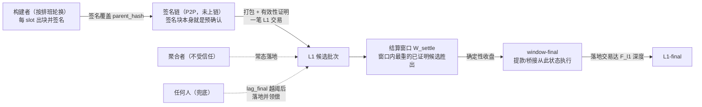
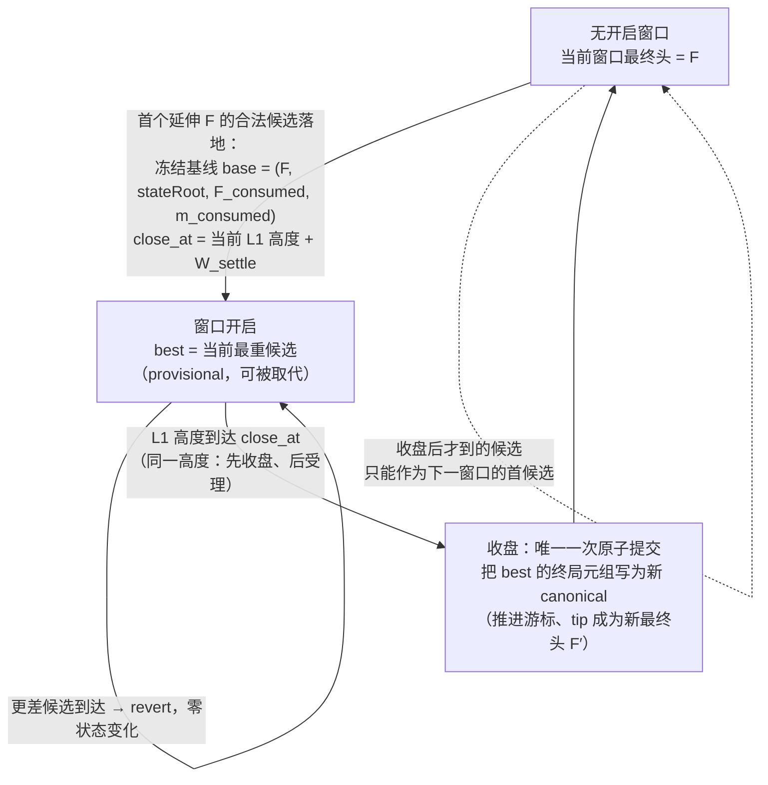
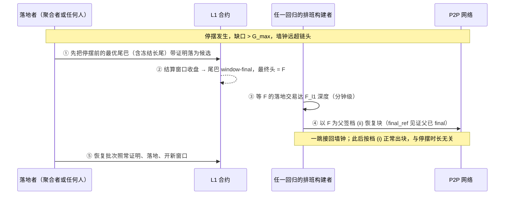

# Slot-Chain：基于槽位签名链的预确认协议（v2 设计规范，草案 v1.46）

> **文档定位。** 这是 Taiko 预确认协议的**后继设计**（successor design），取代此前的
> v15 设计线（永续拍卖 + epoch 判定；其全文与评审记录保留在 git 历史中，可保留结论
> 见 [`legacy-summary.md`](legacy-summary.md)）。设计源自所有者 2026-08-25 的指令：
> 采用亚 epoch 级（sub-epoch）故障切换粒度，由轮换的构建者（builder）按 slot 出块并
> 签名、签名串成链、由证明系统（proof system）验证。本文用中文撰写，特定名词首次
> 出现时在括号内标注英文。

> **如何读这份文档。** 正文（§0–§12 与附录 A–C）是规范本体，按顺序读即可；急着抓主干的
> 读者读 §0 一页摘要与 §9 活性核算表就能建立全貌。正文中大量形如"（评审 r39）""（独立
> 审核第 4 轮发现 2）"的括注是**设计过程的审计线索**——标注某条规则由哪一轮对抗评审
> 促成——第一遍阅读可以直接跳过它们，不影响理解；需要追溯某条规则来龙去脉时再回来查。
> 完整的逐版本变更历史（v1.31 起，含每一轮评审的发现与修复）收在**附录 D**，不再置于
> 正文之前。

**目录**：§0 一页摘要 · §1 设计目标与非目标 · §2 角色 · §3 时间与排班 · §4 构建者
（注册/出块签名/双签罚没） · §5 签名链（合法性/正统性/缺口/删除残留/扣体/**结算窗口
最终性**） · §6 落地（批次/节奏/兜底/恢复/席位经济） · §7 强制包含 · §8 锚定与桥 ·
§9 活性核算表 · §10 罚没总表 · §11 与 v15 对照 · §12 待定项与参数总表 · 附录 A 分歧点 ·
附录 B 术语表 · 附录 C 可执行参考模型 · 附录 D 变更历史

---

## 0. 一页摘要

**一句话概括：** L2 每一秒一个槽位（slot），提前两个 epoch 公布"这一秒谁有权出块"的
排班表（lookahead）。轮到的构建者出块并**签名**，签名覆盖父块哈希——于是未上链的块
串成一条**签名链**（signature chain）。把这条链打包上 L1、附上有效性证明（validity
proof）的动作叫**落地**（landing）：常态由拍卖产生的聚合者（aggregator）负责，但聚合者
掉线时**任何人**都可以做——因为块的权威来自构建者的签名，不来自落地者。

从出块到最终的完整通路：



**这个结构一次解决三件事：**

1. **秒级活性。** 一个构建者掉线只损失它自己的 slot（约 1 秒），下一个构建者接着最后
   可见的链头继续出块。不存在"一个人掉线、链停几十分钟"的窗口。
2. **不需要 L2 共识。** "这个 slot 该谁出块"由排班表决定，"这个块是否合法"由证明电路
   （circuit）里的纯函数规则决定（验签名、验排班、验链接）——任何人读 L1 都算出同一个
   答案，没有投票，没有仲裁者。
3. **落地无特权，聚合者不是单点。** 签名链自带权威，落地只是搬运。指定聚合者超时不落地，
   任何人可以把签名链捡起来落地并从聚合者的保证金（bond）领取报酬。

**保留什么、删掉什么（相对 v15）：**

| 保留 | 删除 |
| --- | --- |
| 聚合者席位的常驻拍卖（perpetual auction）骨架 | epoch 边界承诺（EBC）与每 epoch 一次的不可逆判定 |
| 强制包含队列（forced inclusion queue），规则大幅简化（§7） | 默认派生规则（§6.8 default derivation） |
| "过错方付费、无许可替补"模式（fault-paid permissionless fallback） | 完全无政府模式（Total Anarchy，§9）——落地本身已可无许可兜底，不再需要 |
| 分级保证金/罚没（slashing）思想 | `K_empty`、可用性证书（AC）、`H_cancel` 取消级联等 epoch 判定配套机制 |
| 逐块锚定（per-block anchor）的 L1→L2 桥接方式 | 交接/跳槽仲裁类机制（由电路规则取代） |

**时间线示意（slot = 1 秒，epoch = 384 slot）**——掉线只留缺口，链不停：


落地与兜底的关系（细节见 §6）：任何人都可以把一段连续签名链 + 有效性证明用一笔交易
落上 L1 成为候选；结算窗口 `W_settle` 内最重的已证明候选收盘即最终（§5.6）。聚合者
超时未落地时，任何人可落地，报酬从聚合者保证金支付（§6.3）。

---

## 1. 设计目标与非目标

**目标：**

- **[G1] 秒级排序连续性。** 任何单一参与者（构建者或聚合者）掉线，用户可感知的排序
  服务中断不超过若干个 slot（秒级），而不是若干个 epoch（分钟到小时级）。
- **[G2] 无 L2 共识。** 排班、合法性、正统性全部是 L1 数据与电路规则的纯函数
  （pure function），L2 节点之间不投票、不仲裁。继承 v15 的 I1 精神：派生
  （derivation）是 L1 数据的确定性函数。
- **[G3] 落地无特权。** 把已签名的链搬上 L1 不需要任何身份；指定聚合者只是效率安排
  （避免 gas 竞争与重复证明），不是权力安排。
- **[G4] 证明 + 确定性窗口即最终（r41 option C 修订原"接受即最终"）。** 落地批次附带有效性证明、L1 当场验证成为候选；结算窗口收盘时最重的已证明候选最终化——仍无乐观期/欺诈证明/仲裁，
  没有"已提议未证明"的中间状态，因此不需要围绕这种中间状态的全部机制（封存
  截止、取消级联、计时豁免的大部分）。
- **[G5] 保留包含底线。** 强制包含队列保留：即使全部构建者串谋审查，用户
  与桥接消息仍有 L1 强制路径（§7）。**"无条件"目前带一个阻塞级缺口（评审 r27-1，
  DeepSeek 第 6 轮 Critical 1）**：强制条目用普通 L2 nonce，审查方可接受一笔同
  nonce 冲突交易使其被弃置（§7 的 nonce 抢占，§12 第 12 项）。在该待定项按 §7 三
  候选修法之一定形前，强制路径的"无条件"仅对**不可被 nonce 抢占的条目**成立——
  由桥合约构造、不走用户 nonce 的桥接/退出消息属此类，普通用户的强制交易暂不属。
  §0/§1/§7 凡称"无条件底线"处均按本注解读。
- **[G6] 进入门槛低。** 构建者保证金按"单个 slot 的可提取价值"量级定价，远低于
  v15 中一个席位的整套抵押。

**信任模型（trust model，规范性——所有者决定，2026-08-25）：**

- **构建者：诚实多数（honest majority）。** 假设每个排班窗口（epoch 量级）内，
  大部分排班构建者诚实遵守协议（按时出块、广播块头与块体、接最高可用链头）。
- **聚合者：不受信任（untrusted）。** 聚合者可以任意作恶——拖延、截断、择叉、
  与少数构建者合谋——协议必须在此情形下仍保持 §9 表给出的界。**界的辖域（评审
  r12-4 的精确化 + r20-1 更正深度）**：§9 的界是**活性**界（最终性推进、席位
  更替）；聚合者与恶意构建者合谋对**预确认安全**的敞口——无罚没孤立，单块深跳过
  深度 ≤ `G_max − 1`、少数派联盟接力稀疏分支深度可达未落地尾巴长度
  （≈ `Δ_lag` + 兜底响应）——是 §5.4 明码标价的安全残留，不在"有界"承诺之内。
- **L1：安全且活。** 所有 L2 的标准假设。**外加一条本设计显式承认的【有界纳入假设】
  （r42，独立审核第 5 轮高危 1——固定的 `W_settle` 收盘与 `D_anchor_max` 新鲜度截止无法只由
  "最终会纳入"推出稳健）**：一笔付足费用的候选/落地交易在 **`T_include,max`** 个 L1 块内被
  纳入，且参数满足 `T_include,max < min(W_settle − P_prove,max − 余量, D_anchor_max − D_anchor
  − Δ_lag − P_prove,max)`（§12 设置器关系）。**超出该界的 L1 定向审查属于模型外**——此时更优
  候选可能错过收盘、恢复块 anchor 可能过期，凡依赖"临时审查下仍稳健"的表述（含 §6.4 恢复界）
  一律**条件于本假设**。这是把 v1.28–v1.40 各层隐含的同一时序依赖收拢成一条明说的假设，不是
  新引入的信任。

**诚实多数是经济/社会假设，不是协议强制的（评审 r5-1 的精确化）**：抽签按保证金
加权、`w_max` 防不住女巫（§3.2），所以一个资本方原则上可以买下多数权重、把系统推
出模型——与任何 PoS 链的诚实多数假设同类。本设计**不声称**对构建者角色完全无信任、
完全无许可；这是所有者（2026-08-25）明确接受的信任模型，换取的是不为全员合谋支付
协议级 DA 的成本（成本恒等式见附录 A-3）。各项承诺按此校准：模型内的界见 §9 表，
模型外只保证强制路径。**验收基准注记（r7-7）**：若验收标准是"任何角色均不可信、
完全无许可"，本设计**不满足**且不试图满足——验收基准是本节所有者接受的信任模型；
面向用户的承诺分级见 §5.4 的三档表述。

各机制对假设的**实际用量**（写明，防止假设被悄悄加码）：

- 最终性活性（兜底落地始终有可落的链）只需要**每窗口 ≥ 1 个诚实构建者**（§6.3）——
  弱于假设，有余量；
- 预确认被孤立（跳过、扣体）的**频率**由不诚实构建者的占比约束——这里用到"多数"，
  且它是承重的：跳过对跳过者**可获利**（r5-3），不是靠"无利可图"自灭的行为；
- 构建者全员与聚合者整体合谋（块体私享、链无人可落地）**在模型之外**：协议不为
  这种情形提供最终性保证（所有者决定：无需协议内解决）。但强制路径（§7）被保留为
  **模型外的纵深防御**（defense in depth）——即使假设被打破，强制交易与桥接消息仍
  只依赖 L1 数据独立运行，用户的退出权不随模型失效；
- **尾巴预确认安全额外依赖落地者的视图完整（评审 r33，与"诚实"并列的第三条非纯协议
  依赖）**：一个**诚实但被 eclipse/致盲**的落地者会落错尾巴、撤销一条它没看到的更重
  尾巴的预确认。化解靠"落地深度 ≥ 传播沉淀"（§5.2），把该风险压到"双签（可罚没）或
  eclipse（P2P 层）"；与"诚实多数是经济假设""Byzantine 聚合者活性条件于兜底经济可行"
  同属明码的非纯协议依赖。

**非目标（本版不做）：**

- 交易级公平交换（per-transaction fair exchange）：预确认凭证是块级的（§5）。
- 用户赔付（restitution）：罚没是威慑，不是保险。
- 抗 L1 深度重组：与任何 L2 相同，L1 深度重组可回滚 L2 状态。
- 内建证明者市场（prover market）：聚合者自带证明能力或自行采购。
- **构建者全员 + 聚合者的整体合谋**：按上述信任模型属模型外情形，仅保留强制路径
  作纵深防御，不提供最终性界。

---

## 2. 角色

- **构建者（builder）**：在 L1 合约注册、缴纳保证金的地址集合。按排班表轮到自己的
  slot 时出块、签名、在 P2P 网络广播。**构建者就是预确认者（preconfer）**：它签出的
  块就是对块内交易的预确认承诺。
- **聚合者（aggregator）**：通过常驻拍卖持有唯一席位的服务方。职责只有一件：把签名链
  打包成批次、生成有效性证明、落地上 L1。不构建、不排序、没有内容裁量权
  （discretionary power）——唯一残留的裁量是"落地哪个前缀、何时落地"，两者都被
  截止时间与无许可兜底约束（§6）。
- **兜底落地者（fallback lander）**：任何人。聚合者超时后出现，按过错方付费模式获得
  报酬。不是一个注册角色。
- **用户**：向构建者提交交易换取预确认；被审查时走强制包含队列。
- **L1 合约**：构建者注册表、聚合者拍卖、强制队列、批次入口（验证证明）、罚没入口。
- **证明系统**：验证"这一段链合法且状态转换正确"的电路。它是本设计的裁判。

---

## 3. 时间与排班

### 3.1 slot 与 epoch

- **slot = 1 秒**。L2 的时间单位。每个 slot 至多一个块；块的时间戳（timestamp）恒等于
  slot 的起始秒——时间戳不是谁选的，是排班表定的（消除 v15 附录 C 里时间戳来源的
  整类问题）。
- **epoch = 384 slot**（沿用现值，与 L1 的 32×12 秒对齐）。epoch 在本设计中只是
  计量单位（排班窗口、费用结算的粒度），**不再承载"每 epoch 一次判定"的机制含义**。

### 3.2 排班表（lookahead）

- 排班表是一个映射 `lookahead(slot) → builder 地址`，对每个未来 slot 给出唯一的
  出块权持有者。
- **计算方式（纯函数，评审 r7-1 重写——v1.6 的"每 slot 各自向前 `D_rand` 取
  RANDAO"与 768 slot 前瞻、单一 `H_snap` 三者无法同时成立：768 个 1 秒 L2 slot
  恰好 ≈ 2 个 L1 epoch，窗口末端的 per-slot RANDAO 尚未最终、且晚于 `H_snap`）：**
  `lookahead(slot) = 抽签(hash(seed(窗口), slot), 注册表快照(窗口))`——**种子按窗口
  取一次，不按 slot 取**：
  - **窗口划分（评审 r10-5 的形式化——"窗口"若被解读为滑动视界，同一 slot 会在
    不同时刻得到不同排班，破坏 G2 的确定性）**：窗口是**固定对齐分区**：
    `W(slot) = floor(slot / W_size)`，`W_size = 768`（两个 L2 epoch）；窗口 `W`
    的起点 slot = `W × W_size`，其"起点对应的 L1 slot"按创世映射
    `L1_slot(s) = GENESIS_L1 + floor(s / 12)` 换算（L2 slot 1 秒、L1 slot
    12 秒）。任一 slot 的排班对所有观察者、在所有时刻同值。
  - **唯一快照高度**：窗口 `W` 的快照高度 `H_snap(W) = W 起点对应的 L1 slot −
    D_snap`，其中 **`D_snap` = 前瞻视界 `H_look`（2 L1 epoch）+ 最终性距离
    `F_final`（2 L1 epoch）+ 余量（1 L1 epoch）= 5 L1 epoch**（评审 r8-1 的修复——
    v1.7 的 `D_snap = 3 epoch` 漏了视界项：排班要求提前 `H_look` 可算，最远端窗口
    的起点 ≈ now + `H_look`，其快照点 = now + `H_look` − 3 epoch = now − 1 epoch，
    仍未最终化、可被重组）。设置器不变量：**`D_snap ≥ H_look + F_final + 余量`**。
    由此对**排班需要已定的任意时刻**都有：
    `randao_source(W) = H_snap(W) ≤ 最终化的 L1 头 < W 起点`——种子只有一个，对
    窗口内所有 slot 同时成立，排班在被使用前已定、且不受 L1 重组影响。
  - **种子**：`H_snap(W)` 所在 L1 epoch 的 RANDAO（经 EIP-4788 信标根电路内可证）；
    slot 间差异由 `hash(seed, slot)` 派生，不需要逐 slot 的独立熵源。
  - **注册表快照**：同一 `H_snap(W)` 的注册表状态；进出延迟（§4.1）保证快照覆盖
    整个窗口。窗口内所有块的电路排班验算一律用 `H_snap(W)`，与各块自己的锚定块
    无关（r1-9 的唯一性要求由此自动满足）。
  - **抽签**：按保证金加权的确定性抽样（每 slot 独立）。单地址权重上限 `w_max`
    （初始 20%）。**诚实定性（评审 r1-7）**：`w_max` 只防单地址集中，防不了拆分
    保证金的女巫（Sybil）——大资本拆成多个地址即可重夺权重，且不多花一分钱。
    真正的集中度上界是经济性的（买权重要真锁保证金），与 v15 接受"最高出价者
    可以持续赢"同一取舍。`w_max` 的作用是运维卫生，不承诺去中心化。
- **前瞻可用性**：任一时刻，**至少**未来 `H_look = 768` 个 slot（约 12.8 分钟）的
  排班表已经确定且任何人可算（当前窗口剩余部分 + 下一整个窗口；`D_snap` 的视界项
  保证下一窗口的快照已最终化）。快照、窗口与前瞻的时间几何：

  ```mermaid
  flowchart LR
      HS["快照点 H_snap(W)<br/>= 窗口 W 起点 − D_snap<br/>取 RANDAO 种子 + 注册表快照<br/>（已 L1 最终化，不受重组影响）"] -->|"D_snap ≥ H_look + F_final + 余量<br/>（= 5 个 L1 epoch）"| WS["窗口 W 起点<br/>slot = W × W_size"]
      WS -->|"W_size = 768 slot<br/>固定对齐分区，非滑动窗口"| WE["窗口 W 终点"]
      WS -.->|"排班在被使用前已定：<br/>任一时刻 ≥ H_look = 768 slot 可算"| WE
  ```
- **为什么不混入"最近证明的哈希"做熵（所有者建议，此处有意偏离——见附录 A-1）：**
  同一个陈述可以生成无数个字节不同的合法证明（证明生成自带随机性），所以证明哈希
  是**出证明者可零成本重磨（grind）的熵**——混入它等于把排班的部分控制权送给聚合者。
  纯 L1 信标随机数虽然可被 L1 提议者做每人约 1 bit 的偏置，但对排班这种用途足够，
  且没有引入新的可控方。**原则：熵只来自 L1 共识层，且取值时点早于排班窗口。**
- **已知代价，明说：** 排班公开意味着"下一秒谁出块"是公开的，定向 DoS 一个即将出块
  的构建者在理论上可行。缓解：slot 只有 1 秒（打击窗口极小）、构建者可用哨兵/私有
  网络、被 DoS 的 slot 只是变成缺口（§5.3）。以太坊自身也带着同样的公开排班运行。

---

## 4. 构建者

### 4.1 注册表（registry）

- L1 合约维护。注册需缴纳保证金 `B_builder`，分两个用途（一个账户，两条红线）：
  - **双签罚没额度 `L_eq`**（ETH）。**定价基数是窗口累积敞口，不是单个 slot**
    （评审 r1-5 的修复）：一个构建者在被首次罚没并生效（§4.3 的 `δ_slash`）之前，
    可以对它在本窗口排到的**全部** slot 批量预签双叉，所以
    `L_eq ≥ 该构建者在一个敞口视界内的最大排班 slot 数 × 单 slot 最坏可提取价值 ×
    安全系数`，其中**敞口视界 = 剩余排班窗口 + `δ_slash` + 检测与提交时延余量**
    （评审 r2-3：双签者在首次罚没生效前还能跨入下一窗口继续签，视界不能只算单
    窗口）。按 `w_max` = 20%、窗口 768 slot 计，量级在一两百个 slot 的累积敞口。
    压低这个数字的正路是缩短罚没生效延迟与检测时延，不是假装敞口只有一个 slot。
    具体估价方法是 §12 第 2 项的校准内容。
  - **滋扰缓冲**：小额，覆盖零星违规的处理成本。
  - **`L_eq` 的诚实上限（评审 r5-5）**：`L_eq` 按**协议可见**的可提取价值估计定价；
    外部价值（贿赂、跨域头寸、桥接下游价值）协议无法给出上界——所以双签威慑是
    "按估计定价的威慑"，不是对任意外部激励的保证。依赖超出保证金规模的承诺方必须
    自行定价该残余（与 v15 §5.2"威慑非赔付"同一诚实条款；用户赔付本就是非目标，
    §1）。**证据幂等**：同一构建者的多份双签证据只触发一次罚没（`L_eq` 整额一次性
    没收，其后证据为无效操作）——单个构建者的总威慑上限就是 `L_eq`，这正是 §4.1
    按敞口视界整体定价、§4.3 用 `δ_slash` 尽快把其余 slot 冻结为缺口的原因。
- **进出延迟与保证金保留期（评审 r10-4 的显式化；r22-6 澄清措辞）**：退出申请后，
  凡是已排班给它的 slot 仍然有效（出块或成为缺口）——**已进入某窗口快照
  `H_snap(W)` 的排班项在该窗口内一律有效，即使该地址此后（快照高度之后）退出
  注册也不失效**（此前笼统写"排班表永不含已不在册地址"有歧义：快照后退出的地址
  确实仍出现在已定的排班里，正确表述是"其排班 slot 仍然有效、按出块或缺口处理"）；且
  保证金的实际解锁必须等到该构建者的**全部罚没敞口过期**——设置器不变量：
  **退出延迟 ≥ 至其最后一个已排班 slot 的距离 + `δ_slash` + 检测与提交时延余量**，
  与上文 `L_eq` 的敞口视界同一公式。否则构建者可在临近退出时批量双签、赶在证据
  提交生效前取回保证金，威慑清零。
- 注册表容量上限 `N_max`（初始 64）：够分散、又让电路里的排班验证保持便宜。
  超额按保证金排序竞争席位（细则待定，§12）。

### 4.2 出块与签名

- 轮到 slot `s` 的构建者构造**块头**（block header）：

  ```text
  header = (chainId, slot, parent_hash, anchor, final_ref(仅档 (ii) 块,否则置零),
            txs_root, state_root_claim(可选), forced_root, coinbase, gas_used, ...)
  sig    = 构建者对 keccak(header) 的签名
  ```

  关键字段：
  - `slot`：本块的槽位号；`timestamp` 由它唯一决定，不单独存在。
  - `anchor`：本块引用的 L1 区块（新鲜度基准与 L1→L2 消费点，§8；评审 r36 补入字段列表，
    DeepSeek 警告——§7 的 r30-1 逐块强制义务与 §8 的 `m_consumed` 均以块头 anchor 为准，
    故它必须是**签名覆盖**的块头字段，而非批次级隐式量）。
  - `parent_hash`：父块头的哈希。**签名覆盖 parent_hash 是本设计的核心一环**：
    父块的选择（包括"跳过谁"）是构建者签了字的显式行为，不是事后可抵赖的模糊状态
    （所有者 2026-08-25 的修复建议；分析见 §5.4）。链接用父块头哈希而非父块签名——
    哈希是结构必需（定义链），把父块签名再放进子块属冗余（电路反正逐块验签），
    可作为 P2P 层的证据打包习惯，但不是共识规则。
  - `forced_root`：本块包含的强制条目承诺（§7）。
- **签名域唯一性不变量（评审 r1-8 的修复）**：块头的规范化摘要（canonical digest）
  与签名方案必须是**一个共享对象**——L1 罚没合约直验（§4.3）和电路合法性验证
  （§5.1）验的是完全相同的字节、相同的哈希、相同的曲线。若为降低电路成本改用
  BLS（走 EIP-2537 预编译）或 SNARK 友好哈希，必须两侧同时切换。密钥体系选型
  因此是阻塞级待定项（§12 第 6 项），先于其余参数落定。
- 构建者把（块头 + 签名 + 块体）在 P2P 广播。**这个签名块本身就是预确认**：给用户的
  回执 =（块头， 构建者签名， 交易的包含证明）——回执含块头哈希与 `txs_root`，
  是公开可转发的证据（§5.5 会用到）。
- 两档父块规则的判定流程（正文与例外详见下条）：

  ```mermaid
  flowchart TD
      S["slot s 的构建者选父块 P<br/>（要求 parent.slot < s）"] --> G{"缺口 s − parent.slot ≤ G_max ?<br/>（G_max = 64 slot）"}
      G -->|"是 → 档 (i) 正常出块"| T1["P 只需是签名链中的真实前块<br/>落地状态无关：未落地 / 已落地 / 已 final 均可<br/>（每次落地后的下一块也走这一档）"]
      G -->|"否 → 档 (ii) 恢复（真停摆）"| T2["P 必须同时满足：<br/>① window-final（所在候选已收盘，§5.6）<br/>② L1-final（落地交易达 F_l1 深度）"]
      T2 --> FR["块头携带 final_ref（≤ 本块 anchor）<br/>证明【签名时】P 已 F_l1-final<br/>（堵住 F_l1 边界的预签抢落循环）"]
      FR --> LAND["落地时 §7 另验：P = 当前 canonical 落地尖端<br/>尖端已被推进 → 恢复块良性搁浅，重建即可"]
  ```

- **父块规则——两档，判据是【缺口大小】而非父块落地状态（评审 r6-1 → r32 重做，方向 B
  恢复重设计；r35 澄清判据与求值时点，DeepSeek 关键 1/2）**：`parent.slot < s`，且父块
  满足以下**其一**。**判据是缺口 `s − parent.slot`，在签名链结构（缺口 + `parent_hash`）
  上求值——签名时、证明时、落地时三处求值一致，不依赖父块此刻"是否已落地/是否已 final"
  这个随时间漂移的状态**：
  - **(i) 有界缺口档（正常出块）**：`s − parent.slot ≤ G_max`（缺口上限，初始 64 slot）。
    父块只需是签名链里一个**真实前块**（`parent_hash` 指向它），**其落地状态无关紧要**
    ——未落地、已落地未 final、乃至已 final 都可。**正常出块（含每次落地后的下一块）永远
    走这一档**：落地后下一块以小缺口接在（已落地的）链头上，缺口 ≤ `G_max` 即合法，"已落地
    但未 final"因此**不构成任何空档**（DeepSeek 关键 1 的化解——判据是缺口不是落地状态，
    故不存在"两档都不适用"的父块类别）。这一档防深重组:`G_max` 封顶单块回退深度，恶意
    构建者要孤立更深的**未落地**尾巴需接力稀疏分支(见下残留)。
  - **(ii) 无界缺口档（恢复）**：`s − parent.slot` 任意——但父块**必须同时是【window-final】
    （其所在候选已在 §5.6 结算窗口收盘——r42:仅 `F_l1` 深不够，provisional 候选收盘前仍可被
    取代，建在其上会随之搁浅，独立审核第 5 轮一致性 2；等待界 = `max(W_settle, F_l1) + D_anchor`）
    且【`L1-final`】**（**`L1-final`**，其落地 L1 交易达 `F_l1` 深度；**术语区分，评审 r38 DeepSeek 警告
    3**：这里的"final"专指 **`L1-final`** = L1 达 `F_l1` 深度，**区别于 §6.1 的 `landed-final`
    = L2 批次经结算窗口收盘的 window-final 最终性（r41）**——两档父块规则一律以 `L1-final` 为准；全文术语
    统一见 §12 待定项 18(c)）。仅在缺口 > `G_max`（档 (i) 不可用，即真
    停摆）时进入。**为什么大缺口可无上限**:final 落地块按 §5.2 不可再 reorg，建在它上面
    **不可能 reorg 任何已落地块**；于是它天然安全，不需要 `G_max`。这一档是**恢复的唯一
    机制**（取代旧的整套重锚 episode，见 §6.4）。**求值时点与 `F_l1` 等待（DeepSeek 关键
    2）**：父块"是 final 且是当前 canonical 落地尖端"由 §7 落地规则**在落地时**校验，非
    签名时刻。由此若停摆恰在一次落地后不久开始、当前落地尖端尚未达 `F_l1`，恢复块须**等
    当前尖端 final**（额外 ≤ `F_l1`，分钟级）方能落——建在更旧的 final 头上会 fork 掉较新
    尖端、被 §7 拒。稳态灾难停摆（上次落地早已 final）无此等待。确定性同样由落地规则兜底:
    批次只能延伸**当前 canonical 落地尖端**（§7），建在旧尖端上的恢复块若尖端已被推进则
    **良性搁浅、重建即可**（无 episode/押金可乱；真停摆时尖端不动，恢复块必落）。`F_l1` 使
    "final 落地块"这一谓词在浅层 L1 重组下稳定（挂钩 §12 L1 重组）。
  - **档 (ii) 块头须携【签名时父已 `F_l1`-final】的 L1 引用——堵 `F_l1` 边界预签循环（评审
    r40，独立审核第 3 轮发现 5）**：只在落地时校验父 final，给了聚合者一个循环：在尖端**尚未**
    final 时就预签、预证一个 档-(ii) 块，等尖端刚到 final 的第一个 L1 块抢落，如此每 `F_l1` 一
    循环、lag 永不越阈、诚实内容还没老到 `Δ_prop` 无法挑战 → 永久只落稀疏仅强制链。修复：**档
    (ii) 块头新增一个字段 `final_ref` = 一个 L1 块引用，电路/L1 入口校验"该 L1 块已见证父块达
    `F_l1` 深度"，且 `final_ref` ≤ 本块 anchor（签名时可得）**。于是父块必须在**签名时**就已
    `F_l1`-final，不能预签未 final 尖端；抢落循环被打断（要落 档 (ii) 必须等父真 final 后才能签，
    那时诚实内容尾巴已有时间被证明并作为更重候选落进结算窗口，按 §5.6 直接胜出稀疏仅强制
    候选）。正常恢复不受影响：恢复块本就在父 final 后才出。
- **`G_max_landed = ∞` 的取值论证（方向 B，所有者决定 2026-08-25）**：档 (ii) 不设
  上限，是因为**经落地头的 reorg 敞口天然被未落地尾巴长度封住，而尾巴长度被 `Δ_lag`
  封住**——超过 `Δ_lag` 的尾巴已被兜底落地、最终、不可再 reorg。所以"无限"**不增大**
  最坏 reorg 深度(仍 ≤ `Δ_lag`，与 §5.4 既有残留同界)，却让**任意时长停摆一跳恢复**
  (见 §9)。有限值反而两头输：小于证明时延则永远追不上长停摆，等于 `Δ_lag` 则收紧
  是幻觉(自然界已是 `Δ_lag`)——论证详见附录 D v1.31 条。
- **"尾巴 ≤ `Δ_lag`"是条件性的，不是无条件（评审 r36,Codex line 475 P1——必须明说）**：
  上面"尾巴长度被 `Δ_lag` 封住"**只在无许可兜底能在 ≈`Δ_lag` 内把老尾巴落地时成立**,
  与 §6.3（r24-4）对 Byzantine 聚合者活性界的**同一个条件性完全一致**。若兜底在经济上
  不可行（无人愿兜底）或**兜底落地交易本身被 L1 审查**（§6.3/§5.2 已列)，未落地尾巴会
  **随停摆无界增长、`> Δ_lag`**；此时档 (ii) 的 `G_max_landed = ∞` 让**一个恶意构建者一
  块**即可孤立这条超长尾巴（不再需要 档 (i) 那种随尾长变苛的联盟排班密度），合谋落地者
  落它即孤立**远超 `Δ_lag`** 的诚实预确认。**诚实结论**：档 (ii) 的最坏 reorg 深度
  ≤ **实际未落地尾巴长度**，它 ≈ `Δ_lag` **当且仅当兜底按期落地**；兜底停摆时深度随停摆
  增长，与 §6.3 最终性可无限停滞是**同一条件、同一根因**（无协议级 DA + 兜底经济性/L1
  抗审查）。这不是 `∞` 新引入的洞（档 (i) 接力联盟同样能孤立整条超长尾巴，只是更贵），
  但 `∞` 把该 regime 的构建者侧成本降到"一人一块"，**必须与 `≤ Δ_lag` 的乐观标注一并
  说清**。**r41 注**:§5.6 结算窗口在"有人肯落"的同一条件下把这类孤立分支变成**自败**（更重的
  诚实尾巴候选在窗口内直接盖掉它），但"无人兜底/兜底被 L1 审查"时窗口里可能只有恶意候选——
  条件性不变，只是失败模式从"恶意链最终"变为"恶意链在无竞争窗口最终"。仍如实标注。
- **深重组残留(评审 r20-1，档 (i)/(ii) 下重述)**：无协议级 DA ⇒ L1 看不见未落地尾巴 ⇒
  一个**合谋落地者**总能落一条排除某些未落地块的合法分支、孤立其中预确认。**worst
  case 深度 = 未落地尾巴长度 ≈ `Δ_lag` + 兜底响应**(尾巴被落即最终)。两档规则下的
  构建者侧成本：档 (i) 单块 ≤ `G_max − 1`、更深需接力稀疏联盟；档 (ii) 单块即可提供
  一条以落地头为父、孤立至多整条未落地尾巴的分支。**但两者都只在落地者合谋时生效**
  ——诚实落地者按 §5.2 fork-choice 落最重尾巴、无视这类短分支(见 §5.2 落地者策略);
  worst-case 深度(≤ `Δ_lag`)与"需落地者合谋"这一绑定约束**都不变**，变的只是档 (ii)
  把满孤立分支的构建者侧成本从"密集联盟"降到"一个恶意构建者"。这是 §1 信任模型下
  明码接受的残留(附录 A-3 成本恒等式)，只打破第 2 档承诺(§5.4，本就声明可被单个
  恶意构建者撤销)。`G_max`(档 i)仍是压制稀疏联盟可行性的治理旋钮。

### 4.3 双签罚没（L1 直接验证）

- **过错定义**：同一构建者对同一 `slot` 签出两个字节不同的块头。
- **证据与执行**：任何人把两个（块头， 签名）提交给 L1 罚没合约；合约**直接在链上验
  两个签名 + 同 slot + 不同哈希**——不需要零知识证明、不需要仲裁期，验证通过即罚没
  `L_eq`，其中 ≥ 80% 销毁、余下付给提交者（沿用 v15 的销毁主导原则，防自罚套利）。
- **罚没的生效时点是 slot 基准的确定性规则（评审 r1-4 的修复）**：罚没交易被 L1
  纳入的区块时间戳对应 L2 slot `s_0`，则罚没自 slot `s_0 + δ_slash`（初始
  `δ_slash` = 64 slot）**生效**：生效后该构建者已排班的 slot 全部视为缺口——
  **电路规则**：批次落地时，L1 合约把自己记录的（被罚没者， 生效 slot）清单作为
  已验证输入交给证明验证；批次内任何"由已生效罚没者签名、slot ≥ 生效 slot"的块
  都不合法。生效以 slot 为界（而不是以各块的锚定块为界），保证所有分叉对"谁已被
  罚没"的判断一致，不存在锚定竞态。没有这条，被罚没的零保证金构建者仍能出合法块
  （§4.1 与 §5.1 将互相矛盾）。
- **生效还须挂在【批次接受时点】上，堵住历史 slot 回填（评审 r39，独立审核第 2 轮发现 5）**：
  上面只按 `header.slot ≥ 生效 slot` 判定，而 `header.slot` 是**签名者自填的**——被罚没的
  零保证金旧密钥可以在生效之后签一个 `header.slot < 生效 slot` 的**历史块**，绕过该比较、
  继续出合法块（还能被用于陈旧尖端 grief,§6.4/独立审核发现 5）。**r41（option C）判据 = 该块
  所在【候选批次】的 L1 落地时点——天然不可伪造，取代 v1.40 的承诺时间戳（承诺层已随旧 §5.7
  删除）与 v1.39 的 `δ_land` 猜测（独立审核第 4 轮发现 7 指出其宽限窗内放回填、窗外误杀在途
  的两难）**：**罚没在 L1 生效后，凡【落地 L1 时点 ≥ 生效时点】的候选批次一律不得包含该 signer
  的块——无论 `header.slot` 填多少；生效前已落地（provisional 或 window-final）的候选中该 signer
  的块祖父化有效**。候选的落地时点是 L1 交易的固有属性、不可伪造：事后回填的历史块只能出现在
  生效后落地的候选里 → 必被拒；生效前已在某候选里落地的块 → 保留。**代价（如实，r42 修正措辞——独立审核第 5 轮指出"不误伤其他构建者"不实）**:该 signer
  生效前已签、生效时**尚未落进任何候选**的在途块被一并拒绝——且**其上的诚实后继块因
  `parent_hash` 穿过它而级联搁浅**（双签者只广播一个分身时，诚实后继全建其上；`δ_slash` 短于
  首批证明时，生效后含它的候选全拒）。这仍落在"可罚双签 + ≤ 实际尾巴深度"的已接受残留之内，
  但 `L_eq` 定价与用户语义须承认该**后继级联敞口**；不需要 `δ_land` 宽限参数（删除）。
- 这一类过错是**挑战者提交、L1 机械验证**：比 v15 中依赖 L2 证据链的
  preconf-vs-record 变体（§8b）强一级——提交后零延迟、无需瞭望塔跑证明，只需要
  有人肯提交（有赏金，是有偿的无许可工作）。

---

## 5. 签名链：合法性、正统性、预确认语义

### 5.1 单块合法性（validity，电路规则）

一个块合法，当且仅当（全部电路可验）：

1. 签名有效，且签名者 = `lookahead(slot)`（排班表在电路内从 L1 锚定数据重算）——
   **唯一例外**：满足 §7 **合法性谓词 `P_forced`** 的仅强制块（forced-only block）豁免
   本条排班检查——`P_forced` 是精确、电路可验的准入测试（任意密钥 + 父为 window-final 头
   〔档 (ii) 重根〕**或前一仅强制块〔档 (i) 同-lane 续接，r37/r42 本摘要补齐〕** + `slot ≤ 墙钟`
   + 非空且**逐块重验成熟**的强制前缀 + 最大消息消费，详见 §7），取代 v1.31 前已删除的旧
   "三条件"表述（评审 r3-3 Codex 引入例外；r35 更新引用 DeepSeek 警告 1；r36 定为精确谓词
   Codex line 517 / DeepSeek）；
2. `parent.slot < slot` 且**父块满足 §4.2 的两档规则之一**（r32；判据是缺口大小、非父块
   落地状态，r35）：(i) 缺口 `slot − parent.slot ≤ G_max` 时父块是签名链里任一真实前块
   （落地状态无关）；(ii) 缺口无上限但父块必须是最终 L1 已落地块。`parent_hash` 指向该
   合法父块。**档 (ii) 块另须 `final_ref` 合法（r41 补进合法性规则——独立审核第 4 轮一致性 1:
   v1.40 只在 §4.2 叙述、未列入本节）**:`final_ref` 见证父块已达 `F_l1`-final 且 `final_ref`
   ≤ 本块 anchor（§4.2）；父"是当前 canonical 尖端"仍由 §7 在落地时校验（两个谓词分开：签名时
   final 由 `final_ref` 证，落地时 canonical 由入口验）；
3. `slot` 未越过落地批次声明的范围；时间戳规则自动满足（= slot）；
4. 按 §7 的**逐块容量规则**包含到期且链上尚未包含的强制条目——**统一的"最大前缀"定义（评审
   r40 消除独立审核发现 4：此前"至 `C_force` 上限"与新增"gas 满即溢出"两套规则互相否定）**：
   块首强制前缀 = 队列 FIFO 中**同时满足"条数与 gas 均在 `C_force`/`C_bridge` 份额内"的最长
   前缀**（`C_force` 是条数与 gas 双封顶，取先触顶者；桥接队列同理按 `C_bridge`）；**取到该最长
   前缀即合法，少于它才不合法**（不是"恰好某个条数"）。余量确定性溢出到后续块。**消费不等于
   执行**——对前置状态非法的条目弃置消费（r9-2）；
5. 块内交易执行合法（正常的状态转换验证）；锚定交易（anchor tx）满足新鲜度规则（§8）
   **且满足 §8 的因果序不变量 `anchor.L1_timestamp ≤ L2 时间戳(slot)`（评审 r37）**；**且 L1→L2
   入站消息按 §8 消费到【统一最大前缀】——FIFO 中同时满足"条数 ≤ `C_anchor`"且"累计声明 gas ≤
   L1→L2 消息 gas 份额"的最长前缀（评审 r40 与规则 4 同构，消除发现 4 的"恰好 `min(C_anchor)`"
   与"gas 满即溢出"矛盾）；取到该最长前缀即合法，少于它才不合法**（杜绝"用新鲜 anchor 却零处理
   入站消息"的无限期审查，r36）。

### 5.2 正统性（canonicality）与分叉选择（fork choice）

- **L1 已落地部分（r42 改窗口语义，删"先落者永久正统"）**：正统链 = **各结算窗口收盘的
  window-final 批次**串起来的链（§5.6）。窗口内冲突候选由 §5.2 全序取代、收盘定终身；
  收盘后才是"永久出局"。
- **未落地部分（P2P 尾巴）的协调规范——排序判据统一由下条"最优链全序"给出（评审 r11-2 引入，
  r40 把排序合并进全序、删去与之冲突的旧"块数最多"独立表述，独立审核一致性 1）**：诚实构建者/
  节点接在**按下条全序最优**的链头上（旧文的"最多块 + 高 slot + 哈希"已并入全序的第 2/3/4 级，
  不再单列，以免与全序的 lane 优先冲突）。**效果定位（评审 r12-4，仍成立）**：这是**链下 P2P
  协调规范**、不是电路或 L1 入口规则——它只约束诚实 P2P 节点的收敛，**不能约束**恶意聚合者/
  兜底者/私有中继/L1 提议者的择叉；对**恶意落地者**的真实约束由 §5.6 结算窗口竞争给出
  （更差候选被更重候选机械盖掉），深跳过残留敞口的定界仍见 §5.4。
- **最优链的全序（best-chain total order）——分叉选择、落地策略、§5.6 窗口候选比较三处共用
  （评审 r39 引入；r40 修 lane 洗白；r41 起服务于结算窗口的机械比较）**。**本条取代 v1.35 的"恢复优先／冻结死尾
  让位"规则**——独立审核（第 1/2 轮）指出那条会**命令诚实落地者丢弃一条完整可见、可落地的健康
  长尾**，这是错的："不可 P2P 扩展"不等于"应被丢弃"。给定分叉点 `F`，在延伸 `F` 的候选链中比较，
  **依次**：
  **比较的对象是标量四元组，不是逐对结构比较（r42 修独立审核第 5 轮严重 1——旧"看两链首个
  相异块定 lane"是 pairwise 判据，可构造 `A>B>C>A` 非传递环:A=[X,a] vs B=[X,b1..b3] 在 a/b1
  分歧判 content 胜，B vs C=[Y,c1,c2] 在 X/Y 分歧按块数，C vs A 又在 Y/X 分歧按块数——环。修复:
  lane 是每条候选**自身的、相对固定基线 `F` 的不变标量**，与比较对象无关）**。每条延伸 `F` 的
  候选链独立求出四元组 `key = (lane, count, tip_slot, tip_hash)`:
  1. **`lane`（candidate-local,r42）**：= 该候选**自 `F` 起第一个块**的类别——自由裁量块 = 内容
     lane（大），仅强制块 = 仅强制 lane（小）。首块一经决定，**整条候选继承、后继块不改变它**
     （仍防 r40 发现 3 的洗白：仅强制首块的链无论后面接多少普通块，lane 仍为仅强制）；
  2. **`count`**：自 `F` 起的合法块数；
  3. **`tip_slot`**：tip 的 slot;
  4. **`tip_hash`**：tip 的块头哈希（取小者，末级确定 tie-break——r42 弃用"首个相异子块哈希"
     这一 pairwise 量，改为候选自身的标量，保证全序）。
  比较 = 四元组的**字典序**（lane 降序、count 降序、tip_slot 降序、tip_hash 升序）——标量字典序
  **天然自反、完全、传递**,§5.6 的"严格更重"与收盘赢家由此良定义、与提交顺序无关。（形式化
  性质测试列 §12 第 18 项。）内容 lane 优先的理由不变：仅强制只是审查底线，内容块本负强制前缀
  义务，优先内容不牺牲审查抵抗。
  **"冻结长尾"不再被丢弃**：链头落后墙钟 > `G_max`、P2P 中不可再扩展（无 档-(i) 子、又非
  final 无 档-(ii) 子）的长尾，**仍是候选中的最优链**——落地者应**先落它**（兑现其预确认），
  再从其 final 尖端恢复出块（§6.4）；落地无需在 P2P 里扩展它，只需证明并张贴。原先担心的
  "恢复与 fork-choice 死锁"由此消失：先落最优（含冻结）链 → 从其 final 尖端一跳恢复。
- 最终仲裁仍是 L1：**分歧在结算窗口收盘时由 §5.6 全序一次性消解**（r42）。双签者被罚没（§4.3）；
  因分区无辜分叉的块成为孤块（orphan），其中交易回到内存池重新被打包。
- **落地者的尾巴选择策略（评审 r33，所有者提出；r41 由 §5.6 结算窗口机械背书）**：落地者面对
  多条候选尾巴时，**对自己的视图应用上文最优链全序**落最优者。这不再需要是"被信任的义务"——
  **落更差链在 §5.6 窗口内被更重候选直接盖掉、白花成本**，落最优链是唯一不徒劳的策略；协议
  不需要判断落地者"该落什么"（那正是 v1.39/v1.40 证明无法机械判定的)，只需让最重的已证明
  候选赢。`Δ_prop` 保留为落地者**视图完整**的链下策略参考（落传播沉淀满的前沿，r33），不再是
  任何链上判责参数。**"有更好的尾巴但落地者没看到"的处置（r41 由结算窗口化解）**：某个落地者
  没看到更重尾巴、落了较差候选?——**没关系：看到它的任何人在同一 §5.6 窗口内把更重尾巴
  带证明落进去，直接盖掉**。单个落地者的视图不完整**不再是安全依赖**（v1.39 前"落错即无法
  纠正"的前提已被窗口消除）；整体仍需**窗口内至少有一个视图完整且愿意落的参与者**——正常
  P2P 传播秒级、待落前沿早已传遍，该条件在 §6.3 兜底可行性下自然满足；全网 eclipse 级的
  致盲归 §12 P2P 规范。
- **诚实定界（评审 r1-1，必须明说的残留）**：在落地之前，一个双签构建者 + 一个
  愿意为其分叉落地的合谋者（聚合者，或兜底窗口内的任何落地者，乃至被贿赂的 L1
  提议者）可以让"另一条"尾巴成为正统，孤立掉其中的预确认。这个攻击（i）需要一次
  可被 L1 直接罚没的双签（代价 = 按窗口累积敞口定价的 `L_eq`，§4.1）；（ii）深度
  上限 = 未落地尾巴的长度。**尾巴长度不是被 `Δ_lag` "硬性"压住的（评审 r16-1 的
  更正——v1.15 及之前如此声称）**：`lag > Δ_lag` 只是把兜底落地的**授权**打开，
  不强制任何批次被接受；扣落地的聚合者拖住期间，尾巴在兜底响应时间内继续生长。
  如实的深度界 = `Δ_lag` + 兜底响应时间（一轮证明 + 落地 ≈ 10–15 分钟 ≈ 2–3
  epoch），再可被 L1 层对兜底交易的持续审查拉长——后者是 §6.3 已定价的最贵审查
  类别。这是**软上界 + 明示的响应时间假设**，不是硬帽。所以
  预确认在落地前的安全性是**威慑 + 有界深度**，不是绝对——§5.4 的用户语义按此
  表述。把尾巴保持短（§6.3）就是把这类攻击的收益压小的主要手段。
- **正统性仍只由 L1 决定（G2）——但落地"该落哪条"现在是可罚没的义务**：链下 fork-choice
  给诚实节点收敛（上文全序），而"最优链胜出"由 §5.6 结算窗口**机械**给出
  ——L1 不裁决"谁该落什么"，只让窗口内最重的已证明候选最终。故本设计不是"L1 强制最长链"（那需
  协议级 DA 看见未落地尾巴），而是"L1 在已落地、已证明的候选之间选最重"——无 DA、无事后裁决，
  是所有者在 §1 约束下选定的机械中间点（option C,r41）。

### 5.3 缺口（gap）

- slot `s` 没有出现合法块（构建者掉线、被 DoS、块体没传开），链在 `s` 处留空，
  `s+1` 的构建者接在更早的链头上。**缺口是常态化处理，不是异常**：不需要证明
  "为什么缺"，也没有人因缺口被罚没（出块是机会，不是义务——继承 v15 §9.3 的原则，
  但现在适用于每个 slot）。
- 缺口的代价由激励兜住：跳过的 slot 挣不到费；预确认过的用户找该构建者的声誉算账。
  滋扰性长期缺勤由注册表的活跃度规则处理（可选项，§12）。

### 5.4 删除 vs 缺口：签名链修复了什么、剩下什么（明说）

所有者提出的父块哈希串联修复，效果精确陈述如下：

- **修复了：聚合者的选择性删除。** 因为子块签名覆盖 `parent_hash`，从链中间抽掉一个
  块会使后继全部断链、证明必然失败。聚合者对一条签名链只剩**取前缀**的权力：落地
  `[..m]`，把 `[m+1..k]` 留在链外。（"恶意构建者免双签地从旧点另起短分支供聚合者
  择叉"的深重组路径——**单块**被 `G_max` 封顶，但**接力稀疏分支**可达整条未落地
  尾巴，见 §4.2/下文的 r20-1 两档界；r22-4 删去此处此前笼统写"封顶在 `G_max` 以内"
  的旧句，与下文自相矛盾。）而被留下的后缀仍然接在新的 L1 链头上，**下一个
  批次（任何人的）照样能落地它——截断是延迟，不是销毁**。配合落地截止时间（§6.3），
  聚合者恶意截断买不到什么。
- **剩下的：相邻构建者的跳过（skip）——且它是可获利的（评审 r5-3 更正）。** builder
  `s+1` 接在 `s−1` 上、声称没见过 `s` 的块——协议内无法证伪（"没收到"不可证明）。
  v1.4 此前把"行为者无收益"错误地外推到了跳过上：**跳过者可以把被跳块 `s` 里的
  高优先费交易与 MEV 重新打包进自己的块**，照常收取自己 slot 的全部收益——跳过是
  单个不可信构建者即可实施的、有收益、不可罚没的预确认撤销。诚实定界四点：
  (1) 该选择**签名固定、公开可见**（`parent_hash` 白纸黑字 + `s` 的签名块在 P2P
  流传），归责有实锤；(2) **相邻跳过**的单次收益上限 = 一个 slot 的费用/MEV 转移；
  **深跳过 / 稀疏私有分支（评审 r11-2 补明、r20-1 更正深度）**：一个恶意构建者
  用**单块**深跳过一次可波及至多 `G_max − 1` 个未落地块；但**一个少数派联盟把
  多块沿私有分支接力串起（每跳父距 ≤ `G_max`，逐块合法、无双签，§4.2 的 r20-1）**
  可波及**整条未落地诚实尾巴**。§5.2 修订后的协调规范使诚实网络不跟随这类叉，它须被
  抢先落上 L1 才能生效。**竞速的要害（评审 r12-4）**：若合谋落地者只是兜底者，
  这确是与在途诚实批次的竞速（窗口 ≈ 正常落地节奏，且兜底权在 `lag > Δ_lag` 前
  根本不开）；**若合谋者就是在任聚合者，正常运行期它是唯一常态落地者，无竞速
  可言**。该组合是本设计**明码标价的安全残留**，其深度界按攻击形态分三档（r20-1 分两档，
  v1.31 方向 B 增补档 (ii) 的单块经落地头路径）：
  - **档 (i) 单块深跳过（未落地父）**：深度 ≤ `G_max − 1`（约 1 分钟尾巴），一个恶意 slot；
  - **档 (i) 接力稀疏分支**：深度 ≤ 未落地尾巴 ≈ `Δ_lag` + 兜底响应，代价是联盟须在
    尾巴的每个 `G_max` 窗口有一个排班 slot（密度要求随 `G_max` 调小而更苛刻）；
  - **档 (ii) 单块经落地头（v1.31 新，`G_max_landed = ∞`）**：一个恶意构建者以 final
    落地头为父出一块，一步即可提供孤立至多**整条未落地尾巴**的分支，**无需联盟密度**。
    **前提（评审 r35,DeepSeek 警告 4）**：该分支要能被合谋落地者落上 L1，其 final 父块
    须同时是**当前 canonical 落地尖端**（§7 只让延伸当前尖端的批次落地）——即需当前尖端
    本身已 final。稳态下尖端通常已 final，前提常成立、不弱化威胁，此处只是把残留说准
    （尖端未 final 时该单块攻击须先等尖端 final，与 §4.2 恢复的 `F_l1` 等待同源）。
    **深度上界 ≤ 未落地尾巴长度**，把满孤立分支的构建者侧成本从"密集联盟"降到"一人
    一块"，worst-case 深度与"须落地者合谋"绑定约束**均不变**——接受 `G_max_landed = ∞`
    的代价，换任意时长停摆一跳恢复(§6.4/§9)。**"≈ `Δ_lag`"是条件性上界（评审 r36,
    Codex line 475 P1）**：尾巴长度 ≈ `Δ_lag` **仅当无许可兜底按期落地**（与 §6.3
    Byzantine 聚合者活性界同一条件）；兜底停摆或落地交易被 L1 审查时，尾巴随停摆无界增长，
    档 (ii) 一块即可孤立**远超 `Δ_lag`** 的尾巴——详见 §4.2 该条件性论证。此非 `∞` 独有
    （档 (i) 接力联盟同样可孤立超长尾巴，只是更贵），但 `∞` 把该 regime 成本降到一人一块，
    须一并如实标注。
  两档**频率都 ≤ 联盟拿到的排班 slot 数**、全程可归责（parent 选择签名在案，
  聚合者截断落地在 L1 公开）、机械威慑只有席位价值与声誉、协议不罚没构建者；**但 r41 起，
  这些孤立分支要真正最终化，还须在 §5.6 结算窗口内胜过更重的诚实候选**——只要有人把诚实
  尾巴带证明落进窗口，孤立分支即自败；残留收窄为"窗口内无人落诚实尾巴"（兜底可行性条件，
  §6.3）。完全的结构性消除仍需协议级 DA（附录 A-3），按 §1 不采纳。`G_max` 由此是治理旋钮：调大增强缺口容忍（§6.4），调小
  抬高接力稀疏分支所需的联盟排班密度。直接重打包收益仍以攻击块自身容量为上限；
  两种跳过的**频率都由不诚实构建者占比约束——§1 信任模型的"诚实多数"正是在这里
  承重**（不是保守冗余）；
  (3) 对用户的伤害分层：纯"包含"类承诺通常在下一 slot 经重新打包兑现（跳过者恰有
  动力收下那些交易的费用），被真正打破的是"排序/精确状态"类承诺；(4) 处置 = 公开
  归责 + 注册表活跃度/声誉规则（§12 第 1 项）+ 用户对惯犯的流量惩罚。这是威慑级
  残留，本设计接受并明说；结构级消除需要协议级 DA/可用性证明（成本恒等式见
  附录 A-3）。
- **推论——预确认语义（写给用户文档的版本，评审 r1-1/r1-6 后的诚实版）：** 一个
  签名块的预确认，被打破的方式有四种：
  1. 签它的构建者**双签**且合谋方落地另一叉——代价是被 L1 直接罚没按窗口累积敞口
     定价的 `L_eq`（§4.1）；可孤立深度 ≤ `Δ_lag` + 兜底响应时间（软上界，r16-1
     更正——见 §5.2 诚实定界）；
  2. 某个后继构建者**跳过**它——对跳过者可获利（费用/MEV 转移）且不可罚没
     （r5-3）；公开可见、签名固定；相邻跳过波及单 slot，单块深跳过至多
     `G_max − 1` 个未落地块，**少数派联盟接力稀疏分支可达整条未落地尾巴**
     （r20-1），一般须赢得落地竞速（r11-2，§5.2）——但**在任聚合者合谋时无需竞速**
     （r12-4，上文的明码残留）；频率由诚实多数假设约束；纯包含
     类承诺通常经重打包兑现（§5.4 上文）；
  3. 签它的构建者**扣住块体不发**（§5.5）——块永不能被落地，预确认自然作废，
     同样是威慑级处理；
  4. **L1 深度重组**——所有 L2 共有的残留。
  正确的表述是：**没有任何单一参与者能"无代价且悄无声息"地废掉一批预确认**——
  每条路要么付出 L1 可直验的罚没，要么留下签名在案的公开行为记录；但"付得起代价的
  合谋"可以在有界深度内做到。这仍强于 v15 单席位（那里一个席位的沉默就废掉整个
  epoch 的服务且无人可替），但不是绝对保证，不应向用户宣传为绝对保证。
  **产品必须区分三档承诺（评审 r7-7 采纳）**：(1) **包含意向（inclusion
  intent）**——交易会上链，通常跨越跳过/扣体存活（重打包）；(2) **排序/状态预确认
  （ordering/state preconfirmation）**——本设计中可被下一 slot 的单个恶意构建者
  **有收益地**撤销（r5-3），只有频率约束与公开归责，无罚没；(3) **L1 落地最终性
  （landed finality）**——绝对（至 L1 重组深度）。面向用户的措辞按档位如实标注，
  不得把第 2 档宣传为强安全承诺。

### 5.5 签头不发体（withhold-body）——已知的非罚没不当行为（评审 r1-6 的修复）

- **行为**：构建者广播（块头 + 签名）但扣住块体。后果：后继构建者无法计算其状态、
  只能跳过；聚合者拿不到数据、永不能落地它；持有回执的用户的预确认作废。
- **结构性自愈（评审 r2-1 的一半）**：构建者**只能在自己持有块体、能执行出状态的
  父块上构建**——这是执行的物理事实，不必作为规范去"要求"。因此一段被扣体的后缀
  会在**第一个不合谋的构建者**轮到时被自动绕开（它别无选择，只能接在最后一个可用
  块上），产生一条人人可落地的可用分叉。扣体链要拖住整条链的最终性，需要其后
  **所有**排班构建者持续合谋私享块体——那是全卡特尔情形，归 §7 的底线条款管辖。
- **定性，明说**：这不是可罚没过错——"它有块体却不发"在协议内不可证明（和"跳过"
  同源的不可判定性）。本设计**不假装解决它**，处置是：
  1. **落地前的预确认显式携带 DA 假设**：用户文档必须写明"落地前的预确认依赖块体
     在 P2P 网络的尽力可用（best-effort availability），没有协议级 DA 保证"；
  2. 回执格式（§4.2）使受害用户手握（块头 + 签名 + 包含证明）——扣体行为的公开
     证据，供声誉系统与链下追责使用；
  3. 扣体者自己一无所得（它的块拿不到费、必然被跳过），这是纯损人行为，威慑靠
     声誉与注册表活跃度规则（§12 第 1 项）。
- 因此本设计的诚实结论是（**r41 更新——option C 撤回"落错链可罚没"，代之以窗口机械竞争**）：
  **可罚没的过错是 L1 机械可判的两类——双签（§4.3）与落地超时计次（§6.3）**;**落地者落更差链
  不是"可罚过错"而是"自败"**（§5.6 窗口内被更重已证明候选盖掉，白花成本——不需要也无法机械
  裁决"该落什么"，独立审核第 3/4 轮的结论）；**构建者层面的跳过、扣体仍不可罚没**。§10、§11
  的表述按此更新。
  弱执行类的如实清单（评审 r12-6 更正——此处曾残留 r5-3 之前的"弱执行类不含任何
  能获利的攻击"旧结论，与 §5.4 直接矛盾）：**扣体**通常无直接协议收益；**跳过
  （含深跳过）**可获得费用/MEV、可撤销排序/状态类预确认，且不可罚没——处置只有
  频率约束（诚实多数）与公开归责。

### 5.6 结算窗口与最重已证明批次最终性（settlement-window finality）——机械、无 DA 的尾巴保护（评审 r41，所有者决定 option C）

> **本节整体取代 v1.39 的"挑战罚没"（旧 §5.6）与 v1.40 的"链头承诺累加器"（旧 §5.7）。**
> 独立审核第 3/4 轮证明了那两层的共同死穴：要在 L1 上**机械**裁决"落地者跳过了一条更优链"，
> L1 必须能证明那条链**当时存在、块体可得、执行有效**——没有完整 DA + 挑战/押金/分代账本
> 状态机就做不到；做到了就是 episode 复杂度回流。**所有者据此决定换根（option C）：不再事后
> 裁决"该落而未落"，而是把最终性从"第一个被证明的批次即最终"松弛为"结算窗口内【最重的已
> 证明批次】胜出即最终"。** 于是"更优的链"不需要被 L1 事后认定——它**自己带着证明落上来、
> 在窗口内直接赢**。比较只发生在**都已落地、都已通过有效性证明**的候选之间，故:
> - **无块体可得性问题**（第 4 轮发现 1 消失）：拿不出块体的链根本成不了候选，谁也不因它受罚；
> - **无承诺账本/投毒问题**（第 4 轮发现 2 消失）：没有任何跨窗口的承诺状态，每个窗口从
>   当前最终头重新开始；
> - **无挑战/押金/罚没状态机**：没有 `L_land`/`L_chal`/`L_commit`/举证/反证/响应期——落更差
>   链不是"可罚的过错"，而是**自败的徒劳**（在窗口内被更重者直接盖掉，白花 gas 与证明费）。
> 最终性仍由**证明系统 + 确定性窗口**给出——只有带有效性证明的批次能参赛，窗口收盘是
> 确定性的 L1 高度；代价是最终性多等一个 `W_settle`（见 §6.2，预确认秒级体验不变）。

窗口的生命周期一图流（与下文伪代码、附录 C 可执行模型一一对应）：



- **候选（candidate）与窗口（settlement window）——含【基线冻结 + 候选版本化 + 收盘提交】
  状态机（r42 修独立审核第 5 轮严重 2:v1.41 让首个 provisional 候选立即推进 canonical 游标/
  状态，第二个更重候选起始游标对不上、连参赛都不可能——"先落者永久赢"复辟）**：设当前**窗口
  最终头**为 `F`。**窗口开启即冻结基线元组** `base = (F, F.stateRoot, F_consumed, m_consumed)`;
  窗口内**每个候选都对同一个冻结 `base` 验证**（证明的起始游标/状态根 = `base`，消费同一队首），
  验证通过只记录该候选**自己的终局元组** `end_i = (tip_i, stateRoot_i, F_consumed_i,
  m_consumed_i)` 与 §5.2 权重 `key_i`——**provisional 接受不改变任何 canonical 状态**（不推
  游标、不换父、不执行桥接效果）。窗口收盘时，**仅把当前最重候选（`key` 最大者）的 `end` 元组
  一笔原子提交为新 canonical**，其 tip 成为 `F'`，下一窗口从 `F'` 的新 `base` 开始。伪代码:

  ```text
  openWindow(F):        base ← (F, F.stateRoot, F_consumed, m_consumed); best ← ⊥; close_at ← L1.now + W_settle
  acceptCandidate(c):   requires best=⊥ ∨ L1.now < close_at; # 收盘先于接受(r44 规范化,W2):
                                                                # 同一 L1 高度先算 closeWindow 再受理;
                                                                # 到点后到达的候选只能开启下一窗口
                        if best=⊥: openWindow(当前窗口最终头);   # 首个候选开窗
                        verify(c.proof, from = base);          # 全部候选同一冻结基线
                        requires best = ⊥ ∨ key(c) > key(best); # §5.2 四元组字典序,严格更重
                        best ← (c.end, key(c))                  # 只记账,不动 canonical
  closeWindow():        requires L1.now ≥ close_at ∧ best ≠ ⊥;
                        canonical ← best.end                    # 唯一一次原子提交
  ```
  （**基线冻结的对象是【游标与状态】，不含队列内容（r46 澄清，DeepSeek-on-v1.45 W2）**：
  强制/消息队列在 L1 上 append-only，条目按全局序号引用、内容一经入队不可变——故无须"冻结
  队列快照"：两个候选从同一冻结游标起步，读到的每个序号位置必然相同；窗口中途入队的新条目
  对"其块能覆盖到它"的后续候选可见且确定（更重候选合法地多消费），窗口态仍是 L1 历史——
  含入队事件——的纯函数。实现上这要求队列承诺按**逐条/append-only**（哈希链或 MMR）组织、
  证明按序号引用条目，**不得**用"落地时刻的单一可变队列根"做公共输入——否则窗口内先后候选
  的公共输入漂移。模型性质 P12。`closeWindow` 可由任何人调用或并入下一窗口首个交易的 lazy close;**同一 L1 高度的判定序
  规范化为"收盘先于接受"**——`close_at` 高度及之后到达的候选不参与本窗口、只能作为下一窗口的
  首候选，任何实现（含 lazy close）必须与该语义一致（r44,W2；可执行模型的 `replay` 即此语义，
  附录 C P5b/P6）；窗口态与 `best` 都是 L1
  历史的纯函数，浅层 L1 重组随 L1 回滚——并入 §12 第 9 项。）**如实标注**:这是一个**小型窗口
  状态机**（基线冻结/候选版本化/收盘提交三个动作）——比挑战/押金/DA 或旧 episode 小得多，但
  v1.41 说"无额外状态机"不准确，r42 更正。§7 的游标原子推进规则相应改读：起始核对与推进都
  针对**窗口基线与收盘提交**，不再是"先落者即推"。
- **为什么"最重的已证明批次"就是对尾巴的机械保护**：诚实落地者把完整诚实尾巴（按 §5.2 全序
  必然最重——诚实多数下，任何排除诚实块的分支块数更少，见 §5.4）带证明落上来，**它直接赢**。
  恶意落地者抢先落一条更差的链?——**窗口内被诚实候选盖掉，链上不留痕、也不用赔付裁决**,
  恶意者白付 L1 gas + 证明费（天然的、无需设计的 griefing 成本）。旧 v1.39/v1.40 的一切
  "怎么证明它当时该落"难题**不再存在**:该落的链自己落上来赢，不需要任何人证明"它存在过"。
- **窗口收盘的"狙击"是良性的（自审第 1/2 轮）**：有人在收盘前最后一刻落一个略重的候选?
  按全序"更重 = 同 lane 更多真实签名块"——伪造不可能（要伪造得盗构建者私钥），所以更重的
  候选**必然包含更多真实预确认块**，它赢**对用户更好**（更完整的尾巴被最终化）。唯一受损的
  是先落者的 gas——经济残留，非安全残留。故**固定窗口即可，无须棋钟/展期**（展期反而引入
  可玩弄的时序）。**扣块体晚放（builder 扣体 → 兜底落了可见尾巴 → 收盘前攻击者放体落全尾巴
  盖掉）**同理：结果是**更完整的尾巴最终化**，被"盖掉"的兜底者损失 gas——按 §6.3 兜底补偿
  路径处理，列为经济残留。
- **`W_settle` 的设置器不变量**：`W_settle ≥ P_prove,max + T_include,max + 余量`——保证从
  窗口开启起，任何看见更重尾巴的人**来得及**证明并落地它。诚实落地者无须等窗口：看见尾巴就
  开证，常态下窗口开启时最重候选已在路上。**常态成本为零**:无竞争时窗口里只有聚合者自己的
  一个候选，无人多花一分钱——竞争机制只在被攻击时才被使用。
- **窗口状态是 L1 历史的纯函数**：候选都是 L1 交易，窗口开/收盘是 L1 高度，当前最优是逐笔
  比较的确定结果——任何节点重放 L1 即得同一窗口状态；浅层 L1 重组下随 L1 一起回滚（并入
  §12 第 9 项的原子回滚清单，无额外状态机）。
- **活性与反刷（自审第 5/7 轮）**：取代要求**严格更重 + 合法证明**，刷候选者每次都要真实
  证明费且被真实尾巴长度封顶——无 livelock；窗口收盘后到达的候选**良性搁浅**（针对旧 `F`,
  重建到新 `F'` 即可，同 §6.4 搁浅语义）。候选的受益人（报酬/退款地址）做进证明公共输入，
  mempool 抄袭改不了指向（v15 I8，同 §7 仅强制块）。
- **明示残留（诚实标注）**：(a) **窗口期的临时排序摆动**：窗口内"当前最优候选"可能被更重者
  取代，L2 节点跟随的临时头在窗口内可变——这精确对应既有的第 2 档预确认语义（可撤销、以窗口
  收盘为准），**不新增**敞口，只是把它显式化；提款/桥接只从 window-final 状态执行（§6.1/§6.2）。
  (b) **被排除块的兜底**:若最重候选仍排除了某些真实块（如攻击者用足够多自己排班 slot 的稀疏
  分支在某窗口胜出——诚实多数下须密集排班联盟，同 §5.4 定界），被排除交易照旧回内存池/强制
  队列，下窗口重打包——**最坏深度仍 ≤ 未落地尾巴，与 §5.4 既有残留同界**,C 不扩大它。
  (c) **最终性 +`W_settle`**：这是 option C 的真实成本，所有者明码接受（§6.2 核算）。

## 6. 落地（landing）

### 6.1 批次（batch）

- 批次 = 一段连续签名链 `[m+1..k]`（从当前**窗口最终头** `m` 延伸，§5.6）+ 块体数据（blob）+
  一个**有效性证明**，验证 §5.1 的全部规则与逐块状态转换。
- **原子落地（atomic landing）+ 窗口最终性（r41 option C 修订）**：数据、证明、状态根仍
  **一笔交易提交、L1 当场验证**——仍然没有"提议了还没证明"的中间态、没有封存截止/取消视界/
  取消级联/计时豁免网（v15 复杂度削减保持）。但"验证通过"现在得到的是**该窗口的当前最优
  候选（provisional）**，而非立即最终；**最终性在结算窗口收盘时授予窗口内最重的已证明候选**
  （§5.6）。常态无竞争时，聚合者的候选就是唯一候选，收盘即最终——语义差异只在被攻击时显现。
  **提款/L2→L1 桥接效果只从 window-final 状态执行**，不从 provisional 状态执行。
- 批次大小以 blob 容量与证明成本为上限；批次之间无需对齐 epoch 边界。
- **不得落地未来的 slot（评审 r5-2 的修复——阻塞级）**：批次尾块的 `slot` 必须
  ≤ 落地所在 L1 块时间戳对应的 `L2_slot`（允许时钟偏差初始为 0）——L1 入口检查、
  电路同证。排班表提前 768 个 slot 公布，若无此约束，构建者可预签未来 slot 的块、
  批次可把已落地链头推到墙钟之前——破坏时间戳/锚定/强制到期语义，并把 §6.3 的
  `lag` 人为压成负数。相应地，`lag` 的算术定义**下限截断为 0**（safe arithmetic）。

### 6.2 节奏

- 目标落地节奏：聚合者应把 §6.3 定义的**滞后量 `lag`**（**最优 provisional 候选的 tip** 相对
  L1 墙钟的落后 slot 数——L1 可观测，不引用 P2P 状态；r41:lag 以 provisional 候选计，保证活性
  判定不被窗口延迟拖累）保持在 `Δ_lag` 以内。证明时延约 10–15 分钟意味着稳态下**provisional
  落地**落后实时链头约 15–20 分钟；**window-final 最终性再加一个 `W_settle`**（≈ 一轮证明+落地，
  §5.6/§12,r41 option C 的明码成本）——**预确认体验（秒级）与最终性节奏（分钟级）解耦**不变，
  用户感知的是前者。四级确定性的阶梯与两个滞后量：

  ```mermaid
  flowchart LR
      P1["第 1/2 档：预确认<br/>构建者签名，秒级"] --> P2["provisional 落地<br/>候选已上 L1，窗口内仍可被更重者取代<br/>稳态 lag_prov ≈ 15–20 min"]
      P2 -->|"+ W_settle ≈ 20 min"| P3["window-final<br/>提款/桥接从此执行<br/>稳态 lag_final ≈ 35–40 min"]
      P3 -->|"+ F_l1（分钟级）"| P4["L1-final<br/>绝对最终"]
      P2 -.->|"服务观测阈值 Δ_lag,prov = 4 epoch ≈ 25.6 min"| P2
      P3 -.->|"兜底/计次阈值 Δ_lag,final ≈ 9 epoch ≈ 57.6 min<br/>= Δ_lag,prov + W_settle_max + 余量"| P3
  ```
- L2→L1 桥（提款）延迟 = 落地节奏 + `W_settle`（提款只从 window-final 状态执行，§6.1）。
- **不设快速收盘（fast path）**：即便窗口内只有一个候选也等满 `W_settle` 再最终——"提前收盘"
  的判定会重新引入可玩弄的时序，v1 不做；作为优化列 §12（如"候选覆盖全部已知签名链头即可
  提前收盘"须证明不可被扣块操纵后才可引入）。
- **两个 lag，各司其职（r42，独立审核第 5 轮高危 2/中危 1——混用会先关掉纠错报酬、又把可撤销
  敞口写小）**：**`lag_prov`** = 最优 provisional 候选 tip 的落后量——只用于**服务节奏观测**
  （聚合者该不该被换等治理信号）；**`lag_final`** = window-final 头的落后量——用于**安全/可撤销
  敞口核算与兜底会计**（下条与 §6.3）。**两个阈值，一一对应（r44,DeepSeek-on-v1.43 C1——只拆
  判定量不拆阈值，兜底窗口会常开）**：`Δ_lag,prov`（= 旧 `Δ_lag`，初始 4 epoch ≈ 25.6 min,
  设置器不变量 `≥ 正常 provisional 滞后带上界`,r10-2）作用于 `lag_prov`;
  **`Δ_lag,final = Δ_lag,prov + W_settle_max(墙钟换算) + 余量`**（初始 ≈ **9 epoch ≈ 57.6 min**
  ——r46 重校：r44 曾写 8 epoch ≈ 51.2 min，但 `Δ_lag,prov + W_settle_max` = 128 + 150 L1 slot
  = 55.6 min 已超过它，8 epoch 违反本行自己的公式；模型 P9a 非空化后（部署值独立声明、
  不等式互检）当即抓出，改为 9 epoch = 288 L1 slot，余量 2 min）
  作用于 `lag_final`。理由：窗口最终性下稳态 `lag_final ≈ lag_prov + W_settle ≈ 35–40 min`,
  **本身就高于旧阈值 25.6 min**——若兜底/计次以 `lag_final` 判定却沿用旧阈值，兜底窗口在完全
  健康的系统里永久开启、"成本+加成"报酬承诺永续有效、尽责聚合者被持续计次直至终止；r42 只换
  判定量未抬阈值，正是此 bug。**可撤销敞口的如实界（中危 1）**：provisional 候选虽已
  落 L1 但收盘前仍可被取代，故第 2 档预确认的最坏可撤销集合 = 未落地尾巴 + 窗口内 provisional
  增量，**真实界 = `Δ_lag,prov` + `W_settle`（墙钟）+ 兜底响应 ≈ `Δ_lag,final` + 兜底响应**
  ——不能再写成"≈ `Δ_lag`"单独；全文其他"深度 ≈ `Δ_lag` + 兜底响应"式深度界中的 `Δ_lag` 按
  r44 读作兜底开窗阈值 `Δ_lag,final`（同一个量的新名，界不变、只是命名如实）。为把
  该界钉住，`W_settle` 除下界外**另设共识上界 `W_settle_max`**（§12；含 L1 缺 slot 时的墙钟
  换算余量），并入用户语义与 §5.4 表述。

### 6.3 落地义务与无许可兜底（这是聚合者唯一的义务）

> **本节在评审 r1-2 后重写。** v1 初稿把义务写成"覆盖到 P2P 链头"——但 P2P 链头是
> L1 不可观测的量，该义务无法机械执行；恶意聚合者每到截止前落一个只含 1 个块的
> 微批次，就能既"从不超时"又让最终性无界落后。修复：把一切判定改到 L1 可观测的
> **滞后量（lag）**上，并让**兜底落地本身成为聚合者失职的罪证**。

- **滞后量（L1 可观测）**：`lag_* = 当前 L1 时间戳对应的 L2 slot 号 − 参照头的 slot 号`;
  参照头取**最优 provisional 候选 tip** 得 `lag_prov`、取 **window-final 头**得 `lag_final`
  （§6.2 拆分，r42/r44）。**术语约定（r44 清理，DeepSeek W3）**：本节以下（开窗/计次/迟到罚金/
  骑线判定）出现的裸 `lag`/`Δ_lag` 一律读作 **`lag_final`/`Δ_lag,final`**;`lag_prov`/
  `Δ_lag,prov` 只承担 §6.2 的服务观测，不进入任何罚则；历史校准注记（r10-2 等）中的 `Δ_lag`
  指当时的单一阈值，其值今由 `Δ_lag,prov` 继承。**规范定义（评审 r2-4）**：`L2_slot(t) = floor((t − GENESIS_L2) / 1 秒)`，
  其中 `t` 取判定所在 L1 执行块的时间戳（受 L1 共识约束，单个提议者只有秒级抖动的
  影响力）；不引用任何 L2 或 P2P 数据。两个量都是 L1 状态的纯函数，任何合约调用
  都能算。
- 兜底窗口与计次的因果链（各环节的精确定义见本节后续各条）：

  ```mermaid
  flowchart TD
      W["观测 lag_final（L1 状态的纯函数）"] --> C{"lag_final > Δ_lag,final ?"}
      C -->|"否"| N["兜底窗口关闭<br/>常态：只有聚合者落地"]
      C -->|"是"| O["兜底窗口开启（状态条件，非计时器）<br/>资格与报酬承诺【快照】保持到结算窗口收盘"]
      O --> A["任何人可落地合法候选<br/>报酬 = 成本 + 加成，从聚合者保证金支付"]
      A --> S{"开窗期内被接受的批次来自谁？"}
      S -->|"非聚合者"| K1["兜底计次 strike<br/>按 G_strike 限速累积"]
      S -->|"聚合者自己（迟到批次）"| K2["迟到罚金（按超出量定价，等号处最低非零罚）<br/>+ 迟到计数（独立限速）"]
      K1 --> T{"累计 m_agg = 2 次<br/>或 m_agg′ = 4 次？"}
      K2 --> T
      T -->|"是"| E["席位终止 → 最高候补者晋升"]
      T -->|"否"| W
  ```

- **兜底窗口是状态条件，不是计时器**：只要 **`lag_final > Δ_lag,final`**（初始 ≈ **9 epoch
  ≈ 57.6 分钟** = `Δ_lag,prov + W_settle_max + 余量`，r44 引入、r46 数值重校——阈值必须随判定量一起抬，推导见
  §6.2;`Δ_lag,prov` 初始 = **4 epoch ≈ 25.6 分钟**；评审 r10-2 的校准——v1.9 及之前初始值为 3 epoch ≈ 19.2 分钟，
  **低于** §6.2 自己声明的 15–20 分钟正常滞后带上界，违反 r6-2 的设置器不变量
  `Δ_lag ≥ 正常滞后带上界`：正常运行中窗口就会打开、误罚诚实聚合者，"零误伤"
  失效。校准后余量 ≈ 5.6 分钟），**兜底窗口自动处于开启状态——任何人可落地任何合法批次**，按
  指数成本（L1 费用 + 证明成本 + 加成）从聚合者保证金获得报酬（v15 §6.7 过错付费
  模式的移植）。窗口不因"聚合者落了个批次"而关闭——**只因 `lag_final` 降回 `Δ_lag,final` 以内
  而关闭**。微批次因此无效：落 1 个块降不了 lag，窗口照样开着。**兜底资格与报酬以
  `lag_final` 判定并【快照保持到结算窗口收盘】（r42，独立审核第 5 轮高危 2——若按 provisional
  lag 判，恶意同伙先落一个短候选把 lag_prov 清零，就能在诚实重候选落进来之前关掉兜底资格、
  掐断其证明费补偿，理性兜底者退出、坏候选无竞争收盘）**：兜底窗口一旦按 `lag_final > Δ_lag,final`
  开启，**资格与"成本+加成"报酬承诺对本结算窗口内的全部候选保持有效直至收盘**；报酬付给
  **收盘赢家及每个曾严格改进最优的候选**（覆盖完整证明+纳入成本）——被更重者盖掉的诚实
  改进者不白干，provisional 短候选抢不走资格。
- **过错与罪证（L1 机械判定）**：**一次"计次"（strike）= 兜底窗口开启期间有一个
  非聚合者的批次被接受**。这个定义的妙处在于零误伤：如果 P2P 上根本没有块可落
  （构建者全缺勤），那么谁也落不了地，聚合者不会因"没东西可落"被计次；而一旦有人
  落成了，就**在 L1 上证明了"存在可落的内容而聚合者没落"**——失职由事实自证，不需要
  观测 P2P。每次计次罚没聚合者活性保证金一档。**计次按持续开窗时间累积、按
  `G_strike` 限速（评审 r5-4 引入去重、r13-1 修正粒度——Codex 第 5 轮指出 v1.12
  的"每个开窗期至多一次"是绝对去重：与聚合者合谋的兜底账户在开窗后落**一个**
  刻意的微批次吃下该期唯一一次计次，之后持续滴灌微批次让最终性任意缓慢地爬行、
  开窗期永不关闭，`m_agg` 永远凑不满，聚合者永不被换——防刷计次的盾牌被反手当成
  了攻击者的盾牌；微批次每次推进落地头还会作废诚实兜底者按旧链头预生成的证明，
  使其抢不回落地权）**：计次单位改为**持续开窗区间**——开窗期（`lag > Δ_lag` 的
  连续区间）每持续满一个 `G_strike`（初始 1 epoch），若该区间内有 ≥ 1 个非聚合者
  批次被接受，计一次。两个性质同时保住：（i）**限速防刷**：同一 `G_strike` 区间
  内拆分再多微批次也只计一次，攻击者无法加速时间（r5-4 的原始目的）；（ii）
  **持续失职必然累积**：窗口一直开着、兜底一直在落，计次就每 `G_strike` 涨一次，
  `m_agg`（2 次）在 ≈ 2 epoch 内凑满、换人——r13-1 的滴灌拖延恰好落进这一支。
  首次计次仍要求窗口已连续开启 ≥ `G_strike`（瞬时故障宽限不变）。**对称的
  反向武器化**（恶意兜底者滴灌微批次作废**聚合者**追赶证明、替它刷计次）：聚合者
  自己的批次永不计次、可无限加价抢先，且批次证明须支持**从已证前缀增量续证/
  聚合**（工程要求，并入 §12 第 6 项）——微批次推进链头即不再迫使任何人从头重证，
  滴灌的牙齿被拔掉；残余仍是"对聚合者落地交易的 L1 层持续审查"（v15 §11.5 定价
  过的最贵审查类别），明码接受。**保证金耗尽即终止**：迟到罚金与计次把活性保证金
  扣穿（低于最低维持额，校准项）视同终止触发，罚金由此也是独立的终止路径，不再
  只是流血。
- **迟到落地本身也计费——堵住"骑线"策略（评审 r3-1，Codex）**：只按"兜底批次被
  接受"计次有一个漏洞：在线的恶意聚合者可以蹲在阈值上——等 `lag` 刚超过 `Δ_lag`、
  兜底窗口一开，就抢跑（front-run）兜底者落自己的追赶批次，把窗口关掉，永不吃
  计次，让最终性长期贴着 `Δ_lag` 骑线，还白白烧掉兜底者的证明成本。修复（同样
  L1 机械可判）：**任何在 `lag > Δ_lag` 状态下被接受的批次——包括聚合者自己的——
  都对聚合者收取按超出量定价的迟到罚金**（从活性保证金扣），且**聚合者自己的迟到
  批次被接受**这一事件计入一个较轻的违约计数，累计 `m_agg'` 次（初始 4 次）同样
  触发终止。**计数挂在"迟到批次被接受"上而不是"窗口被打开"上（评审 r4-2，
  DeepSeek——v1.3 曾写成按开窗计数，与本节的零误伤原则自相矛盾）**：窗口可能因
  构建者全缺勤、证明系统故障等与聚合者无关的原因打开，此时谁也落不了地、任何
  计数都是冤枉；而"迟到批次被接受"（无论是聚合者自己的还是兜底者的）本身就在 L1
  上自证了"存在可落的内容"，零误伤成立。骑线抢跑的循环仍被堵死：抢跑者每关一次
  窗口就必然落一个自己的迟到批次，每次都计数。**诚实降级（评审 r7-6）**："外部性
  故障期间分文不罚"目前只对**兜底 strike** 完全成立；迟到罚金/迟到计数仍会命中
  "证明系统全网故障恢复后落第一个恢复批次的诚实聚合者"（恢复批次必然迟到）。修复
  其一：迟到计数与兜底 strike 同样按 `G_strike` **限速累积**（每持续开窗一个
  `G_strike` 且区间内有自身迟到批次被接受，至多计一次——r13-1 把两个计数器的
  粒度一并从"每开窗期一次"修正过来，否则聚合者用自己的微批次骑线同样可以把
  `m_agg'` 卡在 1）。其二：
  系统性证明中断的豁免机制升格为**阻塞级待定项（§12 第 8 项）——在它定义完成并可
  机械验证之前，"零误伤"声明仅限兜底 strike，不覆盖迟到罚金**。被抢跑的兜底者的
  落地 gas 损失从迟到罚金中按预注册意向补偿（细则并入 §12 第 3 项）。
- **堵住"自擦 lag + 落更差链"的零罚重置（评审 r39，独立审核第 2 轮发现 3-一）**：仅按
  "接受时 `lag` 是否 `> Δ_lag`"计费，给了聚合者一个**卡阈值**的循环：它可以掐在 `lag = Δ_lag`
  （非 `>`）时落一条自己的仅强制/短链盖过健康内容尾巴，接受即零迟到罚金，落地后 lag 掉回，
  每证明周期重复——最终性长期被压制却零罚、席位永不更换。两处堵死:
  (a) **落更差链自败（主堵点，r41 §5.6 结算窗口）**：它每次落的更差仅强制/短链只是窗口里的
     一个候选——**那条健康内容尾巴由任何人带证明落进同一窗口，按全序直接盖掉它**；恶意候选
     白花 gas + 证明费、什么也压制不了。"零罚可反复"变成"零收益必亏本"，不需要举证/罚没裁决。
  (b) **lag 债按接受前状态结算，不容整数骑线（评审 r39;r40 修等号处仍零罚——独立审核第 3
     轮发现 8）**：迟到罚金/迟到计数的判定改为 **`lag ≥ Δ_lag`**，罚金按 **`late_units =
     max(0, preLag − (Δ_lag − 1))`** 定价——即在 `lag = Δ_lag` 处 `late_units = 1`（**最低
     非零罚金**，不再是"超出量 = 0 的免罚点"）；`m_agg'` 计数改为**独立维护"自身迟到批次被接受"
     的按上次计次 L1 slot 限速状态**（不再依赖"连续开窗满 `G_strike`"这个在等号点无定义的旧
     条件——发现 8 指出旧限速定义在 `= Δ_lag` 处既未开窗也无持续时间）。由此掐点到 `= Δ_lag`
     不再免罚、也不再无计次。**限速单位统一（r41，独立审核第 4 轮中危 3）**:`G_strike`
     的规范单位是 **L2 秒**（1 epoch = 384 L2 秒）；`m_agg'` 限速状态存"上次计次的 L1 slot"，
     比较时按 `(当前 L1 slot − 上次 L1 slot) × 12 ≥ G_strike_L2秒` 换算——消除"L1 slot 数
     直接当 L2 epoch 用"导致 12 倍偏差的歧义。两条合力：自擦 lag 的循环要么落更优真尾巴
     （无害）、要么被窗口盖掉白亏 + 迟到罚金，§6.3/§9 的"Byzantine 聚合者有界"恢复成立
     （在窗口内有人愿落诚实尾巴的同一兜底可行性条件下）。
- **终止与换人**：累计 `m_agg` 次兜底计次（初始 2 次）**或 `m_agg'` 次自身迟到批次
  （初始 4 次）** → 席位终止，最高候补者（standby）晋升，晋升延迟 1 个 epoch
  （本设计里聚合者不做预确认，换人没有服务感知，延迟可以激进）。
- **报酬防磨**：聚合者的服务报酬按**落地推进的 slot 数**计费，不按批次数计费——
  微批次不但压不住兜底窗口，也挣不到钱。
- **聚合者活性是"经济假设下的界"，不是纯协议界（评审 r24-4，DeepSeek 第 5 轮 W3）**：
  计次与 `m_agg'` 只在**兜底窗口内有批次被接受**时累积。若聚合者静默停落、且**无人
  兜底**——证明成本高于报酬、L1 费用尖峰、或根本没有可用证明者——则不产生计次、
  席位不易主、最终性可无限期停滞。因此 §9 表"Byzantine 聚合者有界"这一行的**界是
  条件性的**：它成立**当且仅当无许可兜底在经济上可行**（有人愿意且能负担兜底的证明
  与 gas 成本）。这是一条经济/工程假设，不是协议强制的活性；把它明说，与 §1"诚实
  多数是经济假设"同款诚实条款。兜底报酬的指数成本上限、极端拥堵下的兜底激励，列为
  §12 第 3/7 项的校准项，兜底证明者的可得性/成本正式并入 §1 威胁模型与 §12。
- **兜底的可用性前提（评审 r2-1 的修复——这一条必须明说）**：兜底落地需要块体在手，
  而落地前的块体可用性只有 P2P 尽力保证（§5.5）。所以"Byzantine 聚合者有界"的确切
  条件是：**未落地尾巴或其某条可用分叉，对至少一个愿意兜底的落地者可用**。由 §5.5
  的结构性自愈，这归结为"排班中存在 ≥ 1 个不合谋的构建者"（它自动绕开被扣体的
  段落，产出人人可落地的分叉）——**该前提被 §1 信任模型（构建者诚实多数）直接
  蕴含且有充分余量**，所以在模型内，Byzantine 聚合者的有界性是无条件的。若构建者
  与聚合者**整体**合谋（块体私享、任何人都无从落地），则计次机制确实不触发——这是
  零误伤原则的正确行为（此时的停滞归因于卡特尔，不归因于聚合者个体）；该情形按
  §1 信任模型属**模型外**，协议不为其提供最终性保证，仅保留 §7 强制路径作纵深
  防御：用户提交强制条目 → 逾期 + lag 超限 → 任何人以仅强制块推进最终性。
- **关键性质**：因为落地无需权威（§0 第 3 点），兜底不需要任何新信任。聚合者
  **掉线**：排序服务完全无感（构建者照常出块、预确认照常发），最终性由兜底者维持在
  `Δ_lag` 附近。聚合者**在线但恶意拖延**（Byzantine）：微批次救不了它——lag 超限
  即兜底开启，兜底落地即计次，`m_agg` 次即换人；在上一条的可用性前提下，最终性的
  最坏滞后被钉在 `Δ_lag` + 兜底响应时间，**有界**。这两种情形与全卡特尔情形在
  §9 的表里分开列出。

### 6.4 停摆与缺口恢复（recovery）——普通出块经落地头一跳接管，无 episode（v1.31 方向 B 重设计）

> **本节整体替换 v1.8–v1.30 的"重锚 episode"**（公告 announce / 存在挑战 challenge /
> 押金 `B_ra`,`B_ch` / 新鲜度窗口 / `s_base`,`s_ra` / `Δ_cont` 续接 / 重钉 / 状态机）。
> 那套机制的地基是"把一个块钉在墙钟 slot 的新鲜度窗口内"，而**证明时延（10–15 分钟）
> 与 L1 落地延迟 >> slot / `G_max`（64 秒）时序窗口**，导致任何这类时序规则天生脆弱，
> 经约八轮评审（r23→r24→r25→r28 + 第 7 轮 P1/押金确定性 r29-P2）反复产生同根二阶
> 漏洞、逐点补丁只搬移不收敛。所有者据此（2026-08-25，方向 B）决定整体重设计:
> **恢复不再是一个独立子协议，而是 §4.2 档 (ii) 父块规则的直接推论。** 本重设计经设计者
> 六轮自我对抗复核（见附录 D v1.31 条）。

停摆数小时乃至数天后，恢复只是"一次落地 + 一个档 (ii) 块"：



- **机制（就一条）**：当缺口 > `G_max`（连续缺勤超上限）或聚合者扣落地导致正常出块
  无法在未落地尾巴上继续时——**任一当轮排班构建者以【当前最终 L1 落地头】为父，按
  §4.2 档 (ii) 出一个普通块**（内容块；全卡特尔下由**任意密钥**出仅强制块，§7）。该块
  `slot` = 当轮墙钟 slot，父距任意（档 (ii) 无上限）。**L2 排序由此恢复**:落地头接回墙钟
  附近，后续构建者在其上正常出块（档 (i)）。**恢复块的出块/落地本身没有公告、押金、新鲜度
  窗口、状态机**——它只是 §5.6 结算窗口里的一个普通候选，与其他候选按全序竞争。**先落最优链的顺序见下条**:
  若停摆前存在冻结长尾，先落它、再从其尖端恢复，不丢其预确认。
- **先落最优（含冻结）链、再从其 final 尖端恢复——不丢尾巴（评审 r39 更正，取代 v1.35 的
  错误"恢复优先/让位"；独立审核第 1/2 轮发现 1/2）**：v1.35 曾写"停摆前的冻结长尾让位于
  一块恢复块"，这是错的——它会命令诚实落地者**丢弃可落地的健康长尾**。正确顺序:(1) 停摆前
  的长尾按 §5.2 全序**仍是最优链**（"不可 P2P 扩展"≠"应丢弃"），落地者**先把它落地**（兑现
  其全部预确认，`G_max` 缺口只是让 P2P 无法再接、不妨碍证明并张贴它）；(2) 它落地并达 `F_l1`
  后成为新的 final 尖端，恢复块以**该新尖端**为父按 §4.2 档 (ii) 出块，从这里一跳接回墙钟。
  于是"恢复 vs fork-choice 死锁"消失（不靠丢尾巴，靠先落尾巴），健康长尾的预确认**不被牺牲**。
  只有当**确实没有更长/更优链**（真全停，连冻结尾巴都没有）时，恢复块本身才是最优链、直接落。
  跳过更优尾巴去落恢复块**自败**:更优尾巴由任何人落进同一 §5.6 窗口即胜出（r41）。
- **"一跳"指重新生根，持续推进仍需常态活性底线（评审 r36,Codex line 916 P1——精确化
  "≥1 构建者回归"）**：恢复块 `R`（档 (ii)）**一跳把排序重新生根到落地头**；但 `R` 本身
  是**未落地 P2P 块**，要真正接回墙钟，须有后续构建者在 `G_max` 内**接着扩展它**（档 (i),
  与每个常态块一模一样）——`R` 出证明落地要 10–15 分钟，这段时间排序靠 P2P 在 `R` 上
  继续（正常的"预确认秒级、最终性分钟级"节奏，非新问题）。**"恢复块永不过期"精确指
  `R` 的落地合法性**（档 (ii) 无缺口上限，`R` 何时被证明都能落），**不指 `R` 可被免维护地
  扩展**。因此**恢复活性的确切条件不是"一个构建者出一次块"，而是"排班构建者以 ≥1 个/
  `G_max` 窗口的密度持续回归"——即常态出块本就需要的 `G_max` 活性底线**。若只有单个、
  排班稀于每 `G_max` 一次的构建者回归:`R` 在 `G_max` 内无人接续 → `R` 自身冻结（§5.2）
  → 下一构建者在**同一旧落地头**上另出 `R'`（`R` 未落地、未 final，不能被 档 (ii) 引用）。
  这个重试循环**良性、不丢地**（落地头没动，每次都是从同一点重新生根），**一旦参与度回到
  `G_max` 底线以上，某个 `R` 被接续、落地、恢复完成**。此底线与常态出块底线同一，不是恢复
  独有的新要求；真正的全员长期宕机属社会恢复、模型外。**仅强制续接同理**:全卡特尔下任意
  密钥的仅强制块也须以 ≥1/`G_max` 密度持续出块才能排空积压，单次一块不足以持续推进。
- **为什么任意时长停摆都能一跳恢复（这是相对旧设计的根本改进）**：档 (ii) **无【缺口】
  上限**，所以恢复块**不因父距过大而过期**（缺口维度不存在"过期"）。停摆 2 小时还是 2 天，恢复
  都是"以落地头为父出一块 → 一轮证明 → 落地"。旧设计 r28/第 7 轮 P1 那一族"证明时延顶穿**缺口**
  新鲜度窗口"的问题因此消失。**注意区分维度**：这里说的是**缺口**不过期；**anchor 新鲜度**这个
  **另一个**维度仍适用（见下条 + §8）——"永不过期"精确指前者，不指后者，二者不矛盾。
- **"一跳"的精确边界——`F_l1` 瞬态等待（评审 r35,DeepSeek 关键 2）**：档 (ii) 的父须是
  **final** 落地头，而 §7 只让延伸**当前 canonical 落地尖端**的批次落地。二者只在一种
  瞬态下不重合：停摆恰在一次落地后不久开始、当前尖端尚未达 `F_l1`。此时恢复块只能等
  当前尖端 final（额外 ≤ `F_l1`，分钟级）——建在更旧的 final 头上会 fork 掉较新尖端、
  §7 拒落。故精确恢复界 = **max(0, `F_l1` + `D_anchor` − 当前尖端已存活时长) + 一轮证明落地**
  （**r41 补 `D_anchor` 项**——独立审核第 4 轮中危 2:档 (ii) 块头的 `final_ref` 须 ≤ anchor，而
  anchor 至少深 `D_anchor`，故见证父 final 的 L1 块还要再老 `D_anchor` 才能被引用，最早可签名
  点 = 父落地 + `F_l1` + `D_anchor`）:稳态灾难停摆（上次落地早已远超之）退化为纯一跳；紧接
  落地后起停的最坏瞬态叠加 ≤ `F_l1` + `D_anchor` 的等待（≈ 19.2 分钟，分钟级）。无论哪种，
  与停摆总时长无关(不随 2 小时/2 天增长)。
- **anchor 新鲜度对恢复块的约束——"永不过期"须加限定（评审 r38,Codex P1）**：档 (ii)
  消除的是**缺口过期**（无缺口上限，`R` 无论父距多远都合法），但**anchor 新鲜度（§8
  `D_anchor_max`）仍适用**：`R` 在签名时即钉定 anchor，须在 `落地 L1 块高 − anchor ≤
  D_anchor_max` 内落地,否则 `R` 的 anchor 过陈、通不过 §8、须换新鲜 anchor 重签重证。
  故精确表述：**"恢复块永不因缺口过期"成立；但它须在其 anchor 的 `D_anchor_max` 新鲜度
  窗口内被证明并落地**。**这与旧重锚 s_ra 的关键区别**:旧 `s_ra` 新鲜度窗口被结构性钉死
  在 `G_max`（64 秒墙钟窗口），证明时延（10–15 分钟）**必然**顶穿；而 `D_anchor_max` 是
  **自由可设的参数**，设置器不变量（**完整公式见 §12,r40 修正为** `D_anchor_max ≥ D_anchor +
  P_prove,max + T_include,max + 余量`——独立审核第 3 轮指出旧写法漏了 anchor 签名时已老
  `D_anchor` 这一项）保证恢复块在正常 L1 活性下**不会**过期——旧设计输在窗口结构性太小、非机制
  本身。**r41 起，陈旧-anchor 尾巴死锁由 §8 的窗口几何解除**（`D_anchor_max ≥ D_anchor +
  Δ_lag,final + P_prove,max + T_include,max + 余量`,r44 lag 项升为 final 阈值,罩住兜底授权全程——凡兜底被授权落的尾巴其
  anchor 必然仍新鲜）。若 L1 对 `R` 的落地交易
  持续审查超过 `D_anchor_max` 且 `R` 未被承诺，`R` 以新鲜 anchor 重建重证（不丢排序）——该情形
  属 L1 活性退化，§1 假设 L1 安全且活时不发生。
- **确定性与良性搁浅（设计者自审第 1 轮）**：档 (ii) 的父 = **final 落地块**（达 `F_l1`
  最终性深度，谓词在浅层 L1 重组下稳定，挂钩 §12 L1 重组）；落地时的确定性由 §7 落地
  规则兜底——批次只能延伸**当前 canonical 落地尖端**。一个建在旧尖端上的恢复块若尖端
  已被推进 → **良性搁浅，重建即可**（无 episode/押金可乱）。而尖端被推进 ⇔ 有新落地
  发生 ⇔ 链没真停；**真停摆时尖端不动，恢复块必落**。
- **L1-sync 与强制积压按逐块上限追平（设计者自审第 4/5 轮；r39 更正 `C_anchor` 绑定表述——
  独立审核一致性 2）**："一跳恢复"精确指 **L2 排序**一跳恢复；而**长停摆积累的 L1→L2 消息与
  强制条目积压，按逐块上限追平**:强制条目每块 `C_force`（桥接 `C_bridge`,§7），**L1→L2 消息
  处理游标 `m_consumed` 每块 ≤ `C_anchor` 条**（§8——`C_anchor` 绑在**消息游标**上，**anchor
  引用本身无逐块推进上限**，可一跳跳到新鲜高度；此前本行"anchor 的 L1 推进量每块 ≤ C_anchor"
  是与 §8 冲突的残文，已改正）。故完整核算：**排序 = 1 跳；L1-sync 与强制积压 = `积压 / 逐块
  上限` 个块**（恢复后 1 块/秒,通常秒级~分钟级清完）。
- **恢复活性的确切条件（设计者自审第 2 轮；r39 与下文"持续推进需活性底线"统一——独立审核
  一致性 6：删去与之冲突的旧"≥1 回归即够"表述）**：档 (ii) 的内容恢复块仍需
  `signer = lookahead(slot)`，故**自由裁量恢复的确切前提 = 排班构建者以 ≥1 个/`G_max` 窗口
  的密度持续回归**（= 常态出块的 `G_max` 活性底线，非恢复独有；单个稀疏回归者只能重新生根、
  不能持续推进，见下"'一跳'指重新生根"条）；**审查底线由仅强制块（任意密钥）兜底**,
  构建者全宕也能推强制内容。全员宕机（如全网客户端 bug）属**社会恢复、模型外**，任何
  链皆然。针对性 DoS 近未来排班构建者只是把恢复推迟 `≈1/p` slot，与 §3.2 常态残留同
  级，非新洞。
- **删除清单（相对 v1.30）**：整套 §6.4 episode——公告/`B_ra`、存在挑战/`B_ch`/押金
  结算、钉定父块/重钉、新鲜度地板/`s_base`/`s_ra`、`Δ_cont` 续接授权、episode 状态机
  ——**全部删除**。随之消失的评审待办:r28（新鲜度赶不上落地）、第 7 轮 P1（`Δ_cont`
  短于证明）、r29-P2（押金结算三处矛盾/多 `H_ch` 无唯一赢家/`Executed` 后二次结算）
  ——这些机制不存在了，问题不再适用。§12 相应移除。
- **恢复核算见 §9**（一跳 + 一轮证明，含长停摆一跳；L1-sync 按积压追平）。**残留见
  §5.4**（经落地头单块可孤立 ≤ 未落地尾巴 ≤ `Δ_lag`，仅合谋落地者下生效，与既有 worst
  case 同界）。**落地者的尾巴选择策略见 §5.2。**

### 6.5 聚合者席位与经济

- 席位由**常驻拍卖**产生（继承 v15 §4 骨架：绑定竞价、候补队列、`q` 延迟过渡、保证金、
  `T_max` 到期重拍——全部沿用，其中 `q` 与 `T_max` 语义不变）。
- **费源不得与活性构成循环依赖**（评审 r1-10）：服务费若来自协议费流，链空闲时费流
  枯竭会造成"欠付 → 理性掉线 → 依赖兜底"的循环；因此兜底报酬**只从聚合者保证金
  支付**（已如此，§6.3），且服务费源的设计（§12 第 4 项）必须保证费流不足时聚合者仍
  盈亏平衡（如金库兜底的最低服务费）。低价夺席 + 摆烂的组合已被 §6.3 的计次机制
  封死（摆烂 = 计次 = 换人），此处只需管住"诚实但被欠付"的情形。
- **费用方向反转，明说**：v15 的席位因为独占排序权而向金库付费；本设计的席位是服务
  岗（打包 + 证明 + L1 gas），竞拍标的是**最低服务费率**（reverse auction，服务费
  从协议费收入中支付），保证金另计。竞价维度：(服务费率， 保证金) 二元组，费率低者
  胜，同费率保证金高者胜。细化是 §12 的校准项。
- MEV 与优先费归各 slot 的构建者（coinbase）；基础费去向沿用现行协议。聚合者
  不接触排序，从结构上没有 MEV 位置——这是有意的。

---

## 7. 强制包含（forced inclusion）：保留，规则简化为逐块义务

- **队列语义沿用，数据载体改为 calldata（评审 r3-2，Codex——P1）**：用户在 L1 合约
  `saveForcedInclusion` 提交强制条目（交易或桥接消息），付基础费；费用、大小上限、
  逐源隔离等语义沿用现行部署。**但数据载体必须改**：现行队列只存 blob 引用
  （`LibBlobs.BlobReference`），blob 约 18 天过期——已部署合约的 `init3` 正是因为
  blob 过期而不得不作废旧条目。本设计的 §7 逃生路径恰恰要在长期停摆（可能超过
  blob 保留期）时兜底，所以**强制条目的载荷改为随提交交易以 calldata 携带，合约在
  入队时存储其内容哈希（content hash）**：载荷永久可从 L1 历史重建（calldata 属于
  链历史，不过期），仅强制块的证明对照存储的哈希打开载荷即可，`≤ F_delay + H_force`
  的界不再依赖 blob 保留期。强制条目通常很小（一笔交易或一条桥接消息），calldata
  成本可由基础费覆盖；对确需大载荷的条目，可另设"blob 载体 + 过期前须被包含否则
  作废退款"的次级通道（是否需要属 §12 校准项）。这与 v15 §6.4 对桥接条目采用
  "L1 权威的 calldata + 链上哈希"是同一手法，且顺带消除了 v15 里因 blob 过期而生的
  整套作废/退款/召回机制的主要触发面。
- **包含规则（电路强制，逐块，带容量上限）**：条目在提交后 `F_delay` 到期。任何
  slot 为 `s` 的块，必须按队列顺序、作为块首前缀，包含"到期 slot ≤ s、且此前链上
  未包含"的条目——**直至该块的强制容量上限 `C_force`**（按 gas 与条目数双重封顶的共识常量（consensus constant））；未装下的余量保持到期状态，由后续块（含仅强制块）继续按序消化。
  **块首前缀不足上限却遗漏了到期条目的块不合法**（§5.1 规则 4 的精确形式）——审查
  强制条目的构建者出的块直接作废，等价于自己弃权变缺口。**为什么必须有上限
  （评审 r4-1，DeepSeek——严重）**：v1.3 写的是"必须包含全部"，没有上限——攻击者
  只要在某个 slot 前攒够超过单块容量的到期条目，就能让**所有**块（包括仅强制块，
  §5.1 规则 4 对它同样适用）永远无法"全部包含"而集体不合法，链在 `F_delay` 后
  永久停摆。上限 + 确定性溢出正是 v15 §6.5/§6.8 的每快照容量上限与溢出规则
  （"超额确定性溢出到下一 epoch"）在逐块粒度上的移植——v1.3 移植规则时漏掉了这
  一半。积压的清空速度下界 = 每块 `C_force`，攻击者堆积压只是花钱买延迟，买不到
  停摆。**时间界是积压感知的，不是常数（评审 r7-2 的修复——引入 `C_force` 后，
  固定的"≤ `F_delay + H_force`"上界不再成立）**：条目 `i` 的执行时间界 =
  `到期时点 + ceil(其前方到期未消条目数 / C_force) × 落地节奏`——积压受限时退化回
  常数界；持续高速付费入队的攻击者能推长**后来者**的等待（经济型抗 DoS：花费随
  条目数线性增长，换不来停摆，只有按序延迟）。**安全消息保留配额——双队列实现（评审
  r8-2 的修复——单一 FIFO 游标下"保留配额"形同虚设：桥接条目仍要等它前面的全部
  普通条目清完才轮到，付费洪泛可无界推迟它）**：强制队列拆为**两条独立 FIFO**——
  普通队列（游标 `f_cur_ord`）与桥接/退出队列（游标 `f_cur_br`），入队时按条目
  类型确定归属（桥接消息经 L1 权威入口识别）。每块的强制前缀规范顺序：先取桥接
  队列到期条目至多 `C_bridge`（初始 = 25% × `C_force`），再取普通队列到期条目
  补足 `C_force`；两游标各自按 r7-3 的原子规则推进，确定性与电路可验性不变。
  由此桥接条目的时间界只依赖**桥接队列自身**的积压，普通条目洪泛与之无关；配合
  现行的逐源隔离与基础费。§9 表涉及强制路径的时间界一律按（各自队列的）积压感知
  公式理解。**队列游标语义（评审 r5-6 的形式化）**："此前链上未包含"用**队列游标
  `f_cursor`**（该链已消费的条目总数）精确表述：游标是被证明链状态的一部分；每个
  块的强制前缀恰好消费队列位置 `[f_cursor, f_cursor + k)` 的到期条目（`k` 取
  "到期且容量允许"的最大值，`k ≤ C_force`）并推进游标——**同一批次内的后续块读到
  的是前面块推进后的游标**，不是批次起点的 L1 快照，因此不存在同批次内重复要求或
  漏判。**原子状态转换（评审 r7-3 的形式化；r10-3 调和为游标对——r8-2 拆双队列后本条
  仍写着单一游标，而"两游标各自按 r7-3 推进"缺少形式定义，实现会在批次起止校验
  上分叉）**：L1 合约维护 canonical 的**已消费游标对
  `F_consumed = (f_cur_ord, f_cur_br)`**（与两条队列各自的入队尾游标分开）。
  落地时：(1) 批次声明的起始游标**对**必须逐分量等于合约当前 `F_consumed`；
  (2) 证明的公共输入是队列快照 =（两队列根、两尾游标）。**净规则（实现照此一句，评审
  r35 澄清，DeepSeek 警告 3——下文 r18-2→r30-1 是演进史，不是并行的第二套绑定）**：
  **每个块的强制义务对照【该块签名头已承诺的 anchor】逐块计算与逐块证明**；这里的"批次
  级快照"专指 `F_consumed` 这一对**已消费游标**（L1 落地时逐分量匹配起始、原子推进至末
  值），**不是**独立于逐块 anchor 的第二套到期判定——到期永远按各块自己的 anchor 判，游标
  对只记"消费到哪"。**快照绑定改为逐块、
   写进签名块头（评审 r18-2 → r30-1 重做）**：此前 r18-2 把快照定为"批次首块的
   anchor 高度 `H_batch`"（批次级唯一），但 Codex 第 18 轮指出这让**一个已签名块
   的强制义务取决于落地者最终选的批次边界**——签名的 P2P 尾巴可在任意前缀处被拆
   落地，若 `B2` 的 `forced_root`/状态转换是按快照 `H1` 签的、落地者却只落 `B1` 使
   `B2` 成为下一批次首块(快照变 `H2`)，则 `B2` 或漏掉 `H1→H2` 间到期的条目、或
   无法在以 `B1` 为起点的批次里被证明；而 `forced_root` 已签不可改，尾巴无法修复，
   普通前缀落地就会把本来合法的块搁浅。**修复**：每个块的强制义务对照**它自己
   签名块头里已承诺的 anchor**（§4.2 块头本就含 anchor 引用)计算——义务在**签名
   时**即固定，与批次边界无关；批次证明逐块按各自 anchor 验强制前缀。因 anchor 沿
   链不减，`F_consumed` 仍单调推进(每块消费"对照本块 anchor 到期、且游标之后"的
   前缀)。L1 入口的新鲜度检查**必须逐块**(评审 r38,DeepSeek Critical——删去"或批次末块，
   其 anchor 最高"的旧捷径:anchor 只单调不减，批次可以末块 anchor 新鲜、而靠前的块 anchor
   陈旧；只查末块会漏放这些靠前块，而它们的强制义务/`m_consumed` 是对照陈旧 L1 视图算的，
   强制包含这条无条件安全路径不容此漏)对照
   `落地 L1 块高 − 块 anchor ≤ D_anchor_max`，仍封死"用陈旧 anchor 藏到期条目"，
   且现在**同一签名块无论落在哪个批次边界，义务不变、不可被搁浅**。**退出时限**仍
   为 §7 积压公式 `+ D_anchor_max`(有界)。(3) 验证通过后合约把 `F_consumed`
   **整对原子**推进到批次末游标对——**r42 改读：核对与推进都按 §5.6 窗口状态机进行**:候选
   验证对照**窗口冻结基线**的游标对（同窗口全部候选同一起点），验证只记录候选自己的末游标对，
   **收盘时仅把赢家的末游标对原子提交**;(4) 并发候选不再"先落者成功"，而是**同窗口按 §5.2
   全序取代、收盘定赢家**。前文 r5-6 的单游标表述按分量意义
   理解(每条队列各自"消费到期前缀、推进游标")。
- 每个块块首的强制消费，一图流（"统一最大前缀"规则，与 §5.1 规则 4、附录 C 模型一致）：

  ```mermaid
  flowchart TD
      Q["块首消费：两条 FIFO 队列，逐块义务"] --> BR["桥接队列前缀：<br/>同时满足 条数 ≤ C_bridge 且 累计声明 gas ≤ C_bridge gas 份额<br/>的最长前缀（r19-1 保留配额）"]
      BR --> OR["普通强制队列前缀：<br/>条数 ≤ C_force − 已取桥接条数<br/>累计 gas ≤ C_force gas 份额 − 桥接已用 gas<br/>的最长前缀"]
      OR --> R["取到最长前缀即合法，少于它才不合法<br/>（不是「恰好某个条数」）；余量确定性溢出到后续块"]
      R --> D["对前置状态非法的条目：弃置消费<br/>游标照常推进、不执行（r9-2）"]
  ```

- **非法条目的准入与弃置消费（评审 r9-2，Codex——P1）**：v1.8 的规则对一条畸形或
  状态非法的条目构成两难——包含它违反 §5.1 规则 5（执行合法性），不包含违反规则 4
  （强制前缀完整性）——一笔付费提交即可让普通块与仅强制块全体永久不合法、链停摆。
  修复为两道防线，判定全部确定性：
  1. **入队验证（L1 合约执行）**：载荷已改为 calldata 随交易提交（本节首条），合约
     因此**能够**在 `saveForcedInclusion` 时直接验证：可解码为格式良好的签名交易、
     签名可恢复、`chainId` 正确、**条目 gas 上限不超过其所属队列的单条目份额
     ——普通条目按 `C_force − C_bridge`、桥接条目按 `C_bridge` 计（评审 r16-2 引入
     按队列验份额、r19-1 修正普通份额：若桥接条目只按 `C_force` 验，gas 落在
     `(C_bridge, C_force]` 的条目入队却塞不进 `C_bridge` 桥接前缀、到队头死锁；
     而普通份额若取 `C_force`，当每块都有到期桥接条目占去至多 `C_bridge` 时，
     一个满 `C_force` 的普通队头永远只剩 `C_force − C_bridge` 可用、永远塞不下，
     持续桥接流即可无限期饿死普通强制包含——两条队列的单条目份额都必须取其
     "**扣除对方保留配额后的保证容量**"：普通 = `C_force − C_bridge`，桥接 =
     `C_bridge`，各自的队头由此在任意对方流量下都能装进本块）**。不过关即拒绝入队；桥接条目的上限由桥合约在构造消息时同步强制（设置
     器不变量：桥接消息的最大 gas ≤ `C_bridge` 单条目份额）。**容量参数下调的
     设置器不变量（评审 r17-2 取代 v1.16 的借额泄流规则——借额只覆盖
     `≤ C_force 份额`的桥接条目，救不了 `C_force` 下调后超出新份额的普通队头
     条目，强制前缀义务会使所有块非法、死锁重现）**：`C_force`/`C_bridge` 的
     下调**拒绝生效**，除非新的单条目份额 ≥ 相应队列**未消费条目的最大 gas**。
     实现用水位线（watermark）：各队列在入队时维护未消费条目 gas 的最大值
     （队列排空时重置），设置器对照水位线检查——保守但 O(1)、L1 直查。由此任何
     可达状态下都不存在"已入队却装不进配额"的条目，无需任何借额特例。桥接队列
     条目由桥合约构造，格式良好由构造保证。
  2. **消费时弃置（consume-and-discard，电路规则）**：入队验证挡不住状态依赖的
     非法性（nonce 不匹配、余额不足以覆盖 gas 上限 × 费率上限——入队后状态会变）。
     规则：块的强制前缀消费到某条目时，若该条目对**消费点前置状态**不满足确定性
     可执行判定，则该条目**照常消费（游标照常推进、计入 `f_consumed`）但不执行**
     （除消费记录外不改状态）。判定是前置状态的纯函数，电路可验、所有节点一致；
     块的合法性由此与条目内容解耦——规则 4 要求的是"按序消费"，不是"成功执行"。
  这是 v15 默认派生规则"逐源默认处置"职能中唯一必须保留的部分：v2 删掉了默认派生
  整套机制（§0 表），但"非法输入的确定性弃置"不是派生策略、是完备性要求，以最小
  形式回收于此。用户侧语义：强制费入队时收取、弃置不退——格式与签名在入队时已验
  过，剩余的弃置只可能源于提交者在入队后自己动了 nonce 或余额。
  **nonce 抢占弱化强制路径——阻塞级待定项（评审 r24-5，DeepSeek 第 5 轮 W5）**：
  强制条目用普通 L2 账户 nonce，弃置不退。若用户此后（例如审查期间为维持运转）用
  **同一 nonce** 发另一笔交易先被打包，强制条目到消费点即因 nonce 冲突被弃置——
  **审查方可主动接受一笔冲突交易来废掉受害者的强制条目，削弱本应无条件的强制路径**
  （§5 桥接/退出消息尤其敏感）。这不是纯用户失误，是对审查抵抗底线的真实攻击面。
  候选修法（择一，需设计）：(i) 强制条目占用**每源独立的强制 nonce/计数器**，与普通
  nonce 空间分离；(ii) 入队即**冻结**该 nonce，普通交易不得抢占直至强制条目被消费；
  (iii) 桥接/退出消息本就由桥合约构造、不走用户 nonce（§7 桥接队列），把该保护延伸
  到更广的强制类。**升为阻塞级待定项（§12 第 12 项）**：在选定并形式化前，强制路径
  对 nonce 抢占的无条件性**不成立**，面向用户的强制承诺按此打折。
- **仅强制块（forced-only block）——全卡特尔下的审查底线，现为 §4.2 档 (ii) 的直接
  应用（v1.31 方向 B 简化：删除双侧 `lag > Δ_stall` 条件、公告/挑战/`Δ_ra` 窗口、
  `s_base`/`s_ra`、`Δ_cont` 续接——这些随 §6.4 episode 一并删除）**：
  - **场景**：全部构建者串谋、不出任何自由裁量块（§9 模型外情形）。强制内容仍需一条
    进入路径。
  - **定义**：仅强制块 = anchor（系统级隐式交易，§8）+ 到期强制条目（按队列顺序、
    至逐块上限 `C_force`/`C_bridge`，§7）之外别无自由裁量内容；**任意密钥签名**（电路验
    有效性、豁免排班检查）；父块规则见谓词 2（重新生根用 档 (ii) final 落地头，后续用
    档 (i) 串联前一个仅强制块——r37-2 修正，原"只准 档 (ii)"会被 `F_l1` 限速）。
    `coinbase` = 出块者自选受益地址（收强制费），作为批次证明公共输入，mempool 复制无法
    改指向（v15 I8 预承诺受益人）。
  - **合法性谓词 `P_forced`（精确、电路可验，取代 §5.1 旧"三条件"引用；评审 r36,Codex
    line 517 P2 / DeepSeek 警告）**：一个块作为**仅强制块**被电路接受，当且仅当同时满足:
    1. **签名有效**（任意密钥，豁免 `signer = lookahead(slot)` 排班检查——这是它相对
       §5.1 规则 1 的唯一豁免；签名仍须覆盖块头、可 L1 直验）；
    2. **父块满足以下之一（评审 r37-2,Codex "Allow forced-only blocks to continue
       after landing" P1——原写"只准 档 (ii)"在全卡特尔下被 `F_l1` 限速，与 §7 声称的
       `积压/C_force` 逐块排空矛盾）**：
       - **(重新生根) 档 (ii)**：父是 final L1 落地块（`F_l1` 深度），落地时须是当前
         canonical 落地尖端（§7）——用于**仅强制链的起点**，或前一条仅强制链冻结
         （> `G_max`）后的重新生根；
       - **(同 lane 续接) 档 (i)**：父是一个 `slot − parent.slot ≤ G_max` 的**前一个
         仅强制块**（父块本身满足 `P_forced`）——使仅强制块能在全卡特尔下以每块 `C_force`
         的密度**串联**、无需等每块 `F_l1` 最终化即可续下一块，`积压/C_force` 逐块排空
         由此成立。**父限定为仅强制块**（不是任意档 (i) 父）:防任意密钥经档 (i) 注入
         诚实排班尾巴——仅强制块只在**仅强制 lane 内**串联，诚实内容尾巴仍只由排班构建者
         按 §5.1 规则 1 扩展；两条 lane 由"父是否 `P_forced`"分开，而按 §5.2 全序**内容 lane
         全局优先于仅强制 lane**，故更重的仅强制链也不能击败健康内容尾巴（r39；落地者跳过内容
         尾巴去落仅强制链在 §5.6 窗口内被内容候选直接盖掉，r41）。
    3. **`slot` 合法**：`parent.slot < slot` 且 `slot ≤ L2_slot(落地所在 L1 块时间戳)`
       （§6.1 不得落地未来 slot,L1 入口 + 电路同证）——这即是"= 当轮墙钟 slot"的**可机械
       验证**形式，不依赖任何在册身份；
    4. **内容仅强制 + 逾期 `H_force` 才开放（评审 r40 补 `H_force`，独立审核第 3 轮发现 9：
       此前谓词只要"到期非空前缀"，在 `due_slot = 提交 + F_delay` 就开放任意密钥，比参数表
       宣称的 `due + H_force` 早 `H_force`，提前放大任意密钥分叉面）**：块体 = anchor（§8）+
       按 §7 队列顺序、至 `C_force`/`C_bridge` 份额的强制前缀，**别无自由裁量交易**；该前缀
       **非空**，且其**队头条目已逾期 ≥ `H_force`**（即 `slot ≥ due_slot(队头) + H_force`）
       ——给排班构建者 `H_force` 先纳入的窗口，任意密钥仅强制块只在此后才合法，与 §9/§12 的
       "逾期兜底"时间界一致。**逐块重验，lane 续接不继承成熟资格（r41，独立审核第 4 轮中危 1
       ——"首块满足即可"会让一个老条目把任意密钥权限无限续杯）**:每个仅强制块（含同-lane
       续接块）都须对**它自己消费的队头**满足 `slot ≥ due_slot(该队头) + H_force`;lane 续接
       只免父块 final 检查，不免各块的条目成熟检查；
    5. **消息消费 + 因果序**：按 §8 **统一最大前缀**（条数 ≤ `C_anchor` 且累计 gas ≤ 份额，
       r40）消费 L1→L2 消息；且满足 §8 因果序不变量 `anchor.L1_timestamp ≤ L2 时间戳(slot)`。
    **slot 唯一性怎么保证（DeepSeek 警告——任意密钥无双签罚没）**：仅强制块因任意密钥签名，
    **不靠双签罚没**保证"每 slot 至多一块"（无在册身份可罚）。同一 slot 可能出现多个合法
    仅强制块 = 竞争分支，由**§5.2 fork-choice + 原子落地**择一（先落者正统，§5.2）——与普通
    分叉同一消解路径，不需要 slot 唯一性作为电路不变量。谓词 4 的非空前缀 + 谓词 3 的
    `slot ≤ 墙钟` 共同确保它只在"有到期强制内容且不越未来"时合法。
  - **合法性与竞争，统一归入 §5.4 残留（消除旧设计的双侧条件与 finding-6 抢跑担忧）**：
    仅强制块和任何档 (ii) 块一样——正常运行时它是 final 落地头上的**短分支**，诚实落地者
    按 §5.2 fork-choice **不跟随、不落它**，故不与在途正常内容块抢位（这正是旧设计用
    `lag > Δ_stall` 双侧条件苦苦维持的互斥，现在由 fork-choice 天然给出，不需要额外
    开关）；只有**合谋落地者**才会落它孤立尾巴 = §5.4 明码残留（同界）。全卡特尔时它是
    唯一在推进的链，由 permissionless 落地推进最终性。
  - **单方 Byzantine 聚合者可自源孤立分支——必须明说的残留收紧（评审 r36,Codex line
    1102 P1）**：任意密钥豁免意味着**恶意聚合者自己就能造出这条 档-(ii) 仅强制分支**（先
    自入队一条强制条目、等 `F_delay` 到期，即有合法非空前缀），**无需策反任何排班构建者、
    不产生可罚没双签**。于是 §5.4"须落地者合谋"的残留，其"合谋"可以**塌缩为单个不受信任
    的聚合者一方**（它既是分支作者又是落地者)，而非"恶意构建者 + 另一个合谋落地者"两方。
    **r41 起，这条攻击是"自败"而非"残留"**：(a) 它**打不动健康尾巴**——按 §5.2 全序**内容
    lane 全局优先于仅强制 lane**（且 lane 在分叉首块固定，普通子块洗不白）；(b) 它抢落的仅
    强制候选只是 §5.6 窗口里的一个候选——**健康内容尾巴由任何人带证明落进同一窗口即按全序
    直接胜出**，恶意候选白花 gas + 证明费。"单方零罚可反复"变成"反复必亏本"。残留收窄为一条:
    **窗口内没人落诚实尾巴**（兜底可行性，§6.3 同一条件）。被孤立尾巴的自由裁量交易照旧回
    mempool、不销毁。
  - **审查时间界**：一条强制条目在"有人出一个含它的块"后 `backlog / C_force` 个块内被
    包含；含它的块可以是**普通块**（强制前缀义务，§7）或**仅强制块**（全卡特尔下）。**当
    该含它的块是经落地头的 档 (ii) 块（全卡特尔恢复路径）时，其出块继承 §6.4 恢复界，含
    紧接落地后起停最坏叠加 ≤ `F_l1` 的尖端 final 等待（r35,DeepSeek 建议 2）**——稳态无
    此项。仅
    强制路径 permissionless——全卡特尔下任何持任意密钥者都能出仅强制块推进，故审查底线
    不依赖任何在册身份或聚合者。这继承现行部署 `permissionlessInclusionMultiplier` 的
    直觉与 v15 I6（强制内容总会流动），**用两档父块规则 + 强制前缀义务替代了 v15 的整个
    无政府模式**。
- **为什么保留队列**（评估文档 §6 的结论在本设计下依然成立，且更便宜）：轮换在
  "≥ 1 个诚实构建者"时给出有界等待，但对全员卡特尔给零保证，且链上无法检测卡特尔；
  桥接消息需要不依赖任何运营方的进入路径。本设计里队列的日常成本几乎为零（就是
  §5.1 的一条规则），灾难尾部（v15 §6.4 的桥接召回握手等）因为没有"作废退款"路径
  而大幅缩水：条目要么被包含，要么等 `H_force` 后被任何人包含——**没有作废分支**，
  也就不需要终止取消握手。（blob 过期问题不存在：强制条目数据本来就在 L1 上。）

---

## 8. 锚定与桥（L1 → L2）

- 沿用现行的逐块锚定模式：每个块的第一笔交易是锚定交易（anchor tx），引用一个深度
  ≥ `D_anchor`（32 L1 slot）的 L1 区块，且相对上一个锚定单调不减、新鲜度不超过上限
  （数值沿用 v15 §6.6 的约束形态）。
- **anchor 不得晚于本块 slot 时间——L1→L2 因果序不变量（评审 r37,Codex line 598 P1）**：
  除单调不减 + 新鲜度外，还须 **`anchor 的 L1 时间戳 ≤ 本块 slot 对应的 L2 时间戳`**
  （等价:`L2_slot(anchor.L1_timestamp) ≤ slot`），**对普通块与仅强制块一律适用**。**为什么
  必须有**：§6.1 规则 3 只挡"未来 slot"，§8 只挡"anchor 太旧"，两者都不挡**"旧 slot 配新
  anchor"**——一个构建者可扣住一个旧 slot，事后挑一个刚到、已含某条新 L1→L2 消息的**新鲜
  anchor**，签一个档 (i) 续接把该消息消费进一个**slot 时间戳早于该消息源 L1 块**的 L2 块，
  Byzantine 聚合者抢在诚实恢复前落它 → L1→L2 因果序被破坏、基于 `block.timestamp` 的桥接/
  消息时限语义失真。加此不变量后：一个块永不能引用**自己 slot 时间之后**的 L1 状态。**不
  影响恢复**：恢复块引用的是深度 ≥ `D_anchor`（≈6.4 分钟前）的 L1 块，其时间戳恒 ≤ 当轮
  墙钟 slot 时间，诚实块天然满足；本不变量只拒"旧 slot + 新 anchor"这一畸形组合。L1 入口
  与电路同证（`anchor.L1_timestamp` 是被引用 L1 块头的纯函数）。
- 最坏路径下 anchor 年龄的时间几何（`D_anchor_max` 设置器不变量的由来，附录 C P9a）：

  ```mermaid
  flowchart LR
      T0["块产生<br/>anchor 已老 ≤ D_anchor<br/>（32 L1 slot）"] -->|"聚合者扣落地拖延<br/>≤ Δ_lag,final（兜底开窗阈值）"| T1["兜底被授权"]
      T1 -->|"证明 ≤ P_prove,max"| T2["证明完成"]
      T2 -->|"L1 纳入 ≤ T_include,max"| T3["候选落地<br/>anchor 新鲜度在此校验"]
      T3 --> INV["不变量：D_anchor_max ≥ D_anchor + Δ_lag,final + P_prove,max + T_include,max + 余量<br/>≈ 420 L1 slot ≈ 84 分钟 —— 罩住兜底授权全程，死锁不存在"]
  ```

- **陈旧-anchor 尾巴死锁的解——`D_anchor_max` 覆盖兜底授权期（r41，取代 v1.40 的承诺时间豁免
  ——承诺层已删；独立审核第 3 轮发现 1、第 4 轮场景 A）**：恶意聚合者长期扣落地时，一条诚实
  尾巴的早期块 anchor 会在"落地时"超过 `D_anchor_max` → 尾巴既不能被落（首块超期）、又不能
  被跳过（`parent_hash` 穿过它）。**解法是参数几何，不是新机制**:设置器不变量
  **`D_anchor_max ≥ D_anchor + Δ_lag,final + P_prove,max + T_include,max + 余量`**（r44:lag 项
  是 **`Δ_lag,final`**——兜底以 `lag_final` 开窗，授权时点比旧 `Δ_lag` 更晚，新鲜度窗口必须罩住
  它，否则 C1 修复会反过来把这条几何解打穿）——即新鲜度窗口
  必须罩住"从块产生，到 `lag_final` 越阈开启兜底，到兜底证明并落地"的全程。于是**凡兜底被授权落
  的尾巴（`lag_final ≤ Δ_lag,final` 时产生、越阈后被兜底落）其 anchor 必然仍新鲜**，死锁不存在。
  按初始参数粗算：32 + 288 + 75 + 10 + 余量 ≈ **420 L1 slot（≈84 分钟）**（r46 随 `Δ_lag,final` 重校同步抬升），仍是可部署的值。超出该窗口的
  情形（兜底也持续缺位 > D_anchor_max），陈旧前缀不可再落，链从窗口最终头重建——与 §6.3 兜底
  可行性是同一条件性残留，如实标注。因果序不变量（上条）不受影响。
- 因为每秒都有块（正常情况下），L1→L2 消息的摄入节奏是秒级的——优于 v15 中
  强制专用节奏的兜底路径。缺口与卡特尔情形下，桥接消息走 §7 的强制路径。
- **L1→L2 消息处理上限 `C_anchor`——绑在【处理游标】上，不绑在 anchor 引用上（评审
  r32 自审第 5 轮引入，r34 修正绑定对象——Codex 指出绑在 anchor 上会与新鲜度冲突）**：
  区分两个独立量:
  - **anchor 引用**（块引用哪个 L1 区块做新鲜度基准）：仍**单调不减 + 必须新鲜**
    （`落地 L1 块高 − anchor ≤ D_anchor_max`）。**恢复块引用一个当前的新鲜 anchor**
    ——即使它父块（数天前的落地头）的 anchor 很旧，这一次大跨度的单调跳增是允许的
    （只是引用一个近期 L1 块，满足新鲜度），**anchor 本身不设逐块推进上限**。
  - **L1→L2 消息处理游标 `m_consumed`**（**全局消息序号**，不是 L1 高度——评审 r39，独立
    审核一致性 3：同一 L1 高度可含多条消息，若游标只记高度会在该高度内重复或漏消费、无法
    唯一证明"最大前缀"；故 `m_consumed` = 入站消息队列的全局序号，或等价的 `(L1高度, tx序,
    log序)` 三元组,与 §7 强制游标同款）：**唯一规范算法 =【统一最大前缀】（r41 删净"恰好
    min(条数)"残文——独立审核第 4 轮严重 3 指出该残文与 §5.1 双约束前缀互相否定，可致共识
    分裂或无合法块）**:L1→L2 消息构成一条**公开 FIFO 队列**（合约维护队列根 + 尾游标，与
    `m_consumed` 分开）；每块必须消费 **FIFO 中同时满足"条数 ≤ `C_anchor`"且"累计声明 gas
    ≤ L1→L2 消息 gas 份额"的最长前缀**（限定在本块 anchor 引用高度内已到达且未消费者；取到
    该最长前缀即合法，少于它才不合法——同 §5.1 规则 5，再无第二套"恰好某条数"判据）。恢复块
    引用新鲜 anchor（覆盖数天 L1），每块按此前缀消化，余量由后续块继续（`m_consumed` 单调
    推进）。**积压追平界相应双约束**:`积压清空时间 = max(ceil(条数/C_anchor),
    ceil(累计gas/G_l1msg份额))` 个块（§6.4/§9 的界按此理解,r41 修"纯条数除法低估 gas 瓶颈"）。**没有这条下限,`m_consumed`
    单调却可停滞**：构建者持续处理 0 条、仍用新鲜 anchor，即可无限期审查 L1→L2 消息，
    使 §6.4/§9 的 `积压 / C_anchor` 追平界失效（Codex line 1031）。加下限后，追平界
    是电路强制的、可兑现的。**消费不等于执行**——对前置状态非法的入站消息按 §7 的
    consume-and-discard 同规则弃置消费。
    **真正的反审查界是 `D_anchor_max`，不是 `C_anchor` 单独（评审 r38,DeepSeek 警告 1
    ——修正 "少消费即块不合法" 的过强表述）**：最大前缀只强制"消费到**本块 anchor 引用
    高度内**已到达者"，故构建者若把 anchor 钉在新鲜度允许的**最旧**高度（`落地头 −
    D_anchor_max`）,可以合法地不消费任何**更新**的消息。**但这不是无限期审查**：anchor
    须满足新鲜度下限 `anchor ≥ 落地 L1 块高 − D_anchor_max` 且单调不减，随着落地头推进，
    该下限**抬升**，一条在高度 `h` 到达的消息在 `落地头 − D_anchor_max > h` 时被强制落入
    "anchor 引用高度内"→ 必被消费。**故一条 L1→L2 消息的最坏包含延迟 ≈ `D_anchor_max`
    （新鲜度逼迫 anchor 前沿前进）+ `积压 / C_anchor`（进入待消集后的处理速率）**，两个
    参数共同定界，不是 `C_anchor` 单独。（配合 Codex line 598 的 `anchor ≤ slot 时间` 上界，
    anchor 被夹在 `[落地头 − D_anchor_max, slot 时间对应高度]` 内。）
  **为什么这样拆（r34）**：§4.2 档 (ii) 恢复块要从数天前落地头一跳接回墙钟。若把
  `C_anchor` 加在 **anchor 引用**上(v1.31 原文的错误)，则恢复块的 anchor 只能从陈旧
  的父 anchor 前进 `C_anchor`、仍然陈旧、**通不过新鲜度检查**——恰好在它要支持的长
  停摆上失效(Codex r34-1)。改绑到**消息处理游标**后：**anchor 引用新鲜(满足 §8)、
  L2 排序一跳恢复；而海量 L1→L2 消息按每块 `C_anchor` 逐块处理**，完整同步用
  `消息积压 / C_anchor` 个块(恢复后 1 块/秒，很快)。这与 §7 强制条目每块 `C_force`
  的积压分摊是同一手法、同一形状(fresh 引用 + 限速游标)。`C_anchor` 为 §12 校准项。
- **共享块级 gas 预算 + 单消息 gas 上限——堵住组合 gas 停链（评审 r39，独立审核第 1/2 轮
  发现 1/5——严重）**：§7 的强制前缀（`C_force`/`C_bridge`）与本节的 L1→L2 消息消费
  （`min(C_anchor, ...)`）是**两个各自有量的强制义务**，但此前**没有共享块 gas 预算，也没有
  单条消息 gas 上限**。反例：块 gas 30M，强制到期前缀恰占 20M,`m_consumed` 队头是一条前置
  合法、执行需 11M 的入站消息——规则 4 要它取满强制前缀、规则 5 又要它消费该消息，合计
  31M + anchor 固定开销 **> 块上限**，而少消费任一侧又不合法 → **普通/恢复/仅强制块全都不
  存在合法状态转换，全诚实也永久停链**，桥接/退出游标一并停死。修复（全确定性、电路+L1 可验）:
  1. **单条准入 gas 上限**：入站 L1→L2 消息与强制条目在**入队时**各设单条 gas 上限，超限拒
     入队（消息侧新增，强制侧沿用 §7 r16-2/r19-1 的按队列份额）；
  2. **共享块级预算不变量**：`anchor 固定开销 G_anchor + C_force（含 C_bridge）gas 份额 +
     L1→L2 消息 gas 份额 ≤ block_gas_limit`,作为**共识常量的设置器不变量**;三方各自的
     "扣除他方保留配额后的保证容量"都能在**任意对方流量下装进本块**（沿用 §7 双队列保留
     配额的同一手法，扩到三方）；
  3. **确定性优先级与溢出**：块内强制执行顺序 = anchor → 强制前缀（桥接优先，§7）→ L1→L2
     消息前缀；任一方按各自游标"消费到本块保证容量，余量确定性溢出到后续块"——所有游标只
     由合法块推进，积压只买延迟、买不到停链；
  4. **参数下调水位线**：`C_force`/`C_anchor`/各 gas 份额下调时，沿用 §7 水位线不变量（新份额
     ≥ 相应队列未消费条目最大 gas），保证任何可达状态下都不存在"已入队却装不进保证容量"者。
  由此三个各自限速的义务被一个**共享预算**协调，不再能组合出"无合法块"的死锁。gas 份额数值
  并入 §12。

---

## 9. 各角色掉线时会发生什么（活性核算，一张表说清）

| 谁掉线 | 用户看到什么 | 恢复机制 | 恢复时间 |
| --- | --- | --- | --- |
| 一个构建者 | 它的 slot 变缺口，别的 slot 照常 | 无需恢复，下个 slot 自然继续 | ~1 秒 |
| 连续缺勤 ≤ `G_max − 1`（63 slot，下一块父距 ≤ `G_max`） | 若干秒无新块 | 下一构建者按 §4.2 档 (i) 接上；缺勤者事后补签亦可桥接 | ~掉线人数 × 1 秒 |
| 连续缺勤 ≥ `G_max` 个 slot，乃至数小时/数天（灾难级停摆） | 停摆期无新块 | **先落最优链、再从其 final 尖端恢复（§5.2/§6.4,r39 更正——不丢冻结长尾）**：停摆前若有冻结长尾，落地者先落它（兑现其预确认），达 `F_l1` 后恢复块以其尖端为父按 §4.2 档 (ii) 出块；确无更优链时恢复块本身即最优、直接落。落更差候选在 §5.6 窗口内被更重者盖掉（自败，r41） | **排序 ≈ 一轮证明 + 落地（≈10–15 分钟，与停摆时长无关）+ `W_settle` 窗口收盘（r41）+ 紧接落地后起停最坏叠加 ≤ `F_l1` + `D_anchor` 等待（r35/r41；稳态无此项）**；有冻结长尾时含"先落尾巴"的一轮证明；L1-sync/强制积压按每块 `C_anchor`/`C_force` 追平；**持续推进需排班构建者以 ≥1/`G_max` 窗口密度持续回归（常态 `G_max` 活性底线，r36）**或仅强制底线（同密度） |
| 聚合者掉线（诚实但离线） | **无感**（预确认照常）；最终性暂缓 | `lag > Δ_lag` → 兜底窗口开启，任何人落地并计次；`m_agg` 次 → 候补晋升 | 最终性滞后钉在 `Δ_lag` + 兜底响应；排序服务 0 中断 |
| 聚合者在线但恶意拖延（Byzantine，落微批次） | 同上 | 微批次压不住 lag → 兜底窗口照开、照计次、照换人（§6.3） | 同上（**有界——但条件于无许可兜底经济可行**，r24-4：若无人兜底则不计次、可无限停滞）；席位在 `m_agg` 次计次内易主 |
| 聚合者 + 无候补 | 同上 | 兜底落地持续可用（无需席位）；拍卖出清后恢复常态节奏 | 排序服务 0 中断 |
| 全部构建者（灾难/卡特尔）——**模型外**（§1 信任模型） | 无新预确认 | 强制条目逾期 `H_force` 后**任何人以任意密钥出仅强制块**（§4.2 档 (ii) 建在落地头 + §7，纵深防御，无 episode）；注册表随时可加入新构建者 | 强制路径 ≈ 各队列积压感知界（§7）；自由裁量服务待新构建者加入 |
| 构建者 + 聚合者整体合谋（块体私享）——**模型外**（§1 信任模型，所有者决定不在协议内解决） | 预确认照发但不可信；最终性停滞，且**正确地**不产生聚合者计次（停滞归因于卡特尔） | 强制路径是纵深防御出口；任一构建者退出合谋即产生可落地分叉（§5.5 自愈），回到模型内 | 强制路径 ≈ 各队列积压感知界（§7）；其余待合谋瓦解 |
| 证明系统故障 | 预确认照常；无新最终性 | **兜底 strike 零误伤成立**（无人能落地 ⇒ 无计次，§6.3）；但迟到罚金/迟到计数的豁免**尚不存在**——§12 第 8 项（阻塞级）完成前，恢复后第一个落地批次按现行规则会被计费（r14-1 如实标注；豁免形态拟沿用 v15 §10.4 第 3 级） | 与故障时长同；恢复批次的误罚敞口待 §12 第 8 项关闭 |

对照 v15：那里"一个席位掉线"= 20–26 分钟服务中断（有候补时）；这里同类事件是
1 秒（构建者）或 0 秒（聚合者，只影响最终性节奏）。这就是本设计存在的理由。

---

## 10. 罚没与保证金总表

| 过错 | 判定方式 | 后果 |
| --- | --- | --- |
| 构建者双签（同 slot 两个块头） | 挑战者提交两个签名块头，L1 合约直接验签 | 罚没 `L_eq`（≥80% 销毁，余付提交者）+ 移出注册表 |
| 构建者跳过前块 / 缺勤 | 不构成过错（出块是机会不是义务） | 无罚没；跳过对跳过者**可获利**（费用/MEV 转移，r5-3）。孤立深度按 §5.4 三档：相邻跳过波及单 slot；**档 (i)** 单块深跳过至多 `G_max − 1` 个未落地块，少数派联盟接力稀疏分支可达整条未落地尾巴 ≈ `Δ_lag`（r11-2/r20-1）；**档 (ii)** 单个恶意构建者经 final 落地头一块即可孤立至多整条未落地尾巴 ≈ `Δ_lag`（v1.31/r35，前提是当前落地尖端已 final，见 §5.4/§4.2）。三档 worst-case 深度同为 **≤ 实际未落地尾巴长度（兜底按期落地时 ≈ `Δ_lag`，条件性——r41 与 §4.2/§5.4 一致化）**、均须在 §5.6 窗口内胜过更重诚实候选方可最终、签名在案公开归责，频率受诚实多数假设约束；缺勤者损失自己 slot 的费收入 |
| 构建者签头不发体（withhold-body，§5.5） | 不可判定（"有体不发"无法证明） | 无罚没；块必被跳过、自身一无所得；回执即公开证据，声誉处置 |
| 聚合者失职（兜底窗口开启期间他人落地成功 = 计次，§6.3） | L1 机械判定（lag 状态 + 兜底批次被接受的事实） | 每次计次罚活性档；累计 `m_agg` 次 → 终止 + 候补晋升 |
| 聚合者取前缀/落更差链（截断后缀） | **不构成可罚过错（r41 option C——"该落什么"被证明无法机械裁决，独立审核第 3/4 轮）** | 无罚没；落更差链**自败**:§5.6 结算窗口内任何人落更重的已证明候选即将其盖掉，恶意者白花 gas + 证明费；只取前缀则后缀仍可入后续窗口 |
| 任何人提交非法批次 | 证明验不过，交易回滚 | 白花 gas，无协议后果 |

本表的结构性特点，按评审 r1-11 修正后的诚实表述：**所有可罚没的过错，其判定要么是
L1 直接验签（双签）、要么是 L1 时钟与 L1 事实的机械判定（落地计次）**——不存在
需要 L2 证据链 + 仲裁期的罚没类（v15 §8b 那类瞭望塔依赖的*罚没*在这里不存在，因为
"预确认"与"块"是同一个签名对象，equivocation 就是双签，直接可验）。但存在**两类
不可罚没、只有威慑的不当行为**（跳过、扣体，§5.4/§5.5）——本设计不消除它们；精确
表述（r5-3 更正）：**扣体**对行为者无收益；**跳过**可获利（单 slot 的费用/MEV
转移），其频率由 §1 的诚实多数假设约束——两者都留下公开的签名证据供归责。

---

## 11. 与 v15 的详细对照（给读过 v15 的读者）

- **v15 的九条不变量怎么样了**：I1（派生是纯函数）继承并加强（时间戳/排班全部纯函数）；
  I2（单一判定/计算态证书）的精神继承于落地超时判定，但不再有 epoch 判定对象；
  I3（epoch 总会推进）被"L1 链头总可被任何人推进（兜底落地 + 仅强制块）"替代；
  I6（强制内容总会流动）继承（§7，且执行更强：逐块电路义务）；I7（封存无发送者性）
  被"落地无权威性"推广；I8（预承诺受益人）继承（兜底报酬与罚没赏金的领取人做进
  证明公共输入）；I9（安全罚没用 ETH 计价）继承于 `L_eq`。
- **v15 的评审遗产不作废**：拍卖骨架（§4）、过错付费模式（§6.7）、锚定新鲜度约束
  （§6.6）、销毁主导的罚没分成（§8）、参数设置器的不变量检查纪律，全部直接搬用。
  v15 中围绕"每 epoch 一次不可逆判定"的部分（EBC、AC、默认派生、无政府模式、
  取消级联）在本设计中**无对应物**，相应的历史评审发现不适用。
- **评估文档四点批评的回应**：单点搬家 → 已解（落地无权威 + 基于滞后量的兜底与
  计次，对掉线和 Byzantine 两种聚合者都有界——§6.3）；builder 过错全是瞭望塔依赖类
  → **可罚没类**已解（双签 L1 直接验签），但两类不可罚没的不当行为（跳过、扣体）
  以威慑级残留存在并明说（§5.4/§5.5）——是"降级并明码标价"，不是"消除"；公平交换
  成为承重件 → 部分解（中间删除被签名串联根除；残留同前）；epoch 机制需重写 →
  承认，本文就是那次重写，且结果比 v15 短。

---

## 12. 待定项（open items）

1. **构建者集规模与准入细则**：`N_max`、保证金加权抽签的权重上限 `w_max`、超额
   竞争规则、活跃度要求（长期缺勤是否降权）。
2. **`L_eq` 定价**：单 slot 最坏可提取价值的估计方法；是否随市场状况由治理调整。
3. **落地参数**：`Δ_lag,prov`/`Δ_lag,final`（r44 拆分，定义见 §6.2）、`m_agg`、`δ_slash`、
   `H_force`、兜底报酬的指数成本上限；
   **恢复参数（v1.31 方向 B 重设计后）**：`F_l1`（档 (ii) final 落地块的 L1 最终性
   深度）、`C_anchor`（§8 **消息处理游标 `m_consumed` 的逐块条数上限——不是 anchor 推进
   上限，anchor 引用无逐块上限**;r41 修正本行残文，独立审核第 4 轮一致性 7）、`Δ_prop`（§5.2 落地深度的传播
   沉淀量，通常 << `Δ_lag`）、`D_anchor_max`（anchor 新鲜度上限，r18-2/r30-1）。
   **`D_anchor_max` 设置器不变量（评审 r38 引入，r39 修正公式漏项——独立审核第 2 轮发现 4）：
   `D_anchor_max ≥ D_anchor + Δ_lag,final(换算 L1 slot) + P_prove,max + T_include,max + 队列/时钟余量`**
   （r44:lag 项为 `Δ_lag,final`，与 §8 同步）
   （**r42 补 `Δ_lag` 项、全部加数先换算 L1 slot——独立审核第 5 轮高危 3:本行此前漏 `Δ_lag`，合法参数组如 130 会让被扣落地至兜底开启的诚实尾巴必然过期；合约 setter 只实现这一条最强不变量**。`D_anchor`=32 L1 slot;`P_prove,max`=最坏证明时延；`T_include,max`=§1 有界纳入界。另一设置器关系（§1,r42）:`T_include,max < min(W_settle − P_prove,max − 余量, D_anchor_max − D_anchor − Δ_lag − P_prove,max)`）——
   v1.38 曾漏掉 anchor 在**签名时已至少老 `D_anchor`**这一项，若只写"≥证明+落地"会得出一个
   无攻击者也永久失败的参数组（reviewer 反例：设 70、实需 102）。否则恢复块（及任何块）会在
   证明+落地窗口内 anchor 过期、须重签重证（§6.4 anchor 新鲜度条款）；这是恢复"不因缺口
   过期"的前提，把旧 `s_ra` 的 64 秒结构性窗口换成可设足够大的自由参数。**如实标注**:有限
   `D_anchor_max` 仍是"证明+纳入延迟 vs 新鲜度窗口"，只是窗口**可配置到足够大**，故 C1 明确
   条件于"临时 L1 拥堵/审查 ≤ `D_anchor_max`"这一有限纳入假设，不宣称对任意长审查无条件。
   **结算窗口参数（r41 option C,§5.6;r42 补上界）**：`W_settle`（结算窗口长度，L1 块计；
   设置器不变量：下界 `W_settle ≥ P_prove,max + T_include,max + 余量`,**共识上界 `W_settle_max`
   （含 L1 缺 slot 墙钟换算余量——上界钉住 §6.2 可撤销敞口 `Δ_lag + W_settle(墙钟) + 兜底响应`,
   r42 中危 1）**，初始建议 ≈ 100 L1 slot ≈ 20 分钟）；窗口
   状态的 L1 重组回滚并入第 9 项。**`final_ref` 语义**（§4.2 档-(ii) 块头字段，证签名时父已
   `F_l1`-final，已入块头元组与 §5.1）。`Δ_prop` 降为落地者视图完整的链下策略参考（§5.2,
   非链上判责参数）。（v1.39/v1.40 的 `W_chal`/`L_land`/`L_chal`/`L_commit`/`δ_land` 随挑战
   与承诺层删除，不再是参数。）**共享 gas 份额（§8）**：`G_anchor`、`C_force`/`C_bridge` gas
   份额、L1→L2 消息 gas 份额，满足 `三者之和 ≤ block_gas_limit` + 单条准入上限 + 水位线（水位
   线的"下调 vs O(1)"张力见独立审核一致性 7，列为实现细化）。
   （旧重锚 episode 的 `Δ_ra`/`Δ_ra_ext`/`B_ra`/`B_ch`/`Δ_cont` 随 episode 删除，
   不再是参数。）计次机制在极端拥堵（L1 費用尖峰导致无人愿兜底）下的行为。
   **§8/§9 中围绕这些参数给出的具体界（`积压/C_anchor`、恢复时间、`D_anchor_max` 反审查
   界等）在参数标定前均为【暂定值】（评审 r38,DeepSeek 警告 4）**——形态确定、数值待定。
4. **聚合者反向拍卖细则**：服务费率的资金来源（协议费/金库）、费率与保证金的
   评标函数、候补队列的绑定性。
5. **P2P 层规范**：签名块的传播协议、块体可用性的工程保障（预确认回执格式、
   构建者间的中继义务、纠删码传播是否值得）、跳过与扣体行为的公开度量（做成
   公共看板，威慑的抓手——§5.4/§5.5 的威慑级残留全靠它落地）。
6. **证明电路成本**：逐块验签（最多 384 签/epoch）+ 排班重算在电路内的成本评估；
   BLS 聚合签名是否值得引入（把逐块 ECDSA 换成可聚合签名，降低电路与潜在的
   L1 直验成本——涉及构建者密钥体系选型）；**批次证明的增量续证/聚合能力
   （r13-1 的工程要求）**：链头被小批次推进后，针对旧链头在证的批次须能复用
   已证前缀续证，不得从头重证——这是滴灌拖延战术无牙化的前提。
7. **多批次并发与重组**：兜底窗口内多方落地竞争的 gas 竞争处理（预计沿用 v15
   §11.3 的"竞争者自担成本、链照常推进"结论，需复核）。
8. **证明系统中断的豁免机制（阻塞级，r7-6）**：形态沿用 v15 §10.4 第 3 级
   （独立证实 + 有界豁免 + `H_toll_max` 型上限），在没有取消级联的前提下大幅简化，
   需要一次专门推导；**在它完成前，§6.3 的"零误伤"声明仅限兜底 strike**。
9. **L1 重组处理**：落地批次遇 L1 重组的回滚语义（预计显著简单于 v15 §3.1/§13-S.1，
   因为没有跨交易的证书状态机，但需写明）。
10. **迁移路径**：从现行部署 / 从 v15 到本设计的升级顺序。
11. **交互时序图**（评审 r2-8）：批次落地、等高分叉消解、兜底窗口、仅强制块逃生阀
    四者的交互目前分散在 §5–§7，值得一张规范化时序图。
12. **强制条目的 nonce 抢占防护（阻塞级，r24-5）**：见 §7；在每源强制 nonce / nonce
    冻结 / 桥合约构造三方案中选定并形式化前，强制路径对 nonce 抢占非无条件。
13. **兜底证明者的可得性与成本**（评审 r24-4，DeepSeek 第 5 轮）：并入威胁模型——
    §9 的 Byzantine 聚合者活性界条件于此；极端拥堵/证明成本 > 报酬下的兜底激励设计。
14. **`saveForcedInclusion` 入队验证的 L1 成本上界**（评审 r27-5，DeepSeek 第 6 轮
    W4）：L1 上解码 L2 签名交易 + 验签 + `chainId` + 份额检查有非平凡 gas 成本、
    且面向畸形 calldata 有 griefing 面。需定验证自身的 gas 上限与不可解析提交的
    廉价拒绝路径（提交者付费），或把验证下放到更便宜的域。
15. **lag 阈值余量的最坏情形校准**（评审 r27-5，DeepSeek 第 6 轮 W5；r44 起覆盖两个阈值）：
    `Δ_lag,prov`（4 epoch ≈25.6 min）对正常 provisional 滞后带上界（20 min）只余 ≈5.6 min；
    `Δ_lag,final`（≈9 epoch ≈57.6 min，r46 重校）对稳态 `lag_final` 带（≈35–40 min）的余量由
    `W_settle_max` 的余量项承担。证明尖峰 + L1 最终性抖动叠加下可能把尽责聚合者推过阈值、
    误开兜底窗口。需评估是否加宽。
16. **强制包含数据载体迁移**（评审 r36，DeepSeek 警告）：§7 把强制条目载荷从 blob
    引用改为 calldata（永久可重建），但现行 `MainnetInbox` 存的是 `LibBlobs.BlobReference`。
    需要一条迁移/兼容路径：已入队的 blob-ref 条目在切换时如何处理（重放为 calldata、
    宽限期内双载体受理、或旧队列排空后再切）——否则升级瞬间的在队条目可能被搁浅。
17. **创世/引导语义**（评审 r36，DeepSeek 警告）：初始 `lag`（无落地头时 `lag` 可能
    任意大、兜底窗口从创世即"开启"）、首个聚合者选取、首批次落地前的计次会计，均未定义。
    需定创世锚点（genesis landed head）+ 引导期兜底/计次的抑制规则。
18. **形式化规范补强——实现前的门（评审 r36 提出；r42 定为阻塞；r43 前半、r44 后半已交付）**：
    **(已交付，r43)** §5.2 全序与 §5.6 窗口状态机的可执行参考模型 + 性质测试（P1–P7，含第 5 轮
    两项阻塞的全部不变量）——见附录 C 与 `settlement-window-model.py`/`settlement-window-
    RESULTS.md`,改规则必须同步改模型重跑。**(已交付,r44)** 后半:模型补 P8–P11（桥接预留、
    anchor 几何/因果序、罚没生效时点、兜底会计快照，19 项断言全过）+ 实现前复核文档
    [`settlement-window-implementation-review.md`](settlement-window-implementation-review.md)
    （Solidity 级 `acceptCandidate` 存储/gas、Inbox 集成路径、下列 (a)/(b)/(c) 的逐项处置与
    **仍开放项清单**——其中 (b) lookahead 抽样算子的精确定义仍开放，electing 实现前必须闭合；
    最终判定 = 所有者 + 人类安全评审，本门不自动放行）。原清单:(a) 一份块合法性 /
    父块选择 / **最优链全序（§5.2 四元组，含反自反/完全/传递性质测试——r42）** / **结算窗口
    `openWindow/acceptCandidate/replaceCandidate/closeWindow` 状态机（§5.6，含双候选取代、
    强制/消息非空时的基线冻结、L1 重组与 lazy-close 测试——r42 阻塞级，实现前必须完成）** /
    落地 / 强制包含 / **窗口
    `challenge`（§5.6）** / **共享 gas 预算与溢出（§8）** / **L1 重组下 `landed head`+状态根+
    `F_consumed`/`m_consumed`+lag 的原子回滚（§12 第 9 项）** 的**伪代码或状态机**（当前散文
    重度依赖评审注记与交叉引用，P1 级的父块/fork-choice/落地者交互易被读者漏看）；(b)
    `lookahead` 的**确定性加权抽样算法**的精确定义（"按保证金加权的确定性抽样"不足以支撑
    电路实现，须给定种子源、抽样函数、权重上限的确切算子）；(c) 术语上把 **L2 接受最终性**
    与 **L1 最终性 `F_l1`** 用不同词区分（"final"混用使两档父块规则更难推理）。

### 参数总表（评审 r24-建议——单位与不变量集中一处，散落数值易读错）

| 参数 | 初始值 | 单位 | 关键不变量 / 出处 |
| --- | --- | --- | --- |
| slot | 1 | 秒 | §3.1 |
| epoch | 384 | slot | §3.1 |
| `H_look` 前瞻视界 | 768 | slot（≈2 L1 epoch） | §3.2 |
| `D_snap` 快照延迟 | 5 | L1 epoch | `≥ H_look + F_final + 余量`，§3.2 r8-1 |
| `w_max` 权重上限 | 20% | — | §3.2 |
| `N_max` 注册容量 | 64 | 地址 | §4.1 |
| `G_max` 缺口上限（档 (i)：缺口 ≤ G_max，父块落地状态无关，r35） | 64 | slot | §4.2；深度旋钮非硬帽 r20-1 |
| `G_max_landed`（档 (ii)：缺口无上限，父须 L1-final 落地块） | ∞（无上限） | — | §4.2 方向 B；论证见 v1.31 记录 |
| `F_l1` final 深度 | 待定 | L1 slot | 档 (ii) 父块最终性深度，§4.2 |
| `C_anchor` L1→L2 消息处理上限 | 待定 | 消息/块 | §8 绑 `m_consumed` 游标，r34 |
| `Δ_prop` 落地传播沉淀 | 待定（<< `Δ_lag,prov`） | slot | §5.2 落地深度，r33 |
| `δ_slash` 罚没生效延迟 | 64 | slot | §4.3 |
| `Δ_lag,prov` 服务观测阈值 | 4 | epoch（≈25.6 min） | `≥ 正常 provisional 滞后带上界`，§6.2 r10-2/r44；不进入罚则 |
| `Δ_lag,final` 兜底/计次阈值 | ≈9（= `Δ_lag,prov` 128 + `W_settle_max` 150 + 余量 10，L1 slot 计 = 288；r46 重校，8 epoch 违反本公式） | epoch（≈57.6 min） | 稳态 `lag_final ≈ lag_prov + W_settle（35–40 min）> 旧阈值`，不抬则兜底永开（r44,DeepSeek C1）；§6.2/§6.3 |
| `W_settle_max` 窗口共识上界 | 待定（≈1.5×`W_settle`） | L1 块（含墙钟换算余量） | 钉住可撤销敞口与 `Δ_lag,final`，§6.2 r42 中危 1 |
| `G_strike` 计次限速 | 1 | epoch | §6.3 r13-1 |
| `m_agg` / `m_agg'` | 2 / 4 | 次 | 终止阈值，§6.3 |
| `F_delay` 强制到期延迟 | 待定 | slot | **唯一到期谓词** `due_slot = submission_slot + F_delay`，**`submission_slot := L2_slot(入队交易所在 canonical L1 块 timestamp)`**（不取 L2 头——巨大停摆下两解分叉，r42 中危 2；随 L1 重组回滚） |
| `H_force` 逾期兜底阈值 | 1 | epoch | §9 事件用：到期后再逾 `H_force` 触发任意密钥仅强制块，非第二套到期判据，r39 |
| `C_force` / `C_bridge` | 待定 / 25%×`C_force` | gas+条目 | 单条目份额 = 扣对方保留后，§7 r19-1 |
| `D_anchor` / `D_anchor_max` | 32 / 待定（≈420，r46 随 `Δ_lag,final` 重校抬升） | L1 slot | 锚定深度/新鲜度上限；`D_anchor_max ≥ D_anchor + Δ_lag,final(L1 slot) + P_prove,max + T_include,max + 余量`（r42 全文统一最强式，r44 lag 项升 final） |
| `W_settle` 结算窗口 | 待定（≈100 L1 slot ≈20 min） | L1 块 | §5.6：`≥ P_prove,max + T_include,max + 余量`，r41 option C |
| gas 份额 `G_anchor`/`C_force`gas/`C_l1msg`gas | 待定 | gas | §8：三者和 ≤ `block_gas_limit` + 单条准入上限 + 水位线，r39 |

（数值为初始建议，标"待定"者属 §12 校准项；单位换算：1 L1 slot = 12 s = 12 L2 slot。）

---

## 附录 A：与所有者建议的分歧点（待所有者确认）

1. **排班随机数不混入证明哈希。** 所有者建议"L1 共识层数据 + 最近证明的哈希"；本文
   只取前者。理由（§3.2）：证明哈希是出证明者可零成本重磨的熵，混入它把排班部分
   控制权交给聚合者，方向与去信任目标相反。纯 L1 信标随机数的 1-bit 级偏置残留
   对排班用途可接受。
2. **父块链接用块头哈希，不用父块签名。** 所有者两案并提；本文选哈希为共识规则
   （结构必需且传递承诺整条历史），父块签名进子块降级为可选的证据打包习惯（§4.2）。
3. **跳过（skip）残留定性为威慑级并接受。** 签名串联消除了聚合者的中间删除，但
   相邻构建者跳过在协议内不可证伪（§5.4）。本文选择明说并以公开性 + 声誉 + 单 slot
   损失上限处置，不引入不可判定的"我发布过"仲裁。如所有者希望结构级消除，已知
   代价是每 slot 向 L1 发布承诺（费用回到聚合省费之前）——不建议。（这句就是 §1
   所引的**成本恒等式**（r10-6 补标注）：为预落地阶段购买协议级承诺/DA 的费用
   ≈ 本设计靠聚合批量落地省下的费用——买了前者，后者的节省就不存在了。）

## 附录 B：术语对照表

| 中文 | 英文 | 说明 |
| --- | --- | --- |
| 槽位 | slot | L2 的 1 秒时间单位 |
| 排班表 | lookahead | slot → 构建者地址的确定性映射 |
| 构建者 | builder | 按排班出块并签名的预确认者 |
| 聚合者 | aggregator | 打包 + 证明 + 落地的服务席位 |
| 签名链 | signature chain | 由 parent_hash 串联、逐块签名的未落地链 |
| 落地 | landing | 批次 + 证明上 L1 成为候选；窗口收盘最重者最终（§5.6,r41） |
| 批次 | batch | 一段连续签名链 + 数据 + 证明 |
| 缺口 | gap | 无合法块的 slot |
| 跳过 | skip | 构建者签名选择不接前一个已存在的块 |
| 兜底落地 | fallback landing | 聚合者超时后任何人落地并领偿 |
| 仅强制块 | forced-only block | 排班豁免、只含到期强制条目的块 |
| 双签 | equivocation | 同 slot 签两个不同块头，L1 直验罚没 |
| 两档父块规则 | two-tier parent rule | 判据是缺口：(i) 缺口 `≤ G_max`（父落地状态无关）；(ii) 缺口无上限但父须 L1-final 落地头（§4.2，v1.31/r35） |
| 恢复块 | recovery block | 停摆时按档 (ii) 建在 L1-final 落地头上、接回墙钟的普通/仅强制块（§6.4） |
| 良性搁浅 | benign stranding | 恢复块的父尖端被推进时该块作废、重建即可，不损坏状态（§6.4） |
| 弃置消费 | consume-and-discard | 对前置状态非法的强制/入站条目照常推进游标但不执行（§7/§8，r9-2） |
| 最优链全序 | best-chain total order | 候选自身四元组 `(lane, count, tip_slot, tip_hash)` 字典序；lane = 候选自冻结基线起首块类别（内容 1 > 仅强制 0）、整条继承不可洗白（§5.2，r42） |
| 落最优链策略 | best-chain landing strategy | 落地者按 §5.2 全序落最优链——非义务：落更差链在 §5.6 窗口内被更重候选盖掉、自败（r41/r42） |
| 结算窗口 | settlement window | 首个延伸窗口最终头的候选落地后开启、`W_settle` 个 L1 块后确定性收盘（§5.6，r41 option C） |
| 候选批次 | candidate batch | 延伸窗口最终头、带有效性证明的已落地批次；窗口内可被按 §5.2 全序严格更重者取代（§5.6） |
| 窗口最终 | window-final | 结算窗口收盘时的最重已证明候选；提款/桥接只从此状态执行（§5.6/§6.1） |
| （已删）挑战罚没 / 链头承诺 | challenge / head-commitment | v1.39/v1.40 的问责与承诺层，独立审核第 3/4 轮证明无 DA 不可机械化，r41 由结算窗口取代 |
| （已删）重锚 episode | re-anchor episode | v1.8–v1.30 的恢复子协议，v1.31 方向 B 整体删除，由两档父块规则取代（§5.6 现为结算窗口最终性，r41） |

## 附录 C：结算窗口可执行参考模型（normative pseudocode + 性质验证）

> **§12 第 18 项"实现前的门"的交付（前半 r43，后半 r44）**。规范性伪代码以本附录与 §5.6 正文为准；
> **可执行版本**在 [`settlement-window-model.py`](settlement-window-model.py)（零依赖 Python,
> 直接运行），验证结果在 [`settlement-window-RESULTS.md`](settlement-window-RESULTS.md)。
> **纪律**:凡修改 §5.2 全序、§5.6 窗口状态机、§7/§8 游标与 gas 规则，必须同步改模型、重跑、
> 更新 RESULTS——三者不同步视为规范缺陷（沿 v15 model_checker 的同一做法）。

**已验证的性质（对照独立审核第 5 轮的阻塞/要求）**：

| 性质 | 内容 | 对应发现 |
| --- | --- | --- |
| P1 | 全序 key `(lane, count, tip_slot, tip_hash)` 反自反/完全/传递；第 5 轮 `A>B>C>A` 环消解为 `B>C>A` | 严重 1 |
| P2 | 收盘赢家与候选提交顺序无关（全排列验证） | 严重 1 推论 |
| P3 | 强制/消息队列非空时:provisional 不改 canonical；更重候选对同一冻结基线可验证并取代；收盘恰好提交赢家终局一次；游标单调无重复消费 | 严重 2 |
| P4 | lane 洗白抵抗：仅强制首块的 13 块链 < 3 块内容链 | 第 3 轮发现 3 |
| P5 | lazy close 不改赢家；收盘后候选只能开启下一窗口 | 收盘边界 |
| P6 | 窗口态是 L1 历史纯函数；浅重组截断后重放一致、被重组候选原子消失 | L1 重组 |
| P7 | 共享 gas 预算 + 单条准入下，300 组随机可达队列状态（含非创世游标）均存在合法块；双约束最大前缀守上限 | 第 4/5 轮 gas 死锁 |
| P8 | 桥接队列满载洪泛下，普通强制队列每块仍消费 ≥ 保证容量（`C_bridge` 预留生效，不被饿死） | r19-1;DeepSeek-on-v1.43 C2（r44） |
| P9 | 设置器不变量在**独立声明的部署值**间互检（`Δ_lag,final ≥ prov+W_settle_max`、`D_anchor_max ≥` 最坏路径、`W_settle ≥` 证明+纳入——r46 非空化，推导式断言恒真无检验力）；因果序 `anchor.L1_time ≤ L2_time(slot)`（显式时基，含等号边界） | §8/§12；r44 引入，r46 非空化（DeepSeek W1/建议 3） |
| P10 | 罚没生效按**候选 L1 落地时点**判：生效后落地拒含该 signer，生效前已落地祖父化 | §4.3 r41；门后半（r44） |
| P11 | 兜底资格按 `lag_final > Δ_lag,final` 开窗即快照、保持到窗口收盘；provisional 短候选清零 lag_prov 不撤销资格 | §6.3 r42/r44 高危 2 |
| P12 | 窗口中途入队：队列 append-only 按序号引用，基线只冻结游标/状态——先前候选终局不变、更重候选可确定地消费新条目、入队时点不影响验证结果 | §5.6 r46 澄清（DeepSeek W2） |

**模型边界（如实）**：签名/证明/执行合法性为占位（模型只精确建模本设计**新增**的共识对象:
全序 key、窗口状态机、游标算术、gas 份额、时序几何）。r44 起 anchor 几何/因果序、罚没生效
时点、兜底会计快照已入模型（P9–P11）；Solidity 级 `acceptCandidate` 入口的存储布局与 gas
成本是**分析性**（非可执行）复核，见
[`settlement-window-implementation-review.md`](settlement-window-implementation-review.md)。
**最终判定 = 所有者 + 人类安全评审**——模型与复核文档是门，不是签字。


## 附录 D：版本变更历史（设计过程记录）

> 逐版本记录每一轮对抗评审的发现与修复（新在前、旧在后）。这是设计的完整论证轨迹，
> 非规范性；正文与之冲突时以正文为准。

> **草案 v1.46，2026-08-26——DeepSeek-on-v1.45 批次：模型检验力修复 + 一处真实数值矛盾重校。**
> **(W1) P9a 非空化——并当即抓出 r44 的数值松弛**：模型此前把 `D_ANCHOR_MAX` 定义为
> "最坏路径 + 5"再断言"最坏路径 ≤ D_ANCHOR_MAX"，恒真、无检验力。修：时序参数全部改为
> **独立声明的部署值字面量**（照抄参数表），P9a 用不等式互检。非空化后立即失败——r44 的
> `Δ_lag,final` 初值 8 epoch（51.2 min）**低于其自身公式** `Δ_lag,prov + W_settle_max`
> = 128 + 150 L1 slot（55.6 min）。重校：`Δ_lag,final` 初值 **9 epoch = 288 L1 slot ≈
> 57.6 min**；连带 `D_anchor_max` 初值估算 380 → **≈420 L1 slot（≈84 分钟）**（§6.2/§6.3/
> §8/§12/参数表/两幅图同步）。**(W2) 基线冻结语义澄清 + P12**：冻结对象是【游标与状态】，
> 不含队列内容——队列 append-only、按序号引用、内容不可变，故窗口中途入队对能覆盖到它的
> 后续候选可见且确定；实现上队列承诺须逐条/append-only（哈希链或 MMR），不得用落地时刻的
> 单一可变队列根做公共输入（§5.6 新条 + 实现前复核文档 `baseCommit` 一节同步）。模型新增
> P12a/P12b（中途入队不改先前候选终局；入队时点不影响验证结果），**21 项断言全过**。
> **(W3) HTML 再生成纪律**：`build-html.py` 加 `--check` 模式（再生成并 diff，脏则非零退出），
> README 写明"改 md → 重新生成 + check"约定；monorepo CI 工作流不在本 docs 分支范围，列为
> 合入时的仓库级跟进。**(建议)** P9b 强化为按显式时基函数检验 `anchor.L1_timestamp ≤
> L2_timestamp(slot)`（含等号边界）；`build-html.py` 用 with 管理文件、注明依赖版本。
> **草案 v1.45，2026-08-26——可读性修订（所有者指令：五轮自审，零规范语义变更）。**
> 第 1 轮（结构）：约 400 行版本变更历史从文档顶部移入本附录，正文前新增"如何读这份
> 文档"导读（含评审括注的阅读约定）与目录。第 2 轮（排版）：中文语境内的半角逗号/分号/
> 冒号统一为全角（约 630 处，代码块与行内代码不动）。第 3/4 轮（图示）：新增 **10 幅
> mermaid 图**嵌入正文——§0 全链路通路与缺口时间线、§3.2 排班快照几何、§4.2 两档父块
> 规则判定流程、§5.6 结算窗口生命周期、§6.2 四级确定性阶梯与双阈值、§6.3 兜底与计次
> 因果链、§6.4 停摆恢复时序、§7 双队列最大前缀消费、§8 anchor 新鲜度几何——全部以
> diagram-as-code 形式（GitHub 原生渲染，非贴图），并经 mermaid-cli 逐幅渲染验证。
> §0 摘要句拆分润色，正文对旧"变更记录"的引用改指本附录。第 5 轮（终读）：全文复读、
> 残留修补，并新增 **HTML 版** `slot-chain-spec.html`（由本 markdown 生成，mermaid
> 客户端渲染，便于浏览器阅读）。规范语义、参数、模型（19 项断言）均未改动。
> **草案 v1.44，2026-08-26——DeepSeek-on-v1.43 批次修复 + §12 第 18 项"实现前的门"后半交付。**
> **(C1，高危) 拆阈值:`Δ_lag,prov` / `Δ_lag,final`**——r42 把兜底/计次判定量换成 `lag_final`
> 却沿用旧阈值 `Δ_lag`(4 epoch ≈25.6 min)；窗口最终性下稳态 `lag_final ≈ lag_prov + W_settle
> ≈ 35–40 min` **本身就高于旧阈值**→ 健康系统里兜底窗口永久开启、尽责聚合者被持续计次终止。
> 修：两个 lag 各配阈值，**`Δ_lag,final = Δ_lag,prov + W_settle_max + 余量`**(初始 ≈8 epoch
> ≈51.2 min),§6.2/§6.3 全部罚则判定改用之；§6.3 加术语约定(裸 `lag`/`Δ_lag` 读作
> final,W3 清理);**涟漪:`D_anchor_max` 公式的 lag 项同步升为 `Δ_lag,final`**(兜底以
> lag_final 开窗，新鲜度窗口须罩住更晚的授权时点；初值估算 250→380 L1 slot)。**(C2) 模型
> 桥接预留漏建**——`settlement-window-model.py` 曾把 `C_force` 全额给桥接队列，漏 r19-1 的
> `C_bridge` 预留；修 + 新增 P8(桥接满载洪泛下普通队列不被饿死)。**(W2) 收盘先于接受规范化**
> ——§5.6 伪代码显式 `L1.now < close_at` 才可受理，同高度先收盘再受理(与模型 replay 语义一致)。
> **(W1) 附录 B"最优链全序"词条更新为 r42 四元组。** **门后半交付**:模型补 P9(anchor 几何/
> 因果序)、P10(罚没按候选落地时点)、P11(兜底资格快照),19 项断言全过；新增
> `settlement-window-implementation-review.md`(Solidity 级 `acceptCandidate` 存储/gas 分析、
> Inbox 集成路径、§12 第 18 项 (a)/(b)/(c) 逐项处置；最终判定 = 所有者 + 人类安全评审)。
> **改动落点**：§5.6、§6.2、§6.3、§8、§12(第 3/15/18 项、参数表)、附录 B/C、模型与新文档。
> **草案 v1.43，2026-08-26——§12 第 18 项"实现前的门"前半交付：结算窗口可执行参考模型 +
> 性质验证（附录 C）。** 新增 `settlement-window-model.py`（零依赖可运行）与
> `settlement-window-RESULTS.md`:把 §5.2 全序 key 与 §5.6 窗口状态机（基线冻结/候选版本化/
> 收盘提交/lazy close/L1 重放）及 §7/§8 双约束游标算术写成可执行模型，验证 P1–P7 共 14 项
> 断言全过——含第 5 轮两项阻塞的全部不变量（A/B/C 环消解、提交顺序无关、provisional 不改
> canonical、无重复消费）、lane 洗白抵抗、lazy close、L1 重组纯函数、300 组随机队列状态无
> gas 死锁。纪律：改规则必须同步改模型重跑（沿 v15 model_checker 做法）。§12 第 18 项后半
> （实现前复核：模型未覆盖项 + Solidity 级入口）仍开放，动手实现前必须完成。**改动落点**：
> §12 第 18 项、附录 C（新）、新增两个文件。
> **草案 v1.42，2026-08-26——独立审核第 5/5 轮（终轮）修复：结算窗口的数学与状态机闭合。**
> 终轮结论:option C 方向正确（承诺头/挑战两层的死穴确认消除），但 v1.41 执行有两处阻塞:
> **(严重 1) 全序不传递**——旧"看两链首个相异块定 lane"是 pairwise 判据，可构造 `A>B>C>A`
> 环，收盘赢家随提交顺序漂移。修:lane 改为**候选自身的不变标量**（= 候选自 `F` 起第一个块的
> 类别，整条继承），比较 = `(lane, count, tip_slot, tip_hash)` **四元组字典序**——天然全序，
> 仍防洗白（§5.2）。**(严重 2) provisional 候选推进 canonical 游标**——首候选一落就推
> `F_consumed`/状态，第二个更重候选起始游标对不上、无法参赛，"先落者永久赢"复辟。修:§5.6 补
> **基线冻结 + 候选版本化 + 收盘提交**状态机（窗口开启冻结 `base=(F,stateRoot,F_consumed,
> m_consumed)`,全部候选对同一 base 验证、各存自己的 end 元组,收盘只把赢家 end 一笔原子提交;
> `openWindow/acceptCandidate/closeWindow` 伪代码入正文；如实承认这是**小型窗口状态机**,
> v1.41"无额外状态机"措辞更正），§7 游标规则改读、§5.2"先落者正统"残文删除。**(高危 1) 有界
> 纳入假设明示**——固定 `W_settle`/`D_anchor_max` 截止推不出对临时审查的无条件稳健；§1 显式
> 新增 `T_include,max` 假设 + 设置器关系，相关表述改条件性。**(高危 2) 兜底会计以 `lag_final`
> 判定并快照保持到收盘**——防短候选清 provisional lag 掐断纠错报酬；报酬付赢家与每个严格改进者。
> **(高危 3) `D_anchor_max` 公式三处统一补 `Δ_lag`**（漏则合法参数组必然搁浅诚实尾巴）。
> **(中危 1) 拆 `lag_prov`（服务）/`lag_final`（安全）**，可撤销敞口如实改 `Δ_lag + W_settle
> (墙钟) + 兜底响应`,`W_settle` 加共识上界。**(中危 2) `submission_slot := L2_slot(入队 L1 块
> timestamp)`** 唯一化（巨大停摆下"取 L2 头"另解会分叉）。**一致性**:档 (ii) 父须 window-final
> 且 L1-final（等待界 `max(W_settle,F_l1)+D_anchor`）、§5.1 `P_forced` 摘要补档 (i) 续接、
> §4.3"不误伤"措辞改为承认双签后继级联敞口、`δ_land` 表行/挑战残文/术语表清理。**改动落点**：
> §1、§4.2、§4.3、§5.1、§5.2、§5.6、§6.2、§6.3、§7、§9、§12、附录 B。
> **草案 v1.41，2026-08-26——所有者决定 option C：结算窗口最终性，整体取代挑战/承诺层 +
> 独立审核第 4 轮修复。** 第 4 轮证明 v1.40 的"轻量承诺"仍不成立：链头承诺证不了**块体可得**
> （承诺头后扣体 → 诚实落地者落唯一可落的链 → 攻击者事后揭体挑战 → 诚实者被冤罚/全体停服），
> 单一承诺账本会被**一次择差落地永久投毒**、有限审查仍穿透承诺窗口——修好它 = 完整 DA +
> 分代承诺历史 + 挑战/押金状态机 = episode 复杂度全量回流。**所有者据此换根（option C）**：
> **删除整套挑战/承诺层（v1.39 §5.6 + v1.40 §5.7,`W_chal`/`L_land`/`L_chal`/`L_commit`/
> `δ_land` 全部退场），新 §5.6 = 结算窗口最终性**——落地不再"接受即最终"，而是**窗口 `W_settle`
> 内最重的已证明候选收盘即最终**；更优的链**自己带证明落进窗口直接赢**，不需要 L1 事后裁决
> "该落而未落"。比较只在**都已落地、都已证明**的候选间进行，故：块体可得性问题不存在（拿不出
> 体成不了候选）；无跨窗口状态，无投毒；收盘狙击是良性（更重 = 更多真实签名块 = 更完整的尾巴
> 最终化）；固定窗口即可，无棋钟。落更差链从"可罚过错"改为**自败**（被盖掉白花成本）——§5.5/
> §6.3/§10 相应撤回"落错链可罚没"。**成本（明码）**:最终性 + 一个 `W_settle`（≈20 分钟，提款
> 从 window-final 执行）；设置器 `W_settle ≥ P_prove,max + T_include,max + 余量`。**连带解决**:
> 陈旧-anchor 尾巴死锁改由参数几何解（`D_anchor_max ≥ D_anchor + Δ_lag + P_prove,max +
> T_include,max + 余量` ≈ 250 L1 slot,§8）;罚没祖父化判据 = 候选批次的 L1 落地时点（不可
> 伪造，§4.3，删 `δ_land`）；lag 以最优 provisional 候选计（活性不受窗口拖累，§6.2/§6.3）。
> **第 4 轮独立 bug 同修**:§8 删净"恰好 min(条数)"残文、统一双约束最长前缀 + 积压界改
> `max(条数/C_anchor, gas/份额)`（严重 3）；`G_strike` 单位统一 L2 秒 + L1 slot 换算（中危 3）；
> `H_force` 逐块重验、lane 续接不继承成熟资格（中危 1）；恢复界补 `+D_anchor` 项（中危 2）；
> `final_ref` 入块头元组与 §5.1（一致性 1）；§10 三档深度改条件性；§12 `C_anchor` 措辞修正
> （一致性 7）。**自审六轮已并入 §5.6 正文**（狙击良性/固定窗口/参数不变量/L1 纯函数/反刷/
> 残留三条）。**改动落点**：§4.2、§4.3、§5.1、§5.2、§5.4、§5.5、§5.6（整体重写）、§6.1、§6.2、
> §6.3、§6.4、§7、§8、§9、§10、§12、附录 B（§5.7 删除）。
> **草案 v1.40，2026-08-25——所有者决定 option B：加轻量【链头承诺层】使挑战可机械执行 +
> 独立审核第 3 轮修复。** 第 3 轮证明 v1.39 的挑战（纯验签）无法机械证明竞争链"落地前已存在"
> （块自报 slot 可事后补签造假）也无法证"执行有效"——要么误罚诚实落地者，要么需 DA/承诺/证明
> 才能成立。所有者据此选 option B：**新增 §5.7 链头承诺累加器**——permissionless、bonded
> （`L_commit`），任何人把更优合法签名链的**链头 + 权重**（几十字节、无块体、无 ZK）提交上 L1,
> L1 **盖不可伪造的时间戳**；这是**部分 DA（仅链头）**，明码接受其成本换"挑战可机械判定"。**§5.6
> 挑战改锚定在承诺时间戳上**：竞争链"落地前已存在"由 L1 承诺时间证明（关掉事后补签，发现 2a），
> 分歧点须在 `B` 已落区间内（发现 2a 的高 slot 延伸挑战，一致性 3），无效链由**落地者 validity
> 反证 → 罚承诺者 `L_commit`**（关掉无效块冒充，发现 2b）；只罚不改最终性不变。承诺层同时修好:
> **发现 1 陈旧-anchor 尾巴死锁**——已承诺块的 anchor 新鲜度按【承诺时间】判、非落地时间，扣落地
> 拖久也可落（§8）；**发现 5 `F_l1` 边界预签循环**——档-(ii) 块头加 `final_ref` 证签名时父已
> final、拒预签（§4.2）；**发现 7 罚没回填**——祖父化改用承诺时间戳、精确到"生效前是否真存在"
> （§4.3）。**独立修的 bug**：**发现 3 lane 洗白**——lane 在分叉后**首块**定、由整支继承，一个
> 普通块洗不白仅强制脚手架（§5.2）；**发现 4 gas 前缀矛盾**——统一为"条数 ≤ 上限且累计 gas ≤
> 份额的最长 FIFO 前缀"，删"恰好 min(条数)"（§5.1/§8）；**发现 8 整数骑线**——`late_units =
> max(0, preLag−(Δ_lag−1))`、等号处最低非零罚（§6.3）;**发现 9 `H_force`**——并入 `P_forced`
> 谓词 4（任意密钥块须逾期 ≥ `H_force`,§7）。**一致性**：删 §5.2 旧"块数优先"独立表述并入全序、
> §5.5/§10 结论纳入 §5.6 第三类可罚过错、§6.4 D_anchor 公式修正、"永不过期"限定为缺口维度。
> **明示残留（§5.7）**：`HC` 真实性依赖"≥1 诚实承诺者"；承诺仅证头存在不证块体可得（扣体链
> 仍可抗辩）；这层是当初为省成本删掉的链头承诺/DA 的**最小回流**,option B 明码接受。**改动落点**：
> §4.2、§4.3、§5.1、§5.2、§5.5、§5.6、§5.7（新）、§6.3、§6.4、§7、§8、§10、§12、附录 B。
> **草案 v1.39，2026-08-25——所有者决定引入"挑战罚没"层 + 独立审核第 1/2 轮严重发现修复。**
> 独立 AI 深审（对象 v1.34/v1.38）证明：在"落地者完全不受信任 + §1 无协议级 DA"下，纯链下
> fork-choice 无法阻止恶意落地者跳过健康尾巴、落更差链，也无法阻止单聚合者零罚反复重置；若
> 要对恶意落地者机械保证，无 DA 即不可判定。**所有者据此决定加一个"只罚不改链"的问责层**：
> **新增 §5.6 落最优链义务 + 挑战罚没**——落地者应落"最优链"（§5.2 新全序：内容 lane > 仅强制
> lane；再块数、再高 slot、再首个相异子块哈希）且已传播沉淀者；跳过一条更优沉淀链，任何人可在
> 问责窗口 `W_chal` 内向 L1 举证（纯验签、举证的是早已签好存在的链、**无时钟赛跑**）→ 没收
> 落地保证金 `L_land`、赏举报人。**关键：挑战只罚没、绝不回滚、不改最终性**（落地即最终仍由
> 证明系统定）——与 v1.30 前删掉的"重锚 episode"（改正统/需回滚/与证明时延赛跑）本质不同，
> 故避开老死穴。**据此修复独立审核的严重发现**：(1) 诚实落地者被旧"恢复优先"命令丢弃可落地
> 健康长尾——§5.2 改"最优链含冻结长尾、先落再从其 final 尖端恢复，不丢尾巴"，§6.4 同步（取代
> v1.35 错误规则）；(2) 单聚合者零罚反复重置——每次落更差链可 §5.6 罚，§6.3 加 lag 债按接受前
> 结算、堵整数骑线；(3) 任意密钥更重强制链盖内容尾巴——§5.2 lane 优先直接判负 + 可罚。**同修
> 独立审核的高危/一致性**：组合 gas 停链（§8 加共享块级 gas 预算 + 单消息 gas 上限 + 确定性
> 优先/溢出/水位线）；`D_anchor_max` 公式漏算 `D_anchor`（§12 补 `≥ D_anchor + P_prove,max +
> T_include,max + 余量`）;被罚没旧密钥回填历史 slot（§4.3 加"按批次接受时点 + `δ_land` 宽限"
> 第二道闸）；`C_anchor` 残文、`m_consumed` 改全局消息序号、"档 (i) 未落地父"措辞、`H_force/
> F_delay` 单一到期谓词、参数表/术语表更新。**改动落点**：§4.3、§5.2、§5.6（新）、§6.3、§6.4、
> §8、§9、§10、§12、附录 B。**明示残留**（§5.6）：挑战是经济威慑非安全保证（需举证经济可行）；
> 诚实但被 eclipse 的落地者可能被误罚（`Δ_prop` 压低）；不改最终性 ⇒ 被跳过预确认是"延迟非
> 找回"。均为 §1 无 DA 模型下明码接受项。
> **草案 v1.38，2026-08-25**：Codex 1×P1 + DeepSeek 1 Critical + 4 警告，聚焦 anchor 新鲜度
> /反审查/仅强制块交互：**(Codex P1) anchor 新鲜度可使恢复块过期**——档 (ii) 消除"缺口过期"，
> 但 §8 `D_anchor_max` 新鲜度仍适用，恢复块须在其 anchor 的新鲜度窗口内证明+落地。修:§6.4
> 把"永不过期"限定为"不因缺口过期"，新增设置器不变量 `D_anchor_max ≥ 证明时延 + 最坏落地
> 延迟`（§12）;关键区别是 `D_anchor_max` 是自由可设参数,不是旧 `s_ra` 结构性钉死的 64 秒
> 窗口。**(DeepSeek Critical) 批次末块新鲜度捷径不成立**——anchor 只单调不减，末块新鲜不代表
> 靠前块新鲜，只查末块会漏放强制义务对照陈旧 L1 视图的靠前块。修:§7 改**必须逐块**查新鲜度，
> 删"或批次末块"捷径。**(DeepSeek W1) 反审查界是 `D_anchor_max` 非 `C_anchor` 单独**——修正
> "少消费即块不合法"过强：新鲜度下限逼迫 anchor 前沿随落地推进，消息最坏延迟 ≈ `D_anchor_max`
> +`积压/C_anchor`（§8）。**(DeepSeek W2) 仅强制块 vs 排班块同 slot/父平局**——分叉点相同使
> 哈希 tie-break 失效。修:§5.2 补"同 slot/父下排班块优先于仅强制块，除非普通尾巴已冻结"。
> **(DeepSeek W3) "final" 过载**——§4.2 标注 `L1-final` vs §6.1 `landed-final`（全文统一列
> 18(c)）。**(DeepSeek W4) 界依赖未定参数**——§8/§9 具体界标注为暂定（§12）。另修 `P_forced`
> 谓词 3 的嵌套反引号 Markdown。**改动落点**：§4.2、§5.2、§6.4、§7、§8、§12。
> **草案 v1.37，2026-08-25**：Codex（14:43）一项 P1——**仅强制块落地后无法续接，`F_l1`
> 限速与 §7 `积压/C_force` 逐块排空矛盾**。原 `P_forced` 谓词 2 要求每个仅强制块都用
> 档 (ii)（final 落地父）:全卡特尔下第一个仅强制块落地后成为 canonical 头但未 final，第二个
> 既不能建在它上（未达 `F_l1`）、也不能建在旧 final 头上（落地须延伸当前头）→ 每块须等
> `F_l1` 最终化，逐块排空落空。**这恰是 v1.35 finding-5 注记"仅强制续接同理"隐含假设、却
> 被谓词 2 禁止的串联**。修:`P_forced` 谓词 2 放宽为**两选一**——(重新生根) 档 (ii) final
> 落地头〔链起点/冻结后重根〕，或 (同 lane 续接) 档 (i) 串前一个**仅强制块**（父须满足
> `P_forced`,gap ≤ `G_max`）。仅强制块由此在卡特尔下以每块 `C_force` 密度串联排空；父限定
> 为仅强制块 → 任意密钥不能经档 (i) 注入诚实排班尾巴（两 lane 以"父是否 `P_forced`"分开，
> 恶意仅强制块对健康内容尾巴仍受 §5.2 恢复优先约束）。**改动落点**：§7 `P_forced`。
> **草案 v1.36，2026-08-25**：Codex 第三批（14:38）一项 P1（line 598）——**anchor 不得
> 晚于本块 slot 时间的 L1→L2 因果序不变量**。§6.1 规则 3 只挡未来 slot、§8 只挡 anchor
> 太旧，二者都不挡**"旧 slot 配新 anchor"**:构建者可扣一个旧 slot、事后挑一个已含新 L1→L2
> 消息的新鲜 anchor，签档 (i) 续接把该消息消费进一个 slot 时间戳早于消息源 L1 块的 L2 块，
> Byzantine 聚合者抢落 → 破坏 L1→L2 因果序、失真基于 `block.timestamp` 的桥接时限语义。
> 修:§8 加不变量 `anchor.L1_timestamp ≤ L2 时间戳(slot)`（普通块 + 仅强制块一律适用，
> §5.1 规则 5 与 §7 `P_forced` 谓词 5 同步）。不影响恢复（恢复块的 anchor 深 ≥ `D_anchor`
> ≈6.4 分钟前、时间戳恒 ≤ 墙钟 slot 时间，天然满足），只拒"旧 slot + 新 anchor"畸形组合。
> **改动落点**：§8、§5.1、§7。（同批 line 855/1036 两项 = v1.35 已修的 cHR4b/cHR4c 在
> 新 head 上的重发，已回复 resolve。）
> **草案 v1.35，2026-08-25**：Codex 第二批（14:31）两项 P1，均为对 v1.34 声明的**精确化
> 收紧**（非推翻）:**(P1 line 916) "一跳"指重新生根，持续推进仍需常态活性底线**——恢复块
> `R` 是未落地 P2P 块，出证明落地要 10–15 分钟，期间排序靠 P2P 在 `R` 上继续；"恢复块永不
> 过期"精确指 `R` 的**落地合法性**（档 (ii) 无缺口上限），不指 `R` 可免维护扩展。故恢复
> 活性的确切条件是"排班构建者以 ≥1/`G_max` 密度**持续**回归"（= 常态 `G_max` 活性底线，
> 非恢复独有）；单个稀疏构建者会让 `R` 冻结→在同一旧落地头重试 `R'`,**良性不丢地**，参与度
> 回底线即恢复。§6.4/§9 措辞收紧。**(P1 line 1102) 单方 Byzantine 聚合者可自源孤立分支**
> ——任意密钥豁免让恶意聚合者**自己**（自入队强制条目 + 等 `F_delay`）造出 档-(ii) 仅强制
> 分支并亲自落地，§5.4"须落地者合谋"的"合谋"可塌缩为**单个不受信任聚合者一方**，无需策反
> 排班构建者、无可罚没双签。边界不变：被 §5.2 恢复优先挡在健康尾巴外(只在尾巴冻结时才被
> 跟随)、深度仍 ≤ 未落地尾巴、只及第 2 档可撤销预确认、内容仅强制(自由裁量交易回 mempool)。
> 修正措辞：仅强制路径频率**不受"恶意排班 slot 数"约束**，危害受上述三条夹住；显式并入 §1/
> §5.4 的 untrusted-聚合者残留。**改动落点**：§5.4、§6.4、§7、§9。
> **草案 v1.34，2026-08-25**：Codex 与 DeepSeek 对方向 B 新设计的评审（Codex 3×P1 +
> 1×P2；DeepSeek 1 Critical + 6 警告 + 4 建议）——四项**真·新洞**（非旧机制回潮）已修:
> **(P1) 恢复 fork-choice 死锁（Codex line 822）**：真停摆后停摆前的长尾块数更多、却
> 已冻结不可扩展，§5.2"最多块"规则会让诚实节点死守它、饿死一块的恢复块，恢复与 fork-
> choice 死锁。修:§5.2 新增**恢复优先**——分支链头 > `G_max` 落后墙钟即为【冻结死分支】，
> 让位于建在 final 落地头的 档-(ii) 恢复块；让位判据与恢复触发判据同一，只在真停摆触发、
> 绝不孤立健康尾巴（其头恒在墙钟 `G_max` 内）。§6.4 同步引用。**(P1) `m_consumed` 只有
> 上限无下限（Codex line 1031 / DeepSeek）**：纯上限允许构建者持续处理 0 条 L1→L2 消息
> 却用新鲜 anchor，无限期审查入站消息、使 `积压/C_anchor` 追平界失效。修:§8 加**强制最大
> 前缀消费** `min(C_anchor, 待处理)`（公开 FIFO 队列 + 队列根 + §5.1 规则 5 新增合法性
> 义务，形状完全同 §7 强制队列）。**(P1) `≤ Δ_lag` 是条件性的（Codex line 475）**：尾巴
> ≤ `Δ_lag` 仅当兜底按期落地；兜底停摆/落地被 L1 审查时尾巴无界增长，档-(ii) 一块即可
> 孤立远超 `Δ_lag` 的尾巴。修:§4.2/§5.4 如实标注该上界与 §6.3 Byzantine 活性界**同一
> 条件**，不加不可兑现的界。**(P2) 仅强制块准入谓词（Codex line 517 / DeepSeek）**：把
> §5.1 对已删"三条件"的引用换成 §7 的**精确谓词 `P_forced`**（任意密钥 + 档-(ii) final
> 父 + `slot ≤ 墙钟` + 非空强制前缀至容量 + 最大消息消费），并说明任意密钥下 slot 唯一性
> 由 fork-choice + 原子落地消解、不靠双签罚没。**其余**:§4.2 块头补 `anchor` 字段
> （DeepSeek）；§12 新增强制载体迁移(16)、创世引导(17)、形式化伪代码/lookahead 抽样算法
> /术语区分(18)。v1.32 上 DeepSeek 的"落地未 final"Critical 与"§7 三条件"警告在 v1.33
> 已修（其评审对象是 v1.32 旧 head）。**改动落点**：§4.2、§5.1、§5.2、§5.4、§6.4、§7、§8、§12。
> **草案 v1.33，2026-08-25**：DeepSeek 对 v1.32 的评审（2 Critical + 4 警告 + 3 建议，
> 全部针对方向 B 新设计，非旧机制回潮）——采纳收敛。**关键 1（r35-1）**：两档父块规则
> 的判据被误读为"父块落地状态"，使"已落地但未 final"的父块看似无档可归、每批次首块疑
> 似非法。修正：**明确判据是缺口 `s − parent.slot`，在签名链结构上求值、三处（签名/证明/
> 落地）一致，不依赖漂移的落地状态**——档 (i) 是有界缺口（父块落地状态无关，正常出块含
> 落地后首块永远走此档），档 (ii) 是无界缺口但父须 final 落地。"已落地未 final"因此不构成
> 任何空档（§4.2/§5.1 重述）。**关键 2（r35-2）**：一跳恢复的"一跳"省略了 `F_l1` 瞬态——
> 停摆恰在一次落地后不久开始、当前落地尖端未达 `F_l1` 时，恢复块须等尖端 final（≤ `F_l1`）
> 方能落（否则 fork 掉较新尖端、§7 拒）。修正：恢复界写全为 **max(0, `F_l1` − 尖端存活
> 时长) + 一轮证明**，稳态灾难停摆退化为纯一跳（§4.2/§6.4/§9/§7 更新）。**警告**:§5.1
> 规则 1 的"§7 三条件"陈旧引用改为"§7 定义的仅强制块"（W1）；§10 罚没表补齐档 (ii)
> 经落地头单块孤立路径、三档同界（W2）；§7 游标/快照散文加"净规则"一句厘清逐块 anchor
> 为唯一到期判据、`F_consumed` 只记消费进度（W3）；§5.4 档 (ii) 残留补前提"当前尖端已
> final"（W4）。**建议 3（标记已删参数为历史）**部分保留：保留 `Δ_stall`/`s_base` 等的
> 变更史注记以存评审溯源，均已明标"已删"。**改动落点**：§4.2、§5.1、§5.4、§6.4、§7、§9、§10。
> **草案 v1.32，2026-08-25**：Codex 对 v1.31 首评一项 P1（r34-1）——`C_anchor` 绑
> 错对象:v1.31 把它加在 **anchor 引用**的逐块推进上，与 §8 anchor 新鲜度冲突，长停摆
> (> `C_anchor + D_anchor_max`)恢复块 anchor 只能从陈旧父 anchor 前进 `C_anchor`、
> 仍陈旧、通不过新鲜度——恰在它要支持的长停摆上失效。修复：**`C_anchor` 改绑到独立的
> L1→L2 消息处理游标 `m_consumed`**（每块 ≤ `C_anchor` 条），anchor 引用本身仍单调
> 不减 + 必须新鲜、不设逐块上限。于是恢复块引用新鲜 anchor（一跳恢复排序，C1 保持），
> 海量入站消息按 `m_consumed` 逐块处理（形状同 §7 `f_consumed`）。§8/§12 更新。
> **草案 v1.31，2026-08-25——恢复子系统整体重设计（方向 B），冻结解除。** 用**两档
> 父块规则**取代整套重锚 episode：(i) 未落地父块 `≤ G_max`（防深重组不变）；(ii)
> **final L1 落地头为父，无缺口上限（`G_max_landed = ∞`）**——因落地头最终、建其上不
> reorg 任何已落地块。**恢复 = §4.2 档 (ii) 的直接推论**：停摆时任一排班构建者（或
> 仅强制任意密钥）以落地头为父出一块，**L2 排序一跳恢复，任意时长停摆(数小时~数天)
> 皆一跳**——因档 (ii) 无上限，恢复块永不过期，旧设计"证明时延顶穿新鲜度窗口"一族
> (r28、第 7 轮 P1)从根上消失。**净删**：公告/`B_ra`、挑战/`B_ch`/押金结算、钉定父块/
> 重钉、新鲜度地板/`s_base`/`s_ra`、`Δ_cont` 续接、episode 状态机、仅强制块的双侧
> `lag > Δ_stall` 条件——随之 r29-P2（押金确定性）等待办不再适用。**`G_max_landed = ∞`
> 论证**：经落地头的 reorg 敞口天然被未落地尾巴长度封住、尾巴又被 `Δ_lag` 封住(超出
> 已落地最终)，故"无限"不增大 worst-case 深度(仍 ≤ `Δ_lag`,§5.4)，却换来任意停摆
> 一跳恢复；有限值两头输(小于证明时延永远追不上长停摆，等于 `Δ_lag` 则收紧是幻觉)。
> **设计者六轮自我对抗复核已并入**：①"当前落地头"在 L1 重组下的定义 → 绑 final 深度
> `F_l1` + 良性搁浅；②恢复活性 = ≥1 排班构建者回归 ∨ 仅强制底线；③ rule (ii) 不门控
> (门控会重开 r9-1 且多余——诚实落地者经 fork-choice 天然无害);④/⑤长停摆的 L1-sync/
> 强制积压按逐块 `C_anchor`/`C_force` 追平(排序一跳、同步分摊);⑥（所有者 r33 提问）
> 落地者尾巴选择策略 = §5.2 fork-choice + 落地深度 ≥ `Δ_prop` 传播沉淀，并把"落地者
> 视图完整"补进 §1 诚实条款。**改动落点**：§4.2 两档规则、§5.1 规则 2、§5.2 落地者
> 策略、§5.4 残留三档、§6.4 全替换、§7 仅强制块简化、§8 `C_anchor`、§9 恢复行、§12
> 参数、附录 B。
> **草案 v1.30，2026-08-25**：DeepSeek 第 8 轮——r31-1（Critical 1，非冻结）：§4.2
> 仍写"接最高 slot 合法链头"，与 §5.2 r11-2 的"块数最多"分叉选择矛盾，改为直接
> 引用 §5.2(否则实现会重开深跳过被自动跟随漏洞)。其余：Critical 2（强制包含
> "无条件"vs nonce 抢占）属待决策 ①(r27-1 已加限定);Warning 1/2/3 全部落在**已
> 冻结的 §6.4/§7**(证明前置期 vs lookahead 的"恰好覆盖"措辞、仅强制首块唯一性、
> episode 状态表 Expired 转移)——将由恢复子系统的重设计一并消解，不逐点补。
> **草案 v1.29，2026-08-25**：Codex 第 18 轮一项 P1（r30-1，非冻结范围——普通强制
> 包含路径的确定性）：r18-2 的"批次级唯一快照 `H_batch` = 首块 anchor"让一个已签名
> 块的强制义务取决于落地者选的批次边界，前缀落地可搁浅本来合法的签名块。改为
> **逐块快照，对照块头已承诺的 anchor**——义务签名时即固定、与批次边界无关。
> （§6.4/§7 重锚相关部分仍冻结，本条属普通落地路径，不在冻结范围。）
> **草案 v1.28，2026-08-25**：所有者决定——**§6.4/§7 恢复子系统冻结待形式化**
> （方向 B）。不再对该子系统逐点打补丁：近八轮评审(r18/r20/r21/r23/r24/r25/r28
> 及第 7 轮 P1/P2）暴露的是同一族"证明时延 vs slot 时序窗口"与押金结算确定性问题，
> 根因交点容不下简单规则，应由人工设计复盘 + 状态机模型检查一次性解决。§6.4 顶部
> 加 DRAFT 冻结注(列出复盘开放项)，其机制描述与数值界降级为暂定。落在其他部分
> (激励、强制包含、参数、信任模型措辞等)的评审照常处理。
> **草案 v1.27，2026-08-25**：DeepSeek 第 6 轮（评审 v1.25）2 Critical + 5 警告：
> Critical 2（§6.4 与 §7 首个仅强制块 slot 矛盾）已由 v1.26/r25-2 修复；r27-1
> 把 §0/§1/§7 的强制包含"无条件"声明按 §12-12 nonce 抢占缺口打上限定（Critical 1
> 升级为对声明语气的修正）；r27-2 明确 `B_ra` 在取消 (a)/(b)/执行的不同去向（(b)
> 真实故障自愈时全额退还尽责公告者，W3）；r27-3 补 state 表"续接态遇正常批次"的
> 转移（W2）；r27-4 `s_ra` 须留足证明前置期、期望等待含一轮证明（W1）；W4/W5
> （入队验证 L1 成本、`Δ_lag` 余量校准）并入 §12 第 14/15 项。
> **草案 v1.26，2026-08-25**：Codex 第 16 轮两项 P1（一致性传播——我 r24 的 §6.4
> 修复未同步到其余规范位置）：r25-2 §7 仅强制块格式规则仍写"首块 = 窗口期满
> 执行基准 slot"，与 §6.4/r24-1 的"接受时刻 `G_max` 窗口"矛盾，已对齐（含 §6.4
> 四分法第 3 项）；state 表 Cancelled 行补上 r24-2 的取消 (b) 合取项"无未兑现
> `H_ch`"。纯一致性、无新机制。
> **草案 v1.25，2026-08-25**：Codex 第 15 轮 P1（r25-1）：r24-1 让首个仅强制块把头
> 追到墙钟、`lag` 掉到 ≤ `G_max`，但 §7 仍要求仅强制块 `lag > Δ_stall`，而 `Δ_cont`
> 只几个 L1 slot——续接批次永远等不到 `lag` 再超 `Δ_stall`，r18-3 的"一个窗口清空
> 积压"失效、卡特尔可对每批施加停摆。修复：续接批次**豁免 §7 三个开阀条件**，
> riding 本 episode 已建立的、被证明链状态承载的**仅强制授权**（严格绑定"延伸本
> episode 仅强制头 + `Δ_cont` 未空过 + 队列仍有到期条目"，队列排空或超时即失效）；
> 仅**首批**仍复核三条件。
> **草案 v1.24，2026-08-25**：Codex 第 14 轮 P1（r24-1）+ DeepSeek 第 5 轮 5 警告：
> r24-1 重锚新鲜度地板参照点从"窗口期满 `s_base`"改为"**接受时刻墙钟**"（证明约
> 10–15 分钟 >> `G_max`=64s，窗口期满参照点到接受时已陈旧数百 slot，单块重锚仍
> 追不平；绑定接受时刻按构造保证落地瞬间头距墙钟 ≤ `G_max`，落地者为近未来
> `s_ra` 预签预证实现——终结 r18/r20/r21/r23 的重锚 slot-timing 一族，并含
> DeepSeek W2）；r24-2 取消条件 (b) 加合取项"无未兑现 `H_ch`"（堵排除 `H_ch` 的
> 冲突叉借 `lag ≤ Δ_lag` 绕过分支承诺，DeepSeek W1）；r24-3 多 `H_ch` 登记与独立
> 结算（DeepSeek W4）；r24-4 明说聚合者活性界**条件于无许可兜底经济可行**（DeepSeek
> W3）；r24-5 强制条目 nonce 抢占升为阻塞级待定项（DeepSeek W5）。另按建议加参数
> 总表、episode 增 Expired 态。
> **草案 v1.23，2026-08-25**：Codex 第 13 轮一项 P1（r23-1）：r17-1 的"跳到执行
> 基准 slot `s_base`"只加在了**仅强制**重锚块上，**普通**重锚块漏了——通用落地规则
> 只拒未来 slot，合谋方可落一个 slot 仅超父块 `G_max + 1`、却远落后墙钟的陈旧
> 重锚块，头仍不追平、当轮构建者接不上，攻击者用预签稀疏链反复赢公告拖长恢复。
> 修复：**两条重锚路径统一加新鲜度地板 `slot ≥ s_base`**（§5.1 规则 2 + §6.4 执行
> 检查），使一次重锚必把头追到墙钟；`s_base` 由窗口期满墙钟钉定、跨重钉不变。
> **草案 v1.22，2026-08-25**：DeepSeek 第 4 轮 7 警告 + 1 建议（一致性/措辞修正为主，
> 一处概念澄清）：r22-1 澄清"冲突叉"不 reorg 已落地的钉定父块（§5.2 最终性），而是
> 延伸它、孤立**未落地**尾巴，"重钉"只前移指针；r22-2 §5.1 规则 2 的重锚父块定义
> 与 §6.4 钉定父块对齐；r22-3 §5.1 规则 4 从"全部强制条目"改为引用 §7 的
> `C_force` 容量规则；r22-4 删 §5.4 与 r20-1 自相矛盾的"封顶 `G_max`"旧句；r22-6
> §4.1 退出延迟措辞澄清（快照后退出的地址其排班 slot 仍有效）；r22-7 §6.4 明说重钉
> 后须对新钉定父块重证；并按建议加入 §6.4 episode 状态转移表。（DeepSeek 指出的
> 附录 B 旧词条已在 v1.21/r21-1 更新。）
> **草案 v1.21，2026-08-25**：Codex 第 12 轮一项 P1（r21-1）：r18-1 的重锚取消
> 判定"仅同分支延伸取消"**塌缩**——§6.1 要求每个被接受批次都延伸钉定的落地头，
> 故任何批次都以钉定父块为祖先、都通过"同分支"测试，恶意 deep-skip 照样取消重锚。
> 根因是 episode 只钉了父块、没钉要保护的分支。改为**用存在挑战 `H_ch` 作分支
> 承诺**：取消当且仅当 (a) 被接受批次的落地链包含某个已挑战 `H_ch`（被保护尾巴
> 真落地），或 (b) `lag ≤ Δ_lag`（全量恢复）；其他推进落地头的批次（含孤立
> `H_ch` 的冲突叉）只重钉、不取消、保留窗口计时，被孤立挑战退还 `B_ch` 不奖不罚。
> **草案 v1.20，2026-08-25**：Codex 第 11 轮一项 P1（r20-1，重要）：`G_max` 的
> 逐块缺口上限**只封顶单块回退深度、不封顶分支深度**——此前 §4.2 误称"不可接力
> 叠加"。一个少数派联盟把多块沿私有分支接力串起（每跳父距 ≤ `G_max`、逐块合法、
> 无双签），合谋聚合者整条落地即孤立**整条未落地诚实尾巴**，深度远不止
> `G_max − 1`。全文（§4.2/§5.2/§5.4/§10/§1）改为如实两档深度界：单块深跳过 ≤
> `G_max − 1`、接力稀疏分支 ≤ 未落地尾巴长度（≈ `Δ_lag` + 兜底响应，与双签路径
> 同界但不可罚没）；`G_max` 重新定位为压制稀疏分支**可行性**（提高所需联盟排班
> 密度）的旋钮，深度残留归入无协议级 DA 的明码取舍（§1/A-3）。
> **草案 v1.19，2026-08-25**：Codex 第 10 轮一项 P1（r19-1）：普通队头若按满
> `C_force` 定份额，每块都有到期桥接条目占去至多 `C_bridge` 时它永远只剩
> `C_force − C_bridge` 可用、塞不下，持续桥接流可无限期饿死普通强制包含——两条
> 队列的单条目份额都改取"扣除对方保留配额后的保证容量"（普通 = `C_force −
> C_bridge`，桥接 = `C_bridge`），各队头在任意对方流量下都能装进本块。
> **草案 v1.18，2026-08-25**：所有者转贴的第 10 轮评审（对象 head v1.17，2 P1 +
> 1 P2，全部成立采纳）：**r18-1**——r12-1 的"任何批次被接受即取消"过宽，恶意
> 排班构建者的冲突短叉（无双签、只需赢落地）同样取消重锚并作废诚实首证优势，
> 墙钟下滴灌即可绕过 r13-1 且不落入审查残留；取消收窄为**仅同分支延伸取消，
> 冲突叉重组只重钉不重置窗口**，冲突叉频率被攻击者排班占比硬性约束（同 §5.4
> 深跳过残留，证明成本 griefing 明码补入）。**r18-2**——"批次锚定 L1 高度"在
> §8 逐块 anchor 下不唯一，改为落地交易显式声明的**批次级唯一快照高度 `H_batch`**
> （= 首块 anchor）+ 新鲜度上限，退出时限加 `D_anchor_max` 陈旧项。**r18-3**——
> 仅强制积压若每批重开窗口则代价 = 批次数 × 窗口；引入**续接 episode**，仅首批付
> 窗口，符合 §7 复合界。
> **草案 v1.17，2026-08-25**：Codex 第 9 轮两项 P1（r17-1：空积压停摆后新提交
> 条目的到期 slot 在墙钟位置，`parent.slot + 1` 的仅强制链逐 slot 爬行永远追不到
> 到期点，全卡特尔逃生阀无法自举——每个重锚 episode 的**首个**仅强制块改为跳到
> episode 钉定的执行基准 slot，后续块仍 +1，自举一块完成、无自由裁量时间跳跃；
> r17-2：`C_force`/`C_bridge` 下调可使已入队条目超出新份额、v1.16 的借额规则
> 覆盖不了普通队头——改为**设置器不变量**：下调拒绝生效除非新份额 ≥ 该队列未消费
> 条目最大 gas（水位线实现），借额特例删除）。
> **草案 v1.16，2026-08-25**：Codex 第 8 轮两项 P1（r16-1：双签合谋的可孤立深度
> 曾写"被 `Δ_lag` 硬性封顶"——开窗只是授权、不强制接受，如实界为 `Δ_lag` + 兜底
> 响应时间的软上界 + 明示假设；r16-2：桥接条目按 `C_force` 验 gas 但只能按
> `C_bridge` 消费，`(C_bridge, C_force]` 区间条目到队头即死锁——入队验证改按
> 所属队列配额计，加遗留超额条目的确定性借额泄流规则）。
> **草案 v1.15，2026-08-25**：Codex 第 7 轮一项 P2（r15-1）：§9 快速恢复行的边界
> 差一——缺 `k` 个连续 slot 时下一块父距为 `k + 1`，快速路径覆盖 `k ≤ G_max − 1`
> （= 63），恰缺 64 个即须走重锚流程；表行按 `缺勤 ≤ G_max − 1` / `≥ G_max`
> 重新划界。
> **草案 v1.14，2026-08-25**：Codex 第 6 轮两项 P2 一致性修正（r14-1：§9 证明
> 故障行曾承诺"落地义务顺延"的豁免——该豁免是 §12 第 8 项阻塞级待定项、尚不存在，
> 行文改为如实标注恢复批次的误罚敞口；r14-2：附录 B 重锚流程词条仍写"lag 追平
> 即取消"的 v1.11 旧定义，与 §6.4 的"任何批次被接受即取消"（r12-1）矛盾，已改）。
> **草案 v1.13，2026-08-25**：Codex 第 5 轮一项 P1（r13-1）：兜底计次的"每开窗期
> 至多一次"绝对去重可被反向武器化——合谋兜底账户开窗后落一个微批次吃掉该期唯一
> 计次，再持续滴灌微批次让开窗期永不关闭、`m_agg` 永远凑不满、聚合者永不被换。
> 计次（与 `m_agg'` 迟到计数）改为**按持续开窗时间限速累积**：每持续开窗一个
> `G_strike` 且区间内有相应批次被接受即计一次——限速防刷与持续失职必然累积两个
> 性质同时成立；批次证明的增量续证能力列为工程要求（§12 第 6 项），保证金耗尽
> 视同终止。
> **草案 v1.12，2026-08-25**：所有者转贴的第 12 轮深度评审（对象 v1.11，1 阻塞 +
> 5 高危 + 2 中危，全部成立并采纳）：重锚流程改为**钉定父块**制——公告钉定
> (nonce, 父块哈希/slot)，证明只对钉定父块预生成，**任何批次被接受即取消**公告
> （消解"预生成证明"与"执行时取最新父块"的协议矛盾，同时封死"部分落地追不平
> 阈值、剩余尾巴仍被窗口斩尾"的路径，r12-1）；存在挑战改为**附保证金、按结局
> 结算**（虚假挑战不再是免费延期按钮，r12-3）；明说重锚签名者是信任模型内的
> **概率界**、全员卡特尔下唯一确定出口是仅强制块（r12-2）；深跳过敞口补上要害
> ——**在任聚合者合谋时无竞速可言**，定界为明码安全残留并把分叉选择的效果降级为
> P2P 收敛假设、非 L1 保证（r12-4）；恢复时间四分法（安全消息/队列清空/lag 追平/
> 自由裁量服务，r12-5）；§5.5 残留的"弱执行类不含能获利攻击"旧句更正（r12-6）。
> **草案 v1.11，2026-08-25**：所有者转贴的第 11 轮深度评审（评审对象为 v1.6，
> 10 项中 8 项已由 r7–r10 修复，逐项对照见 PR 回复）。对当前版本仍有效的两项：
> **深跳过敞口（r11-2）**——`G_max` 允许父块指到 `s − G_max` 后，"接最高 slot
> 链头"的旧协调规范会让诚实网络**自动跟随**深跳过叉、免费孤立至多 `G_max − 1`
> 个诚实块；§5.2 改为"分叉点起块数最多"优先（真实缺口后的正常出块不受影响，
> 深跳过叉降级为必须赢得落地竞速），§5.4/§10 的敞口表述同步从"单 slot"修正；
> **停摆情形强制路径的复合时间界（r11-4）**明写为 max(逾期时点， 停摆起点 +
> `Δ_stall`) + 重锚窗口 + 证明落地时延。
> **草案 v1.10，2026-08-25**：v1.9 之上应用 DeepSeek 第 3 轮（2 严重 + 3 警告 +
> 2 建议；其严重 1 与 Codex r9-3 重复、v1.9 已修）：`Δ_lag` 初始值 3 epoch 低于
> 规范自己声明的正常滞后带上界（19.2 < 20 分钟）、违反 r6-2 设置器不变量，校准为
> 4 epoch，`Δ_stall` 联动为 5 epoch（r10-2）；`f_consumed` 形式化调和为**游标对**，
> 消除 r8-2 双队列后的实现歧义（r10-3）；退出延迟显式覆盖 `δ_slash` + 证据提交
> 时延的罚没敞口（r10-4）；排班窗口固定对齐分区的形式定义
> `W(slot) = floor(slot / 768)`（r10-5）；附录 A-3 标注 §1 所引成本恒等式（r10-6）。
> **草案 v1.9，2026-08-25**：v1.8 之上应用 Codex 第 4 轮三项 P1（r9-1/r9-3：删除
> "落地时 `lag > Δ_stall` 即豁免 `G_max`"的即时恢复例外——该条件只看 L1 落地头、
> 看不见 P2P 尾巴，扣落地的聚合者 + 一个恶意排班构建者 + 合谋落地者可借它免双签
> 孤立无界诚实尾巴；且真实大缺口的诚实恢复被迫等满 `Δ_stall`——统一改为 §6.4
> **重锚流程**：公告 + 存在挑战窗口 + lag 追平即取消，仅强制块落地同规，r2-2 的
> 停摆残留竞速一并收窄；r9-2：强制条目加两道确定性防线——入队验证 + 消费时弃置，
> 堵死"一条畸形付费条目使包含义务与执行合法性两难、链永久停摆"）。
> **草案 v1.8，2026-08-25**：v1.7 之上应用 Codex 第 3 轮两项 P1（r8-1：`D_snap`
> 补上前瞻视界项，= `H_look + F_final + 余量` = 5 L1 epoch，并立为设置器不变量；
> r8-2：强制队列拆为普通/桥接双 FIFO 双游标，`C_bridge` 保留配额在单一 FIFO 下
> 形同虚设的问题修复）。
> **草案 v1.7，2026-08-25**：v1.6 之上应用所有者转贴的第 7 轮深度评审（2 阻塞 +
> 4 高危 + 1 目标层面，全部采纳）：排班种子按窗口单一取值 + `randao_source ≤
> H_snap ≤ 最终化 L1 头 < 窗口起点` 一致性公式（r7-1，修复 768 slot ≈ 2 L1 epoch
> 的三方矛盾）；强制时间界改为积压感知公式 + 桥接保留配额 `C_bridge`（r7-2）；
> `f_consumed` 游标四步原子状态转换（r7-3）；anchor 定为系统级隐式交易（r7-4）；
> 仅强制块 slot 唯一化为 `parent.slot + 1`（r7-5）；迟到计数按开窗期去重、"零误伤"
> 声明降级至豁免机制（升为阻塞级待定项）完成（r7-6）；用户承诺三档术语 + 验收
> 基准注记（r7-7）。
> **草案 v1.6，2026-08-25**：v1.5 之上应用 Codex 第 2 轮两项 P1（r6-1：父块缺口
> 上限 `G_max` + 停摆恢复例外，封死免双签的深重组路径；r6-2：仅强制阀的开关阈值
> 从 `H_force` 改为 `Δ_stall > Δ_lag`，修复其与正常最终性滞后带的数值冲突）。
> **草案 v1.5，2026-08-25**：初稿经五轮对抗评审修订（一轮内部评审、DeepSeek 两轮、
> Codex 一轮、所有者转贴的 OpenAI 评审一轮，共 31 项发现全部修复或明码定性；正文以
> "评审 rN-M"标注各修复位置，评审原文见 PR 记录）。第 5 轮（OpenAI）修复：批次
> 不得落地未来 slot + `lag` 下限截断（r5-2，阻塞级）、跳过（skip）更正为"可获利、
> 不可罚没"的诚实定性并分层用户语义（r5-3）、计次按开窗期去重并加 `G_strike`
> 宽限（r5-4）、`L_eq` 外部价值诚实上限与证据幂等（r5-5）、强制队列游标形式化
> （r5-6）；信任模型补明"诚实多数是经济假设、非协议强制"（r5-1，所有者决定的
> 精确化）。机制骨架完整，参数为初始建议值，§12 列出待定项。
