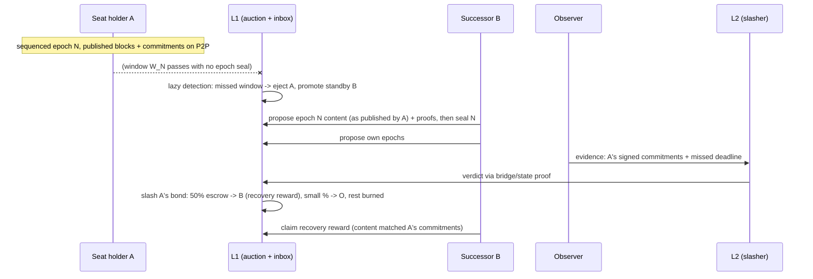

# Taiko Based Preconfirmation Redesign — Perpetual Auction with Deferred, Proof-Carrying Proposals

> **Deliverable 2 of the preconfirmation redesign effort.** Draft v1, 2026-08-20. This is a
> *design* document: it specifies mechanisms, invariants, incentives, and parameters, not
> implementation (no contract interfaces, storage layouts, or code). It builds on the factual
> baseline in [`status-quo.md`](status-quo.md) and on four resolved design decisions recorded in
> its §6. It is written to be attacked: §11 is an explicit attack catalog with defenses, and §13
> lists the issues most deserving of adversarial review.
>
> Prior art in this repository — the URC-based post-whitelist design
> ([reference](reference/post-whitelist-design.md)), the post-Shasta slashing design
> ([reference](reference/post-shasta-preconf-slashing.md)), and PR
> [#22019](https://github.com/taikoxyz/taiko-mono/pull/22019) — is consciously **not** followed
> here. #22019 is implementation reference only, per the redesign brief.

---

## 1. Motivation and goals

The current system (see status quo §1) secures preconfirmations by *trusting a whitelist*. The
designed replacement (URC-based validator opt-in) is blocked twice over: the URC is not
production-ready, and it only works if enough L1 validators opt in — an adoption assumption
Taiko cannot control.

This redesign removes both dependencies:

- **[G1] Anyone can become the preconfer** — preconfing rights are sold in a perpetual on-chain
  auction, not tied to being an L1 validator, and not gated by any external registry.
- **[G2] Slashing is enabled from day one** — every preconfirmation is a bonded, signed,
  slashable commitment. The bond can start small; the *machinery* must be real.
- **[G3] Non-validators can reliably propose** — proposals for an epoch land on L1 in a long,
  deferred window (many L1 slots), so ordinary priority-fee bidding suffices for inclusion; no
  L1-slot ownership is needed.
- **[G4] The pipeline collapses** — with windows deferred anyway, proposals carry their own
  validity proofs and finalize at proposal time. No separate proving phase, no prover market for
  pending proposals, no contestation machinery, fast L2→L1 withdrawals.
- **[G5] Graceful degradation, permissionless endgame** — every failure mode ends in a state
  where *someone* can move the chain: seat → standby promotion → Total Anarchy (permissionless
  first-come-first-served proposing). Bootstrap training wheels (a temporary participation
  allowlist) are explicitly temporary and removable.

Out of scope for v1 (recorded decisions): fair-exchange enforcement (timely *release* of
preconfs to users) — see §12; multi-seat / shared sequencing; based-validator alignment.

---

## 2. Roles

| Role | Description |
| --- | --- |
| **Seat holder (preconfer)** | The current winner of the perpetual auction. Sole sequencer of L2 for its assigned epochs; obligated to propose (with proofs) every assigned epoch's content within that epoch's window. Posts a TAIKO bond; pays a per-epoch ETH fee. |
| **Standby bidders** | Other standing bids in the auction. Bonded. The highest standby is automatically promoted when the seat terminates. A standing bid is a binding commitment to serve if promoted. |
| **Observers** | Anyone. Submit slashing evidence on L2; earn a share of executed slashes. Expected to be run alongside full nodes (the existing `ejector` service is the natural seed). |
| **Users** | Receive signed preconfirmation commitments; can verify seat assignment on L1 and signature validity locally. |
| **Treasury / DAO** | Receives auction fees (ETH); governs parameters, the temporary allowlist (Phase A), and the emergency brake (§10.4). |
| **L2 nodes** | Follow preconf'd blocks over P2P (existing machinery), reconcile against L1 proposals (existing machinery). |

A seat identity is an address that registers two operational keys, rotatable with the same delay
as every other auction transition: a **proposer key** (sends L1 `propose()` transactions) and a
**commitment key** (signs preconfirmations and P2P envelopes). This mirrors the current
whitelist's proposer/sequencer split, which the clients already understand.

---

## 3. Time structure

All times derive from L1 beacon epochs: `E = 384 s`, epoch `N` spans `[T_N, T_N + E)`.

```text
                 sequencing            deferral              proposal window W_N
epoch N:      [T_N ───── T_N+E) ── [T_N+E ── T_N+dE) ── [T_N+dE ────────── T_N+(d+s)E)
                 preconfs issued       proofs computed        proposals + proofs land on L1
```

With the recommended initial parameters `d = 2, s = 2`:

```text
time (s):   0        384       768       1152      1536      1920      2304
            |  ep N   |  ep N+1 |  ep N+2 |  ep N+3 |  ep N+4 |  ep N+5 |
sequencing: [A: N....][A: N+1..][A: N+2..][A: N+3..][A: N+4..]
window W_N:                     [========= W_N =========)
window W_N+1:                             [======== W_N+1 =======)
window W_N+2:                                       [======== W_N+2 =======)
```

- **Sequencing epoch N**: the seat holder assigned to epoch N is its exclusive sequencer,
  issuing preconfirmations in real time.
- **Proposal window** `W_N = [T_N + d·E, T_N + (d+s)·E)`: all of epoch N's L2 blocks must be
  proposed *and proven* on L1 within this window, ending with an on-chain **epoch seal** (§6.3).
- Windows of consecutive epochs may overlap (when `s > 1`); this is harmless because proposals
  form a hash-linked chain and epoch numbers must be non-decreasing along it (§6.2).

### 3.1 Parameters

| Param | Meaning | Initial value | Constraints |
| --- | --- | --- | --- |
| `d` | deferral, epochs between sequencing and window open | 2 | `d ≥ 1`; large enough for proof latency (§10.1) |
| `s` | window span in epochs | 2 | `s ≥ 1`; `32·s` L1 slots of inclusion opportunity (censorship resistance, §11.8) |
| `q` | auction transition delay, epochs | 2 | `q ≥ 2`: assignments for the current and next epoch are always final |
| `E` | epoch length | 384 s | fixed by L1 |

Derived constraints the parameters must satisfy (justified in the sections cited):

1. `d + s ≤ ~14` on mainnet — the derivation timestamp/anchor bounds (status quo §3.3); Hoodi's
   constants must be raised to at least mainnet values.
2. `forcedInclusionDelay ≥ (d + s + 1)·E` — so a preconfer knows, at sequencing time, every
   forced inclusion that can become due during its window (§6.5).
3. `bondWithdrawalDelay ≥ challenge period ≥ (d + s)·E + forcedInclusionDelay + bridge latency
   + margin` — so slashing evidence always beats bond exit, even against an L2-censoring seat
   holder (§11.7).

---

## 4. The perpetual auction (L1)

A single **seat** grants exclusive sequencing + proposing rights for every epoch while held.
The auction is *perpetual*: the winner remains the winner until outbid, quitting, defunding, or
ejection. There are no per-epoch auction events.

### 4.1 Bids

A bid is a triple: **(TAIKO bond, ETH fee rate per epoch, prepaid ETH balance)**.

- The **bond** is the slashable security deposit, denominated in TAIKO, held by the L1 auction
  contract. Minimum `minBond` (governance-set; small initially, scaling rule in §10.2).
- The **fee rate** is what the bidder offers to pay *per epoch held*, in ETH. Fees are debited
  from the prepaid balance each assigned epoch and accrue to the **treasury/DAO** (recorded
  decision). The fee is the price of the monopoly; it burns squatters and gives the DAO a
  revenue lever.
- **Ranking**: highest fee rate wins; ties break by placement order. A new bid must exceed the
  active winner's rate by a minimum increment (e.g. 10%) to displace it — anti-microflipping.
  A governance-set **reserve floor** applies when the seat is vacant.

### 4.2 Transitions — everything is delayed

Every state transition — new winner via outbid, voluntary quit, key rotation, promotion of a
standby — takes effect **`q` epochs after placement**, and assignments for the *current and
next epoch are immutable*. Consequences:

- The incoming seat holder always has ≥ 1 full epoch of notice to spin up infrastructure.
- Clients can always resolve "who sequences epoch N and N+1" from L1 state, deterministically —
  this replaces the whitelist's beacon-randomness lookahead.
- A displaced winner still owns its remaining assigned epochs *and their deferred windows*: it
  must keep proposing for up to `d + s` epochs after its last sequenced epoch.

### 4.3 Funding rule (no silent lapse)

The seat must maintain prepaid ETH ≥ `(q + 2) ×` its fee rate at all times. Falling below acts
as an **automatic quit notice** effective at the last funded epoch. There is therefore no
"surprise lapse": every voluntary exit path gives the network `≥ q` epochs of notice. Only
*ejection* (§4.4) breaks notice, and ejection always has a culprit whose bond pays for it.

### 4.4 Ejection

The seat terminates involuntarily when:

- **A window is missed**: no epoch seal for an assigned epoch by the end of its window (an
  L1-native, lazily-evaluated fact — the auction contract knows which proposals landed), or
- **The bond falls below `minBond`** after slashes.

Ejection takes effect at the earliest non-final epoch (i.e. `current + 2`). The highest standby
is promoted automatically with the same `q`-style notice compressed to the ejection timeline
(standbys accepted this duty when they placed a standing bid). The ejected party's *unproposed
window obligations transfer to the successor* (§7).

The ejection itself is an L1 state transition, **not** a slash; the corresponding liveness slash
flows through the normal L2-evidence path (§8). This split keeps recovery fast (no bridge
round-trip to change the seat) while honoring the "all slashing happens on L2 with proofs" rule.

### 4.5 Vacancy → Total Anarchy

If no eligible standing bid exists when the seat terminates (or the queue empties), the protocol
enters **Total Anarchy** (§9) from the first unassigned epoch onward. Bids can be placed at any
time during anarchy; the auction resumes with the usual `q`-epoch delay.

### 4.6 Seat lifecycle

```mermaid
stateDiagram-v2
    [*] --> Vacant
    Vacant --> Assigned: winning bid placed (effective +q epochs)
    Assigned --> Active: first assigned epoch begins
    Active --> Active: holds seat; pays fee/epoch; seals every window
    Active --> Draining: outbid / quit notice / funding horizon (effective +q)
    Active --> Ejected: missed window OR bond < minBond
    Draining --> Departed: last assigned window sealed + challenge period
    Ejected --> Departed: obligations transfer to successor; slashes settle
    Departed --> [*]: bond withdrawable after bondWithdrawalDelay
    Vacant --> Anarchy: no eligible standing bid
    Anarchy --> Assigned: new winning bid (effective +q)
```



---

## 5. Sequencing and preconfirmation (off-chain)

Largely inherited from today's machinery (status quo §3.8), with the whitelist swapped for the
auction:

- The seat holder's sequencer builds L2 blocks continuously through its epoch and publishes,
  over the existing P2P topics, the block envelope **plus a signed preconfirmation commitment**
  binding at minimum: domain separator, chain id, epoch number, L2 block number, block hash,
  parent hash, the **submission deadline** (`T_N + (d+s)·E`, the end of `W_N`), and an
  **end-of-preconf (EOP) flag** on the epoch's final block. Signed by the registered commitment
  key. This is the slashing evidence format (§8.1) and the user's receipt.
- Nodes validate envelopes against the seat assignment (current + next holder, read from the
  auction) instead of today's whitelist roster; everything else (orphan recovery, caching,
  request/response, end-of-sequencing notification) is unchanged.
- **Handover** at an epoch boundary between holders A → B reuses the existing
  end-of-sequencing request/response flow: B fetches A's EOP block, builds on its tip from
  `T_{N+1}` exactly. The current clients' `handoverSkipSlots = 8` convention — B taking over
  A's last 8 L1 slots so A could still land its proposal — **is retired**: A's proposal rights
  do not end with its epoch anymore (its windows extend `d + s` epochs past it), so B starts
  sequencing at the epoch boundary, not before. What remains of "handover" is purely getting
  A's tip; the machinery for that already exists.
- A user's preconfirmation is credible iff: the signature verifies against the epoch's
  registered commitment key (L1-readable), the assignment matches, and the bond (L1-readable)
  is intact. Wallets/RPCs can check all three cheaply.

---

## 6. Proposals: deferred, epoch-declared, proof-carrying (L1)

### 6.1 What `propose()` becomes

A proposal in this design carries: a **declared epoch number**, the blob-referenced block
manifests (as today), and a **validity proof** of the resulting state transition from the
previous proposal's post-state. Verification of the proof is part of proposal acceptance;
**a proposal that is accepted is final**. There is no separate `prove()` in the normal path
(§10.4 covers the emergency exception). The one-proposal-per-L1-block rule and the ring buffer
remain (the buffer's backlog is now normally zero).

### 6.2 Epoch-relative derivation (a simplification this design unlocks)

Because every proposal declares its epoch, all derivation bounds become **epoch-relative and
fully deterministic before L1 inclusion**:

- Block timestamps must lie in `[T_N, T_N + E)` (monotonic, ≥ parent + 1).
- Anchor block numbers must not exceed the last L1 block of epoch N, must be monotonic, and
  must respect a freshness floor relative to `T_N` (replacing the inclusion-time-relative
  `MAX_ANCHOR_OFFSET` / `TIMESTAMP_MAX_OFFSET` bounds).
- Epoch numbers are non-decreasing along the proposal chain.

Today's derivation bounds reference the proposal's *L1 inclusion* block and timestamp — which a
prover cannot know in advance. Making bounds epoch-relative is what allows proofs to be
generated entirely before the `propose()` transaction is sent, and it makes derivation a pure
function of (epoch, blobs, parent state). L1→L2 anchoring freshness is unaffected: anchors are
chosen at sequencing time, exactly as now.

### 6.3 Windows, seals, and authorization

- Proposals declaring epoch N are accepted only during `W_N` — except recovery (§7) and anarchy
  (§9).
- Only the epoch-N seat holder's proposer key is authorized for epoch-N proposals (same two
  exceptions).
- An epoch may span **multiple proposals** (blob capacity); the final one carries an on-chain
  **epoch seal** marker. The seal is the L1-observable statement "epoch N is complete", and it
  is what the auction contract's missed-window ejection (§4.4) keys on. The seal must be
  consistent with the off-chain EOP commitment — proposing content beyond a signed EOP, or
  sealing at a different tip than the signed EOP, is equivocation (§8.1).
- The existing `endOfSubmissionWindowTimestamp` plumbing carries `end(W_N)` into every proposal
  and (newly stored — §8.2) into L2 state per block.

### 6.4 Why inclusion works without owning L1 slots

The window is `32·s` L1 slots long (64 initially). The proposer needs *any* of them. Inclusion
via ordinary priority fees across 64 slots is overwhelmingly reliable outside sustained,
targeted censorship (analyzed in §11.8); `deadline`-style protections already exist in
`ProposeInput`. This is the mechanism that makes non-validator preconfers viable — the entire
point of the deferral.

### 6.5 Forced inclusions

Unchanged mechanics, retimed: `forcedInclusionDelay ≥ (d + s + 1)·E` guarantees that any forced
inclusion that will be *due* during `W_N` was already visible on L1 **before epoch N's
sequencing began**, so the seat holder incorporates forced blocks into its preconf'd chain at
sequencing time and never faces surprise insertions at proposal time. (Initial value ≈ 32 min —
up from today's 9.6 min; still far below the ~25 h permissionless escape threshold.) Forced
inclusions remain mandatory to consume and are exempt from none of this in anarchy mode.

---

## 7. Failure and recovery

The pivotal design property: **the proposal chain is hash-linked and epoch-monotonic, so a
successor cannot advance its own epochs without first landing everything it built on.** The
brief's rule — "the next preconfer must propose the failed preconfer's proposals, otherwise his
own proposals cannot be submitted" — is *structural*, not policed.

Sequence, when seat holder A fails to seal epoch N by `end(W_N)`:



Rules:

1. **Recovery proposals**: a successor (or the ejected holder itself, until ejection takes
   effect) may propose unsealed past epochs *outside* their windows; window enforcement applies
   only to a seat holder in good standing. Recovery proposals are attributed on-chain as
   recovery (proposer = B, recovered-epoch = N, original holder = A).
2. **Recovery reward**: 50% of A's liveness slash is escrowed for whoever seals epoch N with
   content **matching A's signed commitments** (verified on L2 by observers after finalization,
   claimable on L1 via the verdict path). Content includes coinbase — the reward is for
   *faithful* recovery, and fee/MEV theft via substituted content forfeits it (§11.4).
3. **If A published nothing** (withholding): B sequenced on the last tip it knew, so there is
   nothing to recover — B's own proposals proceed directly; epoch N contributed no blocks. A is
   slashed for the missed window; any leaked signed commitments from A additionally convert to
   safety evidence.
4. **Cascades**: if B also fails, C inherits both. Each failure is a separate slash on its
   failer. The chain's data remains recoverable as long as any P2P follower retains the
   published blocks (§13.6 discusses the DA exposure window).
5. **No double jeopardy / no framing**: safety slashes require either two conflicting signed
   commitments, or a signed commitment conflicting with canonical content **that A itself
   proposed/sealed**. If a successor substitutes different content for A's epoch, A bears only
   the liveness slash — a successor cannot convert A's liveness failure into A's safety
   failure (§11.4).

---

## 8. Slashing: evidence on L2, execution on L1

Per the recorded decision: the **auction and bond ledger live on L1**; all slashing
**conditions are checked on L2** against L2-native state, by anyone ("observers"), with a
**verdict bridged to L1** where the bond is seized.

### 8.1 Fault classes (v1 — deliberately minimal)

| Fault | Evidence (all L2-verifiable) | Slash |
| --- | --- | --- |
| **Missed window** (liveness) | Signed commitment for a block with deadline `end(W_N)`; L2 state shows no such block finalized by an epoch-N seal within deadline | `L_slash` (fixed), 50% escrowed as recovery reward, small % to observer, rest burned |
| **Equivocation** (safety) | Two conflicting signed commitments for the same (epoch, block number); **or** a signed commitment conflicting with canonical content the holder itself sealed | Full remaining bond; small % to observer, rest burned |
| **EOP violation** | Signed EOP for block *b* plus a signed commitment for a later block in the same epoch — a sub-case of equivocation | as equivocation |

Everything reduces to *conflicting signed statements* or *statement vs. own chain*: objective,
proof-checkable, no oracle, no quorum, no subjective timing claims. (Timeliness-of-release
faults are exactly what v1 scopes out.)

### 8.2 What L2 must learn to support this

- The anchor state must store, per L2 block: the block hash (already stored), and the
  **epoch number and submission deadline** it was proposed under (the
  `endOfSubmissionWindowTimestamp` that already reaches the anchor-tx constructor in the Go
  client today but is currently dropped before the contract call — status quo §3.8). This is the
  same L2 change the post-Shasta slashing doc required; it finally lands here.
- A **preconf slasher contract on L2** verifies evidence against that state and emits verdicts.
- One-shot fault digests (per position, per holder) prevent replay; evidence submission is
  permissionless.

### 8.3 Verdict transport and its adversary

Verdicts travel L2 → L1 through the native bridge / signal service, which requires the relevant
L2 state to be finalized on L1 — automatic here, since proposals finalize on acceptance. The
adversarial case is a seat holder censoring observer transactions *on its own L2*: the defense
is layered — (a) forced inclusions bypass sequencer censorship, (b) seats rotate or fall to
anarchy, and (c) the **bond withdrawal delay strictly exceeds the worst-case evidence path**
(constraint 3 in §3.1). A censoring holder only delays its slash; it cannot outrun it with its
bond.

### 8.4 Bond accounting

All slashes debit the L1 bond. Order: liveness slashes first (fixed amounts per missed window),
safety slash takes the remainder. `bond < minBond` ⇒ ejection (§4.4). Withdrawal (after quit /
departure) waits `bondWithdrawalDelay` per constraint 3.

---

## 9. Total Anarchy mode

When no epoch has an assigned seat holder:

- **Proposing is permissionless, first-come-first-served**: anyone may submit epoch-declared,
  proof-carrying proposals. The deferral is waived — a proposal declaring epoch M may land any
  time in `[T_M, T_M + (d+s)·E)`; epoch monotonicity and derivation rules still apply, as does
  mandatory forced-inclusion consumption and one-proposal-per-L1-block.
- **No preconfirmations exist** (nobody is committed), **no slashing** (nobody is bonded),
  **no protocol rewards** — proposers keep ordinary block revenue (basefee share, priority
  fees), which is the incentive to keep the chain moving.
- One deliberate exception to "no rewards": **recovery escrows remain claimable** — if a slashed
  holder's epoch is faithfully recovered by an anarchy proposer, that proposer may claim the
  escrowed 50%, because the escrow is funded by the slash, not by protocol subsidy, and
  preserving user promises is worth paying for in every mode.
- Anarchy ends when a new winning bid's `q`-epoch delay elapses.

**Phase A restriction** (§10.3): while the temporary allowlist is active, anarchy-mode
proposing is restricted to allowlisted addresses ("restricted anarchy") — otherwise the
allowlist's protection against proof-soundness exploitation would have a trivial bypass: empty
the auction, then propose permissionlessly with an unsound proof.

---

## 10. Bootstrap, parameters, and the emergency brake

### 10.1 Proving latency budget

The last block of epoch N exists at `T_N + E`; its proof must be on-chain by
`T_N + (d+s)·E` — i.e. `(d+s−1)·E` after the block exists (19.2 min at d=2, s=2), with
incremental proving running throughout the epoch. Current SP1/RISC0 latencies (~10–15 min for
epoch-scale aggregation) fit with margin. A holder's *sustained* proving failure is equivalent
to downtime: slashes, then ejection — which is why `d`/`s` must not be shaved to the latency
edge, and why the recovery successor (who may need to prove two epochs in one window) sizes the
real requirement.

### 10.2 Economic parameters

| Parameter | Initial posture | Governing constraint |
| --- | --- | --- |
| `minBond` (TAIKO) | small (brief's requirement) | must exceed: 2× faithful-recovery cost (so the 50% escrow clears it), and grow toward κ·(per-epoch extractable value) as preconf'd value grows — §11.2's schedule |
| `L_slash` per missed window | modest | floor: `0.5·L_slash >` recovery cost; ceiling: `0.5·L_slash +` one epoch's fees `<` cost of censoring `32·s` L1 slots (§11.8) — a wide corridor in practice |
| fee reserve floor + min increment | governance-set, low | anti-squat / anti-microflip; revisit with data |
| observer share | ~5%, capped | strictly < (1 − burn share) so self-slashing is always net-negative |
| `bondWithdrawalDelay` | ≥ 2 weeks | constraint 3 (§3.1); dominates every evidence path |

The **bond scaling rule** is a governance duty, not an afterthought: the safety bond must track
κ × the MEV extractable by equivocating on one epoch (oracle updates, large swaps). v1 states
the rule and instruments the measurement; it does not automate it.

### 10.3 Phases (recorded decision: allowlist replaces the proof gate)

| Phase | Auction entry | Anarchy | Notes |
| --- | --- | --- | --- |
| **A — training wheels** | temporary allowlist (DAO-managed) gates `bid()` | restricted to allowlist | Proof-soundness risk is bounded by vetting *who can propose at all* — the same posture as today's prover whitelist, now at the participation layer. Small bonds. `PreconfWhitelist` (rotation) is retired at cutover; the allowlist is a plain set, no election, no randomness. |
| **B — open auction** | allowlist removed | fully permissionless | Bonds raised per schedule; multi-proof composition (if retained in A) may relax per proof-system maturity. |
| **C — endgame** | — | — | Parameter tuning; candidate extensions (§13) like multi-seat. |

The cutover from the whitelist era is a fork-level change (new inbox generation — propose/prove
merged, epoch-relative derivation), comparable in scope to Pacaya → Shasta, using the same
activation pattern.

### 10.4 Emergency brake (flagged for adversarial review)

Removing the standalone `prove()` makes L2 liveness depend on at least one working proof
pipeline end-to-end. For a systemic proving outage (e.g. a zkVM bug disclosed mid-epoch), the
design retains a **DAO-activated emergency mode**: proposals accepted *without* proofs
(preconf UX and sequencing continue), finalization suspended until proofs catch up under the
restored pipeline — i.e. exactly today's propose-then-prove split, kept in the codebase as a
dormant mode rather than deleted. This is a deliberate complexity purchase; §13.3 asks
reviewers to attack both keeping it and dropping it.

---

## 11. Game-theory analysis

Actors, their objectives, and the attack catalog. Notation: `F` = per-epoch ETH fee, `L` =
`L_slash`, `B` = bond, `R` = per-epoch seat revenue (basefee share + priority fees + MEV),
`C_rec` = faithful recovery cost, `C_cen(k)` = cost to censor a target across `k` L1 slots.

**Honest-seat viability**: a rational bidder bids `F < R − amortized costs`; the auction
discovers `R` and transfers most of the monopoly rent to the treasury. Standbys bid lower `F`
expecting promotion. This is the healthy equilibrium; everything below is deviation analysis.

### 11.1 Squat-and-stall (win the seat, do nothing)

Cost per epoch: `F + L` (missed window ⇒ slash) and ejection after the first miss, plus `B`
locked through the challenge period. Payoff: chain degradation for ~2–3 epochs until the
standby/anarchy resumes. Sustained attack requires re-entering through the auction repeatedly:
each cycle costs `≥ F·q + L (+ B at risk)` for at most a couple of degraded epochs, and Phase
A's allowlist filters it entirely. **Verdict: priced, bounded, non-scalable.**

### 11.2 Equivocation for MEV (promise users one block, seal another)

Payoff: `MEV_epoch` (can spike: oracle lag, large pending swaps). Cost: entire `B`, seat loss,
all future `R − F` rent forfeited, reputation. Constraint: `B + PV(seat rent) > κ·MEV_epoch`
with the bond schedule tracking measured MEV. **This is the binding constraint on "bond can be
small"**: small bonds are safe only while preconf'd value is small — stated as an explicit
governance duty with monitoring (§10.2). Residual: a terminal-epoch holder (already outbid,
draining) has less future rent at stake — the last-epochs bond requirement should not be
released until the challenge period lapses, which it isn't (constraint 3).

### 11.3 Auction manipulation

- *Microflipping / sniping*: blocked by min-increment + `q`-delay; the incumbent can always
  counter-bid (a fee war strictly benefits the treasury).
- *Join-quit oscillation to force vacancies*: quitting requires `q` notice and the quitter
  must serve (or be slashed for) every epoch assigned before the notice matures — oscillation
  costs real service or real slashes.
- *Standby ambush* (stand by with no intent to serve, hoping to be promoted and stall): pays
  §11.1's price when promoted; standing bids are bonded for exactly this reason.
- *Wealth-based incumbency*: a deep pocket can hold the seat indefinitely by outbidding — this
  is an accepted, explicit trade (revenue goes to the treasury; users are protected by bonds,
  not by rotation). Mitigations if desired later: tenure caps, escalating fees. **Stated as
  accepted risk.**

### 11.4 Successor griefing / revenue theft

B substitutes its own content for A's published-but-unproposed epoch (capturing that epoch's
fees/MEV) instead of faithful recovery. Defenses: (a) faithful recovery is *paid* (`0.5·L`) and
theft forfeits it; (b) A bears only the liveness slash — no framing (§7.5); (c) **the
self-invalidation trap**: if B had already sequenced its own epoch on top of A's published tip
(the normal case — handover happened before A's window closed), substituting A's content
invalidates B's own preconf commitments, converting B's theft into B's full safety slash. The
attack survives only when B never built on A's tip — i.e. when A published too late for
handover, which converges with the withholding case where substitution is legitimate.
Residual: B colluding with L1 builders to *cause* A's miss — priced in §11.8.

### 11.5 Observer economics

Evidence is objective and permissionless; no collusion set matters because any single honest
observer suffices, and observing is cheap (run a node, watch commitments vs. chain).
Self-slashing to farm rewards is net-negative (observer share ≪ 100%). Racing/front-running
observer submissions is harmless (the slash executes regardless; MEV-style competition for the
reward is acceptable and even wanted).

### 11.6 Withholding (fair-exchange gap, out of scope by decision)

The seat holder can delay or skip publishing preconfs and still seal honestly on L1 — v1 does
not slash this. Consequences are bounded: users simply don't get preconfs (degraded UX, same
trust level as today's whitelist), order flow can leave, and the commitment format +
deadline fields keep the door open for timeliness enforcement later. **Explicit scope
decision, revisit in v2.**

### 11.7 Evidence censorship by the seat holder (L2-level)

Covered in §8.3: forced inclusion bypasses the sequencer; the challenge period out-waits any
censorship the seat can sustain; bond exit is slower than the slowest evidence path
(constraint 3). An attacker cannot both hold the seat (keeping censorship power) and exit the
bond (escaping the slash).

### 11.8 L1 censorship of the seat's `propose()` transactions

The sharpest external attack: suppress A's proposals across `W_N` (64 slots), triggering A's
liveness slash and (for a colluding successor) `0.5·L +` an epoch's revenue. Cost `C_cen(64)`:
sustained builder/relay-level exclusion across 64 consecutive slots — empirically expensive and
highly visible; A counter-bids priority fees (its loss is bounded by `L + F`, so it will pay up
to that in fees, raising the censor's price further). Parameter corridor: keep `L` small enough
that `0.5·L + R_epoch ≪ C_cen(32·s)`, and `s` large enough that `C_cen` is prohibitive. With
FOCIL-era L1 (inclusion lists), `C_cen` grows further. Residual risk accepted and monitored
(this is also exactly the scenario the no-framing rule §7.5 protects: censored A loses `L`, not
its full bond).

### 11.9 Systemic proving failure

§10.4's emergency brake. Without it: cascade slashes through holder and standbys (all using the
broken prover), then anarchy where nobody can propose either — a full halt until the proof
system is fixed, with unfair slashes along the way. The brake converts this into "finality
pauses, sequencing continues, nobody is slashed for the systemic outage" (slash forgiveness
during activated emergency is part of the mode). Attack surface of the brake itself: a DAO that
can suspend proofs can degrade safety — bounded by making emergency mode finalization-suspending
(never finalizing unproven state), so the brake cannot be abused to finalize invalid state,
only to delay finality.

### 11.10 Simulation plan (pre-implementation gate)

Agent-based simulation with bidder agents (revenue-estimating, honest), griefers (§11.1),
equivocators (§11.2 with MEV spike distributions), and censors (§11.8 with slot-cost curves);
sweep `(d, s, q, L, B, F floor)`; success criteria: no profitable deviation at proposed
parameters across the sweep, vacancy time < target, treasury revenue stability. Monte Carlo on
prover-latency distributions against window deadlines (target: seal-miss probability from
proving variance < 0.1%/epoch). These runs are a deliverable of the implementation phase and a
precondition for Phase B (allowlist removal).

---

## 12. Explicitly out of scope (v1)

- **Fair exchange / timely preconf release** (decision): reputation + order flow discipline
  withholding; hooks retained (timestamped commitments, deadline fields).
- **User restitution**: slashes burn/reward; they do not compensate the users whose promises
  broke. (No prior Taiko design solved this either; candidate v2 topic.)
- **Multi-seat / shared sequencing / per-slot granularity**: single seat, epoch granularity.
- **Based-validator alignment / L1 proposer integration**: deliberately abandoned — it is the
  assumption whose failure motivated this redesign.
- **Automated bond-to-MEV scaling**: rule stated, measurement instrumented, execution manual.

---

## 13. Open issues for adversarial review

1. **Censorship economics (§11.8)**: is the `L` corridor real under adversarial builder markets?
   Model `C_cen` pessimistically.
2. **Recovery burden**: a successor may need to propose+prove two epochs inside one window —
   should recovery formally extend the successor's own deadline, and by how much?
3. **Emergency brake (§10.4)**: attack both options — keeping the dormant propose-then-prove
   mode (complexity, DAO-trust surface) vs. deleting it (systemic-outage halt + unfair slashes).
4. **Epoch-relative derivation (§6.2)**: hunt for edge cases where removing inclusion-time
   inputs from derivation weakens anything (e.g. timestamp gaming at epoch boundaries,
   interaction with EIP-4396 basefee).
5. **Restricted anarchy in Phase A (§9)**: does gating anarchy on the allowlist reintroduce a
   liveness cliff if the entire allowlist is unavailable? (Escape: DAO can grow the allowlist;
   is that fast enough?)
6. **DA exposure window (§7.4)**: preconf'd blocks live only in P2P for up to `d + s` epochs
   (vs. `< 1` today). Quantify the correlated-loss risk; consider optional ephemeral DA
   (e.g. publishing envelopes to a blob-archive service) without making it a trust dependency.
7. **Seat-terminal incentives (§11.2)**: a draining holder's last epochs have reduced
   future-rent deterrence — is bond-only deterrence sufficient there, or do terminal epochs
   need a bond top-up rule?
8. **Treasury fee flows**: ETH fees to the DAO create a revenue-maximizing temptation in
   parameter-setting (raise floor, tolerate centralization). Governance-design question worth a
   pass.
9. **Verdict transport**: the bridge/signal-service path for L2→L1 verdicts — message replay,
   ordering, and what happens to in-flight verdicts across the fork boundary or an emergency
   activation.
10. **Client migration**: sequence the client changes (auction reads replacing whitelist reads,
    window scheduler, proposer+prover integration, observer service from `ejector`) against a
    single fork cutover; identify the riskiest rollback points.

---

## Appendix A — Divergence from the brief (deltas the owner should confirm)

Everything in the brief is honored, with these refinements discovered during design:

1. **Window recommendation `s = 2`** (brief sketched `[T+2E, T+3E)`, i.e. `s = 1`): doubles the
   inclusion opportunity and relaxes the proving deadline; the brief's `d = 2, s = 1` remains a
   supported parameterization.
2. **Ejection on first missed window** (brief implied the *next* preconfer recovers, without
   specifying seat termination): a standing winner that missed a window but kept the seat would
   make "the next preconfer" itself for subsequent epochs, collapsing the recovery rule;
   ejection restores it.
3. **Recovery reward in anarchy** (brief: "no rewards" in anarchy): the 50% escrow stays
   claimable in anarchy because it is funded by the slash, not the protocol, and it protects
   user promises. Pure anarchy proposing still earns no protocol reward.
4. **"Same proposals" enforced economically, not literally** (brief: successor "must" propose
   the same proposals): literal enforcement is impossible for withheld data; the design makes
   faithful recovery structurally necessary when the successor built on the data (§11.4's
   self-invalidation trap) and paid when it didn't need to be.
5. **Proof gate removed** per the owner's decision — replaced by the Phase-A participation
   allowlist (§10.3) and the emergency brake (§10.4) as the residual safety nets.
