# Taiko Based Preconfirmation Redesign — Perpetual Auction with Commit → Publish → Seal Epochs

> **Deliverable 2 of the preconfirmation redesign effort. Draft v2, 2026-08-20** — revised after
> the first adversarial review round
> ([review](https://github.com/taikoxyz/taiko-mono/pull/22034#issuecomment-5353544928), all seven merge
> blockers accepted; see [Appendix B](#appendix-b--v1--v2-changelog) for the changelog and
> per-finding disposition). This is a *design* document: mechanisms, invariants, incentives, and
> parameters — no implementation details. Factual baseline: [`status-quo.md`](status-quo.md);
> resolved owner decisions: its §6.
>
> Prior art in this repository — the URC-based post-whitelist design
> ([reference](reference/post-whitelist-design.md)), the post-Shasta slashing design
> ([reference](reference/post-shasta-preconf-slashing.md)), and PR
> [#22019](https://github.com/taikoxyz/taiko-mono/pull/22019) — is consciously **not** followed
> here. #22019 is implementation reference only, per the redesign brief.

---

## 1. Motivation and goals

The current system (status quo §1) secures preconfirmations by *trusting a whitelist*. The
designed replacement (URC-based validator opt-in) is blocked twice over: the URC is not
production-ready, and it requires L1-validator adoption Taiko cannot control.

This redesign removes both dependencies:

- **[G1] Anyone can become the preconfer** — preconfing rights are sold in a perpetual on-chain
  auction, not tied to being an L1 validator, and not gated by any external registry.
- **[G2] Slashing is enabled from day one** — every fault that matters is **objective**:
  provable without any cooperation or signature from the accused (v2 invariant, per review
  blocker 1). Bonds can start small; the machinery must be real.
- **[G3] Non-validators can reliably act on L1** — every mandatory on-chain action has a
  multi-slot inclusion budget, and the largest one (the seal, carrying the proof) has a
  multi-epoch window; ordinary priority-fee bidding suffices. No L1-slot ownership needed.
- **[G4] The pipeline collapses** — proposals finalize when sealed with their validity proof;
  no separate prover market for pending proposals, no contestation machinery, fast L2→L1
  withdrawals.
- **[G5] Halt-safe degradation, permissionless endgame** — a **single-open-epoch state
  machine** (§6) guarantees that the oldest unsealed epoch always has a permissionless path
  forward, in every mode. (Phase A consciously weakens this to DAO-recoverable — stated
  honestly in §10.3.)

Out of scope for v1 of the implementation (recorded decisions): per-transaction fair-exchange
enforcement (§12 — but see §5.1: *epoch-level* content release is now enforced, closing the
successor-weaponization hole from review blocker 2); multi-seat / shared sequencing;
based-validator alignment.

---

## 2. Roles and identities

| Role | Description |
| --- | --- |
| **Seat holder (preconfer)** | Current auction winner. Sole sequencer while held; obligated, per assigned epoch, to (1) commit the epoch's content at its boundary, (2) publish its data, (3) seal it with a proof in its window. TAIKO bond; per-epoch ETH fee. |
| **Standby bidders** | Other standing bids, bonded. Highest standby is auto-promoted on seat termination; a standing bid is a binding commitment to serve. |
| **Observers** | Anyone. Submit slashing evidence on L2; earn a share of executed slashes. |
| **Users** | Receive signed preconfirmation commitments; verify seat assignment, signature, and bond on L1. |
| **Treasury / DAO** | Receives auction fees (ETH); governs parameters, the Phase-A allowlist, and the emergency brake. |
| **L2 nodes** | Follow preconf'd blocks over P2P; reconcile against L1 (existing machinery). |

**Tenures.** Every continuous period of seat holding is a **tenure** with an immutable on-chain
identifier binding: the holder address, its registered **proposer key** and **commitment key**
(rotations create records, never overwrite — historical keys stay verifiable for the tenure's
whole obligation tail), the epochs assigned, and the bond reserved for it (§8.4). Every on-chain
artifact (commitment, publication, seal) and every fault digest binds `(chain id, fork/domain,
tenure id, epoch, fault class, acting proposer, mode ∈ {normal, recovery, anarchy})` — this is
what lets the L2 slasher attribute lateness and recovery correctly (review blockers 5 and the
key-history attack).

---

## 3. Time structure

L1 beacon epochs: `E = 384 s`, epoch `N` spans `[T_N, T_N + E)`. Each assigned epoch produces
three on-chain artifacts on a fixed schedule:

```text
  sequencing              commit          publish (DA)                    seal (finalize)
[T_N ────── T_N+E) ──▶ by T_N+E+Γc ──▶ by T_N+E+Γb ──▶ [T_N+dE ──────────── T_N+(d+s)E)
 preconfs over P2P      EBC: one small   full epoch data as blobs;        one proof-carrying
 in real time           L1 tx locking    permissionlessly fillable        seal per epoch, in a
                        the epoch tip    by anyone holding the data       32·s-slot window
```

| Param | Meaning | Initial value | Notes |
| --- | --- | --- | --- |
| `d` | deferral: epochs from sequencing to window open | 2 | sized for proof latency (§10.1) |
| `s` | seal-window span, epochs | 2 | `32·s` slots of inclusion opportunity |
| `q` | auction transition delay, epochs | 2 | current + next epoch assignments always final |
| `Γc` | commit grace after epoch end | 16 L1 slots | small non-blob tx; congestion analysis in §13 |
| `Γb` | publication (DA) deadline after epoch end | 1 epoch | blob tx; **fillable by anyone** (§5.2) |
| `Δr` | missing-data notice response window | 64 L1 slots | §5.3 |

Derived constraints (justified where cited):

1. `d + s ≤ ~14` on mainnet (derivation timing bounds, status quo §3.3); Hoodi constants must
   be raised.
2. `forcedInclusionDelay ≥ (d + s + q + 1)·E` and forced inclusions are **snapshotted per
   epoch** (§6.5) — recovery must be able to reproduce an epoch byte-for-byte at any later time.
3. Withdrawals are **state-gated, not merely delayed** (§8.4): no unresolved assigned epochs,
   escrows, in-flight verdicts, or active emergency mode; a floor delay (≥ 2 weeks) applies on
   top.
4. All deadlines (`Γc`, `Γb`, seal windows) are judged against the **finalized L1 view plus a
   reorg grace**; an artifact reorged out near a deadline may be canonically resubmitted within
   the grace (review: L1-reorg attack).
5. Data retention and prover capacity are sized for the **worst-case recovery horizon**
   `d + s + q` epochs plus tolling (§7.3), not for `d + s` (review blocker 3).

---

## 4. The perpetual auction (L1)

Unchanged from v1 in substance; restated with v2's bond reservation.

- A **bid** is (TAIKO bond, ETH fee rate per epoch, prepaid ETH). Highest fee rate wins; a new
  bid must exceed the incumbent by a minimum increment (~10%); governance-set reserve floor when
  vacant. Fees debit per held epoch to the **treasury/DAO** (recorded decision).
- **Every transition is delayed `q` epochs** and the current + next epoch assignments are
  immutable — deterministic lookahead for clients, ≥ 1 epoch of notice for an incoming holder.
- **Funding rule**: prepaid ETH ≥ `(q + 2) ×` fee rate at all times; falling below is an
  automatic quit notice effective at the last funded epoch. No silent lapse.
- **Bond reservation**: placing a bid reserves, per tenure, the full maximum outstanding
  liability — `(d + s + q) · L_slash` plus the safety reserve (§8.4) — not one epoch's worth
  (review: undercollateralized pipeline). Displacement, quitting, or ejection never releases a
  tenure's reservation until every obligation of that tenure is resolved.
- **Ejection**: on the first objective liveness fault (§8.1) or bond-below-reservation, the
  tenure enters termination: **no new epochs are assigned to it beyond the already-final
  current + next**, and for those two epochs the holder retains the *right* but its failure to
  commit simply resolves them as empty (§6.4) — a downed holder generates cheap empty epochs,
  not a growing content backlog. The highest standby is promoted at the earliest non-final
  epoch; if none, Total Anarchy (§9).
- **Vacancy** → Total Anarchy from the first unassigned epoch; bids re-fill it with the usual
  `q` delay.

```mermaid
stateDiagram-v2
    [*] --> Vacant
    Vacant --> Assigned: winning bid (effective +q)
    Assigned --> Active: first assigned epoch begins
    Active --> Active: commit / publish / seal each epoch
    Active --> Draining: outbid, quit, or funding horizon (effective +q)
    Active --> Terminating: objective fault or bond below reservation
    Draining --> Departed: all obligations resolved
    Terminating --> Departed: remaining epochs resolve (empty or recovered); slashes settle
    Departed --> [*]: bond released (state-gated + floor delay)
    Vacant --> Anarchy: no eligible standing bid
    Anarchy --> Assigned: new winning bid (effective +q)
```



---

## 5. The per-epoch pipeline: commit → publish → seal

This is v2's structural core, replacing v1's "everything lands in the deferred window". It
exists to make one invariant hold: **the content of epoch N is locked, network-visible, and
successor-safe by shortly after `T_N + E`** — only the *proof* is deferred.

### 5.1 Commit: the epoch-boundary commitment (EBC)

By `T_N + E + Γc`, the epoch-N holder must post one small L1 transaction committing to epoch
N's complete ordered content and final (EOP) tip. The EBC is **one-shot** — exactly one per
(tenure, epoch), never amended; holder tooling must treat it as sign-once.

- **Missing EBC ⇒ epoch N is canonically empty.** Its only valid seal is the deterministic
  empty seal (§6.4), which **anyone** may post. The missed commit is an objective L1 fact and a
  liveness fault (§8.1). An intentionally idle epoch is committed as *explicitly empty* — a
  valid, unslashed EBC; silence is never ambiguous.
- **The EBC, not the seal, defines epoch N's tip.** The later seal must match it; a "hidden
  tail" revealed near the seal deadline (review blocker 2's attack) is structurally impossible —
  content revealed after `T_N + E + Γc` that differs from the EBC is simply invalid, and an EBC
  conflicting with previously P2P-published signed blocks is equivocation evidence.
- The successor's sequencing parent for epoch N+1 is therefore fixed by `T_N + E + Γc` at the
  latest: the EBC tip if a valid EBC exists, else the empty-epoch parent. In the honest case the
  successor already has the tip from P2P at `T_N + E` and the EBC merely confirms it; the `Γc`
  exposure is analyzed in §13.1.

This narrows the fair-exchange scope-out honestly: **release of the complete epoch to the
network is enforced at epoch granularity** (commit + publish deadlines); only per-transaction
release latency to individual users remains out of scope (§12).

### 5.2 Publish: DA with permissionless fill

By `T_N + E + Γb` (≈ 1 epoch), the full epoch-N data matching the EBC must be on L1 as blobs.
Crucially, **anyone may post it** — publication is a permissionless *fill*, reimbursed plus a
bounty from the holder's slash when the holder wasn't the one to do it.

- The successor protects itself: if it sequenced on A's tip (it has the data), it can always
  fill A's publication and keep its own parent valid. If it never had the data, it never built
  on it — and wants the epoch empty. The two cases are self-consistent; a withholding holder
  can no longer strand a successor between them.
- **Missing publication by `Γb` ⇒ epoch N flips to canonically empty** (empty seal only), and
  the missed publication is an objective liveness/availability fault on the holder.

### 5.3 The missing-data notice

One narrow case remains: a valid EBC exists but the data is genuinely unavailable to the
successor (withheld from P2P, holder intending to self-publish late). The successor (or any
bonded party) may post a **missing-data notice** for EBC_N:

- The notice **tolls the notifier's own affected deadlines** (§7.3) and starts a `Δr`-slot
  response window. If anyone publishes the data within `Δr`, the notice resolves: the
  notifier's posted notice fee is forfeited (data was available — anti-spam), sequencing
  resumes on the real tip. If nobody does, epoch N flips to empty **early**, the holder is
  slashed (availability fault), and the notifier's fee is refunded with a bounty.
- Notice spam to farm tolling is therefore priced (fee forfeited whenever data promptly
  appears), and an honest successor is never forced to blind-build on a hash it cannot execute.

### 5.4 Sequencing and preconfirmations (off-chain)

As in v1, inherited machinery: real-time block envelopes + signed preconfirmation commitments
over P2P (binding domain, chain id, tenure id, epoch, block number + intra-epoch index, block
hash, parent hash, seal deadline, EOP flag), signed by the tenure's commitment key. Handover
A→B reuses the end-of-sequencing request/response flow; `handoverSkipSlots` is retired (B
starts at the boundary; A's on-chain duties continue independently). Nodes validate gossip
against the tenure registry (current + next holder). A user's preconf is credible iff
signature, assignment, and intact bond check out — all L1-readable.

### 5.5 Seal: the proof-carrying finalization

Within `W_N = [T_N + d·E, T_N + (d+s)·E)`, the holder posts the **seal**: the validity proof
finalizing epoch N's published content (one or more proposal transactions as blob/gas limits
require; the last carries the seal marker). Acceptance = finality; checkpoint saved. The proof
statement covers exactly (epoch, EBC, published data, parent state) — all fixed since
`T_N + E + Γb` — so proving is fully precomputable (§6.6) and the seal transaction itself is
small and time-flexible across `32·s` slots.

---

## 6. The epoch state machine (single open epoch)

Review blocker 4 showed v1's "epoch numbers non-decreasing" was under-specified in both
directions. v2 defines one canonical pointer and one lifecycle:

### 6.1 One open epoch

The L1 inbox maintains **`openEpoch`**: the oldest epoch not yet sealed. Only artifacts for
`openEpoch` and *later-scheduled* commits/publications are accepted where the schedule says
(commits and publications happen near each epoch's own boundary regardless of `openEpoch`;
**seals apply only to `openEpoch`**). Only a valid seal (content or empty) advances
`openEpoch` by one. Sealing an epoch before its sequencing period ends is invalid
(no pre-sealing an epoch that could still produce content).

### 6.2 Epoch lifecycle

```text
                    ┌── no EBC by Γc ──────────────► EMPTY-PENDING ──┐
SEQUENCING ─────────┤                                                ├──► SEALED
 [T_N, T_N+E)       └── EBC by Γc ──► COMMITTED ── data by Γb ──► PUBLISHED ──(proof in/after W_N)
                                        │                                        ▲
                                        └── no data by Γb, or notice expiry ──► EMPTY-PENDING
```

- **EMPTY-PENDING** epochs are sealable by **anyone, immediately and forever** (a deterministic
  empty seal needs no data and no proof beyond the trivial state-carry — cheap by
  construction).
- **PUBLISHED** epochs are sealable by their holder within `W_N`; after `end(W_N)` they enter
  the **recovery lane** (§7).

### 6.3 The recovery lane is permissionless and unbounded

Once `openEpoch`'s normal window has passed (or it is EMPTY-PENDING), sealing it is
**permissionless with no deadline**: anyone may seal it (empty seal, or content seal matching
the EBC + published data, with proof), in any mode including anarchy. This is the G5
guarantee: the oldest gap always has an open, unowned path forward, so no griefer can strand
the chain by occupying window-tail L1 blocks (they can only delay, paying per block, against an
unbounded lane — review blocker 4's griefing case), and no anarchy epoch is ever without a
resolution rule.

### 6.4 Empty seals

The deterministic empty seal (no blocks, or the protocol-minimal anchor-only content if the
architecture requires every epoch to carry a state-root heartbeat — implementation choice)
resolves EMPTY-PENDING epochs. It is valid from `T_N + E`, never before.

### 6.5 Forced inclusions: per-epoch snapshots

Each epoch N has a deterministic **forced-inclusion snapshot**, fixed before `T_N` (everything
queued and due per the retimed `forcedInclusionDelay`). Epoch N — sequenced, committed,
published, sealed, or *recovered at any later time* — consumes exactly its snapshot; newer
queue items belong to later epochs' snapshots. Forced-block coinbase and fee recipient are
deterministic per epoch (bound to the epoch's original tenure, or a protocol address — not the
transaction sender), so recovery reproduces the original bytes and hashes exactly (review
blocker 7). Empty-resolved epochs pass their snapshot forward to the next non-empty epoch's
snapshot, so forced content is never dropped.

### 6.6 Epoch-native execution identity (derivation v2)

Review blocker 6 identified that current derivation embeds L1-inclusion-time facts into L2
blocks (`proposalId` in `extraData`, proposer-derived fields, inclusion-time bounds), which
breaks proof precomputation and lets a predecessor's packing choices invalidate a successor's
precomputed work. Derivation v2 therefore requires:

- **L2 block identity is (epoch, intra-epoch index)** plus content — never L1 proposal ids,
  never the L1 inclusion block, never the seal transaction's sender. `extraData`/header fields
  derived from proposal ids are replaced by epoch-native equivalents.
- All derivation inputs are **snapshotted before sequencing begins**: epoch-relative timestamp
  and anchor bounds (`[T_N, T_N+E)`; anchors ≤ last L1 block usable for epoch N with an
  epoch-relative freshness floor), the forced snapshot (§6.5), and parameters.
- L1 packing (how many proposal transactions carry the epoch, which addresses send them, when
  in the window they land) affects **nothing** in L2 execution or block hashes.

Result: derivation is a pure function of (epoch, EBC-committed content, parent state), every
block hash is computable at sequencing time, and both the holder's and the successor's proofs
are precomputable and immune to each other's L1-side behavior.

---

## 7. Failure, recovery, and backlog

### 7.1 Worst-case backlog is `d + s + q` — and how the state machine shrinks it

Review blocker 3's arithmetic is adopted: with `d = s = q = 2`, a holder that keeps sequencing
and committing but never seals can leave **6 epochs** of full content unsealed by the time a
successor's first epoch begins (miss detected during epoch N+4; N+4, N+5 still assigned).
All capacity-relevant parameters (bond reservation §4, retention, prover sizing, recovery
rewards) are dimensioned for `d + s + q`.

The state machine bounds the *typical* case far lower: a **dead** holder produces no EBCs, so
its remaining epochs resolve as cheap empties (anyone seals them); only epochs with committed +
published content need real recovery — at most the pipeline depth `d + s`, and each already has
its data on L1 (§5.2), so recovery is "prove and seal", never "find the data".

### 7.2 Recovery flow

```mermaid
sequenceDiagram
    participant A as Holder A (tenure t)
    participant L1 as L1 (auction + inbox)
    participant B as Successor B
    participant O as Observer
    participant L2 as L2 slasher
    Note over A: epoch N: sequenced, committed (EBC), published — never sealed
    A--xL1: end(W_N) passes, no seal
    L1->>L1: objective fact recorded: Missed(t, N); tenure terminating; standby B promoted
    B->>L1: seal epoch N (recovery mode): published content + proof
    B->>L1: seal further backlog, then own epochs (deadlines tolled per §7.3)
    O->>L2: prove Missed(t, N) via anchored L1-state proof (§8.2)
    L2->>L1: verdict via bridge
    L1->>L1: slash tenure t: recovery escrow -> faithful sealer, observer share, remainder burned
```

Rules:

1. Recovery sealing is open to anyone (§6.3); "faithful" means matching the EBC — which is the
   only thing a content seal *can* match, so faithfulness is now structural, not judged after
   the fact. Coinbase/fee attribution inside recovered blocks is fixed by §6.5/§6.6 — a
   recoverer cannot redirect the epoch's in-block revenue to itself (v1's §11.4 theft surface
   is closed by construction; the recoverer's compensation is the escrow).
2. **Recovery escrow**: 50% of the liveness slash for epoch N, claimable by its sealer —
   **excluding the faulted tenure's own addresses and its registered keys**, with sizing as the
   robust backstop against sybil self-recovery: the escrow targets *cost + thin margin*, so
   laundering a slash through a sock-puppet recoverer remains net-negative (review: sybil
   farming; exclusion alone is evadable, pricing is not).
3. **If nothing was committed**: nothing to recover — empty seals close the gap, the successor's
   chain continues, and the holder is slashed per missed commit.
4. **Tolling**: while an actor in good standing is sealing backlog it did not create (or a
   missing-data notice is pending), its *own* upcoming deadlines extend commensurately — one
   window-span per recovered content epoch, bounded by the `d + s + q` cap. Tolling events are
   objective L1 facts (recovery seals, notices), so tolled deadlines remain objectively
   judgeable.
5. **No framing** (now structural): lateness attribution comes from L1 records
   (`Missed(tenure, epoch)` certificates, seal timestamps, acting proposer, mode — §8.2), so a
   late faithful recovery by B is never attributable to A as anything but A's original miss,
   and B's recovery-mode seals never read as B's own liveness.

### 7.3 Data retention

Nodes and the holder ecosystem must retain epoch data for the full recovery horizon (worst case
`(d + s + q)` epochs + maximum tolling) — but note that after `Γb`, **L1 blobs are the
retention** for committed epochs within the blob-retention window; the P2P-only exposure is
reduced from v1's `d + s` epochs to `≈ 1 + Γc/E` epochs. Per-epoch proof workload is capped
(the Unzen zk-gas accounting is the natural hook) so a malicious holder cannot bequeath an
uneconomically heavy proof bill to its recoverer (review: proof-cost griefing).

---

## 8. Slashing: objective faults, L2 adjudication, L1 execution

Per the recorded decision: bond ledger and execution on **L1**; adjudication on **L2** by
permissionless observers with proofs; verdicts bridged up. v2 adds the evidentiary spine that
review blockers 1 and 5 demanded.

### 8.1 Fault classes — all objective

| Fault | Evidence | Slash |
| --- | --- | --- |
| **Missed commit** — assigned epoch, no EBC by `Γc` | L1 fact (assignment + absence), proven on L2 via anchored L1-state proof | `L_slash`; 50% recovery escrow (here: to the empty-sealer, small), observer share, rest burned |
| **Missed publication / availability** — valid EBC, no matching data by `Γb` (or notice expiry) | L1 fact as above | `L_slash` (+ notice bounty funding) |
| **Missed seal** — PUBLISHED epoch, no seal by `end(W_N)` | L1 fact as above | `L_slash`; 50% recovery escrow to the faithful sealer |
| **Equivocation** (safety) | Two conflicting signed statements for the same (tenure, epoch, position) — commitments, EBC, or EOP in any combination; or a signed statement conflicting with content the same tenure itself sealed | Full remaining tenure reservation |

Key property (review blocker 1): **no fault requires the accused's signature**. The liveness
family is grounded in L1-recorded absences; only equivocation uses the holder's signatures —
and there, the signatures *are* the crime. The silent-stall attack now costs
`F·(epochs held) + L_slash per missed obligation + ejection + bond at risk`, restoring (and
this time justifying) v1's "priced, bounded, non-scalable" claim; Phase A's allowlist and the
`q` re-entry delay bound sybil repetition further.

### 8.2 Evidence architecture

- **L1 records** (auction/inbox): per (tenure, epoch): assignment, EBC presence + L1 time,
  publication satisfaction + time, seal + time + acting proposer + mode, `Missed(...)`
  certificates, tenure registry with historical keys. These are the timing/attribution ground
  truth.
- **L2 adjudication**: the L2 slasher verifies (a) content evidence against L2-native state
  (per-block hashes — already stored by the anchor — plus per-block epoch/index/deadline, the
  new anchor storage; the `endOfSubmissionWindowTimestamp` plumbing that today dead-ends at the
  anchor call finally lands), and (b) **timing/attribution evidence via Merkle proofs of the L1
  records against anchored L1 state roots** — the anchor already imports L1 checkpoints, so L2
  can verify L1 facts trustlessly. This resolves blocker 5 without moving adjudication off L2.
- **One-shot fault digests** keyed by `(chain id, fork/domain, tenure id, epoch, fault class,
  position)`; evidence submission permissionless; digests never burn on empty bonds.
- **Verdict transport**: native bridge / signal service; in-flight verdicts across fork
  boundaries or emergency activation are queued, never dropped (flagged in §13 for spec-level
  review).

### 8.3 Bond accounting (v2)

- **Reservation**: per tenure, `(d + s + q)·L_slash +` safety reserve (governance-set,
  MEV-tracking — §10.2). Reservations are per-tenure and survive displacement/quit until every
  obligation resolves.
- **Safety supersedes**: the safety slash draws on the tenure's *reserved* amount as of tenure
  start; liveness slashes and recovery escrows already paid for the same tenure's epochs are
  clawed back from (or netted against) any payouts to addresses linked to the tenure before
  burning — a bond cannot be laundered out through self-recoverable liveness events ahead of a
  safety verdict (review: penalty laundering).
- **Withdrawals are state-gated** (review: withdrawal race): released only when the tenure has
  no unsealed assigned epochs, no open escrows or notices, no in-flight verdicts, and no active
  emergency mode — then a floor delay (≥ 2 weeks) applies. A finality pause therefore
  automatically freezes exits.
- **Collateral valuation** (review: reflexive collateral): the reservation is checked against a
  conservative **ETH-value floor** for TAIKO (governance-set haircut, updated on a schedule);
  falling below triggers a top-up demand with a short cure period, then ejection. The bond
  asset stays TAIKO (owner decision); the *sufficiency test* is ETH-denominated.

---

## 9. Total Anarchy mode

When an epoch has no assigned holder:

- No preconfirmations, no bonds, no slashing, no protocol rewards. **The state machine does not
  change**: anarchy epochs still pass through the same lifecycle — but with nobody obligated,
  the schedule collapses to: anyone may (during the epoch or after) submit content proposals
  for the open anarchy epoch, and from `T_M + E` anyone may seal it (content or empty), FCFS,
  one proposal per L1 block, forced snapshots mandatory. Sealing before `T_M + E` remains
  invalid — an anarchy griefer cannot foreclose an epoch still in progress (review blocker 4c),
  and after it, the permissionless recovery lane (§6.3) means occupation griefing only delays.
- **Recovery escrows remain claimable in anarchy** (funded by slashes, not the protocol);
  everything else earns only ordinary block revenue.
- Anarchy ends when a new bid's `q` delay elapses.
- **Phase A**: anarchy participation is restricted to the allowlist — and this is stated for
  what it is: during Phase A the endgame is **DAO-recoverable, not permissionless** (the DAO
  can expand the allowlist on a fast path). G5 in its full form begins at Phase B (review:
  Phase-A hard halt — acknowledged, not papered over).

---

## 10. Bootstrap, parameters, emergency brake

### 10.1 Proving latency budget

The seal for epoch N is due `(d + s)·E` after `T_N` — with content locked at `T_N + E + Γc` and
published by `T_N + E + Γb`, the prover has `≥ (d + s − 2)·E` of dedicated time even proving
from publication alone (19.2 − 6.4 = 12.8 min at the initial parameters), and can prove
incrementally from sequencing time since all inputs are epoch-native (§6.6). Sizing must cover
the **recovery burst**: `d + s + q` epochs within a tolled horizon (§7.1), which is the real
capacity requirement (review blocker 3). The per-epoch zk-gas cap (§7.3) bounds each unit of
that burst.

### 10.2 Economic parameters

| Parameter | Initial posture | Governing constraint |
| --- | --- | --- |
| `L_slash` | modest | floor: `0.5·L >` faithful-recovery cost (proving + gas; data is on L1 already); ceiling: `0.5·L +` epoch revenue `≪ C_cen(residual slots)` — §11.5 |
| Safety reserve | small at launch | ≥ κ·(aggregate MEV across all simultaneously outstanding epochs of a tenure, i.e. `(d+s+q)`-epoch exposure — not one epoch) with the ETH-floor valuation; governance-tracked |
| Tenure reservation | `(d+s+q)·L +` safety reserve | §8.3 |
| Observer share | ~5%, capped | strictly < 1 − burn share |
| Recovery escrow | 50% of the relevant `L` | sized to cost + thin margin (anti-laundering, §7.2) |
| Fee floor / increment | governance-set | anti-squat / anti-microflip |
| Withdrawal floor delay | ≥ 2 weeks | on top of state-gating |

### 10.3 Phases

| Phase | Auction entry | Anarchy | Notes |
| --- | --- | --- | --- |
| **A** | temporary allowlist gates `bid()` | allowlist-restricted; endgame is DAO-recoverable | proof-soundness risk bounded by vetting who can act at all (replaces the abandoned proof-gate); small bonds; `PreconfWhitelist` rotation retired at cutover |
| **B** | allowlist removed | fully permissionless (G5 complete) | bonds raised per schedule; gated on the §11.7 simulation results |
| **C** | — | — | tuning; candidate extensions (§13) |

Cutover is a fork-level change (new inbox generation: pipeline artifacts, single-open-epoch,
derivation v2), using the established activation pattern.

### 10.4 Emergency brake (hardened)

A DAO-activated mode for systemic proving outages: sealing suspends (nothing finalizes
unproven — the brake can *pause* finality, never fake it), sequencing + commits + publications
continue, liveness faults arising from the outage are forgiven for its duration. v2 hardening
(review: brake-as-finality-pause-key): activation requires an objective precondition where
possible (e.g. `openEpoch` age exceeding a threshold), has a **bounded duration with
auto-expiry** (re-activation requires a fresh action), caps the unsealed backlog (then even
commits pause rather than filling the ring buffer), and **freezes all bond withdrawals** for
its duration plus the challenge horizon — the brake can no longer help a bond escape or strand
verdicts. Deactivation replays queued verdicts before releasing anything.

---

## 11. Game-theory analysis (v2)

Notation: `F` fee/epoch, `L = L_slash`, `B` bond reservation, `R` epoch revenue, `C_cen(k)`
cost to censor a target across `k` L1 slots.

**Honest equilibrium** unchanged: bid `F < R −` costs; the auction transfers monopoly rent to
the treasury; standbys queue at lower `F`.

### 11.1 Squat-and-stall — re-priced

Silent holder: misses its first commit ⇒ objective fault ⇒ `L` + tenure termination; every
further held epoch resolves empty with its own missed-commit fault until termination
completes: total `≥ F·held + L·(missed obligations)`, bond reserved throughout, re-entry gated
by `q` + fresh reservation (+ Phase-A allowlist). **Priced, bounded, non-scalable — now with
the evidence to back it** (blocker 1 closed).

### 11.2 Equivocation for MEV

As v1, with two corrections: the reserve tracks **aggregate** exposure across all outstanding
epochs of the tenure (not one epoch), valued against the ETH floor; and terminal-epoch holders
(draining tenures) keep their full reservation locked through the challenge horizon, so
"nothing left to lose" never coincides with "bond already free".

### 11.3 Withholding — from weapon to dud

v1's residual (blocker 2) is closed structurally: content locks at the EBC; late reveals are
invalid; a committed-but-withheld epoch is forced into the open by the notice/`Δr` path or
flips empty; the successor always has a safe parent rule. What remains genuinely out of scope
is per-transaction release latency (§12) — degraded UX, no longer a slashing weapon against
anyone else.

### 11.4 Successor / standby adversaries

The successor can no longer: steal the epoch's in-block revenue via substitution (coinbase is
epoch-deterministic, §6.5/§6.6), frame the predecessor (attribution from L1 records, §7.2.5),
or profit from withheld-parent limbo (§11.3). Remaining successor lever: colluding with L1
builders to censor the predecessor's seal (§11.5) — the recovery escrow it would earn is sized
to cost + margin, thinning that motive. Standby sabotage is now analyzed as: promotion value +
thin escrow vs. `C_cen` — strictly worse for the attacker than v1's version.

### 11.5 L1 censorship of the seal — recomputed budget

The review is right that the naive "64 slots" overstates the budget: the *residual* window
after the proof tail is what counts, and a multi-proposal epoch needs several blocks. Updated
analysis: with precomputable proofs (§6.6) the tail is pipeline-bound, not window-bound — the
holder should enter `W_N` proof-in-hand (publication preceded the window by `≥ (d−1)·E − Γb`);
the seal itself is one small transaction, retryable every slot of the residual window, judged
at finalized-L1 + grace with resubmission on reorg. Failure costs the holder `L` but the epoch
remains recoverable (lane §6.3), so the censor buys delay, not chain damage. Corridor
constraint restated against residual slots; monitoring obligation stands; FOCIL improves it.

### 11.6 Observers, laundering, and self-dealing

Observer economics unchanged (any single honest observer suffices; self-slashing net-negative).
Self-recovery laundering is closed by pricing (escrow ≈ cost + margin) + exclusion + safety
clawback (§8.3). Penalty laundering closed by reservation + supersession (§8.3).

### 11.7 Simulation plan (gates Phase B)

v1's plan, plus the review's required scenarios: adversarial handover withholding (§11.3
machinery under P2P partition), correlated prover outages (with and without the brake),
full `d + s + q` backlog bursts with tolling, L1 reorgs at every deadline boundary, colluding
standby + builder censorship, notice-spam economics, and TAIKO price-shock paths against the
ETH floor. Success criteria as v1 (no profitable deviation across sweeps) plus: no scenario in
which an honest successor is slashed.

---

## 12. Explicitly out of scope (v1 implementation)

- **Per-transaction fair exchange** (timely release of individual preconfs to individual
  users): reputation + order-flow discipline; hooks retained. *Epoch-level* release is now
  enforced (§5) — the scope-out no longer endangers third parties.
- **User restitution** for broken promises (slashes burn/reward; candidate v2 topic).
- **Multi-seat / shared sequencing / per-slot granularity.**
- **Based-validator alignment.**
- **Automated bond scaling** (rule + measurement specified; execution manual).

---

## 13. Open issues for the next adversarial round

1. **`Γc` under L1 congestion**: 16 slots for a plain tx is conservative but not certain;
   quantify miss probability for a fee-bumping sender and decide whether `Γc` misses deserve a
   reduced penalty tier vs. full `L`.
2. **EBC one-shot sharpness**: an honestly-corrupted EBC (tooling bug) forces its epoch empty
   and slashes the holder. Acceptable severity? Any safe amendment scheme reopens equivocation
   surface — current stance is "no amendments".
3. **Missing-data notice economics**: fee/bounty calibration such that neither notice-spam nor
   ignore-the-notice is ever profitable, including when the notifier and holder collude.
4. **Anchored-L1-proof freshness**: L2 adjudication of L1 facts needs the relevant L1 state
   root anchored on L2; during degraded modes anchoring lags — verify the challenge horizon
   covers worst-case anchor staleness.
5. **Verdict transport across forks/emergency**: queue semantics, replay protection, ordering.
6. **Empty-seal heartbeat choice** (§6.4): pure-empty vs. anchor-only-block epochs — bridge
   liveness and L1→L2 message latency during long empty runs.
7. **ETH-floor governance**: who updates the TAIKO haircut, how fast, and what stops a hostile
   update from mass-ejecting bidders.
8. **Emergency-brake objective trigger**: precise predicate, and adversarial analysis of
   auto-expiry cliffs.
9. **Phase-A → B transition criteria**: objective conditions for removing the allowlist
   (simulation results, bond levels, N independent holders served without faults).
10. **Client migration sequencing**: auction reads, pipeline scheduler (commit/publish/seal),
    prover integration, observer service from `ejector`, against one fork cutover.

---

## Appendix A — Divergence from the brief (owner to confirm)

1. **`s = 2`** recommended (brief sketched `s = 1`); brief's parameterization remains
   supported.
2. **Termination on first objective fault** (brief implied recovery-by-next without seat
   termination): required to keep "the next preconfer" well-defined.
3. **Recovery escrows claimable in anarchy** (brief: "no rewards"): funded by slashes, not
   the protocol; protects user promises.
4. **"Same proposals" enforced structurally** via the EBC (brief: successor "must" repropose):
   the EBC makes faithfulness the only valid option when content exists, and empty resolution
   deterministic when it doesn't.
5. **Proof gate removed** (owner decision) → Phase-A allowlist + hardened emergency brake.
6. **v2 (new): commit/publish deadlines added at the epoch boundary** — the brief's "propose
   within [T+2E, T+3E)" is preserved for the *seal*, but content-lock and DA now happen ~1
   epoch after sequencing. This is the minimal structure that survives the withholding and
   successor-safety attacks; the deferral's purpose (inclusion-reliability for non-validators,
   proof time) is retained where it matters.

## Appendix B — v1 → v2 changelog

All seven merge blockers from the first adversarial review are **accepted**; dispositions:

| # | Finding | v2 response |
| --- | --- | --- |
| 1 | Silent stall unslashable | Objective fault family grounded in L1-recorded absences, provable on L2 via anchored L1-state proofs; explicit empty-EBC for idle epochs (§5.1, §8.1–8.2) |
| 2 | Withholding weaponizes successor slashing | Commit → publish → seal pipeline: EBC locks content at boundary; permissionless DA fill; missing-data notice with tolling; successor parent rule always safe (§5) |
| 3 | Backlog is `d+s+q`, not 2 | Conceded; reservation, retention, prover sizing, tolling, and rewards dimensioned for `d+s+q`; ejection stops new obligations; dead holders produce cheap empties (§7) |
| 4 | Ordering/anarchy not halt-safe | Single `openEpoch` state machine; seal-only-advances; no pre-sealing; explicit empty seals; unbounded permissionless recovery lane (§6, §9) |
| 5 | L2 can't prove L1 timing/attribution | L1 record spine (tenure registry, certificates, seal metadata) + L2 verification via anchored L1 state roots; digests bind tenure/epoch/class/mode (§2, §8.2) |
| 6 | Epoch-relative bounds ≠ precomputable proofs | Derivation v2: epoch-native execution identity; no L1-inclusion-time inputs in L2 blocks; packing-independent hashes (§6.6) |
| 7 | Forced inclusion breaks faithful recovery | Per-epoch forced snapshots; deterministic forced coinbase; snapshots travel with the epoch through recovery (§6.5) |

Additional-attack dispositions: undercollateralized pipeline → per-tenure reservation (§4,
§8.3); sybil/self-recovery → pricing + exclusion + clawback (§7.2, §8.3); penalty laundering →
reservation + supersession (§8.3); withdrawal race → state-gated withdrawals (§8.3); key/config
history → tenure registry (§2); L1 reorg at deadlines → finalized-view + grace + resubmission
(§3.4); censorship budget → recomputed against residual slots (§11.5); emergency brake →
bounded, auto-expiring, withdrawal-freezing, objectively triggered (§10.4); reflexive
collateral → ETH-value floor + cure/ejection (§8.3); standby sabotage → §11.4; Phase-A halt →
acknowledged as DAO-recoverable (§9, §10.3); retention/proof-cost griefing → horizon retention
+ zk-gas cap (§7.3).
