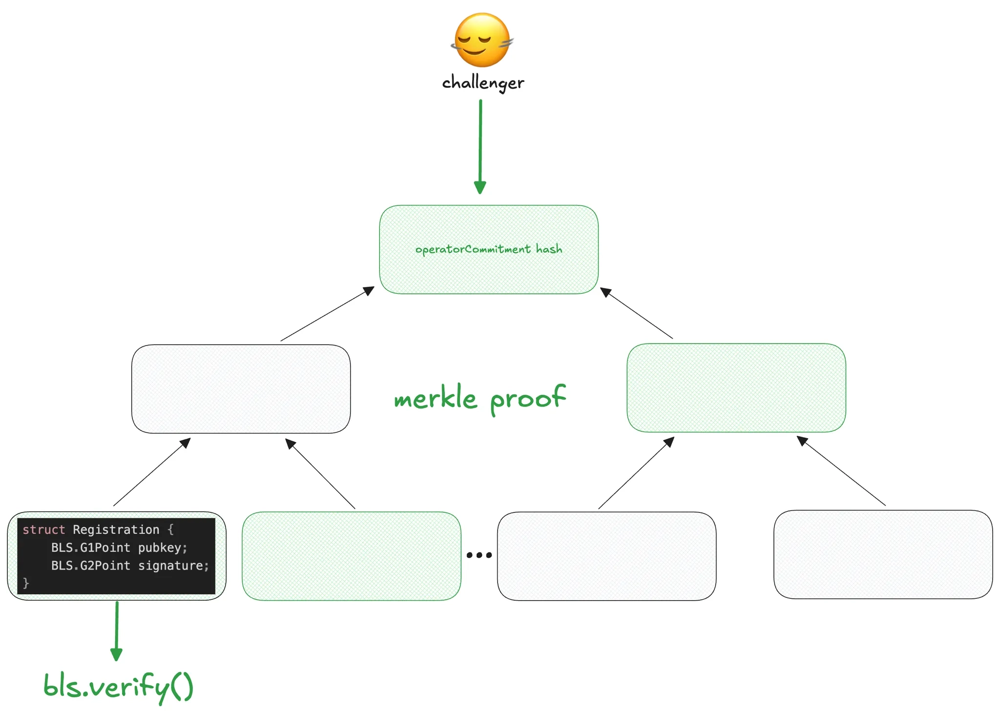
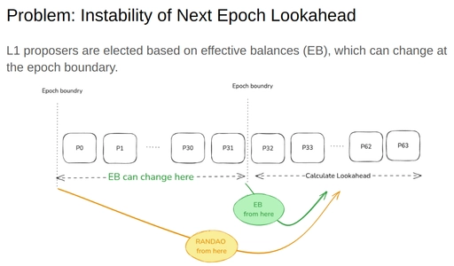
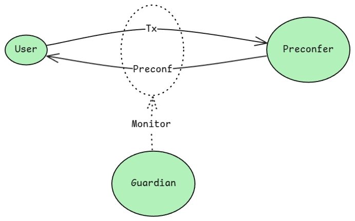
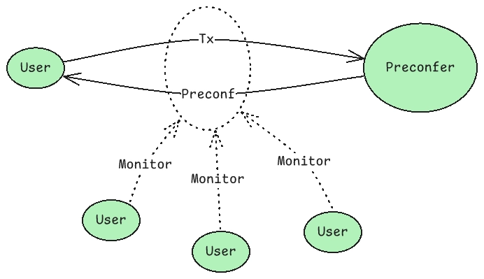

# [Ext] Taiko Preconf Post-Whitelist Design Doc

> **Provenance**: This document is a faithful markdown conversion of the Notion page
> "[Ext] Taiko Preconf Post-Whitelist Design Doc" (PDF export, 15 pages, exported 2025).
> Figures are extracted from the original PDF. Margin comments from the Notion page are
> preserved as quoted asides where legible; several were truncated in the PDF export and
> are marked `[truncated]`.
>
> **Known gaps in the source export**: the final section "Inactive Preconfers" appears in
> the table of contents but its body is missing from the PDF export, and the last list item
> of "Suggested Path for Fair Exchange" is cut off mid-sentence.

- [Introduction](#introduction)
- [Goals](#goals)
- [How?](#how)
- [URC Integration](#urc-integration)
  - [Batching of Multiple Validator BLS keys](#batching-of-multiple-validator-bls-keys)
  - [Optimistic BLS Signature Verification](#optimistic-bls-signature-verification)
  - [Decoupling of Slashing Logic](#decoupling-of-slashing-logic)
- [Preconfirmation Publication](#preconfirmation-publication)
- [Preconfirmation Reception](#preconfirmation-reception)
- [Preconfirmation Slashing](#preconfirmation-slashing)
- [Lookahead Handling](#lookahead-handling)
- [The Fair Exchange Problem](#the-fair-exchange-problem)
  - [Approach 1: Overseer Oversight](#approach-1-overseer-oversight)
    - [Detection Mechanism](#detection-mechanism)
  - [Approach 2: User Oversight](#approach-2-user-oversight)
  - [Suggested Path for Fair Exchange](#suggested-path-for-fair-exchange)
- [Inactive Preconfers](#inactive-preconfers)

## Introduction

Taiko will be introducing a preconfirmation solution featuring a whitelisted preconfirmer. While
this approach enables fast deployment of preconfirmations to the mainnet, it cuts many corners.
This design document blueprints the "Phase 2" release of Taiko preconfirmations, which will
eliminate the whitelist and address the limitations of the initial deployment.

This phase 2 release will build upon Nethermind's preconfirmation PoC work, which we will refer
to as "PoC" in the remainder of the document. For any details not explained here, please refer to
the PoC design document and implementation.

Furthermore, the design document is split into two:

- This document covers a high level overview of the design.
- The low-level diagrams (LLD) document that goes over the details of the smart contract
  interfaces and specs: 🛠️ _[Ext] Taiko Preconfirmations Core LLD - Preconfirmation Violations_

We will refer to the LLD document whenever relevant.

## Goals

The main goals of phase 2 are:

- **[G1] Enable open participation of preconfer.**
  - Remove the whitelist and enable any L1 proposer to opt in and become a preconfer.
- **[G2] Reduce the on-chain gas cost for registration.**
  - In the PoC registry, the system maps each validator's BLS key to an ECDSA key. As a
    result, if a single node operator manages 100 validators, they must perform 100 BLS
    checks and store 100 mappings during registration. This process can be costly in terms
    of gas costs. In phase 2, we would want to reduce this cost.
- **[G3] Modularize smart contract code.**
  - Organize the smart contract code into distinct modules. For example, separate the
    logic for lookahead submission and slashing from the block proposal functionality.

## How?

For [G1], we will:

- Rework and enable **preconfirmation equivocation slashing** to incorporate recently
  introduced _L2 block batching_ and the URC (explained below).
- Rework and enable **lookahead submission and slashing** to align with the URC.
- Implement a **fair exchange** solution.

For [G2] and [G3], we will:

- **URC Integration**: integrate with (or draw significant inspiration from) the
  _Universal Registry Contract (URC)_ initiative.

In the following sections, we will provide a detailed explanation of each item. Since the URC
integration impacts all other parts of the protocol, we will begin with it.

## URC Integration

By integrating with URC, we can:

- Enhancing modularity and improving separation of concerns.
- Reducing costs by eliminating per-validator BLS storage and signature verification overhead.
- Aligning with standards adopted by the broader community.
- Enabling interoperability by allowing collateral to be shared across preconfirmation protocols
  and proposer commitment schemes.
- Future-proofing with built-in support for restaking once URC incorporates it.

These benefits are achieved by batching validator BLS keys, using optimistic BLS signature
verification, and decoupling slashing logic. We will take a look at each of these items in the
following sections.

**Note:** The URC explanation below is tailored for our preconfirmation protocol and some parts
may not represent the URC's primary intended use. Most notably, in our implementation, we do
not use the off-chain delegation and opt-in feature, a key part of the URC design.

### Batching of Multiple Validator BLS keys

In previous designs, an operator with 100 validators required 100 separate on-chain
registrations. With the URC's batching:

- All 100 BLS keys and their signatures are combined into a Merkle tree.
- Only the resulting Merkle root is stored in storage, significantly reducing storage.

As a result, we only require 32 bytes per batch of validators.

The Merkle tree is structured as the following:


### Optimistic BLS Signature Verification

When operators register, the provided BLS signatures are not verified on-chain. Instead, the
contract accepts the registration optimistically to bypass the BLS verification costs (which can
be very expensive, even after BLS precompile). If a validator's signature is invalid a challenger
can submit evidence via `slashRegistration` to trigger on-chain BLS verification. If the
challenge succeeds, the operator is slashed. The slashing takes both the BLS key/signature pair
and a Merkle proof via this interface:

```solidity
function slashRegistration(
    bytes32 registrationRoot,
    Registration calldata reg,
    bytes32[] calldata proof,
    uint256 leafIndex
) external returns (uint256 collateral);
```

as depicted below: (Image from URC doc)



### Decoupling of Slashing Logic

The URC decouples slashing logic to external _slasher_ contracts implementing the slashing
interface (`ISlasher`). Instead of incorporating all slashing rules directly in the registry, the URC
checks an operator's opt-in status and then routes challenge evidence to the designated slasher
contract specified in the parameter. The slasher contract processes the evidence and returns
the appropriate slashing amount, which the URC applies by reducing the operator's collateral.
Thanks to this decoupling, different protocols (execution preconfs, inclusion preconfs,
lookahead, etc) can implement rules independently without touching the core registry.

(Image from URC doc)


Below is the slashing interface that any slasher contract must implement:

```solidity
/// @notice A Commitment message binding an opaque payload to a slasher contract
struct Commitment {
    /// The type of commitment
    uint64 commitmentType;
    /// The payload of the commitment
    bytes payload;
    /// The address of the slasher contract
    address slasher;
}

/// @notice A commitment message signed by a delegate's ECDSA key
struct SignedCommitment {
    /// The commitment message
    Commitment commitment;
    /// The signature of the commitment message
    bytes signature;
}

/// @notice Slash an operator for a given commitment
/// @dev The URC will call this function to slash a registered operator
///      if supplied with a valid commitment and evidence.
/// @param commitment The commitment message
/// @param evidence Arbitrary evidence for the slashing
/// @param challenger The address of the challenger
/// @return slashAmountGwei The amount of Gwei slashed
function slashFromOptIn(
    Commitment calldata commitment,
    bytes calldata evidence,
    address challenger
) external returns (uint256 slashAmountGwei);
```

## Preconfirmation Publication

When a preconfer preconfirms an L2 block, their sidecar instance will publish preconfirmed L2
blocks to the P2P. More specifically, they will publish two things:

- The `SignedCommitment` of the preconfirmation, which commits to a `PreconfirmationHeader`.
- The actual transaction list that the preconfirmation is committing to.

> 💬 **Margin comments** (Daniel Wang, 04/20/2025): "publish to the p2p network" —
> (Lin Oshitani, 04/21/2025): "Yes, to P2P"

```solidity
struct Commitment {
    uint64 commitmentType;
    bytes payload; // PreconfirmationHeader encoded into bytes.
    address slasher; // Address of the preconf slasher.
}

struct SignedCommitment {
    Commitment commitment;
    bytes signature; // Signature by the preconfer.
}

struct Preconfirmation {
    SignedCommitment signedCommitment;
    bytes txList; // Will be included as the "payload" field of the Commitment struct.
}

struct PreconfirmationHeader {
    // Taiko specific DS
    bytes32 domainSeparator;
    // Chainid of Taiko
    uint256 chainId;
    // Timestamp of the L1 slot in which the preconfer is the proposer.
    // In the case of fallback preconfer, this will be 0.
    uint256 l1ProposalSlotTimestamp;
    // ID of the batch that will be containing this block in TaikoInbox
    uint256 batchId;
    // Hash of the header of the preconfirmed block
    bytes32 blockhash;
    // `true` if this preconfer is not going to deliver anymore
    // preconfirmations after this block
    bool eop; // End-Of-Preconf flag
}
```

> 💬 **Margin comments on the struct fields** (partially truncated in export):
>
> - (Unknown author): "if txList represents the actual transactions in a preconf … maybe we
>   don't need it, as … in PreconfirmationHeader … commits to that list of tra…" `[truncated]`
> - Daniel Wang (04/20/2025): "What's missing here is the … 'conditions' such that if the …
>   conditions becomes invalid …" `[truncated]` — Lin Oshitani (04/21/2025): "> One example is
>   that the … from the previous precon… orged out, then this preco…" `[truncated]`
> - Daniel Wang (04/20/2025) on `l1ProposalSlotTimestamp`: "Not sure why we need this …"
>   `[truncated]`
> - Daniel Wang (04/20/2025) on `batchId`: "Not sure if this field is nee… think it can be
>   used to loo… batch if needed." — Lin Oshitani (04/21/2025): "It was needed to make ce…
>   slashing work. Should be … we run you through the L…" `[truncated]`

The signed header is a commitment from the preconfer to submit the preconfed transactions to
L1 eventually. If the preconfer equivocates, this signed header can be used as cryptographic
evidence for slashing using the `slashFromOptIn` function of URC. The details of the slashing
logic will be covered in the following sections.

Refer to the following section in the LLD for more details: 🛠️ _[Ext] Taiko Preconfirmations Core
LLD - Preconfirmation Structure_

## Preconfirmation Reception

Anyone interested in the latest preconfed L2 state can run a preconf sidecar instance and listen
to the preconf object in the P2P network. The sidecar will reject and ignore the preconfirmation
if:

- The `signature` is invalid.
- The signer of the signature is not the expected operator in the lookahead.
- The `blockhash` does not match the block hash obtained by executing `txList`.
- The `parent_batch_hash` does not point to the blockhash resulting from the previous batch.

(For the full list of conditions, see _this section_ in the LLD doc)

If a preconf object passes all these checks, the sidecar will accept it and use it to advance the
local head of the Taiko node. Additionally, the sidecar will store the preconfirmation header for
potential use in slashing.

## Preconfirmation Slashing

Eventually, the preconfer will submit L2 blocks to the L1 inbox contract. If the submitted L2
blocks do not match the preconfirmed L2 blocks, the preconfer will be slashed. There are two
cases of such mismatch:

- **Metadata Mismatch:** The metadata in the preconf object does not match the metadata of
  the submitted L2 block. E.g., they have different `batchAnchorBlockId`.
- **TxList Mismatch:** The txList in the preconf object does not match the submitted and verified
  L2 block.

The **TxList Mismatch** slashing requires careful consideration due to the recently _introduced_
concept of batches, which group multiple L2 blocks into one batch. Since L2 blocks are not
directly submitted and recorded on L1, only the L2 batch is submitted (packed within blobs), so
accessing the `txList` of an individual L2 block on L1 is no longer straightforward.

To overcome this, we changed our design to have preconfs commit to block hashes (instead of
raw tx list) and check the committed block hashes against the eventually verified block hashes.
Here's how the slashing mechanism works in a high level:

1. A user receives a preconfirmation (the Preconfirmation struct described earlier), which
   includes the blockHash of the preconfirmed block.
2. The preconfer submits the batch to L1.
3. The batch is eventually verified on L1.
4. If the preconfer has equivocated by submitting a different block to L1 than what was
   preconfirmed, any party can prove this misconduct and slash the preconfer.
5. The slashing is executed by proving that the proven L2 blockHash does not match the
   previously preconfirmed blockHash.
   - This verification is accomplished through a Merkle proof into the L2 state root of the
     batch (the state after executing the final L2 block in the batch). Specifically, the proof
     demonstrates that the `TaikoAnchor` contract in L2 stores a different blockHash for the
     given block height than what was included in the preconfirmation.

> 💬 **Margin comments**: Daniel Wang (04/20/2025): "Need to discusss this with … think maybe
> we can simp… based on mismatch of a p…" `[truncated]` — Lin Oshitani (04/21/2025): "> But I
> think maybe we ca… slash based on mismatch … preconfirmed block hash …" `[truncated]` —
> Daniel Wang (04/20/2025): "proving is not enough, we … make sure the batch is ve… its blocks
> have verified bl…" `[truncated]` — Lin Oshitani (04/21/2025): "Good point, my wording w…
> accurate here. Changed t…" `[truncated]`

## Lookahead Handling

In the PoC, the first preconfer in the lookahead is tasked with submitting the lookahead for the
next epoch (_related section in PoC doc_). To disincentivize posting of invalid lookahead, we
introduced:

- **Retroactive Slashing:** If an invalid lookahead is submitted, the submitter is slashed once it
  can be proven—specifically after the slot of the incorrectly specified preconfirmer has
  passed.

However, following the introduction of Max Effective Balance (EIP-7251), effective balances can
now increase due to rewards or deposits beyond the previous 32 ETH cap. Since lookaheads are
calculated based on the effective balance, the lookahead can now be altered via attestation
rewards, etc. This means this introduces a possibility of slashing the optimistic lookahead
submitter for lookahead changes that are out of their control. For more context, see _this
document_.

To address this issue, we've proposed EIP-7917 in collaboration with Justin Drake from the
Ethereum Foundation. Once this EIP is implemented on L1, the lookahead information will be
stored directly in the beacon state. This means the lookahead data can be accessed through
Merkle proofs against the beacon root, eliminating the need for any optimistic slashing
mechanism.

However, it will take time for EIP-7917 to be included in L1 - Earliest in Fusaka (later 2025) or in
Glamsterdam (some time in 2026). In order to launch post-whitelist preconf solution before that,
we propose the following temporary solution:

- Have optimistic lookahead submitted by the first preconfer (as done in PoC).
- If an invalid lookahead is posted, an overseer used in the fair exchange solution below can
  overwrite the lookahead and kick out the invalid lookahead submitter.

> 💬 **Margin comments**: Daniel Wang (04/20/2025): "Lin, you mean even in the … epoch,
> validators can stil… once EB changes?" — Lin Oshitani (04/21/2025): "EB changes can change t…
> epoch lookahead, but not … epoch lookahead. Here is …" `[truncated]`, with an attached diagram:



## The Fair Exchange Problem

The fair exchange problem is about enforcing the timely release of preconfs. Below is a quote
from our "_Strawmanning Based Preconfirmation_" post that highlights this challenge:

> The preconfer can withhold preconf promises and not return them to the user in a timely
> manner. Note that preconfers are incentivized to withhold preconf promises as much as
> possible to maximize their opportunity to reorder and insert transactions, thereby
> increasing their MEV.
>
> As an extreme example, the preconfer could withhold all promises during its window (12
> sec or more), reorder and inject txs as it wishes, and only publish the promises when the
> final tx batch is submitted to L1.

During our whitelist launch, we address the fair exchange problem by relying on trust in the
preconfers. However, once we remove the whitelist and allow open participation of preconfers,
we can no longer depend on that trust. Therefore, we must implement a proper fair exchange
solution for the post-whitelist launch.

One way of solving the fair exchange problem is introducing an "overseer" that monitors the
exchange and takes action when the fair exchange is violated. The key question becomes who
the overseers are and what action they take.

We consider two approaches:

- **Approach 1: Overseer Oversight:** An entity elected by the L2 governance—the _overseer_—
  will act as the overseer. The overseer will have the authority to slash preconfers that behave
  maliciously.
- **Approach 2: User Oversight:** End-users themselves will function as overseers. If preconfers
  act maliciously, users can respond by ceasing to send order flow.

Note that both approaches are not mutually exclusive and can be combined, as discussed in the
_Suggested Path for Fair Exchange_ section.

### Approach 1: Overseer Oversight

The fair exchange problem in based preconfirmation arises from misaligned incentives: L1
proposers are driven to maximize their MEV revenue, while L2s prioritize delivering a good user
experience. Fair exchange is not a problem in traditional centralized sequencers, where the
sequencer is naturally incentivized to provide good UX to attract users. However, once L2s use
L1 proposers for sequencing, the fair exchange becomes an issue as L1 proposers are
incentivized to maximize MEV revenue, and withholding preconfs will be the most revenue-
maximizing behavior without mitigation.

One approach to solving this misalignment is to let the L2 governance, or more accurately, a
_overseer_ entity elected by L2 governance, monitor and slash misbehaving preconfers. This
resembles how Ethereum _can slash validators via social consensus_ on a 51% censorship attack.



This approach works as follows:

- When an L1 validator opts into Taiko preconfs, they opt into being slashed by a _overseer key_.
- Whenever the overseer entity detects that a preconfer withholds preconfs, it slashes the
  offending preconfer. Withholding preconfs is defined as either:
  - The preconfer does not publish preconfs while still submitting L2 blocks to L1, or
  - The preconfer noticeably delays the publication of preconfs beyond an acceptable time
    threshold.
- The overseer key will be managed inside a Taiko L1 contract, and Taiko token holders should
  be able to veto the overseer key and replace it with a new one.

💡 **Open design question**: How can we enable such "overseer" slashing in the current URC,
where slashing requires an explicit off-chain commitment from the operator?

💡 **Open design question**: How much should the preconfer be slashed for fair exchange
equivocation?

#### Detection Mechanism

For the overseer to detect withholding of preconfs, it must identify timing discrepancies between
when the user first publishes a transaction and when the preconfer provides the corresponding
preconfirmation. There are two approaches:

- **Mempool Monitoring:** The overseer monitors the public mempool and records the first time
  a transaction is observed. Once the transaction is preconfirmed, the overseer calculates the
  time difference between this initial observation and the preconfirmation time. This somewhat
  resembles _FOCIL_ which enable forced inclusion via validators monitoring the public mempool.
- **Target L2 Block Specification:** Users explicitly specify their transaction's target L2 block
  height. After preconfirmation, the overseer calculates the difference between the specified
  target block and the actual L2 block in which the transaction was preconfirmed. Additionally,
  we may modify L2 execution to reject transactions with expired target block heights.

> 💬 **Margin comment**: Daniel Wang (02/18/2025): "Can guardians or users si… monitor the
> actual time be… blocks and vote for slashi…" `[truncated]` — Lin Oshitani (02/19/2025): "But
> one thing to note is, if… implement 'target L2 blo… specification' AND chang…" `[truncated]`

Pros of **Mempool Monitoring**:

- Does not introduce changes in L2 transaction formatting or execution.
- No changes are needed for wallet support.
- Does not impact _native rollup_ support.

Pros of **Target L2 Block Specification**:

- Users can fine-tune their desired inclusion delay.
- Avoids impact from P2P network delays. As a result, more strict and complete enforcement
  of fair exchange is possible that does not rely on heuristics.
- Fair exchange can be enforced for private orderflow via gateways, where the transactions
  bypass the mempool. However, in such cases, a reputation-based mechanism may be
  sufficient to ensure a fair exchange.
- Allows the monitoring system to focus solely on ensuring timely preconfirmation releases,
  without tracking the target or submission time.

💡 **Open design question**: We may be able to utilize account abstraction to enable encoding
target L2 block without changing L2 execution.

💡 **Open design question**: Which approach should we take?

### Approach 2: User Oversight

End users can monitor the timely release of preconfirmations and stop sending order flow when
they detect a fair exchange violation. This creates an economic disincentive for preconfers to
withhold preconfirmations, as doing so results in lost order flow and associated revenue.

This approach was originally proposed by Justin Drake in his _Based Preconfirmation post_.



This mechanism works as follows:

- The preconf sidecar of L2 full nodes will observe the timely release of preconfirmations
  using the methods proposed in _Detection Mechanism_.
- When the sidecar detects a fair exchange violation, it will enter an "alert" mode, stop
  propagating user order flow to P2P, and ideally notify connected end-user wallets of the
  issue.
- As a result, a preconfer that withholds preconfirmations will lose order flow and forgo
  potential revenue from preconfirmation services.

A key advantage of this approach is that it does not introduce a centralized "overseer" entity and
instead relies purely on end-user behavior. However, its effectiveness depends on the
opportunity cost of lost order flow being substantial enough to deter preconf withholding.
Additionally, transactions near the end of a preconfer's elected slot(s) are more vulnerable to
withholding attacks as the remaining potential loss of order flow decreases toward the slot's
conclusion.

### Suggested Path for Fair Exchange

We propose to take an incremental path:

1. Implement the overseer oversight mechanism with a whitelisted overseer key.
2. Implement a token-holding-based veto mechanism for replacing the overseer key.
3. Add the user monitoring solution on top of the above.
4. Once the value of order flow on L2 becomes sufficiently large—making the opportunity cost
   `[remainder of this item is cut off in the source PDF export]`

## Inactive Preconfers

`[This section is listed in the table of contents of the source document, but its body is
missing from the PDF export.]`
